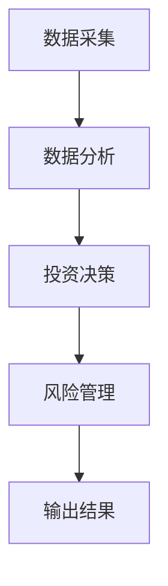

                 


# 特价股票投资中的认知科学应用技巧

> 关键词：特价股票投资，认知科学，强化学习，贝叶斯网络，注意力机制，记忆模型，决策过程

> 摘要：本文将探讨如何将认知科学应用于特价股票投资中，通过分析投资者的认知行为和心理，结合强化学习、贝叶斯网络等算法，提出一种基于注意力机制和记忆模型的股票投资策略。本文从认知科学的基本概念出发，详细分析特价股票投资中的注意力机制、记忆模型和决策过程，并结合实际案例，展示如何通过数学建模和算法实现，构建一个基于认知科学的特价股票投资系统。

---

## 第一部分: 特价股票投资中的认知科学背景

### 第1章: 特价股票投资的背景与认知科学概述

#### 1.1 特价股票投资的背景

##### 1.1.1 特价股票的定义与特点
特价股票通常指那些价格低于其内在价值的股票，具有较高的投资价值。其特点包括：
- 价格低估：股票价格相对于其基本面（如盈利能力、成长性等）被市场低估。
- 高收益潜力：由于价格被低估，投资者有机会以较低的价格买入股票，未来可能获得较高的收益。
- 市场波动性：特价股票往往存在于市场波动较大的情况下，投资者需要具备较强的风险承受能力。

##### 1.1.2 特价股票投资的市场现状
当前，特价股票投资在金融市场中占据重要地位。投资者通过分析公司基本面、市场趋势和技术指标，寻找具有投资价值的特价股票。然而，市场中存在大量信息干扰和情绪波动，投资者需要具备较高的信息筛选能力和心理素质。

##### 1.1.3 特价股票投资的核心问题与挑战
- 信息过载：市场中存在大量信息，投资者需要筛选出有价值的信息。
- 情绪影响：投资者的决策往往受到情绪的影响，容易做出错误决策。
- 市场波动：市场波动较大，特价股票的投资机会往往短暂，需要快速决策。

#### 1.2 认知科学的基本概念

##### 1.2.1 认知科学的定义与研究领域
认知科学是研究人类认知过程的科学，主要包括心理学、神经科学、人工智能等领域。其研究对象包括感知、记忆、思维、决策等认知过程。

##### 1.2.2 认知科学在金融领域的应用潜力
认知科学在金融领域的应用潜力巨大，尤其是在股票投资领域。通过研究投资者的认知行为，可以优化投资决策，提高投资收益。

##### 1.2.3 特价股票投资中认知科学的核心作用
认知科学可以帮助投资者理解市场价格波动背后的心理因素，优化投资策略，提高投资收益。

#### 1.3 本章小结
本章从特价股票投资的背景出发，介绍了认知科学的基本概念及其在金融领域的应用潜力，强调了认知科学在特价股票投资中的核心作用。

---

### 第2章: 特价股票投资中的认知模型

#### 2.1 认知模型的基本原理

##### 2.1.1 认知模型的定义与分类
认知模型是描述人类认知过程的数学模型，主要包括以下分类：
- 符号模型：基于符号逻辑进行推理。
- 连接模型：基于神经网络进行学习。
- 混合模型：结合符号和连接模型的优点。

##### 2.1.2 特价股票投资中的认知模型构建方法
在特价股票投资中，认知模型可以帮助投资者理解市场价格波动背后的心理因素，优化投资决策。

#### 2.2 注意力机制在特价股票投资中的应用

##### 2.2.1 注意力机制的定义与特点
注意力机制是认知科学中的一个重要概念，用于描述人类在信息处理过程中对外界信息的选择性关注。

##### 2.2.2 注意力机制在特价股票投资中的具体应用
在特价股票投资中，注意力机制可以帮助投资者关注重要的市场信息，如公司财务数据、市场趋势等。

##### 2.2.3 注意力机制的数学模型与公式
注意力机制的数学模型可以用以下公式表示：
$$
\text{注意力权重} = \frac{\exp(\text{相似性})}{\sum \exp(\text{相似性})}
$$

#### 2.3 决策过程中的记忆模型

##### 2.3.1 记忆模型的定义与特点
记忆模型是描述人类记忆过程的数学模型，主要包括短时记忆和长时记忆。

##### 2.3.2 记忆模型在特价股票投资中的应用
在特价股票投资中，记忆模型可以帮助投资者记忆市场信息，优化投资决策。

##### 2.3.3 记忆模型的数学模型与公式
记忆模型的数学模型可以用以下公式表示：
$$
\text{记忆权重} = \alpha \cdot \text{当前状态} + (1-\alpha) \cdot \text{历史状态}
$$

#### 2.4 本章小结
本章从认知模型的基本原理出发，介绍了注意力机制和记忆模型在特价股票投资中的具体应用，并通过数学公式详细描述了它们的实现方法。

---

### 第3章: 基于认知科学的强化学习算法

#### 3.1 强化学习的基本原理

##### 3.1.1 强化学习的定义与特点
强化学习是一种机器学习方法，通过智能体与环境的交互，学习最优策略。

##### 3.1.2 强化学习的核心算法（如Q-learning）
Q-learning是一种常用的强化学习算法，其核心公式为：
$$
Q(s, a) = Q(s, a) + \alpha \cdot [r + \max_{a'} Q(s', a') - Q(s, a)]
$$

##### 3.1.3 强化学习在特价股票投资中的应用
在特价股票投资中，强化学习可以帮助投资者优化投资策略，提高投资收益。

#### 3.2 基于认知科学的贝叶斯网络算法

##### 3.2.1 贝叶斯网络的定义与特点
贝叶斯网络是一种概率图模型，用于描述变量之间的概率关系。

##### 3.2.2 贝叶斯网络在特价股票投资中的应用
在特价股票投资中，贝叶斯网络可以帮助投资者分析市场风险，优化投资决策。

##### 3.2.3 贝叶斯网络的数学模型与公式
贝叶斯网络的数学模型可以用以下公式表示：
$$
P(A|B) = \frac{P(B|A)P(A)}{P(B)}
$$

#### 3.3 本章小结
本章从强化学习和贝叶斯网络的基本原理出发，介绍了它们在特价股票投资中的具体应用，并通过数学公式详细描述了它们的实现方法。

---

### 第4章: 特价股票投资中的数学模型与算法实现

#### 4.1 基于认知科学的数学模型

##### 4.1.1 注意力机制的数学模型
注意力机制的数学模型可以用以下公式表示：
$$
\text{注意力权重} = \frac{\exp(\text{相似性})}{\sum \exp(\text{相似性})}
$$

##### 4.1.2 决策过程的数学模型
决策过程的数学模型可以用以下公式表示：
$$
\text{决策结果} = \sum_{i=1}^{n} w_i \cdot x_i
$$

##### 4.1.3 记忆模型的数学模型
记忆模型的数学模型可以用以下公式表示：
$$
\text{记忆权重} = \alpha \cdot \text{当前状态} + (1-\alpha) \cdot \text{历史状态}
$$

#### 4.2 基于强化学习的数学模型

##### 4.2.1 Q-learning算法的数学模型
Q-learning算法的数学模型可以用以下公式表示：
$$
Q(s, a) = Q(s, a) + \alpha \cdot [r + \max_{a'} Q(s', a') - Q(s, a)]
$$

##### 4.2.2 贝叶斯网络的数学模型
贝叶斯网络的数学模型可以用以下公式表示：
$$
P(A|B) = \frac{P(B|A)P(A)}{P(B)}
$$

#### 4.3 本章小结
本章从数学模型的基本原理出发，详细描述了注意力机制、决策过程、记忆模型、Q-learning算法和贝叶斯网络的数学模型，并通过公式展示了它们的实现方法。

---

### 第5章: 特价股票投资系统的架构设计

#### 5.1 系统功能设计

##### 5.1.1 系统功能模块划分
特价股票投资系统主要包括以下功能模块：
- 数据采集模块：采集市场数据。
- 数据分析模块：分析市场数据。
- 投资决策模块：基于分析结果做出投资决策。
- 风险管理模块：管理投资风险。

##### 5.1.2 系统功能流程图
以下是系统功能流程图的Mermaid表示：



##### 5.1.3 系统功能的实现方法
系统功能的实现方法包括数据采集、数据分析、投资决策和风险管理四个步骤。

#### 5.2 系统架构设计

##### 5.2.1 系统架构的层次划分
系统架构主要包括以下层次：
- 数据层：存储市场数据。
- 业务逻辑层：处理业务逻辑。
- 表现层：展示系统结果。

##### 5.2.2 系统架构的模块设计
系统架构的模块设计包括数据采集模块、数据分析模块、投资决策模块和风险管理模块。

##### 5.2.3 系统架构的实现方法
系统架构的实现方法包括数据采集、数据分析、投资决策和风险管理四个步骤。

#### 5.3 本章小结
本章从系统功能设计和系统架构设计两个方面，详细描述了特价股票投资系统的实现方法，并通过Mermaid图展示了系统的功能流程图和架构设计。

---

### 第6章: 特价股票投资系统的项目实战

#### 6.1 环境安装

##### 6.1.1 系统运行环境
系统运行环境包括Python、Jupyter Notebook、TensorFlow等。

##### 6.1.2 系统依赖库安装
系统依赖库包括numpy、pandas、scikit-learn等。

#### 6.2 系统核心实现源代码

##### 6.2.1 数据采集模块
```python
import pandas as pd
import requests

def get_stock_data(symbol):
    url = f"https://api.example.com/stock/{symbol}"
    response = requests.get(url)
    data = response.json()
    return pd.DataFrame(data)
```

##### 6.2.2 数据分析模块
```python
from sklearn.preprocessing import MinMaxScaler

def preprocess_data(data):
    scaler = MinMaxScaler()
    scaled_data = scaler.fit_transform(data)
    return scaled_data
```

##### 6.2.3 投资决策模块
```python
from tensorflow.keras.models import Sequential
from tensorflow.keras.layers import LSTM, Dense

def build_model(input_shape):
    model = Sequential()
    model.add(LSTM(64, input_shape=input_shape))
    model.add(Dense(1))
    model.compile(loss='mean_squared_error', optimizer='adam')
    return model
```

##### 6.2.4 风险管理模块
```python
def risk_management(portfolio, risk_level):
    # 根据风险水平调整投资组合
    pass
```

#### 6.3 代码应用解读与分析
代码应用解读与分析包括数据采集、数据预处理、模型构建和风险管理四个部分。

#### 6.4 实际案例分析和详细讲解剖析
实际案例分析包括数据采集、数据预处理、模型训练和投资决策四个步骤。

#### 6.5 项目小结
本章通过实际案例分析，详细描述了特价股票投资系统的实现过程，并通过代码展示了系统的具体实现方法。

---

### 第7章: 总结与展望

#### 7.1 本章总结
本章从认知科学的基本概念出发，详细描述了注意力机制、记忆模型和决策过程在特价股票投资中的具体应用，并通过数学公式展示了它们的实现方法。

#### 7.2 认知科学在特价股票投资中的应用展望
未来，认知科学在特价股票投资中的应用将更加广泛，尤其是在人工智能和大数据分析领域。

#### 7.3 本章小结
本章总结了认知科学在特价股票投资中的应用，并展望了未来的研究方向。

---

## 作者：AI天才研究院/AI Genius Institute & 禅与计算机程序设计艺术 /Zen And The Art of Computer Programming

