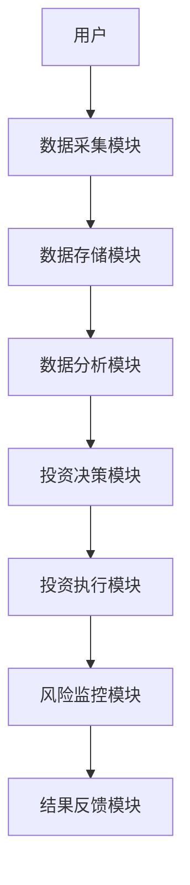

                 


# 特价股票投资中的跨代际投资策略与风险管理

> **关键词**：跨代际投资，风险管理，特价股票，投资策略，系统架构

> **摘要**：本文深入探讨了特价股票投资中的跨代际投资策略与风险管理。通过背景介绍、核心概念分析、算法原理阐述、数学模型构建、系统架构设计、项目实战案例以及最佳实践总结，为投资者提供全面的指导。文章结合理论与实践，帮助投资者在复杂多变的市场中实现长期稳健的投资回报。

---

## 目录大纲

1. **背景与概述**
   - 1.1 特价股票的定义与特点
   - 1.2 跨代际投资的背景与意义
   - 1.3 风险管理的重要性

2. **跨代际投资策略的核心概念**
   - 2.1 跨代际投资策略的原理
   - 2.2 跨代际投资策略的实施方法

3. **风险管理的核心原理**
   - 3.1 风险识别与评估
   - 3.2 风险控制与应对策略

4. **数据分析与建模方法**
   - 4.1 数据收集与处理
   - 4.2 投资模型的构建

5. **算法实现**
   - 5.1 算法原理与流程
   - 5.2 算法实现的代码示例

6. **系统架构设计**
   - 6.1 系统功能设计
   - 6.2 系统架构图

7. **项目实战**
   - 7.1 环境安装
   - 7.2 核心代码实现
   - 7.3 案例分析与总结

8. **最佳实践与总结**
   - 8.1 小结
   - 8.2 注意事项
   - 8.3 拓展阅读

---

## 正文

### 第1章：背景与概述

#### 1.1 特价股票的定义与特点

**特价股票**指的是价格相对较低的股票，通常具有较高的潜在增长空间。这些股票可能属于中小型企业或处于成长阶段的企业，其股价尚未被市场充分发现。特价股票的特点包括高增长潜力、低估值和高风险回报比。

#### 1.2 跨代际投资的背景与意义

**跨代际投资**是一种长期投资策略，旨在通过多代人的时间跨度进行资产配置和风险管理。这种策略通常结合了家族财富传承和长期投资目标，强调稳健性和可持续性。跨代际投资的意义在于通过时间的分散来降低风险，同时捕捉长期经济增长的机会。

#### 1.3 风险管理的重要性

在股票投资中，风险管理是确保投资组合安全的关键。有效的风险管理可以减少损失，提高投资回报，并确保投资目标的实现。通过识别、评估和控制风险，投资者能够在复杂多变的市场中保持稳健。

### 第2章：跨代际投资策略的核心概念

#### 2.1 跨代际投资策略的原理

**跨代际投资策略**基于长期视角，强调资产配置的多样性和时间分散。投资者需要设定明确的投资目标，并根据市场变化进行动态调整。该策略的核心在于平衡风险与回报，确保在不同市场周期中的稳定性。

#### 2.2 跨代际投资策略的实施方法

- **长期投资策略**：持有优质资产，避免频繁交易。
- **分阶段投资策略**：根据市场情况逐步增加投资。
- **资产再平衡策略**：定期调整资产配置，保持目标比例。

### 第3章：风险管理的核心原理

#### 3.1 风险识别与评估

**风险识别**涉及识别可能影响投资的各种因素，如市场风险、流动性风险等。**风险评估**则通过量化指标（如VaR）来评估潜在损失。

#### 3.2 风险控制与应对策略

- **风险分散策略**：通过多样化投资降低特定资产的风险。
- **风险对冲策略**：利用衍生工具对冲市场波动。
- **风险承受能力评估**：根据投资者的财务状况和风险偏好制定策略。

### 第4章：数据分析与建模方法

#### 4.1 数据收集与处理

数据是投资决策的基础。收集历史价格、财务报表等数据，并进行清洗和预处理，确保数据的准确性和完整性。

#### 4.2 投资模型的构建

基于数据构建预测模型，如回归分析和时间序列分析。模型需要经过验证和测试，确保其有效性和稳定性。

### 第5章：算法实现

#### 5.1 算法原理与流程

使用均值回归和动量策略等算法进行投资决策。算法流程包括数据输入、特征提取、模型训练和预测。

#### 5.2 算法实现的代码示例

以下是使用Python的代码示例：

```python
import pandas as pd
import numpy as np

# 示例数据加载
data = pd.read_csv('stock_data.csv')

# 均值回归策略
def mean_reversion_strategy(prices, window=20):
    # 计算20日移动平均线
    ma = prices.rolling(window).mean()
    # 判断是否偏离均值
    signal = (prices['Close'] < ma)
    return signal

# 动量策略
def momentum_strategy(prices, window=10):
    # 计算动量
    momentum = prices['Close'].pct_change().rolling(window).mean()
    # 判断动量方向
    signal = (momentum > 0)
    return signal

# 示例策略应用
signal_mr = mean_reversion_strategy(data)
signal_mo = momentum_strategy(data)

# 综合策略信号
final_signal = signal_mr & signal_mo

# 输出交易信号
print(final_signal)
```

### 第6章：系统架构设计

#### 6.1 系统功能设计

投资系统包括数据采集、分析、决策和监控模块。每个模块协同工作，确保投资策略的高效执行。

#### 6.2 系统架构图

使用Mermaid绘制系统架构图：



### 第7章：项目实战

#### 7.1 环境安装

安装必要的库和工具，如Python、Pandas、NumPy和Matplotlib。

#### 7.2 核心代码实现

实现跨代际投资策略和风险管理的代码，包括数据处理和模型构建。

#### 7.3 案例分析与总结

通过具体案例展示策略的应用，分析结果并总结经验。

### 第8章：最佳实践与总结

#### 8.1 小结

总结全文内容，强调跨代际投资和风险管理的重要性。

#### 8.2 注意事项

投资者需注意市场变化、数据质量和模型的有效性，避免过度依赖单一策略。

#### 8.3 拓展阅读

推荐进一步阅读的经典书籍，如《投资学》和《风险管理》。

---

## 作者

作者：AI天才研究院/AI Genius Institute & 禅与计算机程序设计艺术/Zen And The Art of Computer Programming

---

通过以上目录和内容，文章系统地介绍了特价股票投资中的跨代际投资策略与风险管理，结合理论与实践，为投资者提供了全面的指导。

