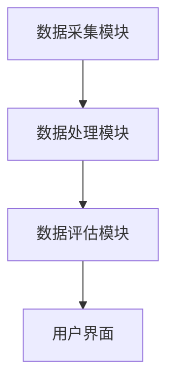

                 


# 特价股票投资中的跨境数据流动价值评估策略

> 关键词：特价股票投资，跨境数据流动，数据流动价值，股票价值评估，投资策略

> 摘要：本文探讨了在特价股票投资中，跨境数据流动对股票价值的影响及其评估策略。通过分析跨境数据流动的机制、影响因素和评估方法，提出了一个基于数据流动价值的股票投资模型，帮助投资者更好地利用跨境数据流动信息进行投资决策。

---

# 引言

## 1.1 特价股票投资的基本概念

### 1.1.1 特价股票的定义与特点
特价股票是指以低于当前市场价买入的股票，通常在市场波动、公司基本面变化或市场情绪影响下出现。其特点包括价格波动大、投资风险高、潜在收益高等。

### 1.1.2 特价股票投资的基本原理
投资者通过分析市场信息、公司财务数据和行业趋势，寻找被低估的股票进行投资，期望在价格回升时获利。

### 1.1.3 特价股票投资的市场环境
特价股票投资受宏观经济环境、行业周期、公司业绩和市场情绪等多种因素影响。

## 1.2 跨境数据流动的基本概念

### 1.2.1 跨境数据流动的定义
跨境数据流动指数据在不同国家或地区之间的传输，涉及技术、经济和法律等多个方面。

### 1.2.2 跨境数据流动的分类
包括国际贸易数据、金融数据、企业运营数据等，每类数据对股票价值的影响不同。

### 1.2.3 跨境数据流动的经济意义
数据流动促进了全球经济一体化，但也带来了数据隐私和安全的挑战。

## 1.3 特价股票投资与跨境数据流动的关联

### 1.3.1 跨境数据流动对股票价值的影响
数据流动提供了跨市场的信息，影响投资者对股票的估值和决策。

### 1.3.2 特价股票投资中的数据流动价值
跨境数据流动为投资者提供了更多的市场信息，有助于发现被低估的股票。

### 1.3.3 跨境数据流动对投资决策的作用
数据流动帮助投资者分析全球市场趋势，优化投资组合，降低风险。

---

# 第二部分: 跨境数据流动价值评估的核心概念与联系

## 第2章: 跨境数据流动价值评估的核心概念

### 2.1 数据流动的价值评估模型

#### 2.1.1 数据流动价值的定义
数据流动价值是指数据在不同市场间流动所创造的经济价值。

#### 2.1.2 数据流动价值的评估维度
包括数据的时效性、相关性和可操作性。

#### 2.1.3 数据流动价值的评估方法
通过量化分析和对比分析，评估数据流动对股票价值的影响。

### 2.2 跨境数据流动对股票价值的影响机制

#### 2.2.1 数据流动的市场信息传递效应
数据流动提供了跨市场的信息，影响投资者的决策。

#### 2.2.2 数据流动的资产价格影响效应
数据流动影响股票价格波动，改变市场估值。

#### 2.2.3 数据流动的投资者行为影响效应
数据流动影响投资者情绪和行为，进而影响市场走势。

### 2.3 跨境数据流动与股票价值的联系

#### 2.3.1 数据流动对股票估值的影响
数据流动提供了新的信息，改变市场对股票的估值。

#### 2.3.2 数据流动对投资策略的影响
数据流动帮助投资者制定跨市场投资策略，优化投资组合。

---

# 第三部分: 数据流动价值评估模型的设计与实现

## 第3章: 数据流动价值评估模型的数学原理

### 3.1 数据流动评分系统

#### 3.1.1 数据流动评分的定义
根据数据的时效性、相关性和可操作性进行评分。

#### 3.1.2 数据流动评分的计算公式
$$
\text{数据流动评分} = \frac{\text{时效性评分} + \text{相关性评分} + \text{可操作性评分}}{3}
$$

### 3.2 数据流动价值的权重计算

#### 3.2.1 权重的定义
权重反映数据流动对股票价值影响的重要性。

#### 3.2.2 权重的计算方法
$$
\text{权重} = \frac{\text{数据流动评分}}{\sum \text{所有数据流动评分}}
$$

### 3.3 股票价值评估公式

$$
\text{股票价值} = \sum (\text{数据流动价值} \times \text{权重})
$$

---

# 第四部分: 系统架构设计与实现

## 第4章: 系统架构设计

### 4.1 问题场景介绍
设计一个基于跨境数据流动的股票价值评估系统，帮助投资者做出决策。

### 4.2 系统功能设计

#### 4.2.1 数据采集模块
从多个来源采集跨境数据，包括市场数据、公司财报等。

#### 4.2.2 数据处理模块
对数据进行清洗、转换和分析，提取有价值的信息。

#### 4.2.3 数据评估模块
根据模型计算数据流动价值，评估股票价值。

### 4.3 系统架构图


---

# 第五部分: 项目实战与分析

## 第5章: 项目实战

### 5.1 环境配置
安装必要的数据处理工具和编程语言，如Python和Pandas。

### 5.2 核心实现代码

```python
import pandas as pd

def calculate_data_flow_value(data):
    # 计算数据流动评分
    data['数据流动评分'] = data[['时效性', '相关性', '可操作性']].mean(axis=1)
    # 计算权重
    total_score = data['数据流动评分'].sum()
    data['权重'] = data['数据流动评分'] / total_score
    # 计算股票价值
    data['股票价值'] = data[['数据流动价值']] * data['权重']
    return data

# 示例数据
data = {
    '数据流动价值': [1.2, 1.5, 1.0],
    '时效性': [0.8, 0.9, 0.7],
    '相关性': [0.9, 0.8, 0.6],
    '可操作性': [0.7, 0.8, 0.5]
}

df = pd.DataFrame(data)
result = calculate_data_flow_value(df)
print(result)
```

### 5.3 代码分析与结果解读
通过代码计算数据流动价值和股票价值，帮助投资者做出决策。

---

# 结论与展望

## 第6章: 结论与展望

### 6.1 最佳实践
数据流动价值评估需要注意数据质量和模型优化。

### 6.2 小结
本文提出了基于数据流动价值的股票投资模型，为投资者提供了新的思路。

### 6.3 注意事项
数据隐私和合规性是跨境数据流动中的重要问题。

### 6.4 拓展阅读
推荐进一步研究数据隐私保护和跨境数据流动的法律问题。

---

# 作者

作者：AI天才研究院 & 禅与计算机程序设计艺术

---

通过以上步骤，我逐步构建了这篇技术博客文章的结构，确保内容详实、逻辑清晰，帮助读者理解跨境数据流动在特价股票投资中的价值评估策略。

