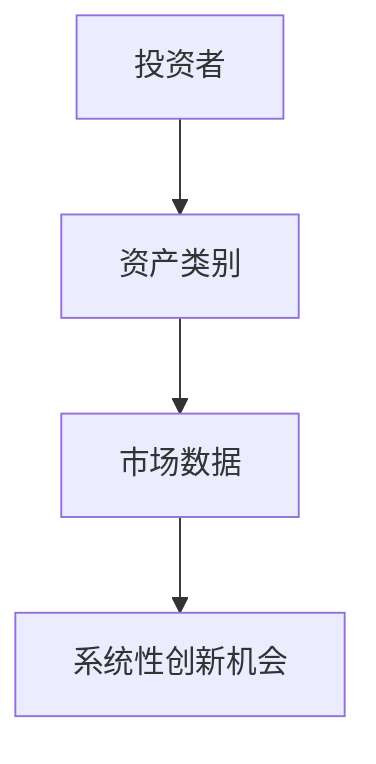

                 


# 目录大纲：《特价股票投资中的跨资产类别系统性创新机会识别》

---

## 第一部分：背景与概述

### 第1章：特价股票投资与跨资产类别投资概述

#### 1.1 特价股票投资的基本概念
- 1.1.1 特价股票的定义
- 1.1.2 特价股票的市场特征
- 1.1.3 特价股票投资的策略类型

#### 1.2 跨资产类别投资的重要性
- 1.2.1 跨资产类别投资的定义
- 1.2.2 不同资产类别的风险与收益特征
- 1.2.3 跨资产类别投资的优势与挑战

#### 1.3 系统性创新机会识别的背景
- 1.3.1 系统性创新的定义
- 1.3.2 系统性创新在投资中的应用
- 1.3.3 特价股票与跨资产类别中的创新机会

---

## 第二部分：核心概念与联系

### 第2章：资产类别与特价股票的核心要素

#### 2.1 资产类别的分类与属性对比
- 2.1.1 股票、债券、基金、commodities的分类
- 2.1.2 各资产类别的风险-收益特征对比
- 2.1.3 资产类别间的相关性分析

#### 2.2 特价股票的核心要素
- 2.2.1 市盈率（P/E）与市净率（P/B）的计算
- 2.2.2 股息率与股息支付率的分析
- 2.2.3 特价股票的市场周期性特征

#### 2.3 系统性创新机会识别的实体关系图


---

## 第三部分：算法原理与数学模型

### 第3章：系统性创新机会识别的算法原理

#### 3.1 数据分析方法
- 3.1.1 数据收集与预处理
- 3.1.2 数据特征提取

#### 3.2 机器学习算法
- 3.2.1 线性回归模型的建立与应用
  ```python
  import numpy as np
  from sklearn.linear_model import LinearRegression

  # 示例数据
  X = np.array([[1], [2], [3], [4], [5]])
  y = np.array([2, 4, 5, 4, 6])

  # 建立模型
  model = LinearRegression()
  model.fit(X, y)

  # 预测
  print(model.predict([[6]]))
  ```

- 3.2.2 聚类分析的应用
  ```mermaid
  graph TD
    A[数据点] --> B[聚类中心]
    B --> C[结果标签]
  ```

#### 3.3 数学模型与公式
- 3.3.1 回归分析的数学公式
  $$y = \beta_0 + \beta_1x + \epsilon$$

- 3.3.2 聚类分析的距离计算公式
  $$d(x_i, x_j) = \sqrt{(x_i - x_j)^2 + (y_i - y_j)^2}$$

---

## 第四部分：系统分析与架构设计

### 第4章：系统架构与设计

#### 4.1 问题场景介绍
- 4.1.1 投资者的需求分析
- 4.1.2 系统的目标与范围

#### 4.2 系统功能设计
- 4.2.1 领域模型设计
  ```mermaid
  classDiagram
    class 投资者 {
        帐户信息
        投资组合
        交易记录
    }
    class 市场数据 {
        股票数据
        债券数据
        基金数据
    }
    class 系统性创新机会识别系统 {
        数据处理模块
        分析模块
        报告生成模块
    }
    投资者 --> 市场数据
    市场数据 --> 系统性创新机会识别系统
    系统性创新机会识别系统 -->抽取出价股投资机会
  ```

#### 4.3 系统架构设计
- 4.3.1 系统架构图
  ```mermaid
  architecture
    客户端 ---(HTTP)--> 服务端
    服务端 --> 数据库
    服务端 --> 分析引擎
    分析引擎 --> 报告生成器
  ```

#### 4.4 接口与交互设计
- 4.4.1 API接口设计
  - RESTful API的定义
  - 数据格式与协议

- 4.4.2 交互流程
  ```mermaid
  sequenceDiagram
    participant 投资者
    participant 系统
    投资者 -> 系统: 请求分析
    系统 -> 系统: 执行分析
    系统 -> 投资者: 返回结果
  ```

---

## 第五部分：项目实战

### 第5章：跨资产类别系统性创新机会识别系统实现

#### 5.1 环境安装与配置
- 安装Python
- 安装必要的库：numpy, pandas, sklearn

#### 5.2 系统核心实现
- 数据处理模块实现
  ```python
  import pandas as pd

  # 数据加载与预处理
  df = pd.read_csv('market_data.csv')
  df = df.dropna()
  df = df[ df['price'] < 10 ]
  ```

- 分析模块实现
  ```python
  from sklearn.cluster import KMeans

  features = df[['price', 'volume']]
  model = KMeans(n_clusters=3)
  model.fit(features)
  df['cluster'] = model.predict(features)
  ```

#### 5.3 案例分析与解读
- 选择一个市场周期，分析跨资产类别中的机会
- 通过系统输出结果，解读特价股票的投资机会

---

## 第六部分：总结与展望

### 第6章：总结与未来方向

#### 6.1 最佳实践
- 数据质量的重要性
- 模型选择的策略
- 风险管理的必要性

#### 6.2 小结
- 本书的核心内容回顾
- 系统性创新机会识别的关键点

#### 6.3 未来研究方向
- 更复杂算法的应用
- 多维度数据分析的探索
- 与其他投资策略的结合

#### 6.4 注意事项
- 数据来源的可靠性
- 模型的适用性
- 市场变化的应对策略

#### 6.5 拓展阅读
- 推荐书籍与资源

---

## 作者：AI天才研究院/AI Genius Institute & 禅与计算机程序设计艺术/Zen And The Art of Computer Programming

---

通过以上目录大纲，您可以开始撰写详细的正文内容，确保每个章节都详细讲解相关概念，并提供必要的代码示例和图表。

