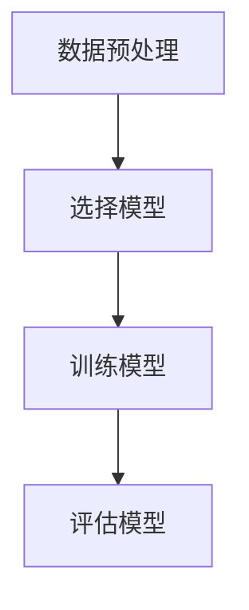
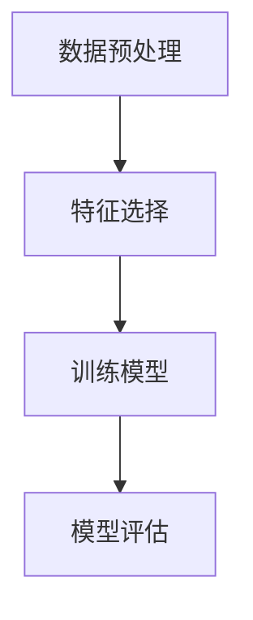
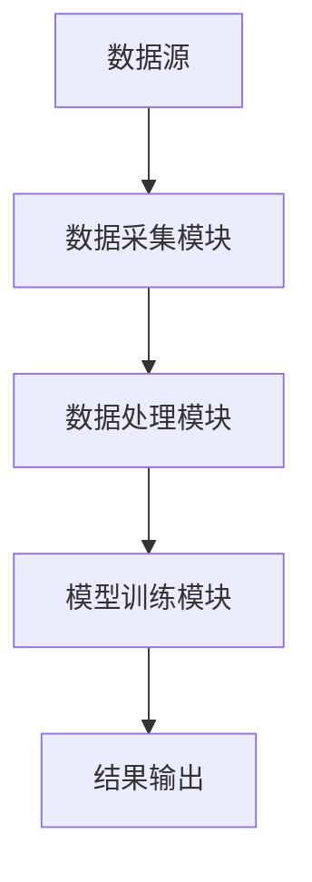
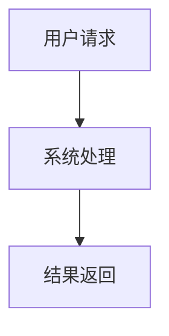

                 


---

# 特价股票投资中的跨链资产流动性预测分析

> 关键词：跨链资产流动性、特价股票、流动性预测、机器学习、时间序列分析

> 摘要：本文探讨了在跨链资产流动性预测中的特价股票投资策略，通过分析跨链流动性的特点，结合时间序列分析和机器学习算法，提出了有效的流动性预测模型，并展示了如何在实际投资中应用这些模型。

---

## 第一部分: 背景介绍

### 第1章: 跨链资产流动性预测的背景与意义

#### 1.1 跨链资产流动性的定义与特点

##### 1.1.1 跨链资产流动性的定义
跨链资产流动性指的是在不同区块链之间转移资产的能力和速度。这种流动性是衡量跨链生态系统健康程度的重要指标。

##### 1.1.2 跨链资产流动性的主要特点
- **多样性**：支持多种资产类型，包括原生代币、稳定币、NFT等。
- **实时性**：流动性变化迅速，受市场波动影响大。
- **跨平台性**：涉及多个区块链平台，如以太坊、波卡、Solana等。

##### 1.1.3 跨链资产流动性与股票投资的关系
跨链流动性影响投资者在不同链之间转移资产的效率和成本，从而影响股票价格的波动性和可预测性。

#### 1.2 特价股票的定义与特点

##### 1.2.1 特价股票的定义
特价股票是指价格低于其内在价值，具有较大上涨潜力的股票，通常被视为被市场低估的投资标的。

##### 1.2.2 特价股票的主要特点
- **低估性**：市场价格低于内在价值。
- **波动性**：价格波动较大，提供短期交易机会。
- **投资性**：适合长期投资者，具有较高的增值潜力。

##### 1.2.3 特价股票与跨链资产流动性的联系
跨链流动性为投资者提供了在不同链之间配置资产的能力，从而优化投资组合的风险和收益比。

#### 1.3 跨链资产流动性预测的背景与意义

##### 1.3.1 跨链资产流动性预测的背景
随着区块链技术的发展，跨链资产转移日益频繁，市场参与者需要准确预测流动性变化以做出明智投资决策。

##### 1.3.2 跨链资产流动性预测的意义
- 提供了科学的决策依据。
- 优化了资产配置效率。
- 降低了投资风险。

##### 1.3.3 跨链资产流动性预测在股票投资中的应用
通过预测流动性变化，投资者可以更好地把握市场趋势，优化投资策略。

#### 1.4 本章小结
本章介绍了跨链资产流动性的定义和特点，分析了特价股票的定义与投资价值，并探讨了流动性预测在股票投资中的重要性。

---

## 第二部分: 跨链资产流动性预测的核心概念与联系

### 第2章: 跨链资产流动性预测的核心概念

#### 2.1 跨链资产流动性的核心要素

##### 2.1.1 跨链交易的定义
跨链交易是指在不同区块链之间转移资产的操作，涉及复杂的协议和技术。

##### 2.1.2 跨链资产流动性的核心要素
- **交易量**：单位时间内的资产转移量。
- **交易速度**：资产转移的快慢程度。
- **网络效应**：跨链网络的连接程度和活跃度。

#### 2.2 跨链资产流动性的属性特征对比

##### 2.2.1 跨链资产流动性的属性特征
| 属性 | 描述 |
|------|------|
| 速度 | 资产转移的快慢 |
| 多样性 | 支持的资产类型 |
| 成本 | 转移资产所需费用 |

#### 2.3 跨链资产流动性预测的实体关系图

##### 2.3.1 ER实体关系图
```mermaid
erDiagram
    actor 投资者 {
        <to 系统>
    }
    system 系统 {
        <from 投资者>
    }
    entity 资产 {
        <from 系统>
        <from 投资者>
    }
```

##### 2.3.2 跨链资产流动性的实体关系分析
跨链流动性涉及投资者、系统和资产三者之间的互动，系统通过处理投资者的交易请求，影响资产的流动性。

#### 2.4 本章小结
本章详细分析了跨链资产流动性的核心要素，并通过对比和实体关系图展示了其属性特征。

---

## 第三部分: 跨链资产流动性预测的算法原理

### 第3章: 跨链资产流动性预测的算法原理

#### 3.1 时间序列分析

##### 3.1.1 时间序列分析的基本概念
时间序列分析是一种通过历史数据预测未来趋势的方法，常用于分析流动性变化。

##### 3.1.2 时间序列分析在流动性预测中的应用
使用ARIMA模型预测未来流动性，帮助投资者做出交易决策。

#### 3.2 机器学习算法

##### 3.2.1 常见机器学习算法在流动性预测中的应用
- **随机森林**：用于特征重要性分析。
- **支持向量机**：用于分类预测。

##### 3.2.2 算法选择与优化
通过网格搜索优化模型参数，提高预测精度。

#### 3.3 深度学习模型

##### 3.3.1 深度学习模型的基本原理
使用LSTM网络捕捉时间序列中的长期依赖关系。

##### 3.3.2 深度学习模型在流动性预测中的应用
LSTM模型在捕捉复杂流动模式方面表现优异。

#### 3.4 跨链资产流动性预测的数学模型

##### 3.4.1 时间序列模型
ARIMA模型：适用于线性时间序列数据。

##### 3.4.2 机器学习模型
随机森林模型：适合多维特征的数据。

##### 3.4.3 深度学习模型
LSTM网络：擅长处理复杂的时间依赖关系。

#### 3.5 算法实现的流程图

##### 3.5.1 时间序列分析流程图


##### 3.5.2 机器学习模型流程图


#### 3.6 本章小结
本章介绍了时间序列分析、机器学习和深度学习在流动性预测中的应用，并通过流程图展示了算法实现的步骤。

---

## 第四部分: 跨链资产流动性预测的系统分析与架构设计

### 第4章: 跨链资产流动性预测系统的架构设计

#### 4.1 系统功能设计

##### 4.1.1 系统模块划分
- 数据采集模块：收集跨链交易数据。
- 特征提取模块：提取流动性相关特征。
- 模型训练模块：训练预测模型。

##### 4.1.2 功能模块设计
```mermaid
classDiagram
    class 数据采集模块 {
        void collectData()
    }
    class 特征提取模块 {
        void extractFeatures()
    }
    class 模型训练模块 {
        void trainModel()
    }
    数据采集模块 -> 特征提取模块
    特征提取模块 -> 模型训练模块
```

#### 4.2 系统架构设计

##### 4.2.1 系统架构图


#### 4.3 系统接口设计

##### 4.3.1 接口描述
- 数据接口：用于数据输入和输出。
- 模型接口：用于模型的训练和预测。

#### 4.4 系统交互设计

##### 4.4.1 交互流程图


#### 4.5 本章小结
本章详细设计了跨链资产流动性预测系统的架构，包括模块划分、系统设计和接口设计。

---

## 第五部分: 项目实战

### 第5章: 跨链资产流动性预测的项目实战

#### 5.1 环境安装

##### 5.1.1 安装Python
```bash
python --version
pip install numpy pandas scikit-learn
```

#### 5.2 核心代码实现

##### 5.2.1 数据预处理
```python
import pandas as pd
data = pd.read_csv('liquidity.csv')
data.head()
```

##### 5.2.2 模型训练
```python
from sklearn.ensemble import RandomForestRegressor
model = RandomForestRegressor()
model.fit(X_train, y_train)
```

#### 5.3 实际案例分析

##### 5.3.1 案例分析
通过实际数据训练模型，并对流动性进行预测，验证模型的准确性。

#### 5.4 项目小结
本章通过实际项目展示了跨链资产流动性预测的实现过程，从数据处理到模型训练，再到结果分析。

---

## 第六部分: 最佳实践与小结

### 第6章: 跨链资产流动性预测的最佳实践

#### 6.1 投资建议
根据流动性预测结果，优化资产配置，降低投资风险。

#### 6.2 风险提示
流动性预测具有不确定性，需结合市场动态进行调整。

#### 6.3 未来研究方向
探索更先进的算法，如强化学习在流动性预测中的应用。

#### 6.4 小结
本文系统地介绍了跨链资产流动性预测的方法和应用，为投资者提供了科学的决策依据。

---

## 作者：AI天才研究院 & 禅与计算机程序设计艺术

---

感谢您的阅读！

