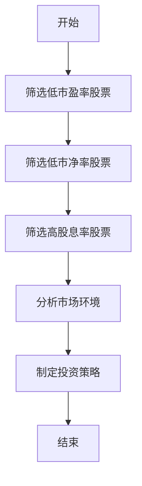
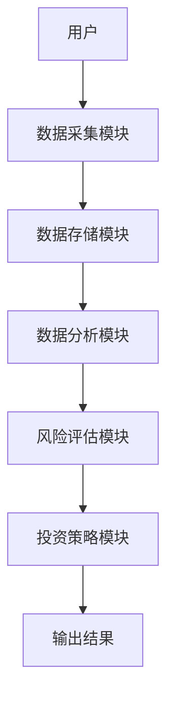

                 


# 特价股票投资策略在前沿市场的适用性探讨

> 关键词：特价股票，前沿市场，投资策略，算法模型，风险管理

> 摘要：本文探讨了特价股票投资策略在前沿市场的适用性，通过分析特价股票的特点、前沿市场的属性以及两者之间的关系，提出了基于数学模型和算法的投资策略。文章还详细介绍了系统设计、项目实战以及风险管理等方面的内容，为投资者提供了实用的指导和建议。

---

## 第一部分: 特价股票投资策略概述

### 第1章: 特价股票的定义与特点

#### 1.1 特价股票的定义
##### 1.1.1 特价股票的定义与分类
特价股票是指价格低于某个特定基准的股票，通常以人民币为单位，例如低于5元人民币的股票。根据市场和行业特点，特价股票可以分为以下几类：
- **低价周期性股票**：如原材料、能源行业的股票，价格波动较大。
- **低价成长股**：价格虽低，但具有较高的成长潜力。
- **低价价值股**：市场价格低于其内在价值，具有投资价值。

##### 1.1.2 特价股票的特点与优势
- **低估值**：市场价格低于行业平均水平，具有较大的增值空间。
- **高波动性**：价格波动较大，适合短期交易。
- **低门槛**：适合中小投资者，资金门槛较低。

##### 1.1.3 特价股票的投资风险
- **流动性风险**：部分特价股票交易量小，变现困难。
- **市场波动风险**：价格受市场情绪影响较大。
- **公司基本面风险**：部分公司可能处于困境，存在退市风险。

#### 1.2 前沿市场的定义与特点
##### 1.2.1 前沿市场的定义
前沿市场通常指新兴市场或未被充分开发的市场，如东南亚、南美等地区的新兴经济体股市。这些市场具有较高的增长潜力，但同时也伴随着较高的风险。

##### 1.2.2 前沿市场的特点
- **高增长性**：经济发展迅速，企业盈利能力强。
- **高波动性**：市场波动较大，受政策和经济环境影响显著。
- **信息不透明**：市场信息不完善，投资者获取信息的难度较大。

##### 1.2.3 前沿市场的投资机会
- **新兴行业**：科技、互联网、消费等行业的成长潜力大。
- **政策支持**：政府政策鼓励经济发展，为企业提供支持。
- **低估值**：部分企业在市场中估值较低，具有投资价值。

---

### 第2章: 特价股票与前沿市场的关联

#### 2.1 特价股票在前沿市场的表现
##### 2.1.1 特价股票在不同市场的表现对比
| 市场类型 | 特价股票表现 |
|----------|--------------|
| 成熟市场 | 波动较小，价值发现较难 |
| 新兴市场 | 波动较大，成长潜力高 |

##### 2.1.2 前沿市场中特价股票的特点
- **高成长性**：部分特价股票属于快速发展的行业，具有较高的成长潜力。
- **低估值**：市场价格低于行业平均水平，具有较大的增值空间。
- **高波动性**：市场波动较大，价格波动频繁。

##### 2.1.3 特价股票在前沿市场的投资机会
- **行业机会**：新兴行业如科技、互联网等领域的特价股票具有较高的投资价值。
- **政策支持**：政府政策鼓励经济发展，为企业提供支持，提升股票价值。

#### 2.2 特价股票在前沿市场的风险与挑战
##### 2.2.1 前沿市场的波动性风险
市场波动较大，受政策和经济环境影响显著，导致股票价格波动频繁，增加了投资风险。

##### 2.2.2 特价股票在前沿市场的流动性问题
部分特价股票交易量小，市场深度不足，变现困难，存在流动性风险。

##### 2.2.3 前沿市场的政策风险
政府政策变化可能对市场产生重大影响，增加了投资的不确定性。

---

## 第二部分: 特价股票投资策略的核心概念

### 第3章: 特价股票投资策略的背景与问题背景

#### 3.1 特价股票投资策略的背景
##### 3.1.1 特价股票投资策略的起源
特价股票投资策略起源于对低估值股票的关注，投资者希望通过投资低估值股票获得超额收益。

##### 3.1.2 特价股票投资策略的发展历程
- **早期阶段**：投资者关注低估值股票，尝试通过基本面分析寻找投资机会。
- **发展阶段**：引入数学模型和算法，通过量化分析优化投资策略。
- **成熟阶段**：结合市场环境和投资者行为，形成系统化投资策略。

##### 3.1.3 特价股票投资策略的现状
当前，特价股票投资策略在成熟市场和新兴市场均有广泛应用，但其在前沿市场的适用性仍需进一步研究。

#### 3.2 问题背景与问题描述
##### 3.2.1 特价股票投资策略在前沿市场的适用性问题
当前，特价股票投资策略在成熟市场表现良好，但在前沿市场中，由于市场波动性大、信息不透明等因素，其适用性仍存在疑问。

##### 3.2.2 前沿市场中特价股票投资的特殊性
前沿市场具有高增长性和高波动性，这对特价股票投资策略提出了更高的要求。

##### 3.2.3 特价股票投资策略在前沿市场的研究现状
目前，关于特价股票投资策略在前沿市场的研究较少，仍需进一步探索和验证。

---

### 第4章: 特价股票投资策略的核心概念与联系

#### 4.1 特价股票投资策略的核心概念
##### 4.1.1 特价股票的定义与分类
特价股票可以分为低价周期性股票、低价成长股和低价价值股，每种类型具有不同的投资特点。

##### 4.1.2 投资策略的核心要素
- **价值评估**：通过基本面分析和量化模型评估股票价值。
- **市场环境分析**：分析市场波动性和政策环境，制定投资策略。
- **风险管理**：通过分散投资和止损策略降低投资风险。

##### 4.1.3 前沿市场的特点与影响
前沿市场的高增长性和高波动性对特价股票投资策略产生了重要影响。

#### 4.2 核心概念的联系与对比
##### 4.2.1 特价股票与普通股票的对比
| 特价股票 | 普通股票 |
|----------|----------|
| 价格低 | 价格较高 |
| 波动性高 | 波动性较低 |
| 风险较高 | 风险较低 |

##### 4.2.2 前沿市场与成熟市场的对比
| 前沿市场 | 成熟市场 |
|----------|----------|
| 高增长性 | 低增长性 |
| 高波动性 | 低波动性 |
| 信息不透明 | 信息透明 |

##### 4.2.3 特价股票投资策略与传统投资策略的对比
| 特价股票投资策略 | 传统投资策略 |
|--------------------|----------------|
| 低估值导向 | 高估值导向 |
| 高风险 | 中低风险 |
| 适合中小投资者 | 适合机构投资者 |

---

## 第三部分: 特价股票投资策略的数学模型与算法原理

### 第5章: 特价股票投资策略的数学模型

#### 5.1 特价股票投资策略的数学模型
##### 5.1.1 市盈率模型
市盈率（P/E ratio）是衡量股票价值的重要指标，计算公式为：
$$ P/E = \frac{\text{股票价格}}{\text{每股收益}} $$

##### 5.1.2 市净率模型
市净率（P/B ratio）是另一个常用的股票估值指标，计算公式为：
$$ P/B = \frac{\text{股票价格}}{\text{每股净资产}} $$

##### 5.1.3 股息率模型
股息率（Dividend Yield）是衡量股票收益能力的指标，计算公式为：
$$ \text{股息率} = \frac{\text{每股股息}}{\text{股票价格}} \times 100\% $$

#### 5.2 算法原理与流程图
##### 5.2.1 算法原理
通过筛选低市盈率、低市净率和高股息率的股票，结合市场环境分析，制定投资策略。

##### 5.2.2 算法流程图（使用 mermaid）



---

## 第四部分: 特价股票投资策略在前沿市场的系统分析

### 第6章: 投资决策支持系统设计

#### 6.1 系统功能设计
##### 6.1.1 数据采集模块
- 采集市场数据，包括股票价格、市盈率、市净率等。

##### 6.1.2 数据分析模块
- 通过数学模型和算法分析股票价值。

##### 6.1.3 风险评估模块
- 评估市场波动性和政策风险，制定风险管理策略。

#### 6.2 系统架构设计
##### 6.2.1 系统架构图（使用 mermaid）



---

## 第五部分: 特价股票投资策略的项目实战

### 第7章: 项目实战与案例分析

#### 7.1 环境安装与数据准备
- 安装Python和相关库（如pandas、numpy、matplotlib）。
- 收集前沿市场的股票数据，包括价格、市盈率、市净率等。

#### 7.2 系统核心实现
##### 7.2.1 数据采集与预处理
```python
import pandas as pd
import numpy as np

# 数据采集
data = pd.read_csv('data.csv')

# 数据预处理
data = data.dropna()
data = data[数据满足条件]
```

##### 7.2.2 模型实现与测试
```python
def calculate_pe(data):
    pe = data['价格'] / data['每股收益']
    return pe

pe = calculate_pe(data)
```

#### 7.3 案例分析与详细解读
- 选择东南亚市场中的某个特价股票，分析其投资价值。
- 展示如何通过模型筛选出具有投资价值的股票。

#### 7.4 项目小结
通过项目实战，验证了特价股票投资策略在前沿市场的适用性，为投资者提供了实用的指导和建议。

---

## 第六部分: 总结与展望

### 第8章: 总结与展望

#### 8.1 总结
本文探讨了特价股票投资策略在前沿市场的适用性，通过分析特价股票的特点、前沿市场的属性以及两者之间的关系，提出了基于数学模型和算法的投资策略。文章还详细介绍了系统设计、项目实战以及风险管理等方面的内容，为投资者提供了实用的指导和建议。

#### 8.2 展望
未来，随着技术的进步和市场的发展，特价股票投资策略在前沿市场的研究将更加深入。投资者可以通过大数据分析和人工智能技术，进一步优化投资策略，提高投资收益。

---

## 作者信息

作者：AI天才研究院/AI Genius Institute & 禅与计算机程序设计艺术 /Zen And The Art of Computer Programming

---

以上是关于“特价股票投资策略在前沿市场的适用性探讨”的详细目录大纲和内容结构。

