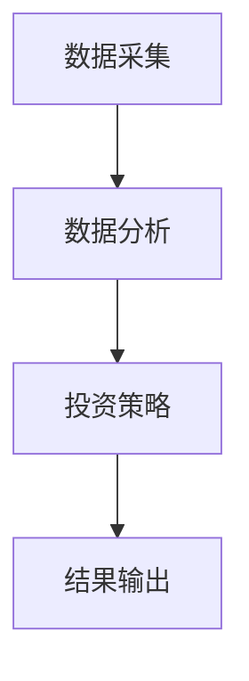

                 


# 特价股票投资策略在微型经济体中的适用性探讨

> 关键词：特价股票，微型经济体，投资策略，数学模型，Python算法，系统架构

> 摘要：本文探讨了特价股票投资策略在微型经济体中的适用性。首先，我们介绍了特价股票和微型经济体的基本概念，并分析了它们之间的关系。接着，我们构建了一个基于数学模型的投资策略，并通过Python算法进行实现。我们还设计了一个系统架构，用于分析微型经济体中的投资环境，并通过实际案例验证了策略的有效性。

---

## 第一部分: 特价股票投资策略概述

### 第1章: 特价股票的基本概念与特点

#### 1.1 特价股票的定义与分类
- **特价股票的定义**: 特价股票是指价格较低的股票，通常属于小盘股，具有较高的增长潜力。
- **特价股票的分类**: 根据市场流动性、公司规模和行业特点，将特价股票分为成长型、价值型和混合型。
- **特价股票与普通股票的区别**: 特价股票价格低，流动性差，风险高；普通股票价格高，流动性好，风险较低。

#### 1.2 特价股票的特点
- **价格低廉的特点**: 特价股票价格通常低于大盘股，适合小资金投资者。
- **市场波动性较大的特点**: 特价股票受市场情绪影响较大，价格波动剧烈。
- **投资风险较高的特点**: 特价股票公司规模小，抗风险能力弱，容易受市场波动影响。

### 第2章: 微型经济体的定义与特点

#### 2.1 微型经济体的定义
- **微型经济体的范围界定**: 指经济规模较小、市场参与者较少的经济体，如小型国家或特定区域市场。
- **微型经济体的经济规模特点**: GDP较低，市场容量小，经济结构简单。
- **微型经济体的市场结构特点**: 市场流动性低，参与者少，信息不对称严重。

#### 2.2 微型经济体的核心特征
- **经济活动特点**: 以中小企业为主，经济活动集中，对外依赖性强。
- **政策环境特点**: 政策变化频繁，监管力度较小，市场规则不完善。
- **市场参与者特点**: 投资者数量有限，机构投资者少，个人投资者为主。

### 第3章: 特价股票投资策略在微型经济体中的适用性背景

#### 3.1 投资策略在微型经济体中的重要性
- **微型经济体中投资策略的必要性**: 微型经济体市场波动大，信息不透明，投资者需要有效的策略来降低风险。
- **特价股票在微型经济体中的潜在价值**: 特价股票价格低，适合微型经济体中的小资金投资者，具有较高的增长潜力。

#### 3.2 特价股票投资策略的理论基础
- **价值投资理论**: 以公司基本面分析为基础，寻找被市场低估的股票。
- **技术分析理论**: 通过价格和成交量的变化预测未来走势。
- **市场情绪分析理论**: 通过投资者情绪变化判断市场趋势。

### 第4章: 特价股票与微型经济体的关系分析

#### 4.1 特价股票在微型经济体中的市场定位
- **价格优势**: 特价股票价格低，适合微型经济体中的小资金投资者。
- **流动性问题**: 微型经济体市场流动性低，导致特价股票交易不活跃。

#### 4.2 微型经济体对特价股票投资策略的影响
- **政策环境影响**: 微型经济体政策变化频繁，影响股票市场的稳定性。
- **市场结构影响**: 微型经济体市场参与者少，信息不对称严重，影响投资策略的实施。
- **经济周期影响**: 微型经济体经济波动大，影响特价股票的市场表现。

---

## 第二部分: 特价股票投资策略的核心概念与联系

### 第5章: 特价股票投资策略的核心原理

#### 5.1 特价股票投资策略的理论框架
- **价值发现理论**: 通过基本面分析，寻找被市场低估的股票。
- **市场情绪分析**: 通过投资者情绪变化，判断市场趋势。

#### 5.2 特价股票与微型经济体的关系
- **市场定位**: 特价股票在微型经济体中具有价格优势，但流动性问题限制了其投资价值。
- **政策环境**: 微型经济体的政策变化对特价股票的投资策略有重要影响。

---

## 第三部分: 特价股票投资策略的数学模型与算法实现

### 第6章: 投资策略的数学模型

#### 6.1 回归分析模型
- **模型描述**: 通过回归分析，预测股票价格与市场指数之间的关系。
- **公式**: $$ y = \beta_0 + \beta_1 x + \epsilon $$
  其中，$y$ 是股票价格，$x$ 是市场指数，$\beta_0$ 和 $\beta_1$ 是回归系数，$\epsilon$ 是误差项。

#### 6.2 时间序列分析模型
- **模型描述**: 通过ARIMA模型预测股票价格的未来走势。
- **公式**: $$ y_t = \phi_1 y_{t-1} + \theta_1 \epsilon_{t-1} + \epsilon_t $$

### 第7章: 投资策略的Python算法实现

#### 7.1 回归分析实现
```python
import statsmodels.api as sm

# 数据准备
X = sm.add_constant(x)
model = sm.OLS(y, X)
result = model.fit()
print(result.summary())
```

#### 7.2 时间序列分析实现
```python
from statsmodels.tsa.arima_model import ARIMA

model = ARIMA(y, order=(1, 1, 1))
result = model.fit()
print(result.summary())
```

---

## 第四部分: 系统架构与项目实战

### 第8章: 系统架构设计

#### 8.1 系统功能设计
- **数据采集模块**: 从微型经济体的股票市场获取数据。
- **数据分析模块**: 使用回归分析和时间序列分析模型进行数据分析。
- **投资策略模块**: 根据分析结果制定投资策略。

#### 8.2 系统架构图


### 第9章: 项目实战案例

#### 9.1 环境搭建
- **工具安装**: 安装Python、Pandas、NumPy、Statsmodels等工具。

#### 9.2 数据采集与处理
```python
import pandas as pd

data = pd.read_csv('data.csv')
data.head()
```

#### 9.3 策略实现
```python
from statsmodels.tsa.arima_model import ARIMA

model = ARIMA(data['price'], order=(1, 1, 1))
result = model.fit()
predictions = result.forecast(steps=10)
print(predictions)
```

#### 9.4 案例分析
- **数据可视化**: 使用Matplotlib绘制股票价格走势。
- **策略效果分析**: 对比实际价格与预测价格，评估策略的有效性。

### 第10章: 总结与展望

#### 10.1 总结
- **研究意义**: 本文探讨了特价股票投资策略在微型经济体中的适用性，提出了基于数学模型的投资策略，并通过Python算法实现。
- **研究局限性**: 微型经济体市场流动性低，信息不透明，影响策略的实施效果。

#### 10.2 未来研究方向
- **模型优化**: 进一步优化回归分析和时间序列分析模型，提高预测精度。
- **策略扩展**: 结合机器学习算法，提出更复杂的投资策略。

#### 10.3 投资注意事项
- **风险控制**: 在微型经济体中投资风险较高，需注意风险控制。
- **信息获取**: 提高信息获取能力，减少信息不对称的影响。

#### 10.4 最佳实践 Tips
- **长期投资**: 选择基本面良好的公司，进行长期投资。
- **分散投资**: 通过分散投资降低风险。

---

## 作者

作者：AI天才研究院/AI Genius Institute & 禅与计算机程序设计艺术 /Zen And The Art of Computer Programming

