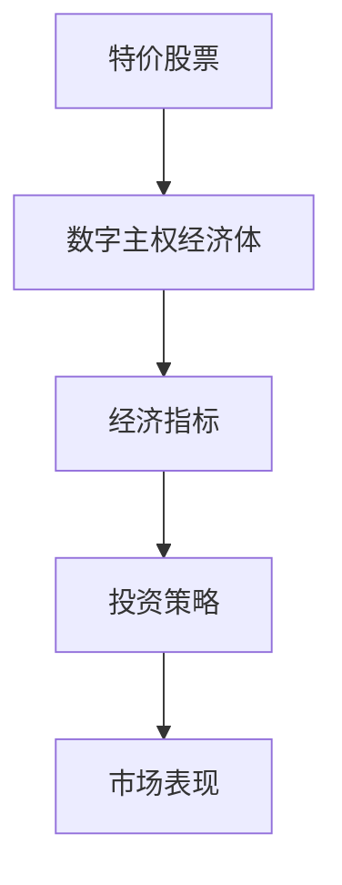
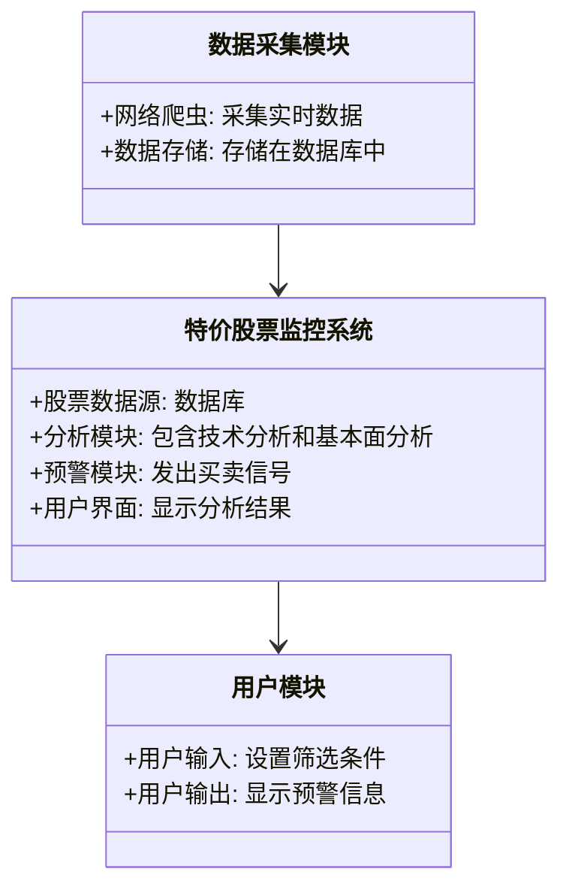
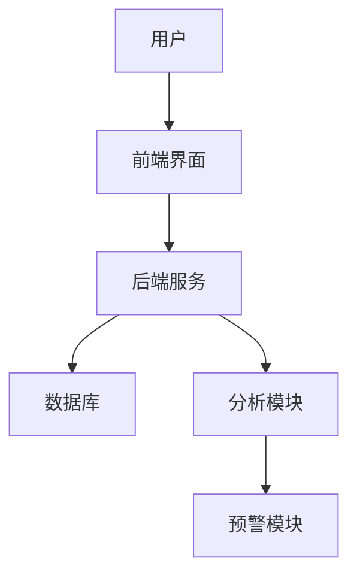
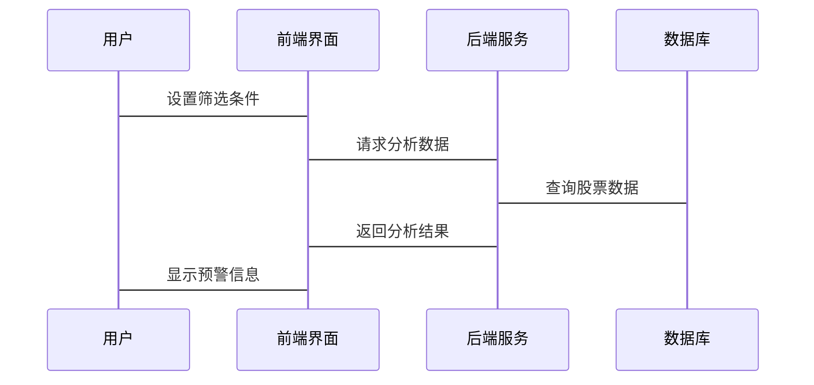

                 

<think>
好，我现在要开始写一篇关于《特价股票投资策略在数字新兴主权经济体中的适用性探讨》的技术博客文章。首先，我需要明确文章的结构，按照用户给我的目录大纲来展开。文章需要逻辑清晰，结构紧凑，语言专业但易懂，同时涵盖用户要求的所有部分，包括背景介绍、核心概念、算法原理、数学模型、系统架构、项目实战和结论等。

### 第1章: 特价股票与数字新兴主权经济体的背景介绍

#### 1.1 特价股票的定义与特征
首先，我需要定义什么是特价股票。特价股票通常指的是那些价格低于面值的股票，可能由于市场波动、公司财务问题或其他因素导致价格下跌。特价股票的特点包括高风险、高回报潜力，以及可能存在的价值被低估的情况。

接下来，我需要分析特价股票的主要特征。这可能包括低市盈率、低市净率、高股息率等。这些特征可以帮助投资者识别潜在的投资机会。

然后，我会探讨特价股票的市场表现。历史上，许多特价股票在特定条件下表现优异，但也有可能继续下跌。因此，投资者需要谨慎选择，结合市场环境和公司基本面进行分析。

#### 1.2 数字新兴主权经济体的概念
接下来，我需要介绍数字新兴主权经济体。这些经济体通常是指那些在数字经济领域发展迅速，具有较强主权的新兴国家。例如，新加坡、中国的某些地区（如深圳）等。

数字主权经济体的特点包括高度依赖数字技术、经济增长迅速、政策支持数字经济、以及在国际贸易中占据重要地位。这些特点使得它们在股票市场中具有独特的投资机会。

#### 1.3 特价股票与数字主权经济体的关联性
我需要探讨特价股票与数字主权经济体之间的关系。数字主权经济体的公司可能因为市场波动或短期困境导致股价下跌，从而成为特价股票。同时，这些经济体的政策支持和经济增长潜力可能为特价股票带来反弹的机会。

### 第2章: 特价股票投资策略的核心概念与联系

#### 2.1 特价股票投资策略的原理
首先，我需要解释特价股票投资策略的基本原理。这包括基本面分析、技术分析和风险管理。基本面分析关注公司的财务状况、盈利能力等，而技术分析则关注股价走势和成交量。

然后，我需要详细分析特价股票投资的独特性。由于特价股票通常价格较低，投资者可以通过购买大量股票来分散风险。同时，识别被市场低估的公司是关键。

接下来，我会介绍投资策略的数学模型。例如，使用市盈率（P/E）和市净率（P/B）等指标来评估股票的价值。我可能会展示一个简单的数学模型，如：

$$ P/E = \frac{\text{股价}}{\text{每股收益}} $$

通过分析P/E比，投资者可以判断股票是否被低估。

#### 2.2 数字主权经济体的经济指标分析
我需要列出数字主权经济体的主要经济指标，如GDP增长率、失业率、通胀率等。这些指标可以帮助评估经济体的整体健康状况，进而影响股市表现。

接下来，我需要分析这些经济指标对股票市场的影响。例如，低通胀和高GDP增长可能促进股市上涨，而高失业率和负增长可能抑制股市表现。

然后，我会探讨经济指标与特价股票的关系。数字主权经济体的经济指标波动可能直接影响特价股票的价格。例如，经济增长放缓可能导致某些股票价格下跌，成为特价股票。

#### 2.3 特价股票投资策略与数字主权经济体的ER实体关系图



这个图展示了特价股票与数字主权经济体之间的关系，以及经济指标对投资策略和市场表现的影响。

### 第3章: 特价股票投资策略的算法原理

#### 3.1 特价股票投资策略的算法
我需要详细解释特价股票投资策略的算法。例如，使用大数据分析技术来筛选低价股票，结合技术指标进行买卖决策。

下面是一个简单的算法流程：

1. 数据采集：收集数字主权经济体内的股票数据，包括股价、市盈率、市净率等。
2. 筛选特价股票：设定筛选条件，如市盈率低于行业平均水平。
3. 技术分析：使用移动平均线、RSI等指标判断买入和卖出时机。
4. 风险管理：设置止损点和止盈点，控制投资风险。

这个流程可以通过Python代码实现。例如：

```python
import pandas as pd
import numpy as np

# 数据采集
data = pd.read_csv('stock_data.csv')

# 筛选特价股票
data['is_discount_stock'] = data['P/E'] < data['P/E'].mean()

# 技术分析
data['moving_average'] = data['股价'].rolling(5).mean()
data['RSI'] = ta.RSI(data['股价'], window=14)
```

#### 3.2 数学模型
我需要建立数学模型来预测股票价格。例如，使用线性回归模型：

$$ \text{预测价格} = a \times \text{当前价格} + b \times \text{P/E} + c $$

其中，a、b、c是回归系数，通过历史数据进行估计。

### 第4章: 数学模型与算法实现

#### 4.1 特价股票的数学模型
我将详细解释如何使用数学模型进行股票预测。例如，使用时间序列分析模型，如ARIMA，来预测未来股价。

#### 4.2 算法实现
通过Python代码实现数学模型。例如：

```python
from statsmodels.tsa.arima_model import ARIMA

# 建立ARIMA模型
model = ARIMA(data['股价'], order=(5,1,0))
model_fit = model.fit()

# 预测未来价格
forecast = model_fit.forecast(steps=5)
```

### 第5章: 系统分析与架构设计

#### 5.1 问题场景介绍
我需要描述一个具体的场景，例如在一个新兴的数字主权经济体中，如何利用特价股票投资策略进行投资。

#### 5.2 系统功能设计
设计一个系统，用于监控和分析数字主权经济体内的特价股票。系统功能包括数据采集、筛选、分析和预警。

使用Mermaid类图描述系统结构：



#### 5.3 系统架构设计
使用Mermaid架构图描述系统架构：



#### 5.4 接口设计
定义系统接口，例如：

- 数据接口：从数据库获取股票数据。
- 分析接口：调用分析模块进行技术分析。
- 预警接口：发送买卖信号到用户界面。

#### 5.5 交互设计
使用Mermaid序列图描述用户与系统之间的交互：



### 第6章: 项目实战

#### 6.1 环境安装
指导读者如何安装Python和相关库，如Pandas、NumPy、Matplotlib等。

#### 6.2 核心代码实现
提供核心代码，例如数据采集、筛选和分析模块的实现。

```python
import pandas as pd
import numpy as np
import matplotlib.pyplot as plt

# 数据采集
data = pd.read_csv('stock_data.csv')

# 筛选特价股票
data['is_discount_stock'] = data['P/E'] < data['P/E'].mean()

# 可视化
plt.scatter(data['P/E'], data['股价'])
plt.xlabel('P/E')
plt.ylabel('股价')
plt.title('P/E vs 股价')
plt.show()
```

#### 6.3 案例分析
分析一个实际案例，例如在新加坡市场中如何应用特价股票投资策略。

#### 6.4 分析与解读
解释代码的功能和案例分析的结果，说明投资策略的有效性。

#### 6.5 项目小结
总结项目成果，指出成功和不足之处。

### 第7章: 结论与展望

#### 7.1 研究结论
总结研究发现，特价股票在数字主权经济体中具有一定的投资机会，但需要结合市场环境和公司基本面进行分析。

#### 7.2 适用性探讨
探讨投资策略的适用性和局限性，指出在不同市场条件下策略的有效性可能不同。

#### 7.3 未来研究方向
提出未来的研究方向，如引入机器学习算法进行预测，或研究不同经济指标对股价的综合影响。

### 附录

#### 附录A: 数据来源说明
列出数据来源和获取方法。

#### 附录B: 工具安装说明
指导读者如何安装Python和相关库。

#### 附录C: 参考文献
列出参考文献和相关资料。

### 作者

作者：AI天才研究院/AI Genius Institute & 禅与计算机程序设计艺术 /Zen And The Art of Computer Programming

---

### 总结

通过以上思考，我可以逐步构建出一篇结构清晰、内容丰富的技术博客文章，涵盖用户要求的所有部分。接下来，我将按照这个思路撰写具体的章节内容，确保每一部分都详细且有深度，同时保持语言的专业性和可读性。

