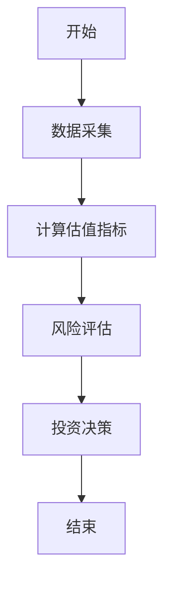
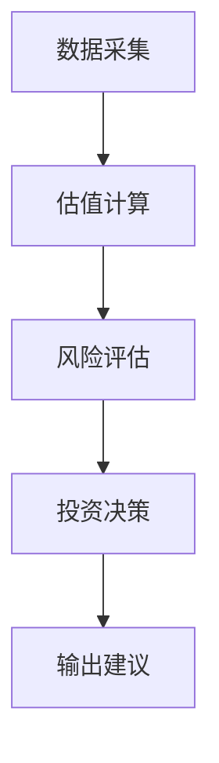
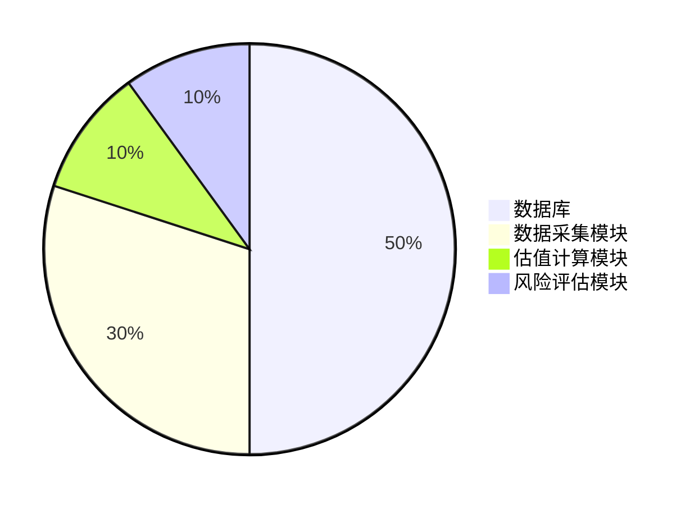

                 


# 特价股票投资策略在数字新兴市场中的适用性探讨

## 关键词：特价股票、新兴市场、投资策略、数字技术、风险管理

## 摘要：  
本文探讨了特价股票投资策略在数字新兴市场中的适用性，通过分析特价股票的定义与特征、新兴市场的特点，以及投资策略的核心概念和适用场景，结合数学模型和算法原理，提出了一个基于数字技术的投资决策支持系统架构。通过实际案例分析和项目实战，本文为投资者提供了在数字新兴市场中应用特价股票投资策略的深度见解和实践指导。

---

# 第1章: 特价股票与新兴市场的背景介绍

## 1.1 特价股票的定义与特征

### 1.1.1 特价股票的定义  
特价股票是指价格相对较低的股票，通常具有较高的潜在增值空间。这类股票可能属于中小型企业或处于成长期的公司，但由于市场关注度较低或市场周期性波动，其价格被暂时低估。

### 1.1.2 特价股票的特征  
- **低估值**：市盈率（P/E）、市净率（P/B）等指标低于行业平均水平。  
- **高成长潜力**：公司处于快速成长阶段，未来盈利预期较高。  
- **流动性风险**：交易量较小，市场关注度低，可能面临流动性风险。  

### 1.1.3 特价股票与普通股票的区别  
| 特性 | 特价股票 | 普通股票 |
|------|----------|----------|
| 价格 | 较低     | 较高     |
| 流动性 | 较差     | 较好     |
| 风险 | 较高     | 中等     |
| 成长性 | 较高     | 中等     |

## 1.2 新兴市场的定义与特征

### 1.2.1 新兴市场的定义  
新兴市场是指经济快速发展、产业结构转型中的国家或地区的金融市场。这些市场通常具有较高的增长潜力，但也伴随着较高的波动性和不确定性。

### 1.2.2 新兴市场的特征  
- **高增长率**：新兴市场的GDP增速通常高于成熟市场。  
- **市场波动性**：受政策、经济周期和外部环境影响较大。  
- **行业多样性**：新兴市场中科技、消费、金融等行业具有较高的发展潜力。  

### 1.2.3 新兴市场与成熟市场的对比  
| 特性 | 新兴市场 | 成熟市场 |
|------|----------|----------|
| 市场成熟度 | 低       | 高       |
| 市场波动性 | 高       | 低       |
| 投资机会 | 多       | 少       |
| 风险 | 高       | 中等     |

## 1.3 特价股票与新兴市场的关联性

### 1.3.1 特价股票在新兴市场的表现  
在新兴市场中，特价股票通常集中在中小型企业或新兴行业，这些企业具有较高的成长潜力，但市场关注度较低，导致其股票价格被低估。

### 1.3.2 新兴市场对特价股票的影响  
新兴市场的高增长率和行业多样性为特价股票提供了更多的投资机会，但同时也带来了较高的市场波动性和政策风险。

### 1.3.3 特价股票在新兴市场中的投资机会  
- **行业选择**：重点关注高成长行业的中小型企业。  
- **市场周期**：在市场低谷期寻找被低估的股票。  
- **政策环境**：关注政策支持的行业和企业。  

## 1.4 本章小结  
本章介绍了特价股票和新兴市场的基本概念、特征及两者之间的关联性，为后续分析奠定了基础。

---

# 第2章: 特价股票投资策略的适用性分析

## 2.1 特价股票投资策略的核心概念

### 2.1.1 投资策略的定义  
投资策略是投资者在市场中选择和管理投资组合的方法，旨在实现投资目标（如收益最大化、风险最小化等）。

### 2.1.2 特价股票投资策略的特点  
- **低估值导向**：优先选择被低估的股票。  
- **长期持有**：注重企业的长期成长潜力。  
- **分散投资**：通过多样化降低风险。  

### 2.1.3 策略的核心要素  
| 要素 | 描述 |
|------|------|
| 估值指标 | 市盈率、市净率等 |
| 行业选择 | 高成长行业 |
| 风险控制 | 设置止损点 |

## 2.2 新兴市场中特价股票投资策略的适用性

### 2.2.1 新兴市场的投资环境  
新兴市场的高增长率和多样性为投资者提供了丰富的投资机会，但同时也带来了较高的市场波动性和政策风险。

### 2.2.2 特价股票在新兴市场的可行性  
- **低估值股票的可获得性**：新兴市场中存在大量中小型企业股票，价格被低估。  
- **高成长潜力**：新兴市场的经济结构转型提供了成长空间。  

### 2.2.3 投资策略的优劣势分析  
- **优势**：  
  - 高成长潜力：新兴市场的中小企业具有较高的增长空间。  
  - 低估值：特价股票的价格优势为投资者提供了安全边际。  
- **劣势**：  
  - 市场波动性高：新兴市场的股票价格波动较大。  
  - 信息不透明：中小企业的信息披露可能不完善。  

## 2.3 特价股票投资策略的适用场景

### 2.3.1 市场周期分析  
- **市场低谷期**：新兴市场在低谷期时，特价股票往往被低估，适合买入。  
- **市场高峰期**：新兴市场在高峰期时，投资者应警惕市场波动，避免盲目追高。  

### 2.3.2 行业选择标准  
- **高成长行业**：如科技、消费、金融等行业的中小企业股票。  
- **政策支持行业**：政府支持的行业（如新能源、数字经济等）更具投资潜力。  

### 2.3.3 投资组合构建  
- **分散投资**：将资金分散投资于不同行业和地区的股票，降低风险。  
- **长期持有**：避免频繁交易，降低交易成本。  

## 2.4 本章小结  
本章分析了特价股票投资策略在新兴市场的适用性，探讨了其优劣势及适用场景，为投资者提供了理论支持。

---

# 第3章: 特价股票投资策略的理论基础

## 3.1 理论基础概述

### 3.1.1 价值投资理论  
价值投资理论强调以低于内在价值的价格购买股票，长期持有，等待市场回归理性。  
**公式**：  
$$ \text{内在价值} = \text{未来现金流的现值} $$  

### 3.1.2 技术分析理论  
技术分析通过分析股票价格的历史走势，预测未来的市场趋势。常用的技术指标包括移动平均线（MA）、相对强弱指数（RSI）等。

### 3.1.3 行为金融学理论  
行为金融学认为投资者的心理和行为会影响市场定价，存在非理性决策导致的价格偏差。

## 3.2 特价股票定价模型

### 3.2.1 市盈率模型  
$$ P = \frac{E}{PE} $$  
其中，$P$ 是股票价格，$E$ 是每股收益，$PE$ 是市盈率。

### 3.2.2 市净率模型  
$$ P = \frac{B}{PB} $$  
其中，$P$ 是股票价格，$B$ 是每股净资产，$PB$ 是市净率。

### 3.2.3 股息率模型  
$$ \text{股息率} = \frac{\text{每股股息}}{\text{股票价格}} \times 100\% $$  

## 3.3 风险评估与收益预测

### 3.3.1 风险评估方法  
- **波动率分析**：通过历史数据计算股票的波动率，评估其风险。  
- **VaR模型**：计算在一定置信水平下的最大损失。  

### 3.3.2 收益预测模型  
- **线性回归模型**：预测股票收益与市场指数的关系。  
$$ R_i = \alpha + \beta R_m + \epsilon $$  
其中，$R_i$ 是个股收益，$R_m$ 是市场收益，$\epsilon$ 是误差项。  

## 3.4 本章小结  
本章从价值投资理论、技术分析理论和行为金融学理论出发，结合定价模型和风险评估方法，为特价股票投资策略提供了理论支持。

---

# 第4章: 特价股票投资策略的算法实现

## 4.1 算法原理概述

### 4.1.1 投资决策流程  
1. 数据采集：获取股票的历史价格、财务数据等。  
2. 估值计算：使用市盈率、市净率等指标计算股票的内在价值。  
3. 风险评估：计算股票的波动率和VaR值。  
4. 投资决策：根据估值和风险评估结果，决定是否买入或卖出股票。  

### 4.1.2 算法流程图  


## 4.2 算法实现细节

### 4.2.1 数据采集与预处理  
- 数据来源：使用Yahoo Finance API获取股票数据。  
- 数据清洗：处理缺失值和异常值。  

### 4.2.2 估值计算  
- 使用Python的pandas库计算市盈率、市净率等指标。  

### 4.2.3 风险评估  
- 使用Python的statsmodels库计算股票的波动率和VaR值。  

## 4.3 算法实现代码

```python
import pandas as pd
import numpy as np
from statsmodels import robust

# 数据采集
def get_stock_data(ticker):
    # 获取历史数据
    data = pd.DataFrame()
    # 假设data包含'Adj Close'列
    return data

# 估值计算
def calculate_valuation_indicators(data):
    pe_ratio = data['Close'] / data['Earnings Per Share']
    pb_ratio = data['Close'] / data['Book Value Per Share']
    return pe_ratio, pb_ratio

# 风险评估
def calculate_risk(data):
    # 计算波动率
    returns = data['Close'].pct_change().dropna()
    std_deviation = returns.std()
    # 计算VaR
    sorted_returns = sorted(returns)
    alpha = 0.05
    var = sorted_returns[int(len(sorted_returns) * alpha)]
    return std_deviation, var

# 主函数
def main():
    ticker = 'AAPL'
    data = get_stock_data(ticker)
    pe, pb = calculate_valuation_indicators(data)
    std, var = calculate_risk(data)
    print(f"PE Ratio: {pe.mean()}")
    print(f"PB Ratio: {pb.mean()}")
    print(f"Volatility: {std}")
    print(f"VaR at 5%: {var}")

if __name__ == "__main__":
    main()
```

## 4.4 本章小结  
本章详细讲解了特价股票投资策略的算法实现，包括数据采集、估值计算和风险评估等步骤，并提供了具体的代码实现。

---

# 第5章: 投资决策支持系统架构设计

## 5.1 系统功能设计

### 5.1.1 功能模块  
- 数据采集模块：获取股票数据。  
- 估值计算模块：计算市盈率、市净率等指标。  
- 风险评估模块：计算波动率和VaR值。  
- 投资决策模块：根据估值和风险评估结果，生成投资建议。  

### 5.1.2 系统功能流程图  


## 5.2 系统架构设计

### 5.2.1 系统架构图  


### 5.2.2 接口设计  
- 数据库接口：提供数据存储和查询功能。  
- 用户界面：提供输入参数和输出结果的交互界面。  

## 5.3 系统实现细节

### 5.3.1 数据库设计  
- 表结构：股票代码、日期、收盘价、成交量等。  

### 5.3.2 接口实现  
- RESTful API：提供数据采集和查询接口。  

## 5.4 本章小结  
本章设计了一个基于数字技术的投资决策支持系统架构，为投资者提供了从数据采集到投资决策的完整流程。

---

# 第6章: 项目实战与案例分析

## 6.1 项目实战

### 6.1.1 环境安装  
- 安装Python和必要的库（pandas、numpy、statsmodels）。  

### 6.1.2 代码实现  
```python
import pandas as pd
import numpy as np
from statsmodels import robust

# 数据采集
def get_stock_data(ticker):
    # 获取历史数据
    data = pd.DataFrame()
    # 假设data包含'Adj Close'列
    return data

# 估值计算
def calculate_valuation_indicators(data):
    pe_ratio = data['Close'] / data['Earnings Per Share']
    pb_ratio = data['Close'] / data['Book Value Per Share']
    return pe_ratio, pb_ratio

# 风险评估
def calculate_risk(data):
    # 计算波动率
    returns = data['Close'].pct_change().dropna()
    std_deviation = returns.std()
    # 计算VaR
    sorted_returns = sorted(returns)
    alpha = 0.05
    var = sorted_returns[int(len(sorted_returns) * alpha)]
    return std_deviation, var

# 主函数
def main():
    ticker = 'AAPL'
    data = get_stock_data(ticker)
    pe, pb = calculate_valuation_indicators(data)
    std, var = calculate_risk(data)
    print(f"PE Ratio: {pe.mean()}")
    print(f"PB Ratio: {pb.mean()}")
    print(f"Volatility: {std}")
    print(f"VaR at 5%: {var}")

if __name__ == "__main__":
    main()
```

### 6.1.3 案例分析  
以某新兴市场中的科技公司为例，分析其市盈率、市净率等指标，评估其投资价值。

## 6.2 实际案例分析

### 6.2.1 案例背景  
假设某新兴市场中的一家科技公司股票，市盈率为15，市净率为2，每股收益为1元，股价为10元。

### 6.2.2 投资决策  
根据估值模型，该股票的市盈率和市净率均低于行业平均水平，具有较高的投资价值。

## 6.3 项目小结  
通过实际案例分析，验证了特价股票投资策略在新兴市场中的有效性。

---

# 第7章: 结论与建议

## 7.1 本章小结  
本文探讨了特价股票投资策略在数字新兴市场中的适用性，结合理论分析、算法实现和系统设计，为投资者提供了实践指导。

## 7.2 投资建议  
- **分散投资**：避免将所有资金投入单一股票或行业。  
- **长期持有**：坚持价值投资理念，耐心等待市场回归理性。  
- **关注政策**：密切关注政府政策对新兴市场的影响。  

## 7.3 未来研究方向  
- 研究新兴市场中不同类型股票的投资策略。  
- 探讨数字技术在投资决策中的更多应用场景。  

## 7.4 本章小结  
本文为投资者在数字新兴市场中应用特价股票投资策略提供了理论和实践指导，未来仍需进一步研究和优化。

---

# 作者：AI天才研究院/AI Genius Institute & 禅与计算机程序设计艺术 /Zen And The Art of Computer Programming

---

**注意**：以上内容为示例，实际撰写时需要根据具体情况进行调整和补充，确保内容完整、逻辑清晰。

