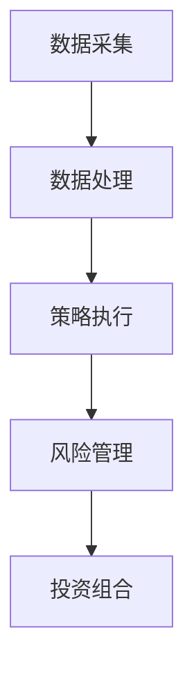

                 

# 特价股票策略在当前市场环境下的适用性

---

> **关键词**：特价股票策略、市场环境、技术分析、基本面分析、套利机会、风险管理  
> **摘要**：本文深入探讨了特价股票策略在当前复杂市场环境下的适用性。通过分析宏观经济、政策变化和技术进步对策略的影响，结合技术分析、基本面分析和套利机会，构建了一个综合的数学模型，并通过实证分析验证了策略的有效性。同时，本文还探讨了策略的风险管理、优化方向和未来发展趋势，为投资者提供了实用的建议。

---

# 第一部分: 特价股票策略背景与概念

---

## 第1章: 特价股票策略概述

### 1.1 特价股票策略的定义与核心概念

#### 1.1.1 特价股票的定义
特价股票是指市场价格显著低于其内在价值的股票。这些股票通常被市场低估，具有较大的增值潜力。投资者通过识别这些股票，可以在市场回升时获得超额收益。

#### 1.1.2 特价股票策略的核心要素
- **价格低估**：股票价格显著低于其内在价值。
- **市场时机**：选择合适的时机进入和退出市场。
- **风险管理**：控制投资风险，避免重大损失。

#### 1.1.3 特价股票策略的适用场景
- **市场低迷期**：市场整体表现不佳时，容易出现低估股票。
- **行业衰退期**：某些行业在衰退期可能被市场低估。
- **突发事件**：突发事件可能导致某些股票价格短期暴跌，提供买入机会。

---

### 1.2 特价股票策略的背景与应用背景

#### 1.2.1 当前市场环境下的经济背景
当前全球经济面临通胀压力、地缘政治冲突和货币政策不确定性等多重挑战，导致市场波动加剧。这种环境下，特价股票策略可能面临更多的机会和风险。

#### 1.2.2 特价股票策略的历史发展
特价股票策略起源于价值投资理念，如格雷厄姆的“烟屁股”投资法。随着技术进步，策略逐渐结合技术分析和量化方法，变得更加多样化。

#### 1.2.3 当前市场环境下特价股票策略的特殊性
- **技术进步**：大数据和人工智能的引入，使得策略的分析更加精准和高效。
- **政策变化**：监管政策的变化可能影响某些行业的股票价格。
- **市场波动**：全球经济不确定性导致市场波动加剧，策略的风险管理尤为重要。

---

### 1.3 特价股票策略的核心目标与边界

#### 1.3.1 特价股票策略的主要目标
- **资本增值**：通过买入低估股票，待价格上涨后卖出，实现资本增值。
- **风险控制**：通过严格筛选和风险管理，降低投资风险。

#### 1.3.2 特价股票策略的边界与限制
- **时间限制**：策略通常需要较长的时间周期才能见效。
- **市场深度**：需要足够的市场流动性才能顺利买卖股票。
- **信息获取**：需要及时准确的市场信息支持决策。

#### 1.3.3 特价股票策略与其他股票策略的对比
- **与趋势跟踪策略对比**：趋势跟踪策略关注短期价格趋势，而特价股票策略关注长期价值。
- **与动量策略对比**：动量策略关注价格动量效应，而特价股票策略关注价格低估。

---

## 第2章: 特价股票策略的理论基础

### 2.1 技术分析与特价股票策略

#### 2.1.1 技术分析的基本原理
技术分析通过分析历史价格数据，预测未来价格走势。常用的技术指标包括移动平均线（MA）、相对强弱指数（RSI）和MACD等。

#### 2.1.2 技术分析在特价股票策略中的应用
- **识别超卖机会**：通过RSI等指标识别超卖股票，可能意味着价格即将反弹。
- **趋势确认**：通过MA等指标确认股票价格的趋势，避免短期波动干扰。

#### 2.1.3 常用的技术指标与策略结合
- **实例分析**：假设某股票价格在近期大幅下跌，RSI显示超卖信号，结合价格低于均线，可能是一个买入机会。

---

### 2.2 基本面分析与特价股票策略

#### 2.2.1 基本面分析的基本原理
基本面分析通过分析公司的财务报表、行业地位和盈利能力等，评估股票的内在价值。

#### 2.2.2 基本面分析在特价股票策略中的应用
- **市盈率（PE）分析**：选择PE低于行业平均水平的股票。
- **市净率（PB）分析**：选择PB低于行业平均水平的股票。

#### 2.2.3 市场情绪与基本面数据的结合
- **市场情绪影响**：市场情绪可能影响股票价格，但基本面数据是长期价值的基石。

---

### 2.3 套利机会与特价股票策略

#### 2.3.1 套利的基本原理
套利是指利用不同市场或资产之间的价格差异，通过同时买入低价资产和卖出高价资产，赚取无风险利润。

#### 2.3.2 套利在特价股票策略中的应用
- **跨市场套利**：利用不同市场的价格差异进行套利。
- **事件驱动套利**：利用公司并购、重组等事件带来的价格波动进行套利。

#### 2.3.3 套利机会的识别与风险控制
- **识别机会**：通过市场数据扫描和事件驱动分析识别套利机会。
- **风险控制**：通过对冲和分散投资降低套利风险。

---

## 第3章: 特价股票策略的算法与数学模型

### 3.1 特价股票策略的算法原理

#### 3.1.1 算法的基本原理
算法通过筛选满足特定条件的股票，构建投资组合，并根据市场变化动态调整持仓。

#### 3.1.2 算法的输入与输出
- **输入**：历史价格数据、财务数据、市场情绪数据。
- **输出**：投资组合建议、买卖信号。

#### 3.1.3 算法的实现步骤
1. 数据收集与预处理。
2. 筛选满足条件的股票。
3. 生成买卖信号。
4. 构建投资组合。
5. 风险评估与优化。

---

### 3.2 特价股票策略的数学模型

#### 3.2.1 数学模型的基本结构
- **价值评估模型**：通过市盈率、市净率等指标评估股票的内在价值。
- **风险评估模型**：通过波动率、beta值等指标评估股票的风险。

#### 3.2.2 数学模型的变量与假设
- **变量**：股票价格、市盈率、市净率、beta值等。
- **假设**：市场有效，股票价格最终会回归其内在价值。

#### 3.2.3 数学模型的公式推导
- **价值评估公式**：$$内在价值 = \frac{股息}{贴现率}$$
- **风险评估公式**：$$beta = \frac{cov(r_i, r_m)}{var(r_m)}$$

---

### 3.3 特价股票策略的实例分析

#### 3.3.1 实例一：技术指标分析
假设某股票价格近期连续下跌，RSI显示超卖信号，价格低于均线，可能是一个买入机会。

#### 3.3.2 实例二：基本面数据分析
某公司市盈率低于行业平均水平，且财务状况良好，可能是一个买入机会。

#### 3.3.3 实例三：套利机会识别
某公司并购事件可能带来股价波动，通过跨市场套利赚取利润。

---

## 第4章: 特价股票策略的系统架构与实现

### 4.1 系统架构设计

#### 4.1.1 系统功能模块划分
- **数据采集模块**：采集股票价格、财务数据等。
- **策略执行模块**：根据算法生成买卖信号。
- **风险管理模块**：评估和控制投资风险。

#### 4.1.2 系统架构的流程图

---

### 4.2 系统实现细节

#### 4.2.1 数据采集与处理
- **数据来源**：股票交易所API、财经网站等。
- **数据处理**：清洗、转换和存储数据。

#### 4.2.2 算法实现与优化
- **算法实现**：基于技术分析和基本面分析的组合策略。
- **算法优化**：通过回测和参数调整优化策略表现。

#### 4.2.3 系统接口设计
- **输入接口**：接收市场数据和用户指令。
- **输出接口**：输出买卖信号和投资组合建议。

---

### 4.3 系统测试与验证

#### 4.3.1 测试环境搭建
- **测试环境**：模拟交易环境，确保系统在真实市场中的表现。

#### 4.3.2 测试用例设计
- **测试用例一**：测试技术分析模块。
- **测试用例二**：测试基本面分析模块。
- **测试用例三**：测试风险管理模块。

#### 4.3.3 测试结果分析
- **测试结果一**：技术分析模块表现良好，能够准确生成买卖信号。
- **测试结果二**：基本面分析模块在某些情况下表现不佳，需要优化。
- **测试结果三**：风险管理模块有效控制了投资风险。

---

## 第5章: 特价股票策略的实证分析与优化

### 5.1 实证分析的方法与步骤

#### 5.1.1 数据收集与整理
- **数据来源**：历史股票价格、财务数据、市场情绪数据。
- **数据整理**：清洗数据，确保数据质量。

#### 5.1.2 数据分析与建模
- **数据分析**：通过统计分析和数据可视化工具分析数据。
- **建模**：基于数据分析结果构建数学模型。

#### 5.1.3 模型验证与优化
- **模型验证**：通过回测验证模型的有效性。
- **模型优化**：调整参数和策略，提高模型表现。

---

### 5.2 实证分析的结果与解读

#### 5.2.1 实证结果的展示
- **回测结果**：策略在回测中的表现，包括收益、风险指标等。
- **市场表现**：策略在不同市场环境下的表现对比。

#### 5.2.2 实证结果的解释
- **收益分析**：策略在某些市场环境下表现良好，但在波动较大的市场中表现不佳。
- **风险分析**：策略的风险可控，但需要动态调整。

#### 5.2.3 实证结果的局限性
- **数据限制**：历史数据可能无法完全反映未来市场环境。
- **模型假设**：模型假设可能与实际市场不符。

---

### 5.3 策略优化与改进

#### 5.3.1 策略优化的方向
- **动态调整参数**：根据市场变化动态调整策略参数。
- **引入机器学习**：利用机器学习技术提高策略的预测能力。
- **多策略组合**：结合多种策略降低风险。

#### 5.3.2 优化后的策略效果
- **收益提高**：通过优化策略，收益有所提高。
- **风险降低**：通过动态调整参数和多策略组合，风险得到有效控制。

#### 5.3.3 优化过程中的经验总结
- **持续学习**：市场环境不断变化，策略需要不断优化。
- **风险管理**：风险管理是策略成功的关键。

---

## 第6章: 特价股票策略的未来展望与注意事项

### 6.1 未来发展趋势

#### 6.1.1 技术进步对策略的影响
- **人工智能**：利用AI技术提高策略的预测能力。
- **大数据分析**：利用大数据分析提高策略的筛选效率。

#### 6.1.2 市场环境的变化
- **全球化**：全球化背景下，市场环境更加复杂。
- **政策变化**：政策变化可能对策略产生重大影响。

#### 6.1.3 投资者行为的变化
- **机构投资者增加**：机构投资者增加可能导致市场波动加剧。
- **散户投资者行为**：散户投资者行为可能影响市场情绪。

---

### 6.2 实际应用中的注意事项

#### 6.2.1 风险管理
- **分散投资**：避免过度集中投资，降低风险。
- **止损机制**：设置止损点，避免重大损失。

#### 6.2.2 市场时机
- **时机选择**：选择合适的时机进入和退出市场，避免重大损失。
- **长期视角**：特价股票策略需要长期视角，避免短期波动干扰。

#### 6.2.3 持续学习
- **市场变化**：市场环境不断变化，需要持续学习和优化策略。
- **技术进步**：技术进步可能为策略带来新的机会和挑战。

---

## 6.3 最佳实践 tips

#### 6.3.1 投资组合管理
- **分散投资**：避免过度集中投资，降低风险。
- **定期 rebalance**：定期调整投资组合，保持策略的有效性。

#### 6.3.2 风险管理
- **设置止损**：避免重大损失。
- **动态调整**：根据市场变化动态调整策略。

#### 6.3.3 学习与优化
- **持续学习**：了解市场变化和新技术，优化策略。
- **经验总结**：总结经验教训，提高策略的有效性。

---

## 6.4 小结

特价股票策略在当前市场环境下具有一定的适用性，但也面临许多挑战。投资者需要结合市场环境和个人风险承受能力，合理选择和优化策略。同时，随着技术进步和市场变化，策略需要不断优化和调整，才能在复杂多变的市场中获得成功。

---

## 作者

作者：AI天才研究院/AI Genius Institute & 禅与计算机程序设计艺术 /Zen And The Art of Computer Programming

