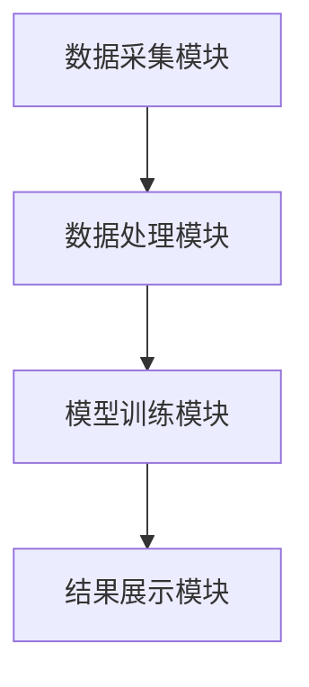
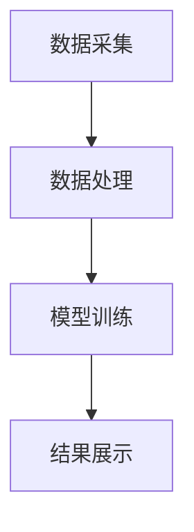

                 


---

# 特价股票筛选中的深度学习模型应用

> 关键词：深度学习，股票筛选，特价股票，神经网络，股票预测，金融数据分析

> 摘要：本文探讨了深度学习在特价股票筛选中的应用，从背景、模型设计到系统实现，详细分析了深度学习技术如何助力金融投资。

---

## 第一部分: 特价股票筛选中的深度学习模型应用概述

### 第1章: 特价股票筛选的背景与深度学习的引入

#### 1.1 特价股票的定义与筛选的重要性
##### 1.1.1 特价股票的定义
特价股票是指在特定时间内价格显著低于市场价的股票，通常具有较高的投资价值。识别这些股票对投资者来说至关重要，因为它可以帮助他们在市场中发现潜在的高回报机会。

##### 1.1.2 特价股票筛选的意义
通过筛选特价股票，投资者可以以较低的价格买入优质股票，从而在市场上涨时获得更高的收益。此外，特价股票通常具有较高的安全边际，降低了投资风险。

##### 1.1.3 特价股票筛选的挑战与难点
筛选特价股票面临诸多挑战，包括数据噪声大、市场波动剧烈以及信息不对称等问题。传统的统计方法在处理这些问题时显得力不从心，而深度学习技术的引入为解决这些问题提供了新的可能性。

#### 1.2 深度学习在金融领域的应用背景
##### 1.2.1 深度学习的基本概念
深度学习是一种人工智能技术，通过多层神经网络来模拟人脑的处理方式，能够自动提取数据中的特征并进行分类或预测。

##### 1.2.2 深度学习在金融领域的应用现状
深度学习已经在金融领域得到了广泛应用，包括股票价格预测、风险评估、欺诈检测等方面。其强大的特征提取能力和非线性建模能力使其在金融数据分析中表现出色。

##### 1.2.3 深度学习在股票筛选中的优势
与传统方法相比，深度学习能够处理高维、非线性的数据，捕捉复杂的市场规律，并且能够自动适应市场变化，提高筛选的准确性和效率。

#### 1.3 本章小结
本章介绍了特价股票的定义、筛选的重要性和挑战，并探讨了深度学习在金融领域的应用背景及其在股票筛选中的优势。

### 第2章: 深度学习模型的核心概念与技术

#### 2.1 深度学习的基本原理
##### 2.1.1 神经网络的基本结构
神经网络由输入层、隐藏层和输出层组成，通过多层结构能够提取数据中的高层次特征。

##### 2.1.2 深度学习的核心算法
常用的深度学习算法包括卷积神经网络（CNN）、循环神经网络（RNN）和Transformer架构。

##### 2.1.3 深度学习与传统机器学习的区别
深度学习能够自动提取特征，而传统机器学习需要手动提取特征。深度学习适用于复杂的数据模式，而传统方法在处理非线性问题时表现较弱。

#### 2.2 深度学习在股票筛选中的应用技术
##### 2.2.1 卷积神经网络（CNN）
CNN适用于处理图像数据，但在股票筛选中可以用于分析K线图等时间序列数据。

##### 2.2.2 循环神经网络（RNN）
RNN适用于处理时间序列数据，能够捕捉股票价格的时序依赖性。

##### 2.2.3 Transformer架构
Transformer基于自注意力机制，能够捕捉股票价格的全局依赖关系，适合处理长序列数据。

#### 2.3 深度学习模型的训练与优化
##### 2.3.1 模型训练的基本流程
包括数据预处理、模型选择、参数调优和模型评估等步骤。

##### 2.3.2 模型优化的策略
包括使用早停法、调整学习率和批量归一化等技术来提高模型的性能。

##### 2.3.3 模型评估与验证
通过交叉验证、混淆矩阵和ROC曲线等方法评估模型的性能。

#### 2.4 本章小结
本章介绍了深度学习的基本原理及其在股票筛选中的应用技术，重点探讨了不同深度学习模型的特点及其适用场景。

### 第3章: 股票数据特征的提取与分析

#### 3.1 股票数据的多维度特征
##### 3.1.1 技术指标特征
包括移动平均线、相对强弱指数（RSI）和MACD等指标，这些指标能够反映股票的市场表现。

##### 3.1.2 市场情绪特征
包括市场波动率、交易量和投资者情绪指数，这些特征能够反映市场的整体情绪。

##### 3.1.3 财务报表特征
包括市盈率、市净率和ROE等财务指标，这些指标能够反映公司的财务状况。

#### 3.2 数据预处理与特征工程
##### 3.2.1 数据清洗与标准化
包括处理缺失值、异常值和数据标准化等步骤，确保数据的质量和一致性。

##### 3.2.2 特征选择与降维
通过主成分分析（PCA）等方法，选择重要的特征并降低数据维度。

##### 3.2.3 时间序列数据的处理
包括滑动窗口技术、时间差分和序列分割等方法，处理时间序列数据的特殊性。

#### 3.3 特价股票特征的识别
##### 3.3.1 特价股票的典型特征
包括低估值、高波动率和市场关注度低等特征，这些特征能够帮助识别潜在的特价股票。

##### 3.3.2 特价股票特征的统计分析
通过统计分析方法，识别特价股票与其他股票在特征上的差异，为模型提供有效的输入。

##### 3.3.3 特价股票特征的可视化
通过可视化工具，如热图和散点图，直观展示特价股票的特征分布，帮助理解数据结构。

#### 3.4 本章小结
本章探讨了股票数据的多维度特征，并介绍了数据预处理和特征工程的方法，重点分析了特价股票的典型特征及其识别方法。

### 第4章: 深度学习模型的设计与实现

#### 4.1 深度学习模型的架构设计
##### 4.1.1 模型输入设计
根据股票数据的特征，设计输入层的结构，包括技术指标、市场情绪和财务报表等多维特征。

##### 4.1.2 模型输出设计
根据筛选目标，设计输出层的结构，包括多分类输出和回归输出等。

##### 4.1.3 模型中间层设计
通过多层隐藏层结构，提取数据中的高层次特征，提升模型的表达能力。

#### 4.2 深度学习模型的训练策略
##### 4.2.1 数据集的划分与交叉验证
将数据集划分为训练集、验证集和测试集，使用交叉验证评估模型的性能。

##### 4.2.2 模型训练的超参数设置
包括学习率、批量大小和训练轮数等超参数的设置，优化模型的训练过程。

##### 4.2.3 模型训练的优化技巧
使用早停法、学习率衰减和模型集成等技术，提高模型的训练效果和泛化能力。

#### 4.3 深度学习模型的评估与调优
##### 4.3.1 模型评估指标
包括准确率、召回率、F1分数和AUC曲线等指标，全面评估模型的性能。

##### 4.3.2 模型调优方法
通过网格搜索和随机搜索等方法，优化模型的超参数，提高模型的性能。

##### 4.3.3 模型的过拟合与欠拟合问题
通过正则化、数据增强和模型简化等方法，解决过拟合和欠拟合问题，提高模型的泛化能力。

#### 4.4 本章小结
本章详细介绍了深度学习模型的架构设计和训练策略，并探讨了模型的评估与调优方法，为后续的系统实现奠定了基础。

### 第5章: 基于深度学习的股票筛选系统架构

#### 5.1 系统功能模块设计
##### 5.1.1 数据采集模块
负责从多种数据源采集股票数据，包括公开市场数据和新闻资讯等。

##### 5.1.2 数据处理模块
对采集的数据进行清洗、特征提取和数据增强，为模型提供高质量的输入。

##### 5.1.3 模型训练模块
负责模型的训练、调优和保存，生成可用于股票筛选的深度学习模型。

##### 5.1.4 结果展示模块
将模型的预测结果进行可视化展示，帮助用户理解和决策。

#### 5.2 系统架构设计
##### 5.2.1 系统整体架构图（Mermaid图）


##### 5.2.2 模块之间的交互流程（Mermaid图）


#### 5.3 系统接口设计
##### 5.3.1 数据接口
定义数据的输入格式和接口协议，确保数据采集和处理的兼容性。

##### 5.3.2 模型接口
定义模型的输入输出接口，确保模型训练和应用的灵活性。

##### 5.3.3 用户接口
设计用户友好的界面，方便用户进行数据查看、模型训练和结果展示。

#### 5.4 本章小结
本章设计了一个基于深度学习的股票筛选系统架构，涵盖了数据采集、处理、模型训练和结果展示等功能模块，并通过Mermaid图展示了系统的整体架构和模块交互流程。

### 第6章: 项目实战——深度学习模型的实现与应用

#### 6.1 项目环境与工具安装
##### 6.1.1 环境配置
安装Python、TensorFlow和Keras等深度学习框架，配置开发环境。

##### 6.1.2 数据集获取
从Yahoo Finance等数据源获取股票数据，清洗并提取特征。

#### 6.2 模型实现与训练
##### 6.2.1 模型定义
使用Keras定义深度学习模型，包括输入层、隐藏层和输出层的结构。

##### 6.2.2 模型训练
编写训练脚本，设置超参数，启动模型训练过程。

##### 6.2.3 模型保存与加载
保存训练好的模型，以便后续使用和部署。

#### 6.3 模型评估与优化
##### 6.3.1 模型评估
使用测试数据评估模型的性能，包括准确率、召回率等指标。

##### 6.3.2 模型优化
通过网格搜索等方法优化模型的超参数，提高模型的性能。

##### 6.3.3 模型部署
将训练好的模型部署到生产环境，提供实时股票筛选服务。

#### 6.4 实战案例分析
##### 6.4.1 数据准备
从Yahoo Finance获取历史股票数据，清洗并提取特征。

##### 6.4.2 模型训练
使用训练数据训练深度学习模型，评估模型的性能。

##### 6.4.3 模型预测与分析
使用测试数据进行预测，分析模型的筛选效果，并与实际市场数据进行对比。

#### 6.5 本章小结
本章通过一个实战项目，详细介绍了深度学习模型的实现过程，包括环境配置、数据处理、模型训练、评估与优化，以及实际案例分析，帮助读者掌握深度学习在股票筛选中的具体应用。

### 第7章: 总结与展望

#### 7.1 本章总结
本文详细探讨了深度学习在特价股票筛选中的应用，从背景、模型设计到系统实现，全面分析了深度学习技术在金融投资中的潜力和优势。

#### 7.2 未来展望
随着深度学习技术的不断发展，未来可以在以下几个方面进行进一步研究：
- 更复杂的模型架构，如多模态模型和自监督学习模型；
- 更高效的数据处理方法，如实时数据流处理和增量学习；
- 更智能的系统架构，如自适应模型和自动化交易系统。

#### 7.3 注意事项
在实际应用中，需要注意模型的泛化能力、数据的实时性和市场的不可预测性，合理控制投资风险。

#### 7.4 拓展阅读
推荐读者进一步阅读以下文献，深入了解深度学习在金融领域的最新研究：
- Goodfellow, I., Bengio, Y., & Courville, A. (2016). Deep Learning.
- Li, Y., & Wang, J. (2020). Stock market prediction using deep learning: A review and future directions.

#### 7.5 本章小结
本文总结了深度学习在特价股票筛选中的应用，并展望了未来的研究方向和注意事项，为读者提供了全面的视角。

---

## 附录: 数据集与代码下载

### 附录A: 数据集获取
可以从以下数据源获取股票数据：
- Yahoo Finance API: [https://developer.yahoo.com/finance/](https://developer.yahoo.com/finance/)
- Alpha Vantage API: [https://www.alphavantage.co/](https://www.alphavantage.co/)

### 附录B: 核心代码实现
以下是深度学习模型的核心代码示例：

```python
import numpy as np
import pandas as pd
from tensorflow.keras.models import Sequential
from tensorflow.keras.layers import Dense, LSTM, Dropout
from sklearn.model_selection import train_test_split
from sklearn.metrics import accuracy_score

# 数据预处理
data = pd.read_csv('stock_data.csv')
X = data.drop('Target', axis=1).values
y = data['Target'].values

X_train, X_test, y_train, y_test = train_test_split(X, y, test_size=0.2, random_state=42)

# 模型定义
model = Sequential()
model.add(LSTM(64, input_shape=(X_train.shape[1], 1), return_sequences=False))
model.add(Dropout(0.2))
model.add(Dense(1, activation='sigmoid'))

model.compile(loss='binary_crossentropy', optimizer='adam', metrics=['accuracy'])

# 模型训练
model.fit(X_train, y_train, epochs=50, batch_size=32, validation_split=0.2)

# 模型评估
y_pred = model.predict(X_test)
print("Accuracy:", accuracy_score(y_test, np.round(y_pred)))
```

### 附录C: 参考文献
- Goodfellow, I., Bengio, Y., & Courville, A. (2016). *Deep Learning*. MIT Press.
- Li, Y., & Wang, J. (2020). Stock market prediction using deep learning: A review and future directions. *arXiv preprint arXiv:2012.06985*.

---

## 作者：AI天才研究院/AI Genius Institute & 禅与计算机程序设计艺术 /Zen And The Art of Computer Programming

---

这篇文章详细介绍了深度学习在特价股票筛选中的应用，从背景、模型设计到系统实现，全面分析了深度学习技术在金融投资中的潜力和优势。通过实际案例分析和代码实现，帮助读者掌握深度学习在股票筛选中的具体应用。

