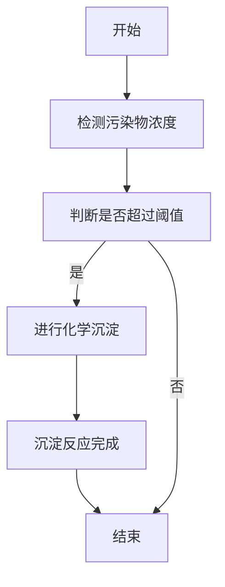
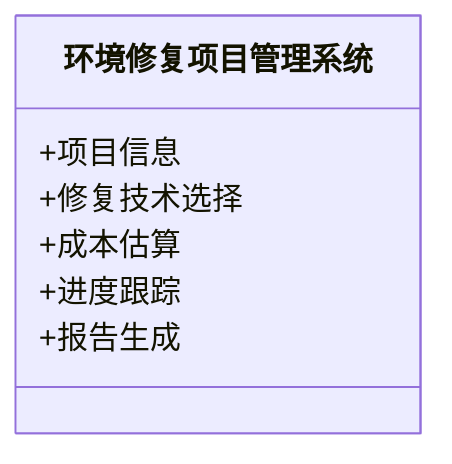
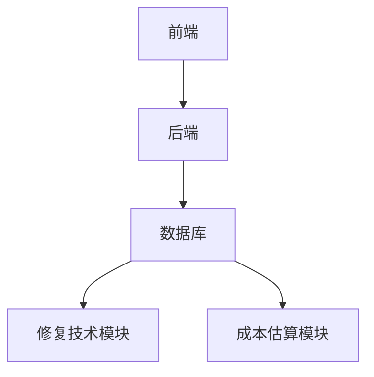
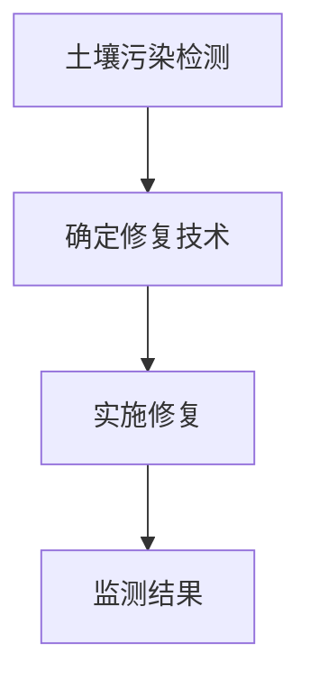
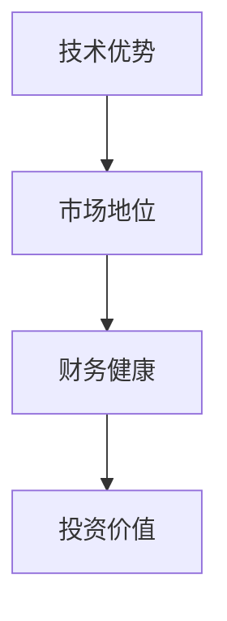

                 


# 环境修复技术公司的市场前景与投资机会

## 关键词：环境修复技术，市场前景，投资机会，技术分析，可持续发展

## 摘要：本文详细分析了环境修复技术公司的市场前景与投资机会，从技术原理、市场现状、投资策略等多个维度进行深入探讨，为读者提供全面的视角和专业的见解。

---

## 第一部分: 环境修复技术公司的市场前景与投资机会概述

### 第1章: 环境修复技术公司的背景介绍

#### 1.1 环境修复技术的定义与分类
##### 1.1.1 环境修复技术的定义
环境修复技术是指通过物理、化学或生物方法，将被污染的环境介质（如土壤、地下水、空气等）修复到可接受水平的技术。这些技术旨在恢复生态系统功能，减少污染物对人类和生物的危害。

##### 1.1.2 环境修复技术的主要分类
环境修复技术可以分为以下几类：
1. **物理修复**：通过物理手段（如 excavation、热处理）去除或分离污染物。
2. **化学修复**：利用化学反应（如沉淀、氧化还原）将污染物转化为无害物质。
3. **生物修复**：利用微生物或其他生物体分解或转化污染物。
4. **工程修复**：通过工程手段（如隔离、屏障）控制污染物的扩散。

##### 1.1.3 环境修复技术的核心要素
环境修复技术的核心要素包括：
- 污染物类型和浓度
- 修复目标
- 技术可行性
- 经济成本

#### 1.2 环境修复技术公司的市场背景
##### 1.2.1 环境修复技术的应用场景
环境修复技术广泛应用于以下场景：
- 工业污染治理
- 石油泄漏处理
- 土壤修复
- 水体修复

##### 1.2.2 环境修复技术的市场现状
全球环境修复市场正在快速增长，主要驱动力包括：
- 环境法规的加强
- 环保意识的提升
- 技术进步带来的效率提升

##### 1.2.3 环境修复技术的未来趋势
未来，环境修复技术将朝着以下方向发展：
- 更加注重可持续性
- 技术的集成化和智能化
- 应用领域的拓展

#### 1.3 环境修复技术与可持续发展的关系
##### 1.3.1 环境修复技术对可持续发展的影响
环境修复技术通过减少污染、恢复生态系统，为可持续发展提供了技术支持。

##### 1.3.2 环境修复技术与绿色经济的结合
绿色经济的发展离不开环境修复技术的支持，后者通过减少资源消耗和污染排放，推动经济的可持续发展。

##### 1.3.3 环境修复技术的社会价值
环境修复技术不仅有助于改善环境质量，还能促进社会经济发展，提高人民生活质量。

### 第2章: 环境修复技术的核心概念与联系

#### 2.1 环境修复技术的核心原理
##### 2.1.1 物理修复原理
物理修复通过机械手段（如挖掘、过滤）去除污染物，适用于污染物浓度较高的场景。

##### 2.1.2 化学修复原理
化学修复利用化学反应将污染物转化为无害物质，适用于重金属污染治理。

##### 2.1.3 生物修复原理
生物修复利用微生物分解污染物，具有成本低、生态友好的优势。

#### 2.2 环境修复技术的属性特征对比
##### 2.2.1 不同修复技术的优缺点对比
| 技术类型 | 优点 | 缺点 |
|----------|------|------|
| 物理修复 | 快速、高效 | 成本高、适用范围有限 |
| 化学修复 | 成本低、效果好 | 可能产生二次污染 |
| 生物修复 | 环保、可持续 | 修复速度慢 |

##### 2.2.2 技术适用性分析
修复技术的选择取决于污染物类型、修复目标和现场条件。例如，重金属污染适合化学修复，而有机污染物适合生物修复。

##### 2.2.3 技术经济性分析
经济性分析需要考虑修复成本、时间以及后续维护费用。通常，物理修复成本较高，但修复速度快；生物修复成本较低，但修复时间较长。

#### 2.3 环境修复技术的ER实体关系图
以下是环境修复技术的ER实体关系图：

```mermaid
erdiagram
actor 投资者 {
  投资者 --> 环境修复公司: 投资
  环境修复公司 --> 修复项目: 实施
  修复项目 --> 技术: 使用
  技术 --> 污染源: 修复
}
```

### 第3章: 环境修复技术的算法原理

#### 3.1 算法原理概述
环境修复技术的算法通常用于污染物的识别和修复方案的设计。以下是化学沉淀法的算法流程：



#### 3.2 化学沉淀法的Python实现
以下是化学沉淀法的Python代码示例：

```python
def chemical_precipitation(pollutant_concentration):
    threshold = 0.5  # 阈值
    if pollutant_concentration > threshold:
        # 进行化学沉淀
        print("开始化学沉淀反应")
        return "化学沉淀完成"
    else:
        print("无需进行化学沉淀")
        return "监测结束"

# 示例调用
pollutant_level = 0.6
result = chemical_precipitation(pollutant_level)
print(result)
```

#### 3.3 数学模型和公式
化学沉淀法的数学模型如下：

$$ C_{\text{after}} = C_{\text{before}} \times e^{-kt} $$

其中：
- \( C_{\text{after}} \) 是反应后的浓度
- \( C_{\text{before}} \) 是反应前的浓度
- \( k \) 是反应速率常数
- \( t \) 是反应时间

---

## 第二部分: 系统分析与架构设计方案

### 第4章: 环境修复技术公司的系统分析与架构设计

#### 4.1 系统功能设计
以下是环境修复项目管理系统的功能模块：



#### 4.2 系统架构设计
以下是环境修复项目管理系统的架构图：



#### 4.3 系统接口设计
以下是系统的主要接口：

```mermaid
sequenceDiagram
参与者 投资者
参与者 系统
投资者 -> 系统: 提交修复需求
系统 -> 投资者: 返回修复方案
投资者 -> 系统: 确认方案
系统 -> 投资者: 开始实施
```

---

## 第三部分: 项目实战与投资策略

### 第5章: 环境修复技术公司的项目实战

#### 5.1 项目环境安装
以下是项目环境的安装步骤：

```bash
pip install numpy
pip install matplotlib
pip install pandas
```

#### 5.2 系统核心实现
以下是化学沉淀法的核心实现代码：

```python
import numpy as np
import matplotlib.pyplot as plt

def chemical_precipitation_model(initial_concentration, time_steps, k):
    concentrations = []
    for t in range(time_steps):
        current_conc = initial_concentration * np.exp(-k * t)
        concentrations.append(current_conc)
    return concentrations

# 示例调用
initial_conc = 1.0
time_steps = 10
k = 0.2
result = chemical_precipitation_model(initial_conc, time_steps, k)
plt.plot(result)
plt.xlabel('时间')
plt.ylabel('浓度')
plt.show()
```

#### 5.3 案例分析与解读
以下是土壤修复项目的案例分析：



### 第6章: 投资策略与案例分析

#### 6.1 投资策略
以下是环境修复技术公司的投资策略：

1. 关注技术创新
2. 选择有市场潜力的区域
3. 分析公司的财务状况
4. 评估管理团队的能力

#### 6.2 案例分析
以下是某环境修复公司的投资分析：



---

## 第四部分: 总结与展望

### 第7章: 总结

#### 7.1 小结
环境修复技术公司在市场前景和投资机会方面具有巨大的潜力，但需要综合考虑技术、经济和社会因素。

#### 7.2 注意事项
投资者应关注技术创新和政策变化，避免盲目投资。

#### 7.3 最佳实践 tips
- 选择有经验的团队
- 注重技术研发
- 关注政策支持

### 第8章: 未来展望

#### 8.1 未来的技术创新
环境修复技术将更加智能化和集成化。

#### 8.2 可持续发展的重要性
可持续发展将是未来环境修复技术发展的核心。

#### 8.3 拓展阅读
建议读者进一步阅读相关学术论文和市场报告。

---

## 作者：AI天才研究院/AI Genius Institute & 禅与计算机程序设计艺术 /Zen And The Art of Computer Programming

