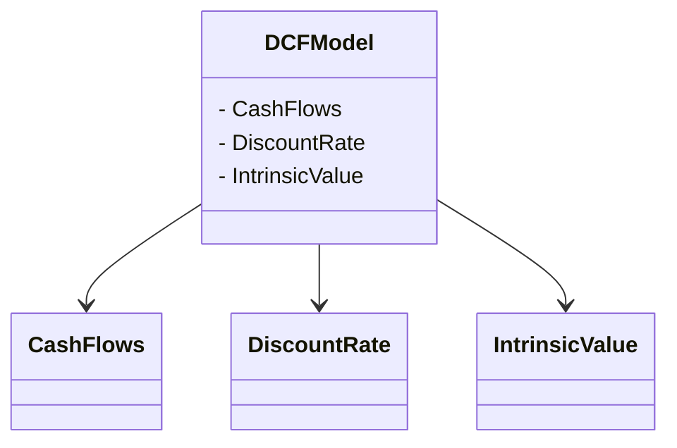
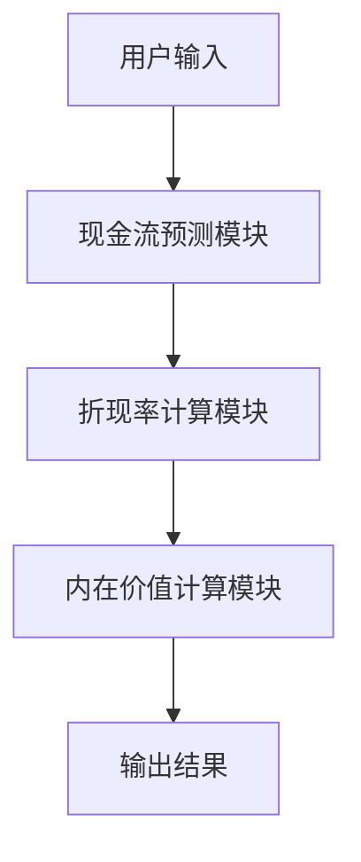

                 


# 现金流折现模型：企业内在价值的科学估算方法

## 关键词：
现金流折现模型, 内在价值, 贴现率, 企业自由现金流, 资本预算, 投资评估

## 摘要：
现金流折现模型（DCF模型）是评估企业内在价值的核心方法，通过将未来现金流折现至当前价值，帮助投资者和企业管理者做出科学的决策。本文系统介绍了DCF模型的原理、计算方法、实际应用以及高级技巧，结合实例分析，帮助读者深入理解其在企业估值中的应用。

---

## 第1章: 现金流折现模型概述

### 1.1 现金流折现模型的定义与背景
现金流折现模型（Discounted Cash Flow Model, DCF模型）是一种用于估算企业内在价值的财务模型。它通过将企业未来现金流折现至当前价值，计算出企业的合理估值，为投资决策提供科学依据。

#### 1.1.1 现金流折现模型的定义
现金流折现模型基于以下假设：企业的价值来源于其未来现金流的现值。通过预测企业未来现金流并选择适当的折现率，计算出这些现金流的现值之和，即为企业的内在价值。

#### 1.1.2 模型的起源与发展
现金流折现模型的起源可以追溯到19世纪的金融学理论，经过多次改进和应用，现已成为现代企业估值的核心方法之一。DCF模型广泛应用于资本市场、并购评估、资本预算等领域。

#### 1.1.3 模型在企业估值中的作用
DCF模型能够帮助企业准确评估其内在价值，避免市场波动对企业估值的影响。它不仅适用于上市公司，也适用于私营企业，是企业融资、并购和投资决策的重要工具。

### 1.2 DCF模型的核心概念
DCF模型的核心在于现金流的预测和折现率的确定。

#### 1.2.1 现金流的定义与分类
现金流分为企业自由现金流（FCFF）和股权自由现金流（FCFE）两类。FCFF适用于整体估值，FCFE适用于股权估值。现金流的预测需要考虑企业的历史表现、市场环境和未来增长潜力。

#### 1.2.2 折现率的定义与作用
折现率是将未来现金流折现为现值的利率，反映了资金的时间价值和风险溢价。折现率的确定需要考虑无风险利率、市场风险溢价和企业特定风险。

#### 1.2.3 内在价值的计算逻辑
内在价值是未来现金流的现值之和。DCF模型通过计算内在价值，评估企业股票的合理价格区间，帮助投资者判断是否低估或高估。

---

## 第2章: 现金流折现模型的核心原理

### 2.1 DCF模型的数学基础
DCF模型基于现值原理，通过公式计算未来现金流的现值。

#### 2.1.1 现金流的现值计算公式
$$ PV = \frac{CF}{(1 + r)^t} $$
其中，CF为未来现金流，r为折现率，t为时间。

#### 2.1.2 永续年金的现值公式
$$ PV = \frac{CF}{r} $$
适用于永续增长的现金流。

### 2.2 DCF模型的假设条件
DCF模型的准确性依赖于以下假设：
1. 现金流可以合理预测。
2. 折现率保持稳定。
3. 企业能够持续经营。

### 2.3 DCF模型的步骤
1. 预测未来现金流。
2. 确定折现率。
3. 计算未来现金流的现值。
4. 求和得到内在价值。

---

## 第3章: 企业自由现金流的评估

### 3.1 企业自由现金流的定义
企业自由现金流（FCFF）是企业扣除所有支出后的剩余现金流，用于再投资和偿还债务。

#### 3.1.1 FCFF的计算公式
$$ FCFF = EBIT(1 - t) + Depreciation - Capital Expenditure $$
其中，EBIT为息税前利润，t为税率，Depreciation为折旧，Capital Expenditure为资本支出。

### 3.2 现金流的预测方法
1. **历史数据分析法**：基于历史数据预测未来现金流。
2. **市场增长率预测法**：结合市场增长率预测现金流。
3. **竞争地位分析法**：评估企业在行业中的地位对现金流的影响。

---

## 第4章: 贴现率的确定与计算

### 4.1 贴现率的定义与影响因素
贴现率反映了资金的时间价值和风险溢价，由无风险利率、市场风险溢价和企业特定风险调整组成。

#### 4.1.1 资本资产定价模型（CAPM）
$$ r = r_f + \beta (r_m - r_f) $$
其中，\( r_f \) 为无风险利率，\( \beta \) 为贝塔系数，\( r_m \) 为市场预期收益率。

### 4.2 贴现率的计算方法
1. **无风险利率**：通常选取国债收益率作为无风险利率。
2. **市场风险溢价**：根据市场情况确定风险溢价。
3. **企业特定风险调整**：考虑企业自身的信用风险。

---

## 第5章: 现金流折现模型的高级应用

### 5.1 杠杆调整现金流模型
杠杆调整现金流模型（LBO模型）用于评估杠杆收购的企业价值。

#### 5.1.1 杠杆调整现金流的定义
$$ LFCFF = FCFF + Interest(1 - t) $$
其中，Interest为利息支出，t为税率。

### 5.2 退出假设与终值计算
终值是未来现金流的现值之和，计算公式为：
$$ TV = \frac{FCFF_{n+1}}{r - g} $$
其中，\( g \) 为永续增长率。

---

## 第6章: 现金流折现模型的系统分析与架构

### 6.1 系统功能设计
DCF模型的系统功能包括现金流预测、折现率计算和内在价值评估。

#### 6.1.1 领域模型


### 6.2 系统架构设计


### 6.3 系统接口设计
1. 用户输入：现金流预测参数。
2. 系统输出：内在价值和投资建议。

---

## 第7章: 项目实战

### 7.1 环境安装
安装Python和相关库（Pandas、NumPy、Matplotlib）。

### 7.2 核心实现代码
```python
def discounted_cash_flow(cash_flows, discount_rate):
    return sum(cf / (1 + discount_rate) ** t for t, cf in enumerate(cash_flows))
```

### 7.3 实际案例分析
以某公司为例，预测未来现金流并计算内在价值，与市场价格对比，判断是否低估。

---

## 第8章: 总结与展望

### 8.1 总结
现金流折现模型是科学的企业估值方法，广泛应用于投资决策和企业价值评估。

### 8.2 展望
未来，随着人工智能和大数据技术的发展，DCF模型将更加精准和高效。

---

## 作者：AI天才研究院/AI Genius Institute & 禅与计算机程序设计艺术 /Zen And The Art of Computer Programming

---

这篇文章系统地介绍了现金流折现模型的原理、应用和实现，结合实例分析，帮助读者全面掌握DCF模型的核心内容和实际应用技巧。

