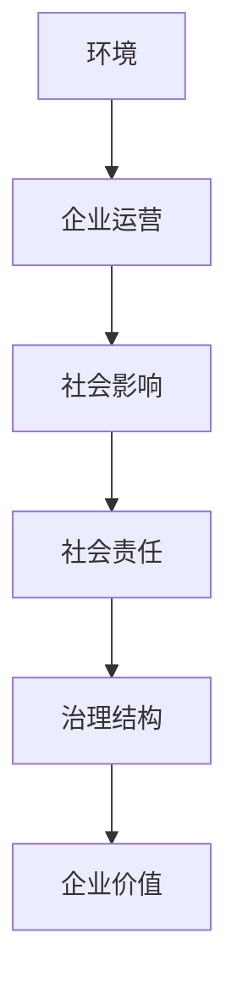

                 


# 珍妮·沙德洛的ESG价值投资：将可持续发展纳入考量

> 关键词：ESG投资，可持续发展，价值投资，环境因素，社会责任，公司治理

> 摘要：  
本文探讨了ESG（环境、社会和治理）价值投资的核心理念，分析了如何将可持续发展因素纳入投资决策。通过详细阐述ESG的定义、评价体系、投资策略以及实际案例，本文为投资者提供了基于ESG框架的深度分析和实践指南，强调了在追求财务回报的同时实现社会价值的重要性。

---

## 目录大纲

1. **ESG价值投资的背景与基础**
   - 1.1 ESG的定义与内涵
     - 环境（Environmental）的核心要素
     - 社会责任（Social）的关键维度
     - 公司治理（Governance）的核心要素
   - 1.2 ESG投资的兴起与发展
     - ESG投资的历史演变
     - 当前全球ESG投资趋势
     - ESG与可持续发展的内在联系
   - 1.3 ESG投资的核心价值
     - ESG对企业的长期价值影响
     - ESG投资的潜在收益与风险
     - ESG的双重效益：社会与经济价值

2. **ESG核心概念的原理与联系**
   - 2.1 ESG核心概念的原理
     - 环境因素的经济学分析
     - 社会责任的伦理学视角
     - 公司治理的组织行为学分析
   - 2.2 ESG核心概念
     - 环境、社会、治理三者的相互关系
     - ESG与企业价值的内在联系
     - ESG评分体系的构建逻辑
   - 2.3 ESG核心概念的特征对比
     - 表格：环境、社会、治理三者的属性与特征对比
     - 图表：Mermaid图展示环境、社会、治理三者的相互作用关系

3. **ESG投资的核心算法与模型**
   - 3.1 ESG评分方法与模型
     - ESG评分的标准化流程
     - 常见ESG评分体系对比
     - ESG评分的权重分配与计算公式
   - 3.2 ESG投资策略的算法实现
     - 用Mermaid图展示ESG投资策略的算法流程
     - 用Python代码实现一个简单的ESG评分模型
     - 用Latex公式详细解释ESG评分的数学模型

4. **ESG投资的系统分析与架构设计**
   - 4.1 系统分析
     - 问题场景介绍：如何构建一个ESG评估系统
     - 项目介绍：ESG评估系统的功能目标
     - 系统功能设计：领域模型Mermaid类图
   - 4.2 系统架构设计
     - 用Mermaid图展示ESG评估系统的架构图
     - 系统接口设计：数据输入、处理、输出接口
     - 系统交互设计：用Mermaid序列图展示用户与系统的交互流程

5. **ESG投资的实际案例分析与实战**
   - 5.1 实际案例分析
     - 某行业典型企业的ESG表现分析
     - ESG评分对企业投资价值的影响
     - 投资决策中的ESG因素考量
   - 5.2 项目实战
     - 环境安装：如何搭建一个简单的ESG评估系统
     - 核心代码实现：用Python代码实现ESG评分模块
     - 代码应用解读与分析：如何将代码应用于实际投资决策
     - 项目小结：ESG评估系统的核心功能与实际应用价值

6. **ESG投资的最佳实践与未来展望**
   - 6.1 最佳实践
     - ESG投资中的关键注意事项
     - 实际操作中的常见问题与解决方案
     - 提高ESG投资效果的小技巧
   - 6.2 未来展望
     - ESG投资的未来发展趋势
     - 技术进步对ESG投资的影响
     - 可能的挑战与应对策略
   - 6.3 总结与建议
     - 本文的核心观点回顾
     - 对投资者的建议
     - 对未来研究的展望

---

### 图表与代码示例

#### Mermaid图：环境、社会、治理三者的相互作用关系



#### Python代码实现简单的ESG评分模型

```python
def calculate_esg_score(environment_score, social_score, governance_score):
    # 简单的加权平均模型
    weight_env = 0.4
    weight_social = 0.3
    weight_governance = 0.3
    total_score = (environment_score * weight_env) + (social_score * weight_social) + (governance_score * weight_governance)
    return total_score

# 示例数据
env_score = 80
social_score = 75
governance_score = 85

esg_total = calculate_esg_score(env_score, social_score, governance_score)
print(f"ESG总评分为: {esg_total}")
```

#### Latex公式：ESG评分的数学模型

$$
\text{ESG总评分} = w_e \times E + w_s \times S + w_g \times G
$$

其中，\( w_e \)、\( w_s \)、\( w_g \) 分别为环境、社会、治理三个维度的权重，\( E \)、\( S \)、\( G \) 分别为各维度的评分。

---

### 作者信息

作者：AI天才研究院/AI Genius Institute & 禅与计算机程序设计艺术 /Zen And The Art of Computer Programming

---

通过以上大纲，本文将系统地介绍ESG价值投资的核心理念、方法和实践，帮助投资者更好地理解和应用ESG投资策略，实现可持续的财务与社会价值。

