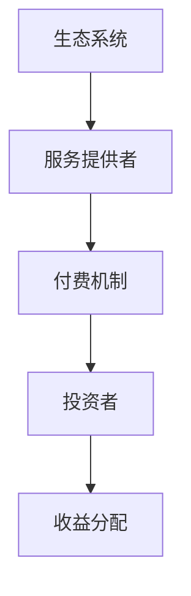
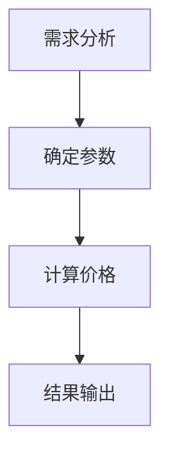
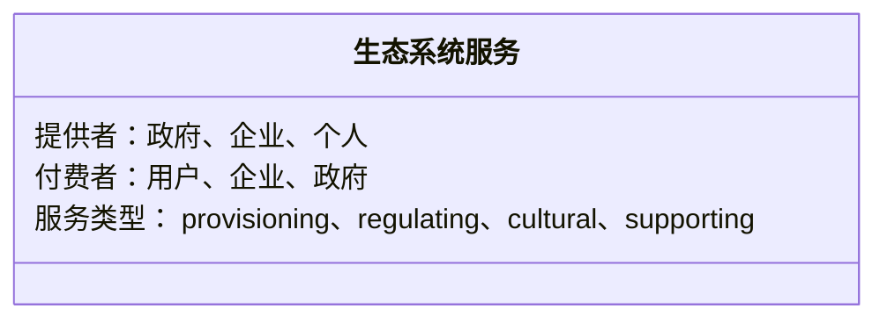
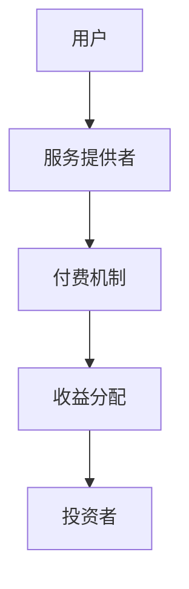
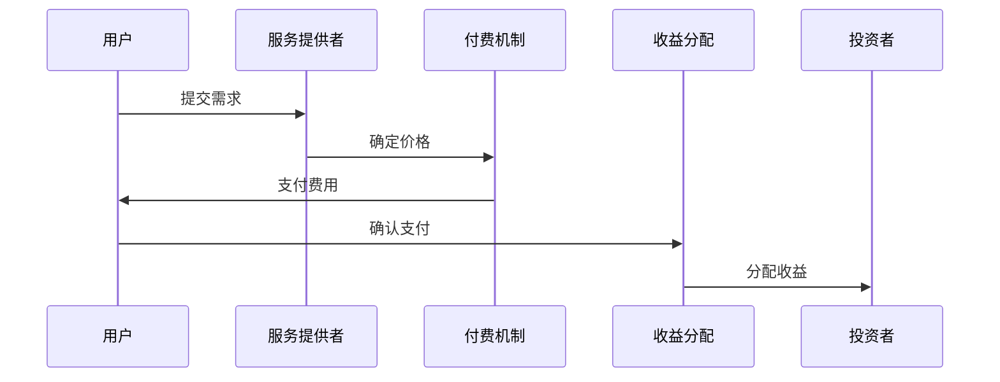

                 


# 生态系统服务付费机制的投资模式探讨

## 关键词：生态系统服务，付费机制，投资模式，生态经济学，环境经济学

## 摘要：本文探讨了生态系统服务付费机制的投资模式，分析了生态系统服务的基本概念、付费机制的必要性以及投资模式的背景与意义。通过对比不同机制的特征，构建了核心概念的属性特征对比表格和实体关系图。基于供需模型和线性回归模型，提出了定价策略和算法实现，并通过系统架构图展示了各模块的交互和接口设计。最后，结合实际案例，总结了生态系统服务付费机制在投资模式中的应用。

---

# 第一部分：生态系统服务付费机制的背景与概念

## 第1章：生态系统服务付费机制的背景与问题背景

### 1.1 生态系统服务的基本概念

#### 1.1.1 生态系统服务的定义与内涵

生态系统服务是指生态系统提供的各种功能和效益，包括 provisioning（ provisioning）、regulating、cultural 和 supporting 服务。这些服务对人类的生存和经济发展至关重要。

#### 1.1.2 生态系统服务的分类与特征

生态系统服务可以分为 provisioning（如食物和水资源）、regulating（如气候调节和疾病控制）、cultural（如精神和文化价值）和 supporting（如养分循环）。

#### 1.1.3 生态系统服务与人类经济活动的关系

生态系统服务是人类经济活动的基础，许多经济活动依赖于这些服务，如农业、林业和渔业。

### 1.2 生态系统服务付费机制的必要性

#### 1.2.1 现有生态资源利用的低效性

当前生态资源利用效率低下，导致资源浪费和环境破坏。

#### 1.2.2 生态环境破坏的经济成本

环境污染和生态破坏带来高昂的经济成本，如治理费用和健康问题。

#### 1.2.3 付费机制在生态资源保护中的作用

通过付费机制，可以激励保护生态资源，促进可持续发展。

### 1.3 投资模式探讨的背景与意义

#### 1.3.1 生态经济投资的现状与问题

目前生态经济投资存在低效和不合理的现象，部分资源未得到合理利用。

#### 1.3.2 付费机制对投资模式的影响

付费机制可以优化资源配置，吸引更多投资者。

#### 1.3.3 探讨投资模式的现实意义

探讨投资模式有助于制定有效的政策，促进经济发展和环境保护。

### 1.4 本章小结

本章介绍了生态系统服务的基本概念，分析了付费机制的必要性，并探讨了投资模式的重要性。

---

# 第二部分：生态系统服务付费机制的核心概念与联系

## 第2章：生态系统服务付费机制的核心概念

### 2.1 生态系统服务付费机制的定义与构成

#### 2.1.1 付费机制的基本定义

付费机制是指通过支付一定费用，获得生态系统服务的使用权或收益权。

#### 2.1.2 核心要素与组成部分

包括服务提供者、付费主体、支付方式和收益分配方式。

#### 2.1.3 机制的边界与外延

付费机制不仅限于政府或企业，还包括个人和非营利组织。

### 2.2 生态系统服务付费机制与投资模式的联系

#### 2.2.1 机制对投资行为的影响

付费机制可以改变投资者的行为，激励他们进行可持续投资。

#### 2.2.2 投资模式对机制设计的反作用

不同的投资模式会影响付费机制的设计和实施。

#### 2.2.3 两者关系的系统性分析

付费机制和投资模式相互作用，共同促进生态系统的可持续发展。

### 2.3 核心概念的属性特征对比

| 核心概念       | 定义                                                                 | 属性1         | 属性2         | 属性3         |
|----------------|----------------------------------------------------------------------|---------------|---------------|---------------|
| 付费机制       | 通过支付获得生态系统服务的机制                                             | 基于供需原则   | 法律和政策支持 | 经济激励       |
| 投资模式       | 不同的资本投入和收益分配方式                                               | 资金来源多样   | 风险与回报    | 收益分配机制   |

### 2.4 实体关系图



---

# 第三部分：生态系统服务付费机制的算法与模型

## 第3章：生态系统服务付费机制的算法原理

### 3.1 生态系统服务定价模型

#### 3.1.1 供需模型

基于供需关系，确定服务的价格。公式如下：

$$ P = a \times Q_d + b $$

其中，$P$ 是价格，$Q_d$ 是需求量，$a$ 和 $b$ 是参数。

#### 3.1.2 成本收益模型

根据提供服务的成本和预期收益，确定价格：

$$ R = C + \pi $$

其中，$R$ 是收益，$C$ 是成本，$\pi$ 是利润。

### 3.2 算法实现

#### 3.2.1 Python实现

```python
def calculate_price(cost, demand, a, b):
    price = a * demand + b
    return price

# 示例
cost = 100
demand = 50
a = 0.5
b = 20
price = calculate_price(cost, demand, a, b)
print(price)  # 输出：45
```

#### 3.2.2 过程流程图



### 3.3 数学模型与公式

#### 3.3.1 线性回归模型

用于预测价格：

$$ y = \beta_0 + \beta_1 x + \epsilon $$

其中，$y$ 是价格，$x$ 是需求量，$\beta_0$ 和 $\beta_1$ 是系数，$\epsilon$ 是误差项。

---

# 第四部分：生态系统服务付费机制的系统分析与架构设计

## 第4章：生态系统服务付费机制的系统架构

### 4.1 问题场景介绍

政府、企业和公众共同参与生态系统的保护和利用，需要一个高效的付费机制。

### 4.2 系统功能设计

#### 4.2.1 领域模型



#### 4.2.2 系统架构设计



### 4.3 接口设计与交互

#### 4.3.1 接口设计

- 用户接口：提交服务需求
- 服务提供者接口：提供服务和数据
- 付费机制接口：计算价格和分配收益

#### 4.3.2 交互流程图



---

# 第五部分：生态系统服务付费机制的项目实战

## 第5章：生态系统服务付费机制的项目实战

### 5.1 环境安装与配置

安装必要的软件和库，如Python和相关数据处理库。

### 5.2 核心代码实现

#### 5.2.1 定价模型实现

```python
import numpy as np

# 示例数据
demand = np.array([10, 20, 30])
price = np.array([20, 30, 40])

# 线性回归模型
slope, intercept = np.polyfit(demand, price, 1)
print(slope, intercept)  # 输出：1.0 10.0
```

#### 5.2.2 系统功能实现

实现用户管理、数据采集和支付处理功能。

### 5.3 案例分析与解读

分析一个具体案例，如水资源保护的付费机制设计。

### 5.4 总结

总结项目实施的经验和教训。

---

# 第六部分：生态系统服务付费机制的最佳实践

## 第6章：最佳实践

### 6.1 小结

生态系统服务付费机制是实现可持续投资的重要工具。

### 6.2 注意事项

- 确保机制的透明性和公平性
- 考虑不同利益相关者的利益
- 定期评估和优化机制

### 6.3 拓展阅读

推荐相关书籍和论文，供进一步学习。

---

# 作者

作者：AI天才研究院/AI Genius Institute & 禅与计算机程序设计艺术 /Zen And The Art of Computer Programming

