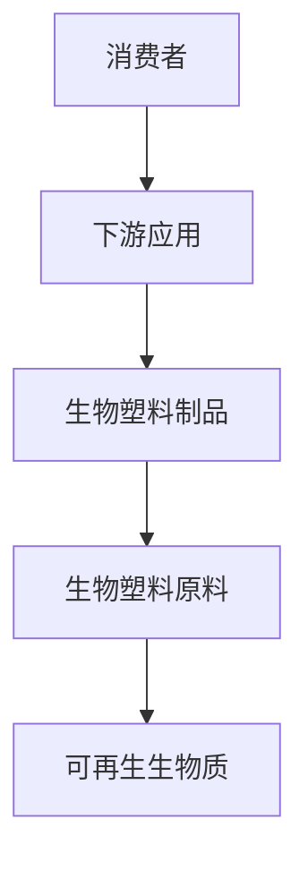
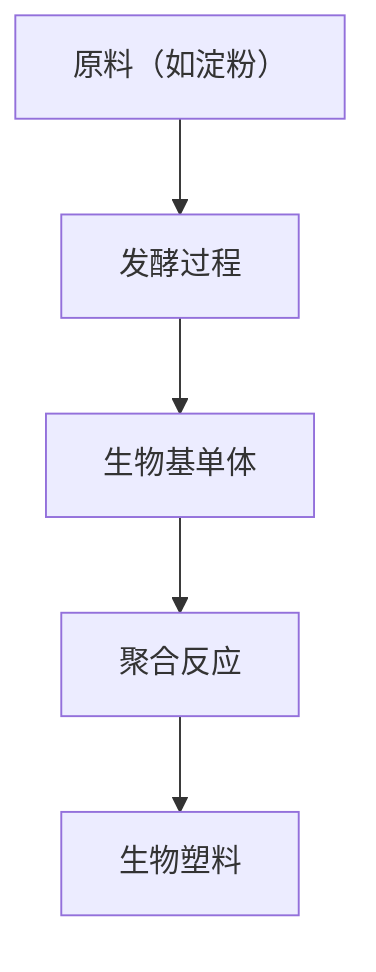
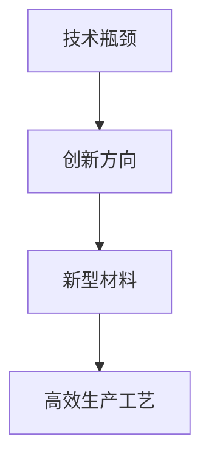
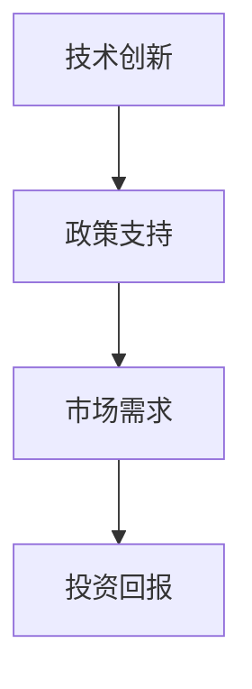

                 


# 生物塑料产业的发展前景与投资策略

## 关键词：
生物塑料，环保材料，投资策略，产业前景，可持续发展

## 摘要：
生物塑料作为一种环保替代材料，正在逐步改变传统塑料产业的格局。本文从生物塑料的定义、分类、技术发展、市场现状、投资机会与风险等方面展开分析，探讨其在环保和经济双重驱动下的发展前景，为投资者提供科学的决策参考。

---

## 第一部分：生物塑料产业的发展背景与核心概念

### 第1章：生物塑料的定义与分类

#### 1.1 生物塑料的定义与分类

生物塑料是指以可再生生物质资源（如植物、微生物等）为原料，通过生物、化学或物理方法制造的塑料材料。与传统石油基塑料不同，生物塑料具有可降解、低碳排放、可持续等优势。

##### 表1-1：生物塑料与传统塑料的对比

| 属性           | 生物塑料                   | 传统塑料                 |
|----------------|---------------------------|--------------------------|
| 原料来源       | 可再生生物质（如淀粉、纤维素） | 石油、天然气等非可再生资源 |
| 生产过程       | 环保、低能耗                | 高能耗、高污染            |
| 应用领域       | 包装、农业、汽车、电子等    | 日常用品、工业制品等      |
| 环境影响       | 可降解、低污染              | 不可降解、污染环境          |

#### 1.2 生物塑料的分类

生物塑料可以根据原料来源、生产过程和应用领域进行分类：

##### 表1-2：生物塑料的分类

| 分类维度       | 类型                       |
|----------------|----------------------------|
| 原料来源       | 植物基塑料、微生物基塑料    |
| 生产过程       | 生物法、化学法、物理法      |
| 应用领域       | 可降解塑料、生物基塑料     |

---

### 第2章：生物塑料产业的背景与现状

#### 2.1 全球塑料污染问题

全球每年产生约3亿吨塑料垃圾，其中大部分最终流入海洋或成为环境污染源。传统塑料的不可降解性和高碳排放问题使其成为环境治理的重点对象。

##### 图2-1：全球塑料产量与生物塑料市场占比预测（2020-2030）


#### 2.2 生物塑料产业的发展历程

生物塑料技术起源于20世纪70年代的石油危机，但大规模商业化始于21世纪初。近年来，随着环保政策的加强和消费者环保意识的提升，生物塑料市场呈现快速增长。

##### 表2-1：全球生物塑料市场容量预测（2020-2030）

| 年份   | 市场容量（亿美元） | 增长率（%） |
|--------|--------------------|-------------|
| 2020   | 120                | 8.5         |
| 2025   | 200                | 10          |
| 2030   | 300                | 12          |

#### 2.3 产业链结构分析

##### 图2-2：生物塑料产业链结构图



---

### 第3章：生物塑料的核心技术与挑战

#### 3.1 主要制备技术

##### 图3-1：生物塑料制备技术流程图



##### 表3-1：主要制备技术对比

| 技术类型       | 优点                     | 缺点                     |
|----------------|--------------------------|--------------------------|
| 微生物发酵     | 成本低、效率高             | 对技术要求较高           |
| 酶催化合成     | 环保、精准                | 酶稳定性不足              |
| 化学合成法      | 工艺成熟                  | 成本较高、能耗较大        |

#### 3.2 生物塑料的性能特点

##### 表3-2：生物塑料性能特点

| 性能指标       | 生物塑料                   | 传统塑料                 |
|----------------|---------------------------|--------------------------|
| 可降解性       | 可生物降解                 | 不可降解                 |
| 热稳定性       | 较低                      | 较高                     |
| 成本            | 较高                      | 较低                     |

#### 3.3 技术瓶颈与未来发展方向

##### 图3-2：生物塑料技术发展趋势图



---

## 第二部分：生物塑料产业的投资策略与市场分析

### 第4章：生物塑料市场的现状与趋势

#### 4.1 全球生物塑料市场分析

##### 表4-1：主要国家生物塑料市场占比

| 国家   | 市场占比（%） | 增长率（%） |
|--------|--------------|-------------|
| 美国   | 30           | 10          |
| 欧盟   | 25           | 12          |
| 中国   | 20           | 15          |
| 日本   | 15           | 8           |

##### 图4-1：中国生物塑料市场增长曲线图

```mermaid
lineChart
    "2020": 50
    "2025": 70
    "2030": 90
```

#### 4.2 中国生物塑料市场分析

中国是全球最大的塑料生产国，也是生物塑料增长最快的市场之一。政策支持（如“双碳”目标）和环保需求推动了国内生物塑料产业的快速发展。

##### 表4-2：中国生物塑料主要应用领域

| 应用领域       | 市场规模（亿元） | 增长率（%） |
|----------------|-----------------|-------------|
| 包装材料       | 30              | 18          |
| 塑料制品       | 25              | 15          |
| 汽车零部件     | 15              | 10          |

---

### 第5章：生物塑料产业的投资机会与风险

#### 5.1 投资机会分析

##### 表5-1：投资机会与潜在回报

| 投资领域       | 潜在回报（%） | 投资周期（年） |
|----------------|---------------|----------------|
| 原材料供应     | 15-20         | 5              |
| 制造环节       | 20-25         | 5              |
| 应用与回收     | 18-22         | 3-5            |

##### 图5-1：生物塑料投资回报率预测图

```mermaid
lineChart
    "原材料供应": 15
    "制造环节": 20
    "应用与回收": 18
```

#### 5.2 投资风险评估

##### 表5-2：主要投资风险因素

| 风险类型       | 影响程度（%） | 应对策略           |
|----------------|---------------|--------------------|
| 技术风险       | 30            | 加强技术研发投入   |
| 市场风险       | 25            | 提升市场拓展能力   |
| 政策风险       | 20            | 关注政策变化       |
| 成本风险       | 25            | 优化生产流程       |

---

### 第6章：制定投资策略与成功关键因素

#### 6.1 投资策略

##### 表6-1：投资策略建议

| 投资方向       | 策略建议                       |
|----------------|-------------------------------|
| 上游原材料     | 与农业企业合作，确保原料供应   |
| 中游制造环节   | 投资先进生产设备，提升生产效率   |
| 下游应用市场   | 扩大市场推广，推动消费升级       |

#### 6.2 成功关键因素

##### 图6-1：成功关键因素分析图



---

## 第7章：未来展望与可持续发展

生物塑料产业的未来发展将更加注重技术创新和可持续发展。随着技术的进步和环保政策的完善，生物塑料有望成为替代传统塑料的核心材料。投资生物塑料产业不仅是环保的需要，更是经济发展的新机遇。

---

## 总结

生物塑料产业正处于快速发展阶段，市场潜力巨大。投资者需要结合技术、市场和政策三方面因素，制定科学的投资策略，抓住产业发展机遇。同时，要关注技术创新和成本控制，确保投资的可持续性。

---

## 作者

作者：AI天才研究院/AI Genius Institute & 禅与计算机程序设计艺术 /Zen And The Art of Computer Programming

