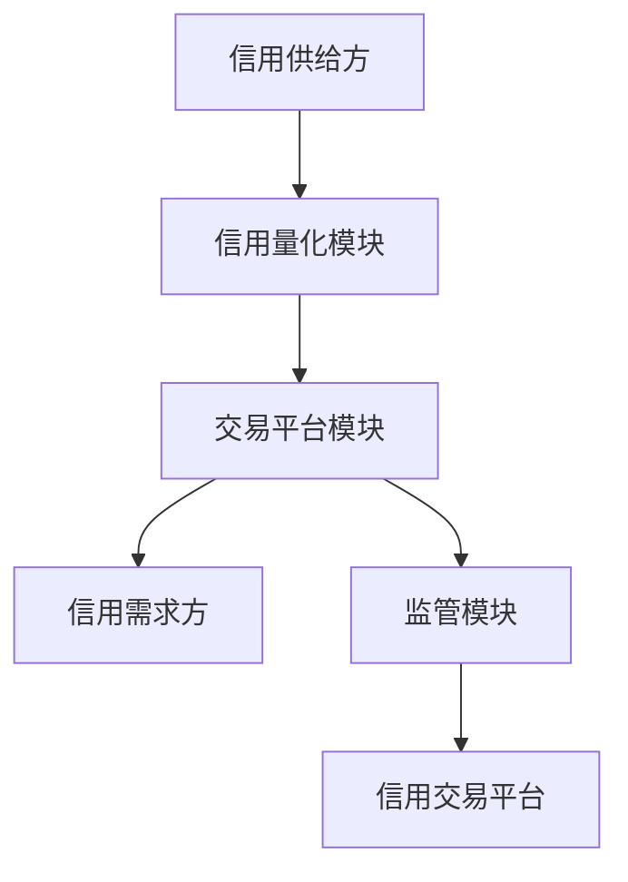

                 


# 生物多样性信用交易机制的可行性研究

## 关键词：生物多样性、信用交易、环境经济学、可持续发展、生态补偿

## 摘要：  
生物多样性是地球生态系统的重要组成部分，其价值不仅体现在生态功能上，还具有重要的经济和社会价值。然而，由于传统环境保护机制的局限性，生物多样性的保护与利用之间的矛盾日益突出。本文通过分析生物多样性信用交易机制的核心概念、国内外研究现状、技术可行性以及实际应用场景，探讨该机制在生物多样性保护中的潜力与挑战。本文旨在为政策制定者、企业和社会提供理论依据和实践指导，以促进生物多样性保护与经济发展的协调发展。

---

## 第一部分: 生物多样性信用交易机制的背景与概念

---

## 第1章: 引言

### 1.1 生物多样性信用交易机制的背景
#### 1.1.1 生物多样性的概念与重要性
生物多样性是指在一定区域内，生物物种的丰富程度、遗传多样性和生态系统多样性的总和。它不仅维持了生态系统的稳定，还为人类提供了食物、药物、工业原料等多种资源。生物多样性是地球生命支持系统的基础，其价值无法用金钱衡量。

#### 1.1.2 现有环境保护机制的局限性
传统的环境保护机制，如罚款、行政处罚等，往往缺乏激励性，难以调动各方主体的积极性。此外，现有机制更多关注于末端治理，而非源头保护和可持续利用。

#### 1.1.3 生物多样性信用交易机制的提出背景
随着全球范围内生物多样性丧失的加剧，探索新型的保护机制成为当务之急。生物多样性信用交易机制通过将生物多样性转化为可量化的“信用”，为保护和利用生物多样性提供了市场化的解决方案。

---

### 1.2 研究意义与目标
#### 1.2.1 生物多样性保护的经济价值
生物多样性的间接价值（如生态功能）和直接价值（如旅游收入）均具有重要的经济意义。通过信用交易机制，可以将这些价值量化为经济收益，从而为保护工作提供资金支持。

#### 1.2.2 建立信用交易机制的必要性
信用交易机制能够通过市场激励，引导企业和社会资本参与生物多样性保护，弥补政府财政投入的不足。

#### 1.2.3 本研究的目标与范围
本研究旨在探讨生物多样性信用交易机制的可行性，包括机制设计、技术实现和实际应用等方面。研究范围涵盖理论分析、技术验证和案例研究。

---

### 1.3 研究方法与框架
#### 1.3.1 研究方法概述
本研究采用文献分析、理论建模和案例研究相结合的方法，从法律、经济和技术三个维度对机制的可行性进行评估。

#### 1.3.2 研究框架与逻辑流程
1. 理论基础：分析生物多样性的定义、价值和保护需求。  
2. 核心概念：构建生物多样性信用交易机制的理论框架。  
3. 可行性分析：从法律、经济和技术角度评估机制的可行性。  
4. 实际应用：通过案例分析验证机制的有效性。  

---

## 第2章: 生物多样性信用交易机制的核心概念

### 2.1 生物多样性信用交易机制的基本原理
#### 2.1.1 信用交易机制的定义
生物多样性信用交易机制是一种通过市场化的手段，将生物多样性的保护和利用转化为可交易的信用，从而实现生态保护与经济发展的双赢机制。

#### 2.1.2 生物多样性信用的内涵与外延
- **内涵**：生物多样性信用是指在特定区域内，通过保护和恢复生态系统所获得的生物多样性增量，可转化为可用于交易的“信用”。  
- **外延**：信用的范围包括物种保护、生态修复、可持续利用等多个方面。  

#### 2.1.3 机制的核心要素与属性
- 核心要素：信用的生成、量化、交易和监管。  
- 属性：可量化性、可交易性、可持续性、激励性。  

---

### 2.2 生物多样性信用交易机制的框架设计
#### 2.2.1 机制的基本架构
1. **信用生成**：通过保护和恢复生态系统，产生生物多样性信用。  
2. **信用量化**：基于科学方法，对信用的价值进行量化。  
3. **信用交易**：通过市场平台，买卖双方进行信用交易。  
4. **信用监管**：政府或第三方机构对信用的生成和交易进行监管，确保机制的公平性和有效性。  

#### 2.2.2 关键参与方的角色与职责
- **信用供给方**：包括政府、企业和个人，通过保护和恢复生态系统提供信用。  
- **信用需求方**：包括企业、政府和社会组织，通过购买信用支持生态保护。  
- **交易平台**：提供信用交易的平台，确保交易的透明性和公正性。  
- **监管机构**：负责信用的生成、交易和监管，确保机制的合规性。  

#### 2.2.3 信用额度的计算与分配
信用额度的计算基于生态系统的恢复成本、保护效果和市场供需关系。分配原则包括公平性、效率性和可持续性。

---

### 2.3 核心概念对比分析
#### 2.3.1 生物多样性信用与其他环境信用机制的对比
| 对比维度 | 生物多样性信用 | 碳信用 | 水权信用 |
|----------|----------------|--------|----------|
| 核心目标 | 保护生物多样性 | 减少碳排放 | 节约用水 |
| 主体 | 政府、企业、个人 | 企业 | 企业、个人 |
| 计量方式 | 物种数量、生态功能 | CO2排放量 | 用水量 |

#### 2.3.2 实体关系图（ER图）设计
```mermaid
erd
actor 信用供给方，参与者 信用需求方，系统 信用交易平台，监管机构
关系：信用供给方 -> 信用交易平台：提交信用；信用需求方 -> 信用交易平台：购买信用；监管机构 -> 信用交易平台：监管交易。
```

---

## 第3章: 国内外研究现状与发展趋势

### 3.1 国内外研究现状
#### 3.1.1 国内研究进展
国内学者主要从法律、经济和生态学角度研究生物多样性保护机制，但缺乏系统化的信用交易机制设计。

#### 3.1.2 国际经验与借鉴
国际上，碳信用交易机制较为成熟，可为生物多样性信用交易提供参考。

#### 3.1.3 学术界的主要争议
学术界对信用交易机制的公平性、可操作性和监管问题存在争议。

---

### 3.2 发展现状与挑战
#### 3.2.1 当前生物多样性保护的主要模式
- **政府主导模式**：以行政手段为主，缺乏市场激励。  
- **市场驱动模式**：以企业和社会资本为主，缺乏政策支持。  

#### 3.2.2 信用交易机制的实践案例
部分国家和地区已经开始试点生物多样性信用交易，但尚未形成成熟模式。

#### 3.2.3 实施过程中面临的主要问题
- **信用量化**：缺乏统一的量化标准。  
- **交易流动性**：市场流动性不足。  
- **监管缺失**：缺乏有效的监管机制。  

---

### 3.3 未来发展趋势
#### 3.3.1 技术创新对机制的影响
区块链技术可为信用交易提供去中心化的解决方案，确保交易的透明性和安全性。

#### 3.3.2 政策支持
政府应出台相关政策，为信用交易机制提供法律和政策支持。

---

## 第4章: 生物多样性信用交易机制的可行性分析

### 4.1 法律可行性分析
#### 4.1.1 国内法律框架
- 《环境保护法》《野生动物保护法》等为生物多样性保护提供了法律依据。  
- 信用交易机制的法律框架尚未完善。  

#### 4.1.2 国际法律与协议
- 《生物多样性公约》为全球生物多样性保护提供了框架。  
- 信用交易机制需与国际协议相衔接。  

---

### 4.2 技术可行性分析
#### 4.2.1 核心技术需求
- 信用量化技术：基于生态学和经济学的方法，建立信用价值评估模型。  
- 交易平台技术：开发在线交易平台，确保交易的安全性和高效性。  

#### 4.2.2 当前技术实现
- 信用量化模型：基于生态功能和经济价值的综合评估。  
- 交易平台：利用区块链技术实现信用的发行、交易和监管。  

---

### 4.3 经济可行性分析
#### 4.3.1 市场需求
- 生物多样性信用的需求主要来自企业和社会组织。  
- 市场需求的不确定性较高。  

#### 4.3.2 成本与收益
- 成本：信用交易机制的建立需要较高的初期投入。  
- 收益：通过市场交易，可为生态保护提供持续的资金支持。  

---

## 第5章: 生物多样性信用交易机制的设计与实现

### 5.1 机制设计
#### 5.1.1 设计目标
- 实现生物多样性的量化与交易。  
- 建立公平、透明的交易机制。  

#### 5.1.2 设计原则
- 可操作性：机制设计应简单易行。  
- 可持续性：机制应具备长期运行的能力。  
- 公平性：确保各方利益的均衡。  

---

### 5.2 系统架构设计
#### 5.2.1 系统功能模块
- 信用量化模块：负责信用的生成与量化。  
- 交易平台模块：提供信用的交易与结算服务。  
- 监管模块：负责交易的监管与合规性检查。  

#### 5.2.2 系统架构图


---

### 5.3 交易流程设计
#### 5.3.1 信用生成
1. 信用供给方通过保护和恢复生态系统，产生生物多样性信用。  
2. 信用量化模块对信用的价值进行评估。  

#### 5.3.2 信用交易
1. 信用需求方通过交易平台购买信用。  
2. 交易平台完成信用的结算与交割。  

#### 5.3.3 信用监管
1. 监管机构对信用的生成和交易进行监管。  
2. 确保交易的公平性和合规性。  

---

## 第6章: 项目实战与案例分析

### 6.1 环境介绍
#### 6.1.1 项目背景
某地区通过建立生物多样性保护区，吸引企业和社会资本参与生态保护。

---

### 6.2 系统实现
#### 6.2.1 环境安装
- 操作系统：Linux 18.04  
- 开发工具：Python 3.8、Django 2.2、PostgreSQL 13  

#### 6.2.2 核心代码实现
```python
# 信用量化模块
class CreditCalculator:
    def __init__(self, area, species):
        self.area = area  # 保护区域面积
        self.species = species  # 保护物种数量

    def calculate_credit(self):
        # 简单的信用计算模型
        credit = self.area * self.species
        return credit

# 交易平台模块
from django.urls import path
from .views import *

urlpatterns = [
    path('submit_credit/', submit_credit, name='submit_credit'),
    path('buy_credit/', buy_credit, name='buy_credit'),
    path('transfer_credit/', transfer_credit, name='transfer_credit'),
]
```

---

### 6.3 代码应用解读与分析
#### 6.3.1 信用计算模型
- 信用计算公式：credit = area × species  
- 该公式简单直观，但实际应用中需考虑更多因素，如生态功能和经济价值。

#### 6.3.2 交易平台功能
- 提供信用提交、购买和转移功能。  
- 通过区块链技术确保交易的透明性和安全性。

---

### 6.4 实际案例分析
#### 6.4.1 案例背景
某企业通过购买生物多样性信用，抵消其生产活动对生态系统的负面影响。

#### 6.4.2 案例分析
- 企业购买信用的数量和金额。  
- 信用交易对生态保护的促进作用。  

---

### 6.5 项目小结
#### 6.5.1 成功经验
- 信用交易机制的有效性。  
- 交易平台的运行效率。  

#### 6.5.2 改进建议
- 完善信用量化模型。  
- 加强监管机制的建设。  

---

## 第7章: 总结与建议

### 7.1 总结
生物多样性信用交易机制作为一种新型的生态保护模式，具有重要的理论和实践意义。通过市场化的手段，可以有效调动各方主体的积极性，实现生态保护与经济发展的双赢。

---

### 7.2 建议
#### 7.2.1 完善法律与政策
政府应出台相关政策，为信用交易机制提供法律保障。

#### 7.2.2 推动技术创新
利用区块链等技术，提高信用交易的透明性和安全性。

#### 7.2.3 加强宣传与教育
通过宣传和教育，提高公众对生物多样性保护的认识和支持。

---

## 第8章: 参考文献

### 8.1 相关书籍
1. 《生物多样性保护的经济学分析》  
2. 《环境经济学原理》  

### 8.2 相关论文
1. Smith, J. (2020). "The Economics of Biodiversity Conservation." *Journal of Environmental Economics*.  
2. Brown, T. (2021). "Biodiversity Credit Trading Mechanisms: A Review." *Environmental Science & Technology*.  

---

## 作者：AI天才研究院/AI Genius Institute & 禅与计算机程序设计艺术/Zen And The Art of Computer Programming

