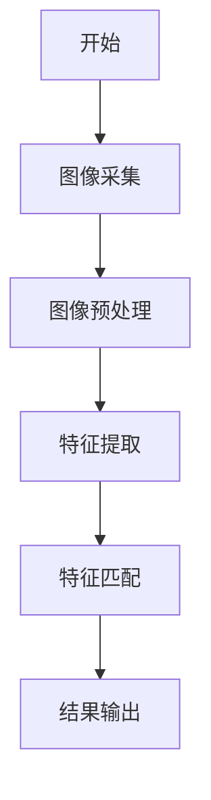
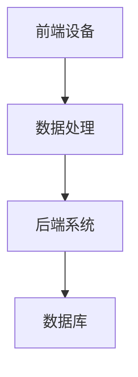

                 

# 生物识别技术的进步与安全产业投资机会

## 关键词：生物识别技术，安全产业，投资机会，指纹识别，人脸识别，虹膜识别

## 摘要：生物识别技术近年来取得了显著进展，广泛应用于安全、金融、医疗等领域。本文探讨了生物识别技术的核心原理、算法优化、在安全产业中的应用解决方案，以及相关投资机会和未来发展趋势。通过分析当前市场格局、技术融合趋势和潜在风险，为投资者和技术创新者提供深度见解。

---

## 第一部分：生物识别技术的背景与现状

### 第1章：生物识别技术概述

#### 1.1 生物识别技术的基本概念

生物识别技术是一种通过人体的生理特征或行为特征来识别人身份的自动化技术。其核心概念包括：

- **生理特征**：指纹、人脸、虹膜、掌纹等。
- **行为特征**：书写习惯、声音、步态等。

生物识别技术通过采集、处理和分析这些特征数据，实现对个人身份的唯一识别。

#### 1.2 生物识别技术的发展历程

生物识别技术经历了从简单到复杂的演变过程：

- **早期阶段**：20世纪60年代，指纹识别技术开始应用于犯罪调查。
- **发展阶段**：90年代，人脸识别技术逐渐成熟，开始应用于安防领域。
- **现代阶段**：近年来，基于AI和深度学习的生物识别技术快速发展，应用领域不断扩展。

#### 1.3 生物识别技术的市场现状

全球生物识别市场呈现快速增长态势，主要驱动力包括：

- **技术进步**：算法优化和计算能力提升。
- **市场需求**：安全、金融、医疗等领域的需求增加。
- **政策支持**：政府推动数字化身份验证和公共安全。

---

## 第二部分：生物识别技术的核心原理与算法

### 第2章：指纹识别技术

#### 2.1 指纹识别的原理与实现

指纹识别通过采集和分析指纹的细节特征（如纹线、 ridge endings、dots）来实现身份验证。

- **特征提取**：使用算法从指纹图像中提取关键特征点。
- **匹配算法**：将提取的特征与数据库中的指纹进行匹配，判断是否为同一人。

#### 2.2 指纹识别的算法流程

指纹识别算法流程如下：

1. 图像采集：通过光学传感器采集指纹图像。
2. 图像预处理：去除噪声，增强特征线。
3. 特征提取：提取 ridge endings 和dots。
4. 特征匹配：将提取的特征与数据库中的指纹进行匹配。

**流程图：**

### 第3章：人脸识别技术

#### 3.1 人脸识别的原理与实现

人脸识别通过分析面部特征（如眼睛、鼻子、嘴巴的位置）来识别人脸。基于深度学习的卷积神经网络（CNN）是当前主流算法。

#### 3.2 人脸识别的算法流程

1. 图像采集：获取人脸图像。
2. 预处理：调整光线、归一化尺寸。
3. 特征提取：使用CNN提取面部特征向量。
4. 特征匹配：与数据库中的特征向量进行比对。

**数学模型：**

假设我们有一个包含N张人脸图像的数据库，每张图像经过特征提取后得到一个D维特征向量。识别过程可以表示为：

$$
\text{识别结果} = \argmin_{i=1}^{N} \| x - f(i) \|
$$

其中，\( x \) 是待识别的特征向量，\( f(i) \) 是数据库中第i个人脸的特征向量。

---

## 第三部分：生物识别技术在安全产业中的应用

### 第4章：智能安防中的生物识别应用

#### 4.1 智能安防系统架构

智能安防系统通常包括以下几个部分：

1. **前端设备**：摄像头、传感器。
2. **数据处理**：特征提取和识别。
3. **后端系统**：数据库存储和管理。

**系统架构图：**

#### 4.2 智能安防中的解决方案

- **实时监控**：通过人脸识别技术，实现对监控区域的实时身份识别。
- **异常检测**：结合行为分析，识别异常行为并触发报警。

### 第5章：金融支付中的生物识别应用

#### 5.1 金融支付系统中的生物识别

- **身份验证**：通过指纹或人脸识别，实现无密码支付。
- **风险管理**：减少密码泄露带来的风险。

#### 5.2 生物识别在金融支付中的优势

- **安全性高**：相较于传统密码，生物识别具有更高的安全性。
- **用户体验佳**：操作便捷，提升用户满意度。

### 第6章：智慧城市中的生物识别应用

#### 6.1 智慧城市中的生物识别应用

- **公共安全**：在火车站、机场等人流密集场所进行身份识别。
- **智能交通**：通过人脸识别实现车牌识别和违章检测。

#### 6.2 生物识别在智慧城市中的挑战

- **数据隐私**：如何保护用户隐私，防止数据泄露。
- **环境适应性**：在复杂光照和背景下，确保识别准确率。

---

## 第四部分：生物识别技术的投资机会与产业分析

### 第7章：生物识别技术的市场分析

#### 7.1 市场规模与增长潜力

根据市场研究，全球生物识别市场规模预计将以年均12%的速度增长，到2025年将突破500亿美元。

#### 7.2 市场竞争格局

主要竞争者包括：

- **苹果**：Face ID技术。
- **谷歌**：人脸识别技术。
- **微软**：虹膜识别技术。

### 第8章：生物识别技术的投资机会

#### 8.1 投资方向

- **技术创新**：加大对AI和深度学习算法的研发投入。
- **行业应用**：关注医疗、金融等高潜力领域。

#### 8.2 投资风险

- **技术风险**：算法优化和模型训练需要大量投入。
- **市场风险**：市场竞争激烈，可能导致利润率下降。

---

## 第五部分：生物识别技术的未来趋势与挑战

### 第9章：生物识别技术的未来发展趋势

#### 9.1 多模态识别

结合多种生物特征（如指纹+人脸识别）进行身份验证，提高识别准确率。

#### 9.2 边缘计算的应用

通过边缘计算，实现实时识别和数据隐私保护。

### 第10章：生物识别技术的挑战与解决方案

#### 10.1 数据隐私保护

- **解决方案**：采用加密技术和联邦学习，保护数据隐私。

#### 10.2 技术标准化

- **解决方案**：推动行业标准的制定，确保技术兼容性和互操作性。

---

## 作者：AI天才研究院 & 禅与计算机程序设计艺术

---

通过以上内容，我们全面探讨了生物识别技术的进步、在安全产业中的应用以及投资机会。希望本文能为技术开发者和投资者提供有价值的参考和启发。

