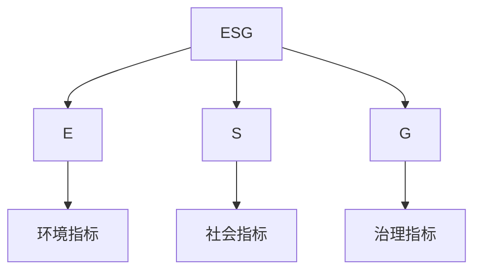
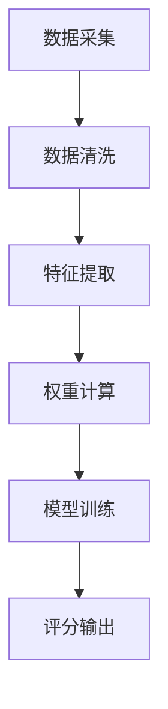
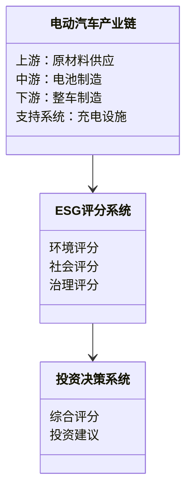
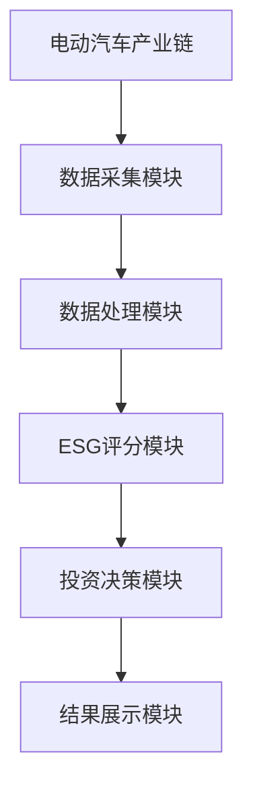
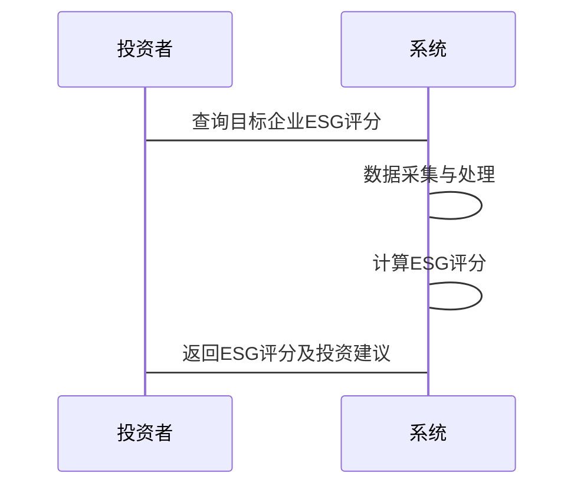

                 


# 电动汽车产业链的ESG投资机会分析

## 关键词：电动汽车，ESG投资，产业链分析，环境影响，社会责任，治理结构

## 摘要：随着全球对可持续发展的关注增加，电动汽车产业链因其环保和技术创新而成为ESG投资的热点领域。本文从产业链的构成、ESG核心概念、算法原理、系统设计、项目实战等多方面展开分析，揭示电动汽车产业链中的ESG投资机会，并提供详细的投资策略和案例分析，帮助投资者把握可持续发展的投资机遇。

---

## 目录

1. [电动汽车产业链的背景与概述](#电动汽车产业链的背景与概述)
2. [ESG核心概念与联系](#ESG核心概念与联系)
3. [ESG投资机会的算法原理](#ESG投资机会的算法原理)
4. [电动汽车产业链的系统分析与架构设计](#电动汽车产业链的系统分析与架构设计)
5. [项目实战：电动汽车产业链的ESG分析](#项目实战电动汽车产业链的ESG分析)
6. [总结与展望](#总结与展望)

---

## 正文

### 第1章: 电动汽车产业链的背景与概述

#### 1.1 电动汽车产业链的构成与特点

##### 1.1.1 电动汽车产业链的定义与范围
电动汽车产业链涵盖了从原材料供应到整车制造，再到充电设施和电池回收的全生命周期。主要环节包括：

- **上游**：锂、镍、钴等关键原材料的开采与加工。
- **中游**：电池制造、电机生产、电控系统开发。
- **下游**：整车制造、充电基础设施建设、销售与服务。

##### 1.1.2 电动汽车产业链的核心环节与参与者
- **电池制造**：如宁德时代、比亚迪等企业，是产业链的关键环节。
- **整车制造**：如特斯拉、上汽集团等，是产业链的核心参与者。
- **充电设施**：如国家电网、特来电等，提供充电服务和基础设施。

##### 1.1.3 电动汽车产业链的全球发展趋势
全球范围内，电动汽车的销量持续增长，尤其是欧洲、中国和美国市场。各国政府通过政策支持和补贴推动电动汽车的发展，同时全球环保意识的提升也加速了电动汽车的普及。

#### 1.2 ESG投资的概念与重要性

##### 1.2.1 ESG的定义与内涵
ESG是环境（Environmental）、社会（Social）和治理（Governance）的简称，是衡量企业可持续发展能力的重要指标。环境关注碳排放和资源利用，社会关注劳工权益和社区影响，治理关注公司治理结构和风险管理。

##### 1.2.2 ESG投资的核心理念与目标
ESG投资强调在追求财务回报的同时，注重企业的社会责任和可持续发展能力。通过投资ESG表现优异的企业，投资者可以在长期实现更高的回报。

##### 1.2.3 ESG在金融投资中的应用现状
近年来，越来越多的投资者将ESG因素纳入投资决策中。通过ESG评级筛选出表现优异的企业，可以降低投资风险，同时实现社会价值。

#### 1.3 电动汽车产业链与ESG投资的结合

##### 1.3.1 电动汽车产业链的环境影响
电动汽车相较于传统燃油车，减少了碳排放和空气污染，但在电池生产和原材料开采过程中可能会对环境造成一定影响。因此，企业在生产过程中需要注重环保，减少资源浪费。

##### 1.3.2 电动汽车产业链的社会责任
企业应关注劳工权益，确保生产过程中的公平与安全。同时，积极参与社区建设，支持社会公益事业，提升社会影响力。

##### 1.3.3 电动汽车产业链的治理结构
良好的公司治理是企业长期发展的基础。电动汽车企业需要建立透明的治理结构，确保决策的科学性和合规性，防范经营风险。

---

### 第2章: ESG核心概念与联系

#### 2.1 ESG核心概念的原理与特征

##### 2.1.1 环境（E）的核心要素
- **碳排放**：企业生产过程中的碳排放量。
- **资源利用**：原材料的高效利用和循环利用。
- **环保措施**：企业采取的环保技术和措施。

##### 2.1.2 社会（S）的核心要素
- **劳工权益**：员工的权益保障，包括工资、工作条件等。
- **社区影响**：企业对当地社区的经济和社会影响。
- **社会责任**：企业参与公益活动，支持社会公益事业。

##### 2.1.3 治理（G）的核心要素
- **公司治理**：董事会结构、高管薪酬、股权激励等。
- **风险管理**：企业对潜在风险的识别、评估和应对能力。
- **合规性**：企业是否遵守相关法律法规，是否存在违规行为。

#### 2.2 ESG核心概念的对比分析

##### 2.2.1 E、S、G的对比特征表

| 指标 | 定义 | 关注点 | 示例 |
|------|------|--------|------|
| E    | 环境 | 碳排放、资源利用 | 企业是否采用可再生能源 |
| S    | 社会 | 劳工权益、社区影响 | 是否支持员工职业发展 |
| G    | 治理 | 公司治理、风险管理 | 董事会结构是否透明 |

##### 2.2.2 E、S、G之间的相互关系
- **环境与治理的关系**：良好的治理结构能够有效管理环境风险，降低碳排放。
- **社会与环境的关系**：企业社会责任的履行可以提升品牌形象，吸引更多环保投资者。
- **治理与社会的关系**：透明的治理结构能够增强社会信任，提升企业的社会影响力。

#### 2.3 ESG核心概念的ER实体关系图



---

### 第3章: ESG投资机会的算法原理

#### 3.1 ESG评分模型的构建

##### 3.1.1 数据采集与预处理
- 数据来源：企业公开财报、ESG评级报告、新闻媒体等。
- 数据清洗：去除缺失值、异常值，标准化数据格式。

##### 3.1.2 指标权重的确定
- 使用层次分析法（AHP）确定各指标的权重。
- 例如，环境指标权重为40%，社会指标为30%，治理指标为30%。

##### 3.1.3 模型的训练与优化
- 使用机器学习算法（如线性回归、随机森林）进行模型训练。
- 通过交叉验证优化模型参数，提升预测精度。

#### 3.2 ESG评分算法的流程图



#### 3.3 ESG评分模型的数学公式

##### 3.3.1 指标权重计算公式
$$ w_i = \frac{f_i}{\sum_{j=1}^{n} f_j} $$
其中，\( w_i \) 表示第i个指标的权重，\( f_i \) 表示第i个指标的重要程度，\( n \) 表示指标总数。

##### 3.3.2 综合评分公式
$$ S = \sum_{i=1}^{n} w_i \times x_i $$
其中，\( S \) 表示综合评分，\( w_i \) 表示第i个指标的权重，\( x_i \) 表示第i个指标的评分。

---

### 第4章: 电动汽车产业链的系统分析与架构设计

#### 4.1 系统功能设计

##### 4.1.1 领域模型Mermaid类图



#### 4.2 系统架构设计

##### 4.2.1 系统架构图



#### 4.3 系统接口设计
- 数据接口：与企业公开数据源对接，获取ESG相关数据。
- 投资接口：与金融平台对接，输出投资建议。

#### 4.4 系统交互设计

##### 4.4.1 投资者查询流程



---

### 第5章: 项目实战：电动汽车产业链的ESG分析

#### 5.1 环境安装
- 安装Python和相关库（如Pandas、Scikit-learn、Matplotlib）。
- 数据源：企业公开数据、ESG评级报告。

#### 5.2 核心实现源代码

##### 5.2.1 数据预处理
```python
import pandas as pd

# 加载数据
data = pd.read_csv('ev_data.csv')

# 数据清洗
data.dropna(inplace=True)
data = data.drop_duplicates()
```

##### 5.2.2 指标权重计算
```python
import numpy as np

# 计算指标权重
weights = np.array([0.4, 0.3, 0.3])
```

##### 5.2.3 ESG评分计算
```python
def calculate_esg_scores(data, weights):
    return np.dot(data, weights)

esg_scores = calculate_esg_scores(data, weights)
```

#### 5.3 代码应用解读与分析
- 数据预处理确保了数据的准确性和完整性。
- 指标权重的合理分配能够提升评分的准确性。
- ESG评分计算公式简单高效，适用于大规模数据。

#### 5.4 实际案例分析
- 以某电动汽车企业为例，分析其ESG表现，包括环境、社会和治理三方面。
- 对比分析同行业其他企业，找出投资机会。

#### 5.5 项目小结
- 通过项目实战，验证了模型的有效性和实用性。
- 提供了具体的ESG投资策略，帮助投资者做出决策。

---

### 第6章: 总结与展望

#### 6.1 总结
本文详细分析了电动汽车产业链的ESG投资机会，从背景、核心概念、算法原理到系统设计和项目实战，全面揭示了ESG投资的重要性与实践方法。

#### 6.2 投资建议
- 优先选择环境表现优异的企业。
- 关注社会责任履行良好的企业。
- 重视公司治理结构完善的企业。

#### 6.3 展望
- 随着技术进步和政策支持，电动汽车产业链的ESG投资潜力将越来越大。
- 未来研究可以进一步优化模型，扩展到更多行业。

---

## 作者：AI天才研究院/AI Genius Institute & 禅与计算机程序设计艺术 /Zen And The Art of Computer Programming

---

这篇文章详细分析了电动汽车产业链的ESG投资机会，从理论到实践，为投资者提供了全面的指导和建议。通过系统的分析和具体的案例，帮助投资者在追求财务回报的同时，实现可持续发展的目标。

