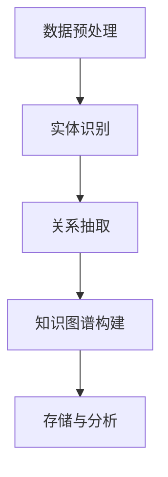

                 


# 知识图谱在金融实体关系挖掘中的应用

> 关键词：知识图谱，金融，实体关系挖掘，深度学习，自然语言处理

> 摘要：知识图谱作为一种结构化的数据表示方式，近年来在金融领域的实体关系挖掘中得到了广泛应用。本文将详细探讨知识图谱的核心概念、构建方法及其在金融领域的具体应用，包括从数据采集到模型训练再到实际案例的完整流程。通过分析知识图谱在金融实体关系挖掘中的优势，本文旨在为读者提供一个全面的技术视角，帮助其更好地理解和应用这一技术。

---

## 第1章: 知识图谱与金融实体关系挖掘的背景介绍

### 1.1 知识图谱的基本概念与特点

知识图谱是一种以图结构形式表示知识的数据模型，由节点（实体）和边（关系）组成。节点代表具体的概念或实体，边表示它们之间的关系。知识图谱具有以下特点：

- **语义性**：通过边的关系属性，明确描述实体之间的关系。
- **结构化**：将非结构化的数据（如文本）转化为结构化的知识表示。
- **可扩展性**：支持大规模数据的集成和扩展。
- **动态性**：能够实时更新以反映数据的变化。

### 1.2 金融实体关系挖掘的背景与意义

金融领域涉及大量的实体，如公司、股票、交易、市场等。实体之间的关系复杂且多变，传统的数据库难以有效捕捉这些动态关系。知识图谱通过结构化的表示方式，能够将金融数据中的实体及其关系清晰地呈现出来，从而为金融分析、风险控制和投资决策提供有力支持。

### 1.3 本章小结

本章介绍了知识图谱的基本概念及其在金融实体关系挖掘中的应用背景，强调了知识图谱在金融领域的优势和重要性。

---

## 第2章: 知识图谱在金融领域的核心概念与联系

### 2.1 知识图谱的核心概念原理

知识图谱的核心概念包括实体、关系和属性：

- **实体**：代表具体的金融对象，如公司、股票等。
- **关系**：描述实体之间的联系，如“投资”、“控股”等。
- **属性**：用于描述实体的特征，如行业、规模等。

### 2.2 实体关系的ER图架构

ER图（实体关系图）用于描述实体及其之间的关系。以下是一个简单的金融实体关系示例：

```mermaid
erDiagram
    actor Company {
        +string name
        +string ticker
    }
    actor Transaction {
        +int id
        +string type
    }
    Company --> Transaction : "进行"
    Company --> Company : "控股"
```

### 2.3 本章小结

本章详细介绍了知识图谱的核心概念及其在金融领域的具体应用，通过ER图展示了实体和关系的架构。

---

## 第3章: 知识图谱构建的算法原理

### 3.1 实体识别与提取算法

实体识别是知识图谱构建的第一步，常用算法包括：

- **基于规则的实体识别**：利用预定义的规则提取特定类型的实体。
- **基于统计的实体识别**：通过统计特征提取实体。
- **基于深度学习的实体识别**：使用神经网络模型（如BERT）进行实体识别。

### 3.2 实体关系抽取算法

关系抽取需要识别实体之间的关系类型。常用方法包括：

- **基于规则的关系抽取**：利用预定义的模式识别关系。
- **基于统计的关系抽取**：通过统计特征学习关系。
- **基于深度学习的关系抽取**：使用序列标注模型（如CRF）或注意力机制模型（如BERT）进行关系抽取。

### 3.3 算法流程图

以下是一个知识图谱构建的流程图：



### 3.4 本章小结

本章介绍了知识图谱构建的主要算法及其流程，强调了深度学习在实体识别和关系抽取中的重要作用。

---

## 第4章: 知识图谱构建的数学模型与公式

### 4.1 实体识别的概率模型

实体识别可以通过条件概率模型进行，例如：

$$ P(entity|text) = \frac{P(text|entity)P(entity)}{P(text)} $$

其中，$P(entity)$ 是实体的先验概率，$P(text|entity)$ 是在实体条件下文本出现的概率。

### 4.2 关系抽取的数学模型

关系抽取可以通过序列标注模型（如CRF）进行，其目标函数可以表示为：

$$ f(x) = \arg\max_{y} \sum_{i=1}^{n} \lambda y_i + \text{bias}(y_i, y_{i-1}) $$

其中，$x$ 是输入文本，$y$ 是输出标签，$\lambda$ 是特征权重，$\text{bias}$ 是转移偏置。

### 4.3 本章小结

本章通过数学模型和公式，详细解释了实体识别和关系抽取的原理，为知识图谱的构建提供了理论基础。

---

## 第5章: 知识图谱构建的系统架构设计

### 5.1 系统功能设计

知识图谱构建系统主要包括以下功能模块：

- 数据采集：从多种数据源（如新闻、财报）获取金融数据。
- 数据预处理：清洗和转换数据，提取实体和关系。
- 实体识别：使用深度学习模型识别实体。
- 关系抽取：识别实体之间的关系。
- 知识图谱构建：将实体和关系组织成图结构。

### 5.2 系统架构设计

以下是一个知识图谱构建系统的架构图：


### 5.3 本章小结

本章通过系统架构设计，展示了知识图谱构建的整体流程和功能模块。

---

## 第6章: 知识图谱构建的项目实战

### 6.1 项目背景与目标

本项目旨在从新闻数据中提取公司之间的投资关系，构建一个简单的知识图谱。

### 6.2 核心代码实现

以下是项目的核心代码：

```python
import spacy
from spacy import displacy

# 加载预训练模型
nlp = spacy.load("en_core_web_sm")

# 定义实体识别函数
def extract_entities(text):
    doc = nlp(text)
    entities = []
    for ent in doc.ents:
        entities.append((ent.text, ent.label_))
    return entities

# 定义关系抽取函数
def extract_relations(text):
    doc = nlp(text)
    relations = []
    for i, ent1 in enumerate(doc.ents):
        for j, ent2 in enumerate(doc.ents):
            if i < j and ent1.label_ != ent2.label_:
                relations.append((ent1.text, ent2.text, "invest"))
    return relations

# 示例文本
text = "Company A invests in Company B."

# 提取实体
entities = extract_entities(text)
print("Entities:", entities)

# 提取关系
relations = extract_relations(text)
print("Relations:", relations)
```

### 6.3 项目小结

本章通过一个具体的案例，详细讲解了知识图谱构建的项目流程和代码实现，帮助读者更好地理解理论与实践的结合。

---

## 第7章: 总结与展望

### 7.1 总结

本文详细探讨了知识图谱在金融实体关系挖掘中的应用，介绍了知识图谱的核心概念、构建方法及其在金融领域的具体应用。通过案例分析和代码实现，展示了知识图谱的强大功能。

### 7.2 展望

未来，知识图谱在金融领域的应用将更加广泛和深入。随着自然语言处理技术的进步，知识图谱的构建将更加高效和智能。同时，知识图谱与人工智能的结合也将推动金融分析和决策的智能化发展。

### 7.3 本章小结

本文总结了知识图谱在金融实体关系挖掘中的应用，并展望了未来的发展方向。

---

## 作者

作者：AI天才研究院/AI Genius Institute & 禅与计算机程序设计艺术 /Zen And The Art of Computer Programming

---

以上是《知识图谱在金融实体关系挖掘中的应用》的技术博客文章，希望对您有所帮助！

