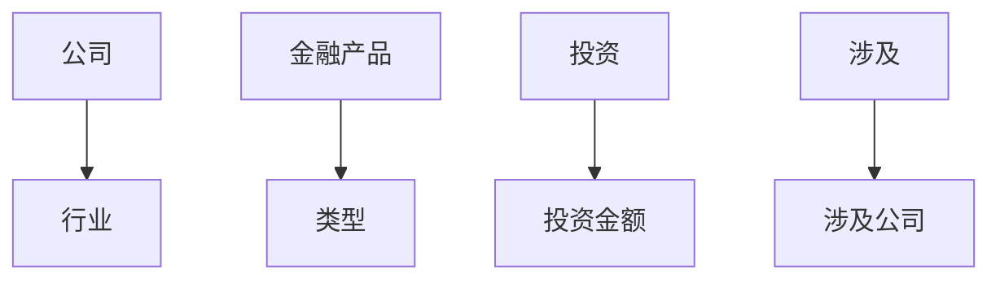
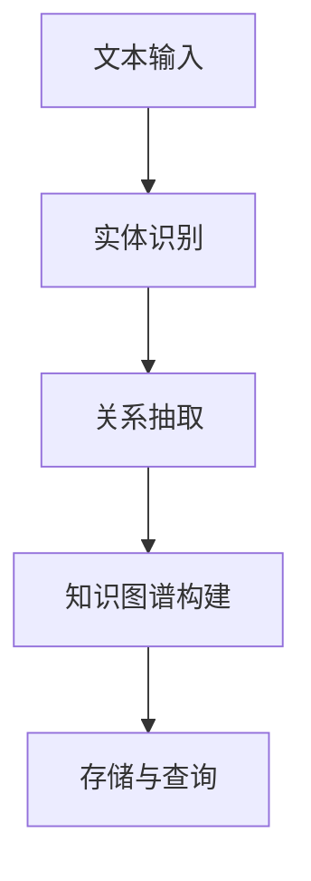
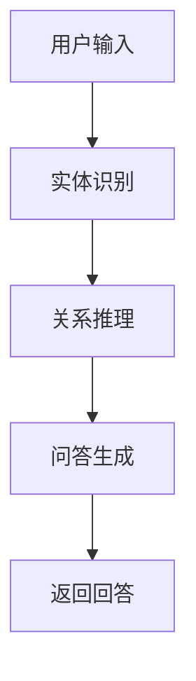
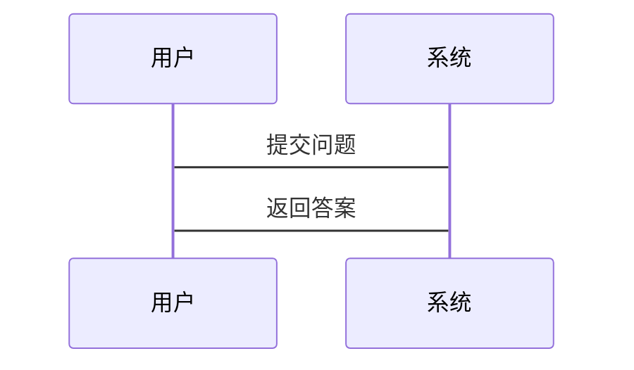

                 


# 知识图谱在金融领域知识问答中的应用

## 关键词
知识图谱，金融问答，实体识别，关系抽取，深度学习

## 摘要
知识图谱是一种以图结构形式表示知识的语义网络，能够有效地处理复杂关系和语义理解。本文详细探讨了知识图谱在金融领域知识问答中的应用，从背景、核心概念、算法原理到系统架构，再到项目实战，全面解析了知识图谱在金融问答中的构建与应用过程。通过实际案例和详细代码实现，本文为读者提供了深入的理解和实践指导。

## 目录

1. 知识图谱与金融知识问答的背景介绍
   1.1 知识图谱的基本概念与特点
   1.2 金融领域知识问答的挑战
   1.3 知识图谱在金融领域的应用现状

2. 知识图谱的核心概念与联系
   2.1 实体识别与关系抽取
   2.2 实体关系属性对比表
   2.3 ER实体关系图

3. 知识图谱构建的算法原理
   3.1 实体识别算法
   3.2 关系抽取算法
   3.3 知识图谱构建流程

4. 系统分析与架构设计
   4.1 问题场景介绍
   4.2 系统功能设计
   4.3 系统架构设计
   4.4 接口设计与交互流程

5. 项目实战与案例分析
   5.1 环境安装与配置
   5.2 核心代码实现
   5.3 实际案例分析
   5.4 系统优化与改进

6. 总结与展望
   6.1 全文总结
   6.2 未来发展方向
   6.3 注意事项与建议

---

## 正文

### 第1章 知识图谱与金融知识问答的背景介绍

#### 1.1 知识图谱的基本概念与特点
知识图谱是一种以图结构形式表示知识的语义网络，节点表示实体或概念，边表示实体之间的关系。其核心特点包括：

- **语义丰富性**：能够表示实体间的复杂关系。
- **可扩展性**：支持大规模数据的扩展。
- **结构化**：以图结构的形式组织知识，便于计算机理解和推理。

#### 1.2 金融领域知识问答的挑战
金融领域知识问答具有以下挑战：

- **领域复杂性**：金融涉及多种实体和复杂的关系。
- **数据稀疏性**：部分金融数据可能难以获取或标注。
- **实时性要求**：金融信息更新快，需要实时响应。

#### 1.3 知识图谱在金融领域的应用现状
知识图谱在金融领域的应用主要包括：

- **金融实体关联分析**：通过图结构分析公司、产品之间的关系。
- **智能问答系统**：基于知识图谱提供准确的金融信息查询。

---

### 第2章 知识图谱的核心概念与联系

#### 2.1 实体识别与关系抽取
实体识别是通过自然语言处理技术从文本中提取实体，关系抽取则是识别实体之间的关系。

- **实体识别**：例如，从“苹果公司投资了特斯拉”中提取“苹果公司”和“特斯拉”。
- **关系抽取**：识别“投资”关系。

#### 2.2 实体关系属性对比表
以下表格展示了实体、属性、关系及关系属性的对比：

| 实体类型 | 实体属性 | 关系类型 | 关系属性 |
|----------|----------|----------|----------|
| 公司     | 名称、行业 | 投资     | 投资金额 |
| 金融产品 | 名称、类型 | 涉及     | 涉及公司 |

#### 2.3 ER实体关系图
以下是知识图谱的实体关系图：



---

### 第3章 知识图谱构建的算法原理

#### 3.1 实体识别算法
实体识别主要采用以下算法：

- **基于规则的实体识别**：通过预设规则匹配实体。
- **基于统计的实体识别**：利用统计模型识别实体。
- **基于深度学习的实体识别**：使用神经网络模型（如LSTM）进行识别。

#### 3.2 关系抽取算法
关系抽取算法包括：

- **基于规则的关系抽取**：通过预设模板匹配关系。
- **基于统计的关系抽取**：利用统计模型提取关系。
- **基于深度学习的关系抽取**：使用神经网络模型（如BERT）进行关系抽取。

#### 3.3 知识图谱构建流程
知识图谱的构建流程如下：



---

### 第4章 系统分析与架构设计

#### 4.1 问题场景介绍
金融知识问答系统需要处理以下问题：

- **实体识别**：从用户问题中提取相关实体。
- **关系推理**：基于知识图谱推理实体之间的关系。
- **问答生成**：根据推理结果生成回答。

#### 4.2 系统功能设计
系统功能模块包括：

- **实体识别模块**：提取问题中的实体。
- **关系推理模块**：推理实体之间的关系。
- **问答生成模块**：生成回答。

#### 4.3 系统架构设计
以下是系统的架构图：



#### 4.4 接口设计与交互流程
系统接口设计如下：



---

### 第5章 项目实战与案例分析

#### 5.1 环境安装与配置
需要安装以下环境：

- Python 3.8+
- PyTorch 1.9+
- transformers库

安装命令：
```bash
pip install torch transformers
```

#### 5.2 核心代码实现
以下是实体识别和关系抽取的代码示例：

```python
from transformers import pipeline

# 实体识别
nlp = pipeline("ner")

text = "苹果公司投资了特斯拉"
result = nlp(text)
print(result)
```

#### 5.3 实际案例分析
案例：用户询问“苹果公司投资了哪些公司？”
- **实体识别**：提取“苹果公司”和“公司”。
- **关系推理**：推理出“投资”关系。
- **问答生成**：生成回答“苹果公司投资了特斯拉。”

#### 5.4 系统优化与改进
优化措施包括：

- **优化实体识别模型**：使用更先进的模型提高准确率。
- **增强关系推理能力**：引入更多关系类型。

---

### 第6章 总结与展望

#### 6.1 全文总结
知识图谱在金融知识问答中的应用能够有效提升问答的准确性和效率。

#### 6.2 未来发展方向
未来，知识图谱在金融领域的应用将更加广泛，包括：

- **实时更新**：实时更新知识图谱以反映最新的金融信息。
- **多模态融合**：结合文本、图像等多种数据源。

#### 6.3 注意事项与建议
在实际应用中，需要注意以下几点：

- **数据隐私**：确保数据的安全和隐私。
- **模型优化**：持续优化模型以提高性能。

---

## 作者

作者：AI天才研究院/AI Genius Institute & 禅与计算机程序设计艺术/Zen And The Art of Computer Programming

