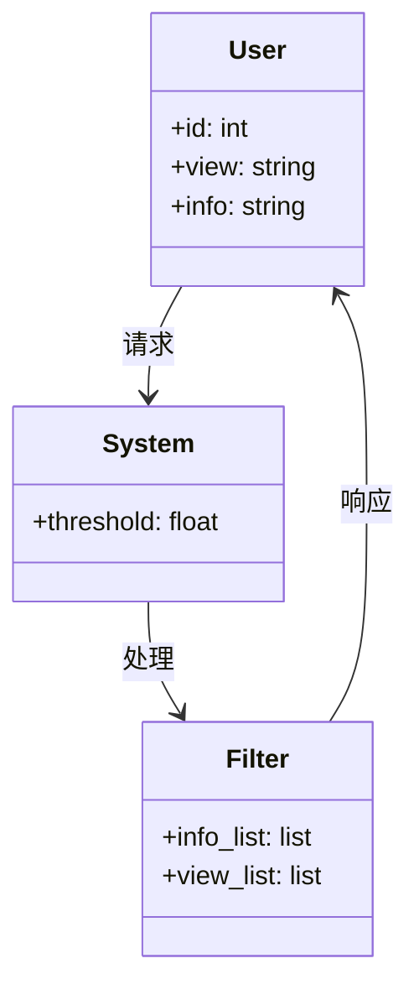

                 


# 确认偏误：如何避免选择性接受信息

---

## 关键词

- 确认偏误
- 信息处理
- 认知偏差
- 系统设计
- 数学模型

---

## 摘要

确认偏误是一种普遍存在的认知偏差，指人们在处理信息时倾向于接受与自己已有观点一致的信息，而忽略或排斥与之矛盾的信息。这种偏差不仅影响个人的决策，还在信息社会中加剧了信息分化的现象。本文将从心理学、算法原理和系统设计等多个角度，深入剖析确认偏误的成因、表现及其应对策略，帮助读者理解并避免选择性接受信息。

---

## 第1章: 确认偏误的定义与背景

### 1.1 确认偏误的定义

确认偏误（Confirmatory Bias）是指个体在处理信息时，倾向于寻找、解释和记住与自己已有观点一致的信息，而忽视或排斥与之矛盾的信息的现象。这种偏差源于人类大脑的信息处理机制，尤其是对已知信息的偏好。

#### 确认偏误的特征

| 特性 | 描述 |
|------|------|
| 选择性接受 | 主动寻找支持已有观点的信息 |
| 选择性忽略 | 忽略或排斥与已有观点矛盾的信息 |
| 选择性记忆 | 记忆中倾向于保留支持已有观点的信息 |
| 选择性解释 | 主观解释信息，使其符合已有观点 |

---

### 1.2 确认偏误的历史背景

确认偏误的研究最早可以追溯到20世纪中期，心理学家通过实验发现，人们在面对信息时，往往倾向于验证而非探索新观点。这一现象在信息社会中变得更加显著，尤其是在社交媒体和信息茧房中。

---

### 1.3 确认偏误的表现形式

确认偏误可以通过以下几种形式表现：

- **选择性搜索**：人们倾向于搜索与自己观点一致的信息源。
- **选择性记忆**：人们更容易记住支持自己观点的信息。
- **选择性解释**：人们倾向于以符合自己观点的方式解释信息。

---

## 第2章: 确认偏误的核心概念与原理

### 2.1 确认偏误的心理学基础

#### 2.1.1 人类信息处理机制

人类的信息处理机制包括感知、记忆、推理和决策等环节。确认偏误主要影响记忆和推理阶段，导致人们倾向于保留和强化已有观点。

#### 2.1.2 选择性接受机制

选择性接受机制是确认偏误的核心机制，表现为：

- **过滤机制**：信息在进入大脑之前被过滤，只允许与已有观点一致的信息通过。
- **强化机制**：一旦信息被接受，大脑会通过强化记忆和情感连接来巩固这一观点。

---

### 2.2 确认偏误的数学模型

#### 2.2.1 确认偏误的概率模型

确认偏误可以用概率模型来描述。设 $P(A|B)$ 表示在已知 $B$ 的情况下 $A$ 发生的概率。确认偏误的模型可以表示为：

$$
P(\text{接受信息}| \text{与已有观点一致}) = 1
$$

$$
P(\text{拒绝信息}| \text{与已有观点不一致}) = 1
$$

---

#### 2.2.2 确认偏误的贝叶斯模型

贝叶斯模型可以帮助我们理解确认偏误对概率推理的影响。假设我们有一个假设 $H$ 和观测数据 $D$，根据贝叶斯定理：

$$
P(H|D) = \frac{P(D|H)P(H)}{P(D)}
$$

确认偏误会扭曲 $P(D|H)$，使我们倾向于认为 $D$ 更符合 $H$。

---

## 第3章: 确认偏误的算法原理

### 3.1 确认偏误的信息过滤算法

确认偏误可以通过信息过滤算法来模拟。以下是算法的步骤：

1. **输入**：信息内容 $I$，已有观点 $V$。
2. **过滤**：计算 $I$ 与 $V$ 的相似性。
3. **输出**：如果相似性大于阈值 $T$，接受 $I$；否则，拒绝 $I$。

#### 算法代码实现

```python
def confirmatory_bias_filter(info, view, threshold=0.8):
    similarity = calculate_similarity(info, view)
    if similarity > threshold:
        return "Accepted"
    else:
        return "Rejected"

# 示例：计算相似性函数
def calculate_similarity(info, view):
    # 简单实现：基于关键词匹配的相似性
    common_keywords = set(info).intersection(view)
    return len(common_keywords) / (len(info) + len(view))
```

---

### 3.2 确认偏误的数学模型与优化

确认偏误的数学模型可以通过优化算法来减少偏差。例如，可以引入惩罚项来降低对已有观点的偏好：

$$
P(\text{更新观点}| \text{新信息}) = \frac{P(\text{新信息}| \text{更新观点})P(\text{更新观点})}{P(\text{新信息})}
$$

---

## 第4章: 系统分析与架构设计

### 4.1 系统功能设计

#### 4.1.1 领域模型

以下是一个简单的领域模型类图（使用 Mermaid）：



---

### 4.2 系统架构设计

#### 4.2.1 系统架构图

```mermaid
graph TD
    A[User] --> B[System]: 请求
    B[System] --> C[Filter]: 处理
    C[Filter] --> A[User]: 响应
```

---

### 4.3 系统接口设计

以下是系统接口的示例：

- **输入接口**：用户提供已有观点 $V$ 和新信息 $I$。
- **输出接口**：系统返回是否接受 $I$。

---

## 第5章: 项目实战

### 5.1 环境安装

需要安装 Python 和以下库：

```bash
pip install numpy
pip install matplotlib
```

---

### 5.2 核心代码实现

以下是实现确认偏误过滤的代码：

```python
import numpy as np

def calculate_similarity(info, view):
    # 计算信息和观点的相似性
    return np.dot(info, view) / (np.linalg.norm(info) * np.linalg.norm(view))

def confirmatory_bias_system(info, view, threshold=0.8):
    similarity = calculate_similarity(info, view)
    if similarity > threshold:
        return "Accepted"
    else:
        return "Rejected"

# 示例
info = [1, 2, 3]
view = [2, 3, 4]
threshold = 0.75
result = confirmatory_bias_system(info, view, threshold)
print(f"结果：{result}")
```

---

## 第6章: 总结与展望

### 6.1 总结

确认偏误是一种复杂但普遍存在的认知偏差，理解其原理和机制是避免其影响的关键。通过数学模型、算法优化和系统设计，我们可以有效减少确认偏误的影响。

### 6.2 注意事项

- **保持开放心态**：主动接触不同观点。
- **批判性思维**：学会质疑和验证。
- **数据驱动决策**：依赖数据而非直觉。

### 6.3 未来研究方向

- 研究确认偏误在人工智能中的影响。
- 探索更有效的算法来减少确认偏误。
- 研究确认偏误在社会网络中的传播机制。

---

## 作者

作者：AI天才研究院/AI Genius Institute & 禅与计算机程序设计艺术 /Zen And The Art of Computer Programming

