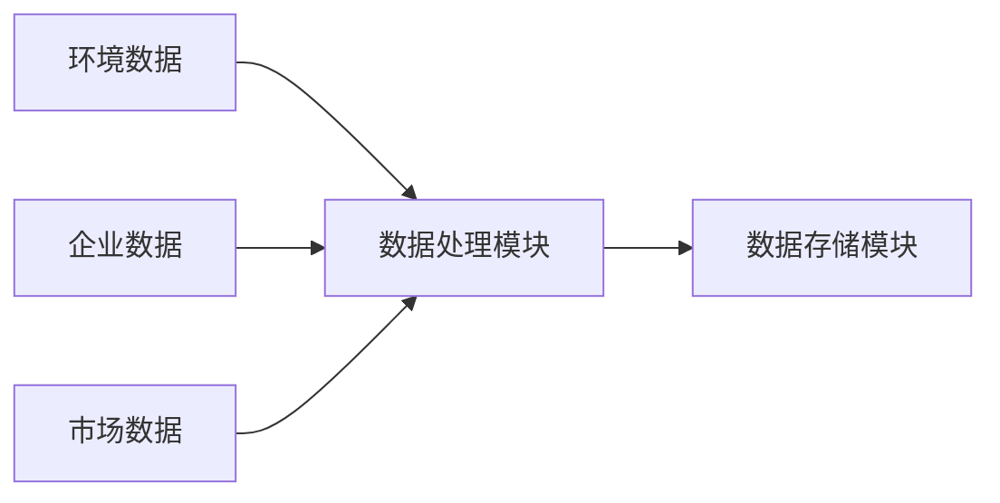
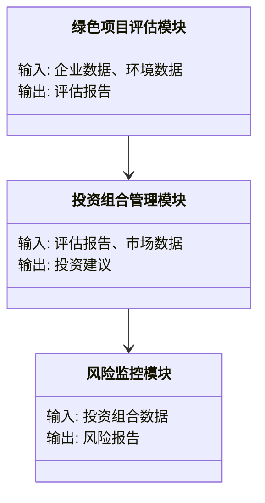

                 

# 《碳中和目标下的绿色投资策略》

## 关键词：碳中和，绿色投资，ESG，碳金融，投资策略

## 摘要：  
碳中和目标要求全球在2050年左右实现温室气体净零排放，这为绿色投资带来了前所未有的机遇和挑战。绿色投资，通过将资金投入到环保、低碳领域，成为推动经济转型和实现可持续发展的重要手段。本文从碳中和背景出发，深入分析绿色投资的核心概念、策略、系统架构和项目实战，探讨绿色投资如何在全球范围内推动碳中和目标的实现。文章结合理论与实践，为投资者提供了科学的投资指导和实际操作建议。

---

## 第一部分: 碳中和目标下的绿色投资背景

### 第1章: 碳中和与绿色投资概述

#### 1.1 碳中和的定义与背景

**碳中和的定义**：碳中和是指在一定时期内，通过减少温室气体排放和增加碳汇，使二氧化碳的净排放量为零。简单来说，就是人类活动排放的二氧化碳被自然吸收，实现碳的“零排放”。

**背景分析**：  
- 工业革命以来，化石能源的大量使用导致全球气温上升，引发极端天气、海平面上升等环境问题。
- 2015年《巴黎协定》要求将全球平均气温升幅控制在1.5摄氏度以内，碳中和成为全球共识。
- 各国纷纷制定碳中和目标，如欧盟、中国、美国等主要经济体承诺在2050年前实现碳中和。

#### 1.2 绿色投资的定义与特点

**绿色投资的核心概念**：绿色投资是指将资金投入到环保、低碳、可持续发展领域，旨在支持经济转型和环境保护。  

**绿色投资的特点**：  
1. **环境效益**：通过支持清洁能源、节能技术等项目，减少碳排放。
2. **社会效益**：关注社会责任，推动公平、包容性发展。
3. **治理结构**：强调企业治理透明、合规，降低风险。
4. **长期性**：绿色投资通常注重长期价值，而非短期收益。

#### 1.3 碳中和与绿色投资的关系

**碳中和目标对绿色投资的驱动作用**：  
- 碳中和要求减少化石能源使用，这为可再生能源、绿色交通等领域提供了巨大投资机会。
- 政府通过碳税、补贴等政策工具，引导资金流向绿色产业。

**绿色投资在实现碳中和中的关键作用**：  
- 绿色投资为低碳技术的研发和应用提供资金支持。
- 通过投资绿色企业，推动产业升级和技术创新。

**碳中和目标下的绿色投资趋势**：  
- 投资者越来越关注企业的碳排放表现。
- 绿色金融工具（如绿色债券、碳期货）快速发展。

#### 1.4 本章小结  
本章介绍了碳中和的定义、背景和绿色投资的核心概念，强调了绿色投资在实现碳中和目标中的重要性。

---

## 第二部分: 绿色投资的核心概念与工具

### 第2章: 绿色投资的核心概念

#### 2.1 绿色投资的三大支柱

**ESG框架**：  
- **环境（Environmental）**：关注企业的碳排放、资源消耗等环境表现。
- **社会（Social）**：关注企业对员工、社区、人权等方面的社会责任。
- **治理（Governance）**：关注企业的管理结构、合规性等治理因素。

**ESG与传统投资的对比**：  
| 对比维度 | 传统投资 | 绿色投资（ESG） |
|----------|----------|----------------|
| 投资目标 | 追求收益最大化 | 追求收益与可持续性双重目标 |
| 风险评估 | 侧重财务风险 | 侧重环境、社会、治理风险 |
| 投资领域 | 广泛领域 | 环保、能源效率等领域优先 |

#### 2.2 碳金融与绿色金融的区别与联系

**碳金融**：  
- 碳金融是指与碳排放权交易相关的金融活动，包括碳期货、碳期权等。
- 主要目的是通过市场机制降低碳排放成本。

**绿色金融**：  
- 绿色金融是指为绿色项目提供资金支持的金融活动，包括绿色债券、绿色贷款等。
- 旨在支持环保项目，促进可持续发展。

**区别与联系**：  
- 区别：碳金融更侧重于碳排放权的交易，绿色金融更广泛，包括所有环保项目。
- 联系：两者都服务于减少碳排放，且在碳中和目标下相互促进。

#### 2.3 绿色投资的量化评估方法

**碳排放强度计算**：  
- 碳排放强度 = 单位产品/服务的碳排放量。
- 例如，某企业生产每吨钢的碳排放为1.5吨，其碳排放强度为1.5吨/吨钢。

**碳足迹计算**：  
- 碳足迹是产品或服务在整个生命周期中产生的温室气体排放的总和。
- 例如，一辆电动汽车从生产到报废的全生命周期碳足迹。

**绿色投资的收益与风险评估**：  
- 收益：长期来看，绿色投资可能带来超额收益，尤其是在政策支持和市场需求增长的情况下。
- 风险：短期波动较大，且存在政策和市场风险。

#### 2.4 本章小结  
本章详细讲解了绿色投资的核心概念，包括ESG框架、碳金融与绿色金融的区别与联系，以及绿色投资的量化评估方法。

---

## 第三部分: 碳中和目标下的绿色投资策略

### 第3章: 碳中和目标对投资策略的影响

#### 3.1 碳中和目标下的政策环境分析

**全球主要经济体的碳中和政策**：  
- 中国：2060年前实现碳中和。
- 欧盟：2050年前实现碳中和。
- 美国：2050年前实现碳中和。

**碳定价机制**：  
- 碳税：通过征税将碳排放成本内部化。
- 碳交易：通过市场机制确定碳排放权的价格。

**政策对投资的影响**：  
- 政策鼓励可再生能源投资，同时增加对高碳行业的监管压力。

#### 3.2 碳中和目标下的市场机会

**可再生能源行业的投资机会**：  
- 风能、太阳能等可再生能源项目具有广阔前景。
- 投资者可通过绿色债券或股权投资进入这一领域。

**绿色交通与智能电网的投资机会**：  
- 新能源汽车、充电基础设施等领域投资潜力大。
- 智能电网建设需要大量资金支持。

**循环经济与绿色建筑的投资机会**：  
- 循环经济模式减少资源浪费，提高效率。
- 绿色建筑通过节能设计降低碳排放。

#### 3.3 碳中和目标下的投资风险

**碳风险的定义与评估方法**：  
- 碳风险指企业在碳中和目标下可能面临的政策、市场和技术风险。
- 评估方法包括情景分析、压力测试等。

**碳中和目标下的行业风险分析**：  
- 高碳行业（如煤炭、石油）面临转型风险。
- 低碳行业（如可再生能源）面临技术替代风险。

**碳风险对投资组合的影响**：  
- 高碳资产可能面临价值贬损。
- 低碳资产可能带来超额收益。

#### 3.4 本章小结  
本章分析了碳中和目标对投资策略的影响，包括政策环境、市场机会和投资风险。

---

## 第四部分: 绿色投资的系统分析与架构设计

### 第4章: 绿色投资系统的分析与设计

#### 4.1 绿色投资系统的总体架构

**系统目标**：支持投资者进行绿色投资决策，实现碳中和目标。  
**系统范围**：覆盖绿色项目评估、投资组合管理、风险监控等功能。  
**系统架构设计**：  

#### 4.2 绿色投资系统的数据流分析

**数据来源**：环境数据、企业数据、市场数据。  
**数据流图**：  

#### 4.3 绿色投资系统的功能设计

**领域模型**：  

#### 4.4 本章小结  
本章从系统架构角度分析了绿色投资的支持体系，包括模块划分和数据流分析。

---

## 第五部分: 绿色投资的项目实战

### 第5章: 绿色投资项目的实施与分析

#### 5.1 绿色投资项目的选择与评估

**项目背景与目标**：支持一家可再生能源企业实现碳中和目标。  
**项目可行性分析**：  
- 技术可行性：可再生能源技术成熟。
- 经济可行性：政府补贴和市场需求充足。
- 社会可行性：公众环保意识提高。

**项目风险评估**：  
- 技术风险：技术更新快。
- 市场风险：能源价格波动。

#### 5.2 绿色投资项目的实施步骤

**项目规划与实施计划**：  
1. 确定投资金额和分配。
2. 确定投资期限和退出策略。
3. 定期监控项目进展。

**项目资源分配与管理**：  
- 人力资源：组建专业团队。
- 财务资源：确保资金到位。
- 技术资源：引入先进技术支持。

**项目监控与调整**：  
- 定期评估项目绩效。
- 根据市场变化调整投资策略。

#### 5.3 绿色投资项目的案例分析

**案例背景与目标**：投资于某风力发电项目。  
**项目实施**：  
- 投资金额：1000万美元。
- 投资期限：10年。
- 退出策略：项目建成后出售收益权。

**项目成果**：  
- 项目每年减少碳排放2万吨。
- 投资回报率超过预期。

#### 5.4 本章小结  
本章通过具体案例展示了绿色投资项目的实施过程和成果。

---

## 第六部分: 结论与展望

### 6.1 研究结论

- 碳中和目标为绿色投资提供了巨大机遇。
- 绿色投资通过支持低碳技术实现环境和经济双重目标。
- 系统化的方法是绿色投资成功的关键。

### 6.2 未来展望

- 绿色金融工具将更加多样化。
- 碳中和目标下的国际合作将加强。
- 技术创新将推动绿色投资发展。

---

## 作者：AI天才研究院/AI Genius Institute & 禅与计算机程序设计艺术 /Zen And The Art of Computer Programming

---

**全文结束**

