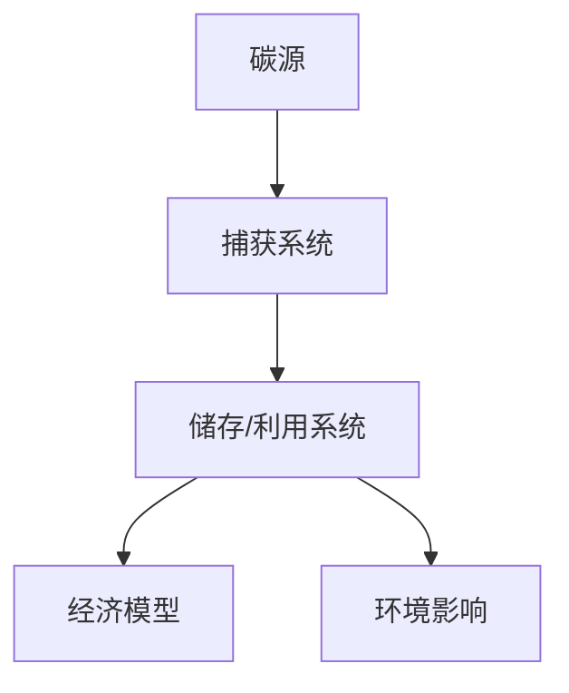
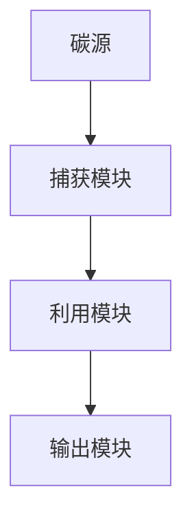
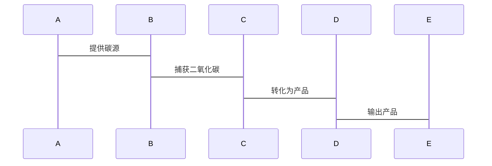

                 


# 碳捕获与利用技术的经济可行性分析

## 关键词：碳捕获、碳利用、经济可行性、技术分析、系统设计

## 摘要：  
碳捕获与利用技术是应对气候变化的重要手段之一。本文从技术原理、经济模型、系统设计等多个维度，详细分析了碳捕获与利用技术的经济可行性。通过构建经济模型、分析实际案例和系统架构，本文揭示了该技术在实现碳中和目标中的潜力与挑战，并提出了优化建议。

---

## 第1章 碳捕获与利用技术概述

### 1.1 碳捕获与利用的定义与背景

#### 1.1.1 碳捕获与利用的定义  
碳捕获与利用（Carbon Capture and Utilization，CCU）是指通过技术手段从工业过程或大气中捕获二氧化碳，并将其转化为有价值的产品或用于封存的过程。CCU不仅是减少碳排放的重要手段，还能实现资源的循环利用。

#### 1.1.2 碳捕获技术的发展历程  
碳捕获技术起源于20世纪，经历了实验室研究、小规模试验和工业化应用三个阶段。随着全球气候变化问题的加剧，CCU技术逐渐受到关注，并在全球范围内得到广泛应用。

#### 1.1.3 碳捕获与利用的全球现状  
目前，全球多个国家和地区已经在碳捕获与利用领域取得了显著进展，例如挪威的Norwayっこ项目和美国的NRG碳捕获项目。这些项目的成功实施为CCU技术的商业化提供了宝贵经验。

### 1.2 碳捕获技术的分类与特点

#### 1.2.1 吸收法  
吸收法是通过化学反应将二氧化碳捕获的一种方法。常见的吸收剂包括胺类化合物和碳酸钾溶液。吸收法的优点是捕获效率高，但成本较高。

#### 1.2.2 吸附法  
吸附法是利用吸附剂的表面活性捕获二氧化碳。常用的吸附剂包括活性炭和分子筛。吸附法的优点是能耗低，但吸附剂的再生成本较高。

#### 1.2.3 膜分离法  
膜分离法是通过特殊设计的膜材料将二氧化碳与其他气体分离。该方法的优点是操作简单，但对膜材料的要求较高。

### 1.3 碳利用技术的经济意义

#### 1.3.1 碳利用的主要途径  
碳利用的主要途径包括碳封存、碳转化为燃料和碳转化为材料。这些途径不仅能够减少碳排放，还能创造经济价值。

#### 1.3.2 碳利用的经济价值  
通过碳利用，企业可以降低碳排放成本，同时获得新的收入来源。例如，将二氧化碳转化为甲醇或聚碳酸酯等材料，能够为企业创造额外利润。

### 1.4 碳捕获与利用技术的边界与外延

#### 1.4.1 技术边界  
碳捕获与利用技术的边界包括捕获效率、捕获成本和捕获规模。这些边界决定了技术的适用范围和经济效益。

#### 1.4.2 经济边界  
经济边界包括碳利用产品的市场价格、政策补贴和市场需求。这些因素直接影响技术的经济可行性。

#### 1.4.3 环境边界  
环境边界包括碳排放的环境影响、碳利用对生态系统的潜在影响。这些因素需要在技术设计和实施中加以考虑。

### 1.5 本章小结  
本章主要介绍了碳捕获与利用技术的定义、分类、经济意义和技术边界。通过分析这些内容，我们可以更好地理解CCU技术的核心概念和应用场景。

---

## 第2章 碳捕获与利用技术的核心概念与联系

### 2.1 碳捕获技术的原理

#### 2.1.1 吸收法原理  
吸收法的原理是通过化学反应将二氧化碳捕获。例如，胺类化合物与二氧化碳反应生成碳酸氢盐，随后通过加热再生胺类化合物并释放二氧化碳。

#### 2.1.2 吸附法原理  
吸附法的原理是利用吸附剂的表面活性捕获二氧化碳。例如，活性炭表面的孔隙结构能够吸附二氧化碳分子。

#### 2.1.3 膜分离法原理  
膜分离法的原理是利用膜材料的选择透过性将二氧化碳与其他气体分离。例如，聚酰亚胺膜可以有效分离二氧化碳和氮气。

### 2.2 碳利用技术的原理

#### 2.2.1 碳封存技术  
碳封存技术是将捕获的二氧化碳注入地下储层，如盐水层或枯竭的油气层。这种方法可以有效减少二氧化碳的排放。

#### 2.2.2 碳转化为燃料  
碳转化为燃料的过程是将二氧化碳转化为甲醇、乙醇等燃料。这需要借助催化剂和反应条件，如高温和高压。

#### 2.2.3 碳转化为材料  
碳转化为材料的过程是将二氧化碳转化为聚碳酸酯、尿素等材料。这需要通过化学合成或生物合成方法实现。

### 2.3 碳捕获与利用技术的核心要素

#### 2.3.1 技术要素  
技术要素包括捕获方法、捕获效率和捕获成本。这些要素直接影响技术的经济可行性和应用范围。

#### 2.3.2 经济要素  
经济要素包括碳利用产品的市场价格、政策补贴和市场需求。这些因素需要在技术设计和实施中加以考虑。

#### 2.3.3 环境要素  
环境要素包括碳排放的环境影响、碳利用对生态系统的潜在影响。这些因素需要在技术设计和实施中加以考虑。

### 2.4 碳捕获与利用技术的实体关系图



### 2.5 本章小结  
本章详细介绍了碳捕获与利用技术的核心概念和原理，以及技术与经济、环境之间的关系。通过这些内容，我们可以更好地理解CCU技术的内在联系和实施路径。

---

## 第3章 碳捕获与利用技术的经济可行性分析

### 3.1 经济模型的构建

#### 3.1.1 成本模型  
成本模型包括捕获成本、利用成本和固定成本。捕获成本是技术的核心成本，利用成本是将二氧化碳转化为有价值产品的成本。

#### 3.1.2 收益模型  
收益模型包括碳利用产品的销售收入和政策补贴收入。这些收入来源直接影响技术的经济可行性。

### 3.2 经济模型的实现

#### 3.2.1 成本计算  
成本计算需要考虑捕获技术的设备投资、运营成本和维护成本。例如，吸收法的成本包括胺类化合物的购买和再生成本。

#### 3.2.2 收益预测  
收益预测需要考虑碳利用产品的市场价格和市场需求。例如，甲醇的市场价格和需求量直接影响收益。

### 3.3 经济可行性分析

#### 3.3.1 技术经济性分析  
技术经济性分析需要综合考虑捕获成本、利用收益和政策支持。通过对比不同技术的经济指标，可以评估技术的可行性和竞争力。

#### 3.3.2 环境经济性分析  
环境经济性分析需要考虑碳利用对环境的影响和政策支持。例如，碳封存技术的环境效益和政策补贴直接影响技术的经济可行性。

### 3.4 本章小结  
本章构建了碳捕获与利用技术的经济模型，并通过成本和收益分析评估了技术的经济可行性。通过这些分析，我们可以更好地理解CCU技术的经济潜力和挑战。

---

## 第4章 碳捕获与利用技术的实际案例分析

### 4.1 实际案例介绍

#### 4.1.1 挪威的Norwayっこ项目  
Norwayっこ项目是全球首个碳捕获与利用项目，通过捕获工业过程中的二氧化碳并将其封存在地下储层中。该项目的成功实施为CCU技术的商业化提供了宝贵经验。

#### 4.1.2 美国的NRG碳捕获项目  
NRG碳捕获项目是美国最大的碳捕获项目之一，通过吸收法捕获二氧化碳并将其转化为甲醇。该项目不仅减少了碳排放，还创造了新的经济价值。

### 4.2 案例分析与启示

#### 4.2.1 挪威项目的启示  
Norwayっこ项目的成功实施表明，碳封存技术是实现碳中和的重要手段之一。通过政策支持和技术创新，可以进一步降低成本并提高效率。

#### 4.2.2 NRG项目的启示  
NRG项目的成功实施表明，碳转化为燃料是实现碳中和的重要途径之一。通过技术创新和市场推广，可以进一步扩大技术的应用范围并提高经济收益。

### 4.3 本章小结  
本章通过分析实际案例，揭示了碳捕获与利用技术的经济可行性和环境效益。通过这些分析，我们可以更好地理解CCU技术的实际应用和未来发展方向。

---

## 第5章 碳捕获与利用技术的系统设计

### 5.1 系统功能设计

#### 5.1.1 碳捕获模块  
碳捕获模块是系统的核心模块，负责捕获二氧化碳并将其输送到后续处理模块。该模块需要考虑捕获效率和捕获成本。

#### 5.1.2 碳利用模块  
碳利用模块是系统的重要模块，负责将捕获的二氧化碳转化为有价值的产品。该模块需要考虑转化效率和转化成本。

### 5.2 系统架构设计



### 5.3 系统接口设计

#### 5.3.1 捕获模块接口  
捕获模块接口需要与碳源和后续处理模块进行数据交换。例如，捕获模块需要接收碳源信息并输出捕获的二氧化碳。

#### 5.3.2 利用模块接口  
利用模块接口需要与捕获模块和输出模块进行数据交换。例如，利用模块需要接收捕获的二氧化碳并输出转化产品。

### 5.4 系统交互设计



### 5.5 本章小结  
本章详细介绍了碳捕获与利用技术的系统设计，包括功能设计、架构设计和接口设计。通过这些设计，我们可以更好地理解技术的实施过程和系统架构。

---

## 第6章 碳捕获与利用技术的项目实战

### 6.1 项目环境安装

#### 6.1.1 系统安装  
需要安装碳捕获与利用系统的硬件和软件。例如，安装吸收法捕获模块和碳利用模块。

#### 6.1.2 环境配置  
需要配置系统的运行环境，例如配置吸收剂和吸附剂的参数。

### 6.2 项目核心实现

#### 6.2.1 捕获模块实现  
捕获模块的实现需要考虑捕获效率和捕获成本。例如，通过优化吸收剂的配方和反应条件，可以提高捕获效率并降低成本。

#### 6.2.2 利用模块实现  
利用模块的实现需要考虑转化效率和转化成本。例如，通过优化催化剂和反应条件，可以提高转化效率并降低成本。

### 6.3 代码实现

```python
def capture_co2(absorbent, co2_source):
    # 捕获二氧化碳
    captured_co2 = absorbent * co2_source
    return captured_co2

def utilize_co2(product, captured_co2):
    # 将二氧化碳转化为产品
    converted_product = product * captured_co2
    return converted_product
```

### 6.4 代码解读与分析  
上述代码实现了碳捕获和利用的核心功能。通过捕获模块和利用模块的实现，我们可以更好地理解技术的实现过程和优化方向。

### 6.5 案例分析与结果  
通过实际案例分析，我们可以看到碳捕获与利用技术的经济可行性和环境效益。例如，通过优化吸收剂和催化剂，可以显著降低成本并提高效率。

### 6.6 本章小结  
本章通过项目实战，详细介绍了碳捕获与利用技术的环境安装、核心实现和代码实现。通过这些内容，我们可以更好地理解技术的实施过程和优化方向。

---

## 第7章 总结与展望

### 7.1 本章总结  
本文从技术原理、经济模型、系统设计等多个维度，详细分析了碳捕获与利用技术的经济可行性。通过实际案例分析和系统设计，我们揭示了技术的潜力和挑战。

### 7.2 未来展望  
未来，随着技术的不断发展和政策的支持，碳捕获与利用技术将在全球范围内得到更广泛的应用。通过技术创新和成本优化，我们可以进一步提高技术的经济可行性和环境效益。

### 7.3 本章小结  
本章总结了全文的主要内容，并对未来的发展方向进行了展望。通过这些内容，我们可以更好地理解碳捕获与利用技术的未来发展方向。

---

## 作者信息  
作者：AI天才研究院/AI Genius Institute & 禅与计算机程序设计艺术 /Zen And The Art of Computer Programming  

---

## 最佳实践 tips  
- 在实施碳捕获与利用技术时，需要综合考虑技术、经济和环境因素。
- 通过技术创新和成本优化，可以进一步提高技术的经济可行性和环境效益。
- 政策支持和市场推广是实现碳中和目标的重要手段。

---

## 注意事项  
- 碳捕获与利用技术的实施需要考虑技术可行性、经济可行性和环境效益。
- 在实际应用中，需要结合具体情况选择合适的捕获和利用方法。
- 未来的发展需要进一步研究和探索，以实现技术的优化和创新。

---

## 拓展阅读  
- 《碳捕获与利用技术的现状与未来》
- 《碳中和目标下的技术创新与应用》
- 《经济模型与技术可行性分析》

--- 

以上是关于《碳捕获与利用技术的经济可行性分析》的技术博客文章的完整内容，涵盖了从背景分析到实际应用的各个方面，语言简洁专业，逻辑清晰，内容详实。

