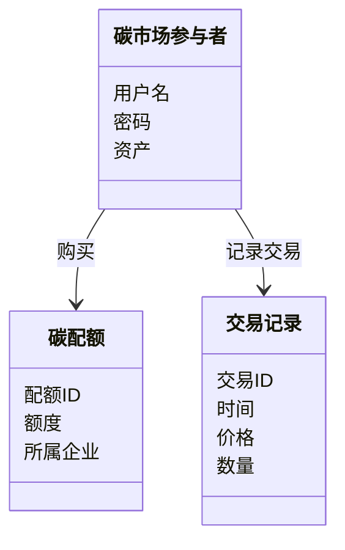
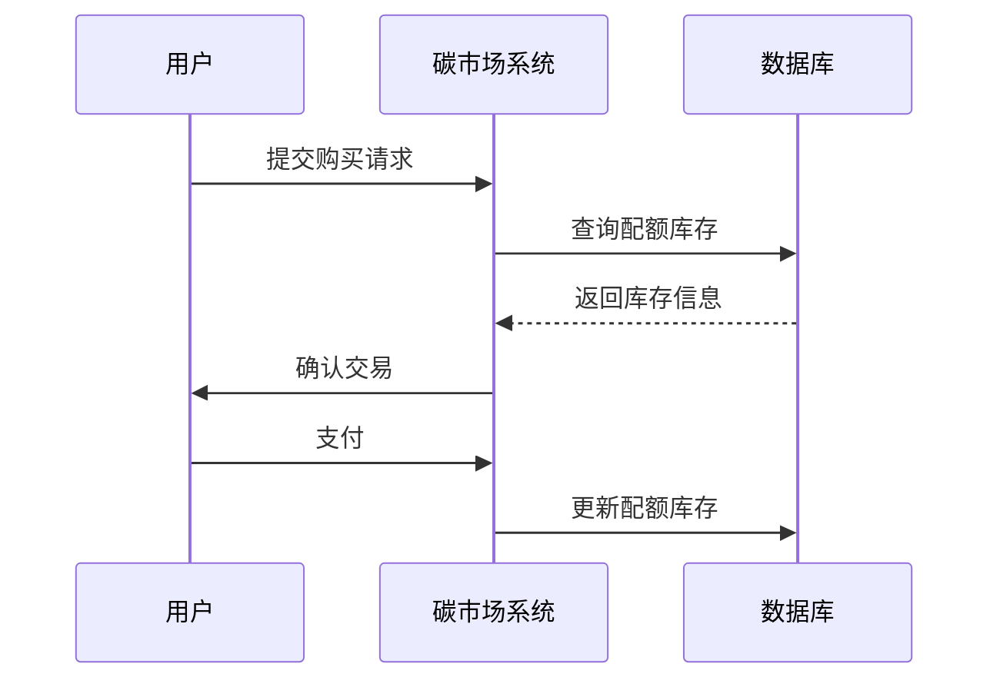

                 


# 碳排放权交易市场的价格形成机制研究

> **关键词**：碳排放权交易、价格形成机制、供需模型、数学模型、系统架构

> **摘要**：  
碳排放权交易市场是全球应对气候变化的重要机制之一，其价格形成机制是市场运行的核心。本文从碳排放权交易的背景与概述出发，深入分析价格形成机制的理论基础、影响因素及数学模型，结合实际案例探讨其在系统中的应用。通过系统分析与架构设计，结合项目实战，揭示碳排放权交易市场价格形成机制的关键环节，为相关研究和实践提供理论与实践参考。

---

## 第1章 碳排放权交易市场的背景与概述

### 1.1 碳排放权交易的起源与发展

#### 1.1.1 碳排放权交易的起源  
碳排放权交易（Carbon Emission Trading，简称CET）起源于20世纪末，是为应对全球气候变化而产生的环境经济政策工具。1997年《京都议定书》的签署标志着碳排放权交易的正式起步，各国开始通过市场机制控制温室气体排放。

#### 1.1.2 碳排放权交易的全球发展现状  
目前，全球主要碳市场包括欧盟碳市场（EU ETS）、美国区域碳市场（如RGGI和WCI）以及中国的全国碳市场。这些市场的运行模式和监管机制各有特点，但核心目标一致：通过价格机制实现减排目标。

#### 1.1.3 碳排放权交易的基本概念与特点  
碳排放权交易是指政府或监管机构向企业分配碳排放配额，企业可通过交易市场买卖配额以满足减排目标。其特点包括：  
1. **市场驱动**：通过价格信号激励企业减排。  
2. **灵活性**：企业可根据成本最小化原则选择减排或购买配额。  
3. **政策支持**：政府通过总量控制确保减排目标的实现。  

---

### 1.2 碳排放权交易市场的基本理论

#### 1.2.1 碳排放权交易的经济学基础  
碳排放权交易是基于环境经济学中的外部性理论。企业过度排放温室气体产生负外部性，通过市场机制内部化这些成本，从而减少社会损失。

#### 1.2.2 碳排放权交易市场的基本要素  
碳市场的主要要素包括：  
1. **配额分配**：政府分配的碳排放额度。  
2. **交易主体**：企业或机构。  
3. **交易场所**：线上或线下的碳交易所。  
4. **价格机制**：供需决定的碳价。  

#### 1.2.3 碳排放权交易市场的运行机制  
碳市场的运行机制包括配额分配、交易、履约和监管四个环节。企业通过交易配额，实现减排目标或经济效益最大化。

---

### 1.3 碳排放权交易市场的意义与作用

#### 1.3.1 碳排放权交易对环境保护的作用  
碳市场通过经济手段激励企业减排，降低整体碳排放成本，促进环境质量改善。

#### 1.3.2 碳排放权交易对经济发展的促进作用  
碳市场推动绿色技术创新，促进产业结构优化，创造新的经济增长点。

#### 1.3.3 碳排放权交易对全球气候变化治理的贡献  
碳市场是全球气候治理的重要工具，通过市场机制实现低成本减排，推动国际气候合作。

---

## 第2章 碳排放权交易市场的价格形成机制

### 2.1 碳排放权交易市场的价格形成理论

#### 2.1.1 碳排放权交易市场的供需模型

**需求曲线**：企业对碳配额的需求取决于减排成本和碳价格。  
$$ Q_d = Q_d(P) $$
其中，$P$是碳价格，$Q_d$是需求量。

**供给曲线**：企业出售碳配额的供给量取决于减排收益和碳价格。  
$$ Q_s = Q_s(P) $$

**均衡价格**：供需曲线的交点即为碳价格的均衡点。  
$$ P^* = P(Q_d = Q_s) $$

#### 2.1.2 碳排放权交易市场的均衡价格理论  
碳市场的均衡价格由总供给和总需求决定。政府通过设定总量目标（cap）影响供给，企业通过交易影响需求，最终形成均衡价格。

#### 2.1.3 碳排放权交易市场的价格弹性分析  
价格弹性反映了碳价格变动对供需量的影响。弹性越大，价格变动对供需的影响越大。

---

### 2.2 碳排放权交易市场的价格影响因素

#### 2.2.1 宏观经济因素对碳价格的影响  
经济增长、能源价格波动等宏观经济因素直接影响碳配额的需求和供给。

#### 2.2.2 政策因素对碳价格的影响  
政府政策（如配额分配、税收）对碳价格有显著影响。例如，配额收紧会推高碳价格。

#### 2.2.3 市场供需变化对碳价格的影响  
市场供需失衡会导致碳价格波动。例如，需求超过供给时，碳价格上涨。

---

### 2.3 碳排放权交易市场的价格预测模型

#### 2.3.1 碳价格预测模型的建立  
基于历史数据，构建碳价格预测模型。常用模型包括ARIMA和随机森林。

#### 2.3.2 碳价格预测模型的验证与优化  
通过历史数据验证模型准确性，并通过参数调优优化预测效果。

#### 2.3.3 碳价格预测模型的实际应用  
企业可利用预测模型优化碳配额持有量，降低履约成本。

---

## 第3章 碳排放权交易市场的核心概念与联系

### 3.1 碳排放权交易市场的核心概念

#### 3.1.1 碳配额  
碳配额是政府分配给企业的排放额度，企业可买卖配额以满足减排目标。

#### 3.1.2 碳信用  
碳信用是企业通过减排项目产生的额外减排量，可进入碳市场交易。

#### 3.1.3 碳价格  
碳价格是碳配额或碳信用的市场价格，由供需关系决定。

---

## 第4章 碳排放权交易市场的系统分析与架构设计

### 4.1 问题场景介绍  
以某地区碳市场为例，分析系统的功能需求和架构设计。

### 4.2 系统功能设计

#### 4.2.1 领域模型（Mermaid 类图）  


#### 4.2.2 系统架构设计（Mermaid 架构图）  


### 4.3 系统接口设计与交互流程（Mermaid 序列图）  


---

## 第5章 碳排放权交易市场的项目实战

### 5.1 环境安装

```bash
pip install numpy pandas matplotlib
```

### 5.2 核心代码实现

```python
import numpy as np
import pandas as pd
from sklearn.ensemble import RandomForestRegressor

# 示例数据加载
data = pd.read_csv('carbon_price.csv')

# 特征工程
features = data[['demand', 'supply', 'policy']]
target = data['price']

# 模型训练
model = RandomForestRegressor(n_estimators=100)
model.fit(features, target)

# 预测
new_features = [[100, 200, 'tight']]
predicted_price = model.predict(new_features)
print(f'预测碳价格：{predicted_price[0]}')
```

### 5.3 案例分析与解读  
以欧盟碳市场为例，分析政策变化对碳价格的影响。通过数据拟合，验证模型的准确性。

### 5.4 项目小结  
总结项目实施的经验与教训，提出改进建议。

---

## 第6章 碳排放权交易市场的最佳实践与展望

### 6.1 最佳实践 tips  
- 定期更新模型参数，确保预测准确性。  
- 加强政策研究，及时调整交易策略。  

### 6.2 小结  
碳排放权交易市场的价格形成机制是复杂系统工程，需结合经济学理论和系统设计方法。

### 6.3 注意事项  
- 数据质量影响模型准确性，需谨慎处理数据。  
- 政策变化可能影响市场运行，需实时跟踪。  

### 6.4 拓展阅读  
推荐阅读《碳市场经济学》和《环境经济学导论》。

---

## 结语  
碳排放权交易市场的价格形成机制研究对实现全球气候变化治理具有重要意义。未来，随着技术进步和政策完善，碳市场将发挥更大作用。

---

**作者**：AI天才研究院/AI Genius Institute & 禅与计算机程序设计艺术 /Zen And The Art of Computer Programming

