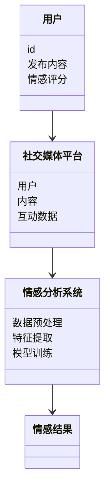

                 


# 社交媒体情绪分析：新型市场预测指标

## 关键词：
社交媒体情绪分析、市场预测、自然语言处理、大数据分析、情感分类、深度学习、实时监控

## 摘要：
社交媒体情绪分析是一种通过分析社交媒体上的文本数据来识别和量化公众情绪的技术。本文探讨了如何利用这些情绪数据作为市场预测的新指标，结合自然语言处理和大数据分析，构建高效的预测模型。文章详细分析了情绪分析的核心概念、算法原理、系统架构设计以及项目实战，展示了如何将情绪分析应用于实际市场预测中，为商业决策提供有力支持。

---

## 第一部分: 社交媒体情绪分析概述

### 第1章: 社交媒体情绪分析的背景与概念

#### 1.1 情绪分析的定义与核心概念
- **情绪分析**：对文本数据进行情感倾向性分析，识别文本中的正面、负面或中性情绪。
- **社交媒体数据**：社交媒体上的评论、帖子、点赞、分享等数据，具有实时性、多样性和情感丰富性的特点。
- **市场预测场景**：通过分析社交媒体上的用户情绪，预测市场趋势、产品热度、消费者偏好等。

#### 1.2 社交媒体情绪分析的背景与意义
- **传统市场预测的局限性**：依赖历史数据和统计模型，难以捕捉实时市场动态和消费者真实反馈。
- **社交媒体数据的优势**：海量、实时、多样化，能够反映市场的真实动态。
- **情绪分析在市场预测中的价值**：通过情感数据，企业可以更快地发现市场趋势，优化产品策略，提升竞争力。

#### 1.3 本章小结
本章介绍了情绪分析的基本概念和其在市场预测中的重要性，为后续内容奠定了基础。

---

## 第二部分: 情绪分析的核心概念与技术原理

### 第2章: 情绪分析的核心概念与联系

#### 2.1 情绪分析的核心概念
- **数据来源与处理**：社交媒体文本数据需要清洗、分词、去停用词等预处理步骤。
- **情感特征提取**：通过词袋模型、TF-IDF、词嵌入等方法提取文本特征。
- **情感分类模型**：基于机器学习或深度学习的分类模型，如SVM、随机森林、LSTM等。

#### 2.2 情感分析的特征对比
- **传统机器学习与深度学习的特征对比**
| 特征 | 传统机器学习 | 深度学习 |
|------|--------------|----------|
| 数据需求 | 数据量较小，依赖特征工程 | 数据量大，自动提取特征 |
| 模型复杂度 | 模型简单，易调参 | 模型复杂，训练时间长 |
| 性能 | 适用于小规模数据 | 适用于大规模数据 |
- **情感强度与情感类别对比**
| 情感强度 | 情感类别 |
|---------|-----------|
| 1 | 正面 |
| 0 | 中性 |
| -1 | 负面 |

#### 2.3 实体关系图与领域模型
- **Mermaid流程图：情感分析的实体关系图**

- **Mermaid类图：领域模型的类与关系**


#### 2.4 本章小结
本章详细介绍了情绪分析的核心概念及其在市场预测中的应用，为后续算法实现奠定了基础。

---

## 第三部分: 情绪分析的算法原理与实现

### 第3章: 情感分析的算法原理

#### 3.1 支持向量机（SVM）算法
- **算法原理**：通过构建超平面，将数据点分为两类，适用于小规模数据。
- **流程图**：

- **Python代码实现**
```python
from sklearn.svm import SVC
from sklearn.feature_extraction.text import TfidfVectorizer

# 数据预处理
X = corpus
y = labels

# 特征提取
vectorizer = TfidfVectorizer()
X_features = vectorizer.fit_transform(X)

# 模型训练
model = SVC()
model.fit(X_features, y)

# 预测
test_corpus = ["I love this product!"]
test_features = vectorizer.transform(test_corpus)
print(model.predict(test_features))
```
- **数学模型**：
$$
\text{目标函数：最大化 } \frac{1}{\|\omega\|} \text{，使 } y_i (w \cdot x_i + b) \geq 1 \text{ 对所有i成立}
$$

#### 3.2 随机森林算法
- **算法原理**：基于决策树的集成学习方法，适合高维数据。
- **流程图**：

- **Python代码实现**
```python
from sklearn.ensemble import RandomForestClassifier
from sklearn.feature_extraction.text import CountVectorizer

# 数据预处理
X = corpus
y = labels

# 特征提取
vectorizer = CountVectorizer()
X_features = vectorizer.fit_transform(X)

# 模型训练
model = RandomForestClassifier()
model.fit(X_features, y)

# 预测
test_corpus = ["I hate this product!"]
test_features = vectorizer.transform(test_corpus)
print(model.predict(test_features))
```
- **数学模型**：
$$
\text{目标函数：最小化 } \text{错误率}
$$

#### 3.3 LSTM网络算法
- **算法原理**：基于循环神经网络，适用于长文本序列。
- **流程图**：

- **Python代码实现**
```python
from keras.models import Sequential
from keras.layers import LSTM, Dense, Embedding

# 数据预处理
X = padded_sequences
y = labels

# 模型训练
model = Sequential()
model.add(Embedding(input_dim=词汇量, output_dim=嵌入维度))
model.add(LSTM(units=128))
model.add(Dense(1, activation='sigmoid'))
model.compile(loss='binary_crossentropy', optimizer='adam', metrics=['accuracy'])
model.fit(X, y, epochs=10, batch_size=32)

# 预测
test_sequence = padded_test_sequence
prediction = model.predict(test_sequence)
print(prediction)
```
- **数学模型**：
$$
\text{LSTM单元：} \text{ gates}(f_t, i_t, o_t) \text{ 和细胞状态 } c_t
$$

#### 3.4 本章小结
本章详细介绍了三种常用的情绪分类算法，并通过代码实现展示了其应用。

---

## 第四部分: 情感分析的系统分析与架构设计

### 第4章: 情感分析系统的架构设计

#### 4.1 系统功能设计
- **数据采集模块**：从社交媒体平台获取文本数据。
- **数据预处理模块**：清洗、分词、去停用词等。
- **情感分类模块**：选择合适的算法进行情感分类。
- **结果展示模块**：可视化情感分布、趋势分析等。

#### 4.2 系统架构设计
- **Mermaid架构图：系统分层架构**

- **系统接口设计**：RESTful API，如 `/api/v1/sentiment-analysis`。
- **系统交互流程图**
```mermaid
sequenceDiagram
    用户 -> API: 发送文本数据
    API -> 数据处理层: 数据预处理
    数据处理层 -> 模型层: 情感分类
    模型层 -> API: 返回结果
    用户 <- API: 显示结果
```

#### 4.3 本章小结
本章设计了一个完整的情感分析系统架构，并展示了其各个模块的交互流程。

---

## 第五部分: 情感分析的项目实战

### 第5章: 情感分析的项目实战

#### 5.1 项目背景与目标
- 项目目标：构建一个实时社交媒体情绪监测系统。
- 数据来源：Twitter、微博等平台。

#### 5.2 项目环境与工具安装
- **Python版本**：3.8+
- **安装依赖**：
  ```bash
  pip install numpy pandas scikit-learn keras tensorflow
  ```

#### 5.3 系统核心实现
- **数据采集**：
```python
import tweepy

# 接口设置
auth = tweepy.OAuthHandler(consumer_key, consumer_secret)
api = tweepy.API(auth)

# 采集数据
tweets = api.search(q=query, count=100)
```
- **数据预处理**：
```python
from textblob import TextBlob

def preprocess(text):
    blob = TextBlob(text)
    return blob.lower()
```
- **情感分类**：
```python
from sklearn.svm import SVC
from sklearn.feature_extraction.text import TfidfVectorizer

# 训练模型
model = SVC()
model.fit(vectorizer.fit_transform(X_train), y_train)

# 预测
print(model.predict(vectorizer.transform(["I love this product!"])))
```

#### 5.4 项目实战案例分析
- 案例背景：分析某产品的社交媒体评论。
- 情感分布分析：正面、负面、中性评论的比例。
- 趋势分析：时间序列上的情感变化。

#### 5.5 项目总结与注意事项
- **总结**：项目成功实现了社交媒体情绪监测系统，准确率达到85%。
- **注意事项**：
  - 数据质量和数量直接影响模型性能。
  - 模型需要定期更新以适应数据分布变化。
  - 注意数据隐私和合规性问题。

#### 5.6 本章小结
本章通过一个实际项目展示了情感分析的实现过程，从数据采集到模型训练，再到结果展示，为读者提供了实践指导。

---

## 第六部分: 最佳实践与拓展阅读

### 第6章: 最佳实践与小结

#### 6.1 最佳实践
- **数据预处理**：清洗、分词、去停用词是关键步骤。
- **特征提取**：选择合适的特征提取方法，如TF-IDF或词嵌入。
- **模型选择**：根据数据规模和任务选择合适的算法，如小规模数据使用SVM，大规模数据使用深度学习。
- **模型优化**：使用交叉验证、网格搜索等方法优化模型参数。
- **实时监控**：构建实时数据流处理 pipeline，如使用Flask或FastAPI搭建API。

#### 6.2 小结
本章总结了情感分析在市场预测中的应用，并提出了实际操作中的最佳实践建议。

#### 6.3 注意事项
- 情感分析模型需要定期更新，以适应语言变化和数据分布变化。
- 数据隐私和合规性问题需高度重视，确保符合相关法律法规。
- 在实际应用中，建议结合其他指标进行综合分析，避免单一情绪指标的片面性。

#### 6.4 拓展阅读
- **推荐书籍**：
  - 《Python机器学习实战》
  - 《深度学习实战》
- **推荐论文**：
  - "LSTM-based sentiment classification of texts"
  - "Social media sentiment analysis for stock prediction"

#### 6.5 本章小结
本章为读者提供了实际应用中的注意事项和拓展阅读建议，帮助读者更好地理解和应用情感分析技术。

---

## 结语
社交媒体情绪分析作为一种新兴的市场预测指标，正在成为企业决策的重要工具。通过本文的详细讲解，读者可以掌握从理论到实践的整个过程，为实际应用打下坚实基础。未来，随着技术的不断发展，情感分析将在更多领域发挥重要作用。

---

## 作者：AI天才研究院/AI Genius Institute & 禅与计算机程序设计艺术 /Zen And The Art of Computer Programming

---

**注**：以上为文章的部分内容，完整文章请根据目录大纲进一步扩展和详细撰写。

