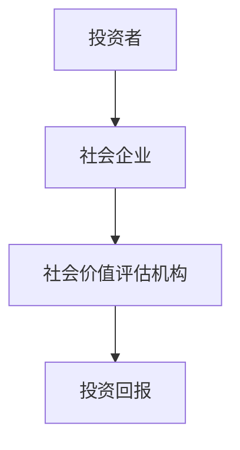

                 


# 社会影响力投资：追求双重回报的策略

> 关键词：社会影响力投资、双重回报、社会价值、投资策略、可持续发展

> 摘要：社会影响力投资是一种结合了财务回报与社会价值的投资方式，旨在通过投资社会企业或公益项目，实现经济效益与社会效益的双重目标。本文将从社会影响力投资的核心概念、算法原理、系统架构、项目实战等方面展开分析，为投资者和社会企业提供理论支持与实践指导。

---

## 第一部分: 社会影响力投资的背景与核心概念

### 第1章: 社会影响力投资的定义与背景

#### 1.1 什么是社会影响力投资
- **社会影响力投资的定义**：社会影响力投资是指通过投资于社会企业或公益项目，以实现财务回报和社会价值双重目标的投资方式。
- **社会影响力投资的核心要素**：
  - 投资目标：追求财务回报和社会价值的双重目标。
  - 投资对象：社会企业、公益项目等。
  - 投资方式：股权投资、债权投资、捐赠等。

#### 1.2 社会影响力投资的起源与发展
- **社会影响力投资的历史演变**：
  - 20世纪70年代：社会影响力投资的概念初步形成，关注于企业社会责任。
  - 21世纪：全球范围内社会影响力投资快速发展，成为可持续发展的重要组成部分。
- **全球社会影响力投资的现状**：
  - 美国、欧洲等发达国家和地区已形成成熟的市场体系。
  - 中国近年来快速发展，社会影响力投资逐渐成为资本市场的重要组成部分。

### 第2章: 社会影响力投资的理论基础

#### 2.1 社会价值的定义与测量
- **社会价值的内涵**：
  - 社会价值是指投资于社会企业或公益项目所创造的社会效益，包括环境保护、教育、医疗、就业等方面。
- **社会价值的测量指标**：
  - 环境影响：如碳排放减少量。
  - 社会影响：如就业机会、贫困减少等。
  - 治理效果：如企业合规性、透明度等。

#### 2.2 双重回报的实现机制
- **财务回报与社会回报的平衡**：
  - 投资者需要在追求财务回报的同时，关注社会价值的实现。
  - 社会影响力投资的收益分配需要平衡各方利益，确保社会价值的实现。

---

## 第二部分: 社会影响力投资的核心概念与联系

### 第3章: 社会影响力投资的核心要素

#### 3.1 社会影响力投资的主体
- **投资者**：包括个人投资者、机构投资者等。
- **社会企业**：以社会价值为目标的企业。
- **政府与非营利组织**：提供政策支持和资金支持。

#### 3.2 社会影响力投资的核心要素对比表
| 核心要素       | 描述                                         |
|----------------|----------------------------------------------|
| 投资目标       | 追求财务回报和社会价值的双重目标           |
| 投资对象       | 社会企业、公益项目等                         |
| 投资方式       | 股权投资、债权投资、捐赠等                   |

### 第4章: 社会影响力投资的系统架构

#### 4.1 社会影响力投资的系统构成
- **投资者决策系统**：投资者根据社会价值评估结果做出投资决策。
- **社会价值评估系统**：评估机构对投资项目进行社会价值评估。
- **投资项目管理系统**：对投资项目进行全生命周期管理。

#### 4.2 社会影响力投资的ER实体关系图
```mermaid
er
actor: 投资者
actor: 社会企业
actor: 评估机构
```

---

## 第三部分: 社会影响力投资的算法原理

### 第5章: 社会影响力投资的核心算法

#### 5.1 社会价值的量化模型
- **多目标优化模型**：
  - 通过数学模型实现社会价值与财务回报的优化平衡。
  - 示例：最大化投资回报率，同时最大化社会影响力。

#### 5.2 社会影响力投资的数学模型
$$ \text{最大化} \quad \text{投资回报率} $$
$$ \text{最大化} \quad \text{社会影响力} $$

#### 5.3 社会影响力投资的算法流程


---

## 第四部分: 社会影响力投资的系统分析与架构设计

### 第6章: 社会影响力投资的系统架构

#### 6.1 系统功能设计
- **领域模型**：
  - 投资者：发起投资需求。
  - 社会企业：提供投资项目。
  - 评估机构：评估社会价值。

#### 6.2 系统架构设计


---

## 第五部分: 社会影响力投资的项目实战

### 第7章: 社会影响力投资的实战案例

#### 7.1 环境安装
- 需要安装Python、Jupyter Notebook、Mermaid等工具。

#### 7.2 核心代码实现
```python
# 社会影响力投资的多目标优化模型
import numpy as np

def social_influence_investment():
    # 定义目标函数
    def objective(x):
        return -x[0] - x[1]

    # 约束条件
    constraints = [{'type': 'ineq', 'fun': lambda x: x[0] + x[1] - 1}]

    # 使用 scipy.optimize 求解
    from scipy.optimize import minimize
    res = minimize(objective, [0.5, 0.5], constraints=constraints)
    return res

# 运行模型
result = social_influence_investment()
print("最优解：", result.x)
```

#### 7.3 案例分析
- **案例：教育科技企业投资**
  - 投资金额：100万元。
  - 投资目标：实现教育公平，同时获得财务回报。
  - 社会价值：提供在线教育平台，覆盖贫困地区的儿童。

---

## 第六部分: 社会影响力投资的最佳实践与小结

### 第8章: 最佳实践与小结

#### 8.1 实践建议
- 投资者需要关注社会价值的实现。
- 社会企业需要明确社会目标。
- 政府需要提供政策支持。

#### 8.2 小结
社会影响力投资是一种实现双重回报的投资方式，能够帮助投资者和社会企业实现可持续发展。

---

作者：AI天才研究院/AI Genius Institute & 禅与计算机程序设计艺术 /Zen And The Art of Computer Programming

