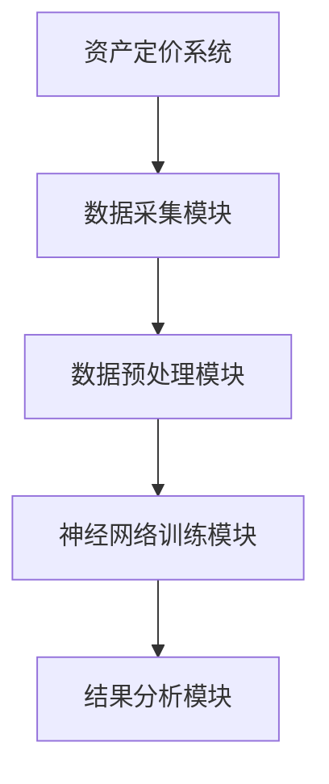
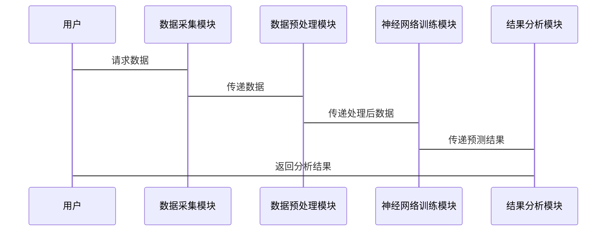

                 


# 神经网络模型在资产定价中的应用研究

> 关键词：神经网络模型，资产定价，金融时间序列，深度学习，机器学习，数学建模

> 摘要：本文深入探讨了神经网络模型在资产定价中的应用，从背景介绍、核心概念、算法原理到系统架构设计，再到项目实战，全面分析了神经网络模型在资产定价中的优势、挑战及解决方案。通过实际案例分析，本文展示了如何利用神经网络模型构建高效的资产定价系统，并提出了未来研究方向及注意事项。

---

## 第一部分: 背景介绍

### 第1章: 神经网络模型与资产定价的背景介绍

#### 1.1 资产定价的基本概念

##### 1.1.1 资产定价的定义与核心问题
资产定价是指通过对资产的内在价值和市场价值进行评估，确定其合理价格的过程。核心问题是如何准确预测资产价格，以支持投资决策。传统资产定价模型（如CAPM、APT）依赖于假设和简化，但在实际市场中面临诸多挑战。

##### 1.1.2 资产定价的传统模型与方法
- **CAPM**：通过无风险利率、市场风险溢价和贝塔系数计算资产的预期收益。
- **APT**：基于多个因素解释资产收益，但需要明确的因素选择。
- **因子模型**：基于多个因子对资产收益进行建模。

##### 1.1.3 神经网络模型在资产定价中的应用背景
传统模型在复杂金融市场中的表现有限，而神经网络模型具有非线性特征提取和自动学习能力，能够处理复杂的数据模式。

---

#### 1.2 神经网络模型的基本概念

##### 1.2.1 神经网络的定义与基本结构
神经网络是由人工神经元构成的计算模型，通过多层结构模拟人脑的神经网络。其基本结构包括输入层、隐藏层和输出层。

##### 1.2.2 神经网络的核心要素与属性
- **输入层**：接收外部数据输入。
- **隐藏层**：通过非线性变换提取特征。
- **输出层**：生成最终的预测结果。
- **激活函数**：引入非线性，如ReLU、Sigmoid。
- **权重与偏置**：模型参数，通过训练优化。

##### 1.2.3 神经网络与传统统计模型的区别
神经网络能够自动提取特征，无需假设数据分布，而传统模型依赖于明确的假设和特征选择。

---

#### 1.3 神经网络模型在金融领域的应用现状

##### 1.3.1 神经网络在金融时间序列分析中的应用
- 用于股票价格预测、波动率分析等。
- 通过LSTM等模型处理时间序列数据。

##### 1.3.2 神经网络在风险评估与管理中的应用
- 用于信用评分、风险定价等。
- 通过深度学习模型识别潜在风险因素。

##### 1.3.3 神经网络在资产定价中的研究进展
- 研究集中在特征提取、非线性建模和实时预测等方面。
- 神经网络模型在高频交易中的应用逐渐增多。

---

## 第二部分: 资产定价与神经网络模型的核心概念

### 第2章: 资产定价与神经网络模型的核心概念

#### 2.1 资产定价的核心要素

##### 2.1.1 资产的内在价值与市场价值
- 内在价值：资产的固有属性决定的价值。
- 市场价值：市场供需关系决定的价值。

##### 2.1.2 资产定价的基本假设与理论框架
- 市场有效性和理性投资者假设。
- 风险与收益的均衡关系。

##### 2.1.3 资产定价的关键影响因素
- 宏观经济指标（GDP、利率等）。
- 行业因素（行业景气度等）。
- 公司基本面（利润、现金流等）。

---

#### 2.2 神经网络模型的核心原理

##### 2.2.1 神经网络的输入输出关系
神经网络通过输入层接收数据，经过隐藏层处理后生成输出结果。

##### 2.2.2 神经网络的训练与优化过程
- **前向传播**：输入数据通过网络计算出输出结果。
- **反向传播**：计算误差并优化权重。
- **损失函数**：衡量预测值与真实值的差距。

##### 2.2.3 神经网络的特征提取能力
神经网络能够自动提取数据中的非线性特征，无需手动特征工程。

---

#### 2.3 资产定价与神经网络模型的联系

##### 2.3.1 神经网络模型在资产定价中的优势
- 能够处理高维、非线性数据。
- 能够捕捉复杂市场关系。

##### 2.3.2 神经网络模型与传统资产定价模型的对比
| 特性                | 传统模型          | 神经网络模型      |
|---------------------|-------------------|------------------|
| 数据假设            | 需要明确假设       | 自动学习数据模式   |
| 特征工程            | 需要手动提取       | 自动提取特征       |
| 鲁棒性              | 较低              | 较高              |

##### 2.3.3 神经网络模型在资产定价中的潜在挑战
- 模型的黑箱特性导致解释性较差。
- 训练数据的质量对模型性能影响较大。

---

## 第三部分: 神经网络模型的算法原理

### 第3章: 神经网络模型的算法原理

#### 3.1 神经网络的基本算法

##### 3.1.1 前馈神经网络的算法流程
1. 输入数据经过网络计算出预测值。
2. 计算预测值与真实值的误差。
3. 通过反向传播优化权重。

##### 3.1.2 反向传播算法的原理
- **损失函数**：衡量预测值与真实值的差距。
- **梯度下降**：优化模型权重。

##### 3.1.3 激活函数的作用与选择
- **ReLU**：常用于隐藏层。
- **Sigmoid**：用于输出层（概率预测）。
- **Tanh**：用于隐藏层。

---

#### 3.2 神经网络的优化与调优

##### 3.2.1 梯度下降的优化方法
- **随机梯度下降**：适用于大数据集。
- **批量梯度下降**：优化效果更稳定。

##### 3.2.2 正则化技术的应用
- **L1/L2正则化**：防止过拟合。
- **Dropout**：随机关闭部分神经元。

##### 3.2.3 网络结构的调优策略
- 增加隐藏层：提高模型复杂度。
- 调整神经元数量：平衡模型容量。

---

#### 3.3 神经网络模型的数学公式

##### 3.3.1 神经网络的输入输出关系公式
$$ y = \sigma(w x + b) $$
其中，$x$ 是输入，$w$ 是权重，$b$ 是偏置，$\sigma$ 是激活函数。

##### 3.3.2 损失函数的定义与计算
$$ \text{损失} = \frac{1}{n} \sum_{i=1}^{n} (y_i - \hat{y}_i)^2 $$

##### 3.3.3 梯度下降的数学推导
$$ w = w - \eta \frac{\partial L}{\partial w} $$
其中，$\eta$ 是学习率，$\frac{\partial L}{\partial w}$ 是损失函数对权重的导数。

---

## 第四部分: 神经网络模型在资产定价中的系统架构设计

### 第4章: 神经网络模型在资产定价中的系统架构设计

#### 4.1 系统需求分析

##### 4.1.1 资产定价系统的功能需求
- 数据采集：获取资产的历史价格、财务数据等。
- 模型训练：构建并训练神经网络模型。
- 预测与分析：生成价格预测并分析结果。

##### 4.1.2 神经网络模型的输入输出
- 输入：资产的历史价格、财务指标等。
- 输出：资产的预测价格。

---

#### 4.2 系统功能设计

##### 4.2.1 数据预处理
- 数据清洗：处理缺失值、异常值。
- 数据标准化：归一化处理。

##### 4.2.2 神经网络模型训练
- 网络结构设计：选择隐藏层数、神经元数量。
- 模型训练：使用训练数据优化权重。

##### 4.2.3 结果分析
- 预测结果对比：与实际价格对比。
- 模型评估：计算误差指标（MAE、MSE等）。

---

#### 4.3 系统架构设计

##### 4.3.1 系统架构图


##### 4.3.2 系统接口设计
- 数据接口：与数据库交互。
- 模型接口：与训练模块交互。

##### 4.3.3 系统交互流程


---

## 第五部分: 项目实战

### 第5章: 项目实战

#### 5.1 项目介绍
本项目旨在利用神经网络模型实现资产定价，通过实际案例分析模型的应用效果。

---

#### 5.2 核心实现

##### 5.2.1 环境安装
- 安装Python、Keras、TensorFlow。

##### 5.2.2 系统核心实现代码
```python
import numpy as np
from tensorflow.keras.models import Sequential
from tensorflow.keras.layers import Dense, LSTM

# 数据准备
X_train = ...  # 输入特征
y_train = ...  # 输出标签

# 模型构建
model = Sequential()
model.add(LSTM(64, input_shape=(timesteps, features)))
model.add(Dense(1, activation='sigmoid'))

# 模型编译
model.compile(loss='binary_crossentropy', optimizer='adam', metrics=['accuracy'])

# 模型训练
model.fit(X_train, y_train, epochs=10, batch_size=32)
```

##### 5.2.3 代码应用解读与分析
- 使用LSTM处理时间序列数据。
- 模型训练后可用于预测资产价格。

---

#### 5.3 实际案例分析
以股票价格预测为例，分析模型的预测结果与实际价格的差异，评估模型的准确性。

---

## 第六部分: 总结与展望

### 第6章: 总结与展望

#### 6.1 总结
神经网络模型在资产定价中的应用具有显著优势，能够处理复杂数据模式，提高预测准确性。

#### 6.2 注意事项
- 数据质量对模型性能影响较大。
- 模型的解释性较差，需结合其他方法进行验证。

#### 6.3 未来研究方向
- 结合强化学习优化资产定价模型。
- 研究多模态数据在资产定价中的应用。

---

## 作者：AI天才研究院/AI Genius Institute & 禅与计算机程序设计艺术/Zen And The Art of Computer Programming

