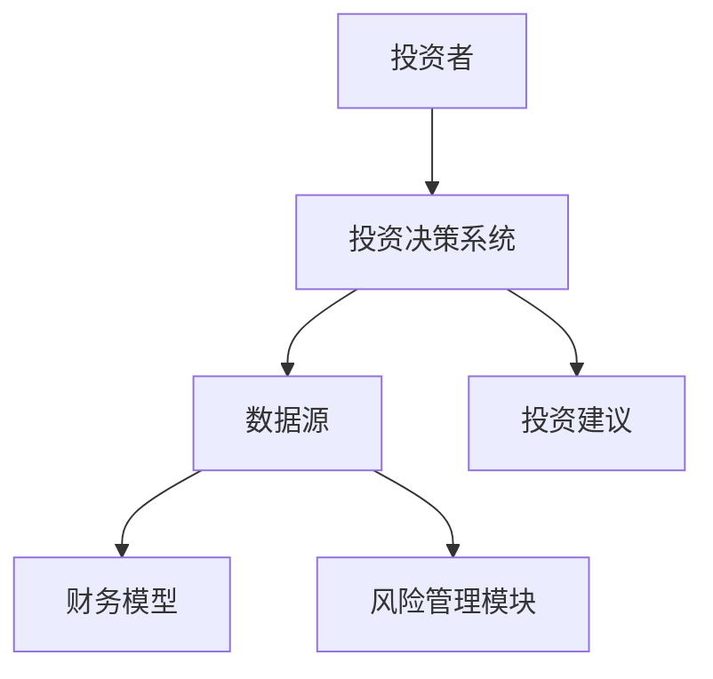

                 

# 私募股权投资：非上市公司的投资机会

---

## 关键词：
私募股权投资，非上市公司，投资机会，财务分析，风险管理，价值创造

---

## 摘要：
本文深入探讨了私募股权投资在非上市公司中的投资机会，分析了私募股权投资的核心概念、运作流程、非上市公司投资的吸引力、行业分布、筛选标准、财务分析、风险评估、退出策略以及实际案例。通过系统性的分析和丰富的图表、数学模型的展示，本文为读者提供了从理论到实践的全面指导，帮助投资者更好地把握非上市公司投资的机遇和挑战。

---

## 目录大纲：
1. [私募股权投资的定义与背景](#私募股权投资的定义与背景)
   - 1.1 私募股权投资的核心概念
   - 1.2 私募股权投资的运作流程
   - 1.3 私募股权投资的参与者
2. [非上市公司投资机会的吸引力](#非上市公司投资机会的吸引力)
   - 2.1 非上市公司投资的定义与特点
   - 2.2 非上市公司投资的主要领域
   - 2.3 非上市公司投资的筛选标准
3. [私募股权投资的核心概念与联系](#私募股权投资的核心概念与联系)
   - 3.1 私募股权投资的核心概念原理
   - 3.2 核心概念属性特征对比表格
   - 3.3 私募股权投资的核心概念ER实体关系图
4. [非上市公司投资的财务分析](#非上市公司投资的财务分析)
   - 4.1 财务报表分析方法
   - 4.2 企业估值模型
   - 4.3 投资回报分析
5. [非上市公司投资的风险管理](#非上市公司投资的风险管理)
   - 5.1 风险识别与评估
   - 5.2 风险控制策略
   - 5.3 风险分散机制
6. [非上市公司投资的退出策略](#非上市公司投资的退出策略)
   - 6.1 退出方式的选择
   - 6.2 退出时机的判断
   - 6.3 退出过程中的法律与税务问题
7. [实际案例分析](#实际案例分析)
   - 7.1 案例背景介绍
   - 7.2 投资决策过程
   - 7.3 投资回报分析
8. [系统架构与项目实战](#系统架构与项目实战)
   - 8.1 系统功能设计
   - 8.2 系统架构图
   - 8.3 系统接口设计
9. [小结与注意事项](#小结与注意事项)
   - 9.1 本文总结
   - 9.2 投资者注意事项
   - 9.3 拓展阅读与实践建议

---

## 正文：

### 1. 私募股权投资的定义与背景

#### 1.1 私募股权投资的核心概念

**私募股权投资**是指通过非公开市场，向未上市公司提供资金支持，并通过长期持有股权，实现资本增值的投资方式。其核心在于通过专业的投资管理和增值服务，帮助被投企业实现增长，最终通过上市或并购等方式退出，获得高额回报。

**私募股权投资的特征**包括：
1. **高风险高回报**：非上市公司投资具有较高的不确定性，但潜在回报也更高。
2. **长期性**：私募股权投资者通常需要持有企业数年，甚至更长时间。
3. **主动性**：投资者不仅仅是提供资金，还积极参与企业战略、管理和增值服务。
4. **定制化**：每个投资案例都有其独特性，需要量身定制投资方案。

#### 1.2 私募股权投资的运作流程

私募股权投资的运作流程可以分为以下几个阶段：

1. **项目筛选与初步尽职调查**：投资者通过行业研究、财务分析等方式筛选潜在投资目标，并进行初步尽职调查。
2. **深入尽职调查**：对企业的财务状况、管理团队、市场前景等进行全面评估。
3. **投资决策**：基于尽职调查结果，决定是否投资，并确定投资金额和条款。
4. **投资执行**：签订投资协议，完成资金交割。
5. **增值服务与监控**：投资者积极参与企业管理，提供战略、财务等支持，并持续监控企业经营状况。
6. **退出策略**：在适当时机通过IPO、并购等方式退出，实现收益。

#### 1.3 私募股权投资的参与者

私募股权投资涉及多方参与者，各自扮演不同的角色：

- **有限合伙人（LP）**：提供资金的主要投资者，承担有限责任。
- **普通合伙人（GP）**：负责管理和决策的核心团队，承担无限责任。
- **目标公司**：接受投资的企业。
- **中介机构**：包括律师事务所、会计师事务所、投行等，提供法律、财务、上市等专业服务。

---

### 2. 非上市公司投资机会的吸引力

#### 2.1 非上市公司投资的定义与特点

非上市公司投资是指将资金投入未上市企业，通过企业成长和增值实现收益。其特点包括：
1. **高增长潜力**：非上市公司通常处于成长阶段，具有较高的增长潜力。
2. **低流动性**：投资后无法在公开市场上快速变现。
3. **高风险**：非上市公司经营不稳定，市场风险较大。

#### 2.2 非上市公司投资的主要领域

私募股权投资者通常关注以下领域的非上市公司：
1. **科技与创新企业**：具有核心技术或创新商业模式的企业。
2. **消费品与服务**：包括消费品牌、电子商务、教育等领域。
3. **医疗健康**：医疗设备、药品研发、医疗服务等。
4. **金融与金融科技**：新兴金融科技公司、创新型金融服务机构。

#### 2.3 非上市公司投资的筛选标准

筛选非上市公司时，投资者通常关注以下因素：
1. **行业前景**：行业是否具有增长潜力。
2. **管理团队**：团队的经验、能力和战略是否可行。
3. **财务状况**：企业的盈利能力、现金流状况、资产负债情况。
4. **市场地位**：企业在市场中的竞争地位。
5. **退出路径**：是否存在明确的上市或并购退出路径。

---

### 3. 私募股权投资的核心概念与联系

#### 3.1 私募股权投资的核心概念原理

私募股权投资通过**投资组合管理**、**风险分散**和**价值创造**实现收益。投资组合管理是指通过分散投资降低风险，同时通过增值服务提升被投企业价值。

#### 3.2 核心概念属性特征对比表格

| 概念          | 投资组合管理 | 风险分散 | 价值创造 |
|---------------|--------------|----------|----------|
| **定义**      | 多种资产配置 | 投资多样化 | 提升企业价值 |
| **目标**      | 最大化收益 | 最小化风险 | 实现增值 |
| **方法**      | 资产配置、动态调整 | 分散投资、对冲 | 改善管理、优化资产 |
| **效果**      | 平衡风险与收益 | 减少损失 | 提高企业竞争力 |

---

### 4. 非上市公司投资的财务分析

#### 4.1 财务报表分析方法

非上市公司投资的财务分析主要基于以下报表：
- **利润表**：评估企业的盈利能力。
- **资产负债表**：评估企业的财务状况和偿债能力。
- **现金流量表**：评估企业的现金流健康状况。

#### 4.2 企业估值模型

常用的非上市公司估值方法包括：
1. **DCF模型（ discounted cash flow model）**：
   - 基于未来现金流的现值计算企业价值。
   - 公式：
     $$
     V = \sum_{t=1}^{n} \frac{CF_t}{(1 + r)^t} + \frac{TV}{(1 + r)^n}
     $$
   - 其中，$CF_t$ 是第t年的现金流，$r$ 是折现率，$TV$ 是终值。

2. **可比公司分析**：
   - 通过与同行业上市公司或可交易股权的对比，确定目标公司的合理估值。

---

### 5. 非上市公司投资的风险管理

#### 5.1 风险识别与评估

私募股权投资者需要识别和评估以下风险：
1. **市场风险**：行业整体波动对企业的冲击。
2. **运营风险**：企业内部管理、供应链等问题。
3. **财务风险**：企业财务状况恶化导致投资损失。
4. **政策风险**：政策变化对企业经营的影响。

#### 5.2 风险控制策略

有效的风险管理策略包括：
1. **分散投资**：通过投资不同行业和阶段的企业降低风险。
2. **加强监控**：定期评估被投企业的经营状况。
3. **增值服务**：通过提供管理支持帮助企业规避风险。

---

### 6. 非上市公司投资的退出策略

#### 6.1 退出方式的选择

常见的退出方式包括：
1. **IPO**：企业上市，投资者通过股票出售实现收益。
2. **并购**：将企业出售给上市公司或大型企业。
3. **回购**：目标公司或第三方回购投资者持有的股权。

#### 6.2 退出时机的判断

退出时机取决于：
1. **市场状况**：整体市场环境是否有利于退出。
2. **企业价值**：是否达到了预期的增值目标。
3. **政策环境**：是否符合相关法规和政策要求。

#### 6.3 退出过程中的法律与税务问题

退出过程中需要考虑的法律与税务问题包括：
1. **税务规划**：合理安排税务以降低负担。
2. **法律合规**：确保退出过程符合相关法律法规。

---

### 7. 实际案例分析

#### 7.1 案例背景介绍

假设某私募基金投资了一家科技公司，该公司处于成长期，具有较高的增长潜力。

#### 7.2 投资决策过程

1. **项目筛选**：通过行业研究和初步尽职调查筛选出目标公司。
2. **深入尽职调查**：评估公司财务状况、管理团队和市场前景。
3. **投资协议**：签订投资协议，确定投资金额和退出条款。

#### 7.3 投资回报分析

通过DCF模型计算目标公司的估值，并与实际投资金额对比，评估投资回报。

---

### 8. 系统架构与项目实战

#### 8.1 系统功能设计

- **数据采集**：收集目标公司的财务数据、市场信息等。
- **数据分析**：使用财务模型进行估值分析。
- **决策支持**：提供投资决策支持和风险预警。

#### 8.2 系统架构图

#### 8.3 系统接口设计

- **输入接口**：接收目标公司数据和市场信息。
- **输出接口**：提供投资建议和风险预警。

---

### 9. 小结与注意事项

#### 9.1 本文总结

本文系统性地介绍了私募股权投资在非上市公司中的投资机会，分析了非上市公司投资的吸引力、筛选标准、财务分析、风险管理、退出策略，并通过实际案例和系统架构设计提供了实践指导。

#### 9.2 投资者注意事项

- **充分尽职调查**：确保投资决策的准确性。
- **分散投资风险**：通过多样化投资降低整体风险。
- **加强增值服务**：通过增值服务提升企业价值。

#### 9.3 拓展阅读与实践建议

- 阅读更多关于私募股权投资的经典书籍和案例。
- 实践中结合具体情况进行灵活调整。

---

## 作者：
作者：AI天才研究院/AI Genius Institute  
合作作者：禅与计算机程序设计艺术/Zen And The Art of Computer Programming  

---

希望这个思考过程和最终的文章结构符合您的要求！如果需要进一步调整或补充，请随时告诉我。

