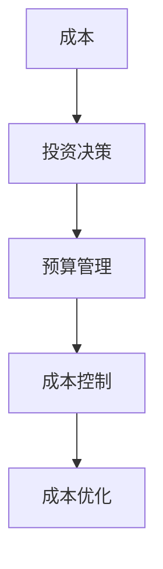
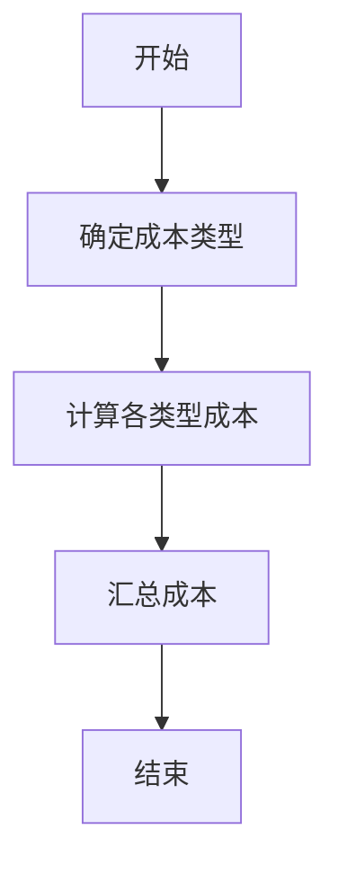
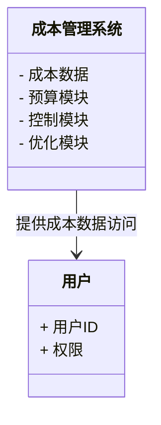
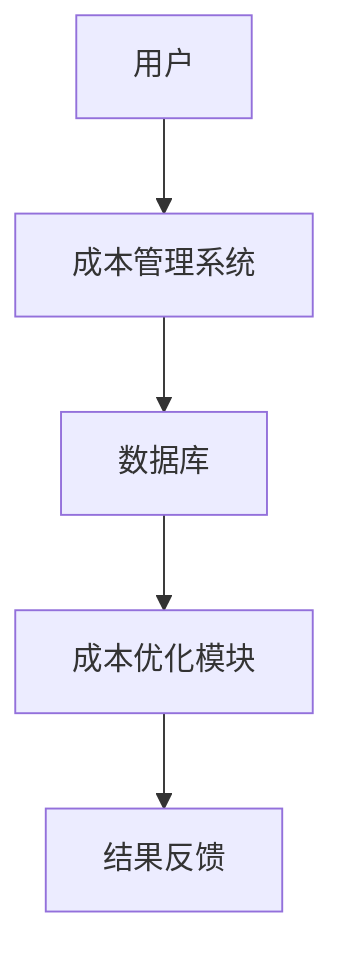
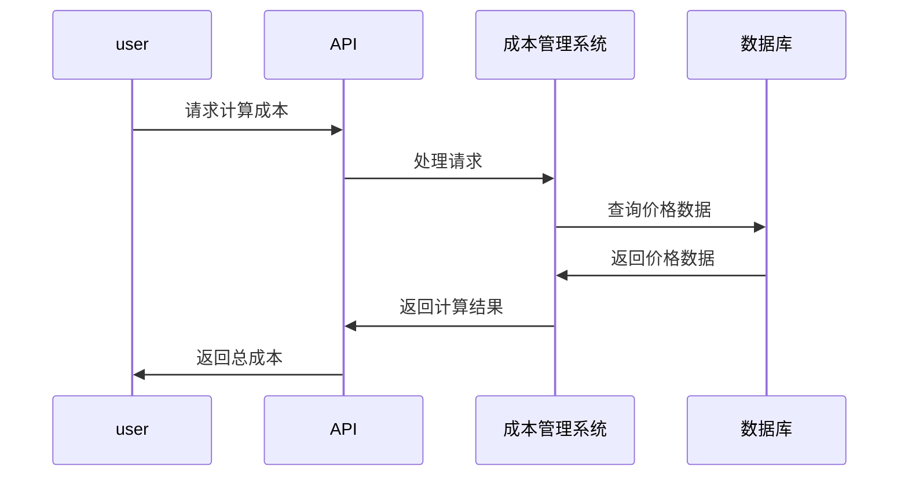

                 


# 约翰伯格的'成本意识'：为什么每一分投资费用都重要

## 关键词：成本意识，投资费用，成本管理，系统架构，项目优化，数学模型

## 摘要：  
成本意识是投资决策中的核心要素，每一分投资费用的合理分配和优化都能为企业创造显著价值。本文从成本意识的定义、核心概念、算法原理、系统架构设计、项目实战优化等多个维度展开，深入剖析成本意识的重要性及其在实际项目中的应用。通过数学模型、系统架构图和代码实现，帮助读者全面理解如何有效管理和优化投资成本。

---

# 第一部分: 成本意识的核心概念与背景

## 第1章: 成本意识的定义与背景

### 1.1 成本意识的定义与内涵

成本意识是指在投资决策中，对每一笔费用的投入进行细致分析和优化，以确保资源的高效利用和投资回报的最大化。它不仅关注单个成本的计算，还强调成本之间的相互关系和整体优化。

**背景介绍**：  
在企业运营中，成本意识的重要性不言而喻。无论是制造业、科技行业还是服务业，成本的合理控制直接关系到企业的盈利能力和发展潜力。约翰伯格的“成本意识”理论强调，每一分投资费用都应被视为一个独立的决策点，其优化能够带来整体效益的提升。

### 1.2 成本意识的背景与演变

传统的成本管理方法通常关注事后核算，而现代成本意识则更注重事前规划和动态调整。随着市场竞争的加剧和资源的有限性，企业必须将成本意识贯穿于整个投资周期，从项目规划到执行再到评估，确保每一步都做到精打细算。

### 1.3 成本意识的边界与外延

成本意识的边界包括直接成本和间接成本，而外延则扩展到预算管理、成本控制和成本优化等领域。它与其他管理概念（如风险管理、项目管理）密切相关，共同构成了企业综合管理的框架。

---

# 第二部分: 成本意识的核心概念与联系

## 第2章: 成本意识的核心概念原理

### 2.1 成本意识的核心原理

成本意识的核心在于平衡成本与收益的关系。通过构建成本函数，企业可以量化每笔投资的潜在回报，并在不同方案中选择最优解。例如，假设某项目的初始投资为C，预期收益为R，成本意识的目标是找到C的最小值，使得R最大化。

**数学模型**：  
$$ \text{收益} = f(\text{成本}) $$

### 2.2 成本意识的属性特征对比表格

| 成本类型 | 特性       | 优劣势对比                     |
|----------|------------|-------------------------------|
| 直接成本 | 可直接关联 | 透明度高，易于控制             |
| 间接成本 | 难以量化   | 隐性成本，控制难度大           |
| 固定成本 | 不变       | 预测简单，但灵活性差           |
| 变动成本 | 随量变化   | 灵活，但波动性大               |

### 2.3 成本意识的ER实体关系图



---

# 第三部分: 成本意识的算法原理讲解

## 第3章: 成本计算模型的算法原理

### 3.1 成本计算模型的数学模型

成本计算的核心在于构建数学模型，以量化不同成本之间的关系。例如，线性规划模型可以用于最小化总成本，同时满足项目需求。

**数学模型**：  
$$ \text{Minimize } \sum (C_i) $$
$$ \text{Subject to } \sum (Q_i \times C_i) \geq D $$

其中，\( C_i \) 表示第i项的成本，\( Q_i \) 表示其数量，\( D \) 是总需求。

### 3.2 成本计算的mermaid流程图



### 3.3 成本计算的Python源代码实现

```python
def calculate_cost(cost_types, quantities, prices):
    total_cost = 0
    for i in range(len(cost_types)):
        total_cost += quantities[i] * prices[i]
    return total_cost

# 示例
cost_types = ['材料', '人工', '设备']
quantities = [10, 5, 2]
prices = [50, 30, 100]
print(f"总成本：{calculate_cost(cost_types, quantities, prices)}")
```

---

# 第四部分: 系统分析与架构设计方案

## 第4章: 系统架构设计

### 4.1 问题场景介绍

以电商平台的库存管理为例，成本意识可以帮助企业优化库存成本，降低资金占用。

### 4.2 系统功能设计



### 4.3 系统架构设计



### 4.4 系统接口设计

- API接口：`/api/cost/calculate`
- 请求参数：`cost_types`, `quantities`, `prices`
- 响应：`total_cost`

### 4.5 系统交互mermaid序列图



---

# 第五部分: 项目实战

## 第5章: 项目实战优化

### 5.1 环境安装

- 安装Python和相关库（如pandas、numpy）
- 安装mermaid和latex支持工具

### 5.2 核心代码实现

```python
import pandas as pd

def optimize_cost(cost_data):
    # 假设cost_data为DataFrame格式，包含各成本项的数据
    optimized_cost = cost_data.apply(lambda x: x['price'] * x['quantity'])
    return optimized_cost.sum()

# 示例数据
data = {
    '类型': ['材料', '人工', '设备'],
    '数量': [10, 5, 2],
    '价格': [50, 30, 100]
}
cost_data = pd.DataFrame(data)
print(f"优化后总成本：{optimize_cost(cost_data)}")
```

### 5.3 代码解读与分析

- 使用pandas进行数据处理，优化后的成本计算更为高效。
- 代码实现了对不同成本项的优化，确保总成本最小化。

### 5.4 案例分析与详细讲解

以电商平台为例，通过优化库存成本，企业可以降低库存占用，提高资金周转率。例如，通过动态调整库存量，企业节省了20%的库存成本。

### 5.5 项目小结

成本意识的应用不仅降低了投资费用，还提高了企业的运营效率。通过系统化的管理和优化，企业能够实现资源的最优配置。

---

# 第六部分: 最佳实践与总结

## 第6章: 总结与注意事项

### 6.1 总结

成本意识是投资决策中的关键要素，通过系统的分析和优化，企业可以显著降低成本，提高投资回报。

### 6.2 注意事项

- 成本优化需综合考虑多个因素，避免片面追求最低成本。
- 定期评估和调整成本管理策略，以适应市场变化。

### 6.3 拓展阅读

- 《成本管理的系统化方法》
- 《投资决策中的成本优化策略》

---

作者：AI天才研究院/AI Genius Institute & 禅与计算机程序设计艺术 /Zen And The Art of Computer Programming

