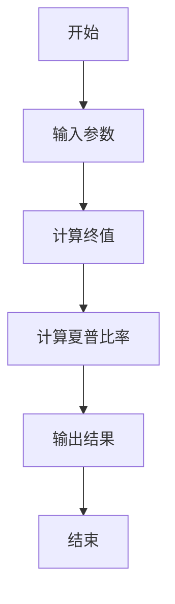
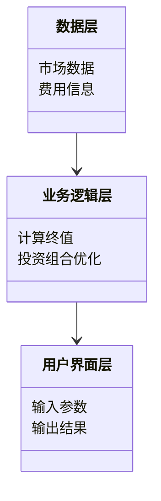

                 


```markdown
# 约翰伯格的低成本投资理念：为什么费用很重要

> 关键词：低成本投资、约翰·伯格、投资费用、指数基金、Vanguard

> 摘要：本文深入探讨了约翰·伯格的低成本投资理念，分析了费用对投资回报的重要性，通过数学模型和系统设计详细解释了低成本投资的原理和实践。

---

# 第一部分: 低成本投资的背景与重要性

## 第1章: 低成本投资的背景与重要性

### 1.1 投资领域的费用问题

#### 1.1.1 投资费用的定义与分类
- 投资费用是指投资者在进行投资过程中需要支付的各种费用，主要包括管理费、托管费、交易费用等。
- 管理费：支付给基金经理的费用，通常按年收取，比例在1%到2%之间。
- 托管费：支付给托管机构的费用，用于保管投资组合的资产。
- 交易费用：包括买卖证券时产生的佣金、印花税等。

#### 1.1.2 费用对投资回报的影响
- 高昂的费用会显著侵蚀投资回报，特别是在长期投资中，费用的累积效应会更加明显。
- 例如，假设两个投资组合，A的年管理费率为1%，B的年管理费率为2%，在长期投资中，费用较高的投资组合回报将受到更大的影响。

#### 1.1.3 投资费用的透明化趋势
- 近年来，投资者越来越关注费用透明化，低成本投资逐渐成为主流。
- 约翰·伯格通过Vanguard公司，推动了低成本指数基金的发展，使得投资者能够以更低的费用获得分散化的投资组合。

### 1.2 约翰·伯格的生平与投资理念

#### 1.2.1 约翰·伯格的生平简介
- 约翰·伯格（John C. Bogle）是美国著名投资者，被誉为“指数基金之父”。
- 1975年，他创立了Vanguard集团，致力于提供低成本的指数基金和投资管理服务。

#### 1.2.2 伯格的低成本投资理念
- 伯格认为，长期投资中，费用是影响投资回报的最重要因素之一。
- 他倡导通过指数基金实现分散投资，避免频繁交易和高昂的管理费用。

#### 1.2.3 伯格与Vanguard的创立
- Vanguard的成立初衷是为投资者提供低成本、透明化的投资工具。
- 伯格通过 Vanguard 推出了全球第一只指数基金，开创了低成本投资的先河。

---

## 第2章: 低成本投资的核心概念

### 2.1 投资费用的构成与影响

#### 2.1.1 投资费用的构成
- 管理费：支付给基金经理的费用，通常以年化比例计算。
- 托管费：支付给托管机构的费用，用于保管投资组合的资产。
- 交易费用：包括佣金、印花税等，通常在交易时发生。

#### 2.1.2 费用对投资回报的影响
- 高费用会降低投资组合的净收益，特别是在长期投资中，费用的累积效应会更加明显。
- 例如，假设两个投资组合，A的年管理费率为1%，B的年管理费率为2%，在30年后的回报中，费用较高的投资组合将显著落后。

#### 2.1.3 费用比率的计算与比较
- 费用比率 = （管理费 + 托管费 + 其他费用）/ 投资组合的资产规模
- 通过比较不同投资组合的费用比率，可以评估其费用的高低。

### 2.2 低成本投资的策略与实践

#### 2.2.1 指数基金的优势
- 指数基金通过跟踪特定指数（如标普500）实现分散化投资。
- 费用低廉，通常管理费率低于1%。

#### 2.2.2 被动投资与主动投资的对比
- 被动投资（指数基金）：费用低，风险分散。
- 主动投资：费用高，但目标是通过精选股票获得超额收益。

#### 2.2.3 低成本投资的长期收益分析
- 长期来看，低成本投资能够为投资者带来更高的净收益。
- 根据研究，主动管理型基金的费用通常高于指数基金，而其超额收益难以持续。

---

## 第3章: 费用对投资回报的数学模型

### 3.1 费用对投资回报的数学公式

#### 3.1.1 投资回报的计算公式
$$
\text{终值} = \text{本金} \times (1 + r - f)^n
$$
其中，r 是年化收益率，f 是年化费用率，n 是投资期限（年）。

#### 3.1.2 费用对终值的影响公式
$$
\text{终值（含费用）} = \text{本金} \times (1 + r - f)^n
$$
$$
\text{终值（不含费用）} = \text{本金} \times (1 + r)^n
$$

#### 3.1.3 费用对复利增长的抑制作用
- 费用会降低复利增长的速度，长期来看，高费用的投资组合会显著落后于低成本投资组合。

### 3.2 费用比率与投资期限的关系

#### 3.2.1 费用比率的长期累积效应
- 高费用的投资组合在长期投资中会因为费用的累积而损失更多收益。

#### 3.2.2 不同投资期限下的费用影响
- 投资期限越长，费用对投资回报的影响越大。

#### 3.2.3 费用对风险调整后收益的影响
- 费用不仅影响收益，还会影响投资组合的风险调整后收益（如夏普比率）。

---

## 第4章: 低成本投资的系统分析与架构设计

### 4.1 投资决策系统的功能设计

#### 4.1.1 系统功能模块划分
- 数据采集：获取市场数据和费用信息。
- 费用计算：计算投资组合的总费用。
- 投资组合优化：基于费用和收益进行优化。
- 风险评估：评估投资组合的风险。

#### 4.1.2 系统输入与输出定义
- 输入：本金、投资期限、预期收益率、费用率等。
- 输出：投资组合的终值、夏普比率等。

#### 4.1.3 系统功能流程图


### 4.2 投资组合管理的架构设计

#### 4.2.1 系统架构的分层设计
- 数据层：存储市场数据和费用信息。
- 业务逻辑层：计算费用和投资组合优化。
- 用户界面层：展示结果和操作界面。

#### 4.2.2 模块之间的交互关系


---

## 第5章: 低成本投资的项目实战

### 5.1 环境安装与工具配置

#### 5.1.1 投资分析工具的安装
- 安装Python和必要的库（如Pandas、NumPy）。

#### 5.1.2 数据获取与处理工具的配置
- 使用Yahoo Finance获取市场数据。

#### 5.1.3 代码编写与运行
```python
import pandas as pd
import numpy as np

# 输入参数
principal = 10000
annual_return = 0.07
fee_rate = 0.01
years = 30

# 计算终值（含费用）
end_value_with_fee = principal * (1 + annual_return - fee_rate) ** years

# 计算终值（不含费用）
end_value_without_fee = principal * (1 + annual_return) ** years

print(f"含费用的终值：{end_value_with_fee:.2f}")
print(f"不含费用的终值：{end_value_without_fee:.2f}")
```

### 5.2 投资组合优化与分析

#### 5.2.1 代码实现与解读
- 代码通过计算终值，展示了费用对投资回报的影响。

#### 5.2.2 实际案例分析
- 假设投资本金为10000元，年化收益率为7%，费用率为1%，投资期限为30年。
- 含费用的终值为：$10000 \times (1 + 0.07 - 0.01)^{30} \approx 60,281.87$
- 不含费用的终值为：$10000 \times (1 + 0.07)^{30} \approx 76,274.65$

#### 5.2.3 项目小结
- 费用对投资回报的影响显著，特别是在长期投资中。
- 低成本投资策略能够帮助投资者最大化净收益。

---

## 第6章: 最佳实践与注意事项

### 6.1 小结
- 费用是影响投资回报的重要因素，低成本投资能够显著提升净收益。
- 约翰·伯格的低成本理念值得投资者深思。

### 6.2 注意事项
- 投资者应关注费用比率，选择低成本的投资工具。
- 长期投资中，费用的累积效应不可忽视。

### 6.3 拓展阅读
- 《投资最重要的事情》——本杰明·格雷厄姆
- 《指数投资策略》——约翰·伯格

---

# 作者
作者：AI天才研究院/AI Genius Institute & 禅与计算机程序设计艺术/Zen And The Art of Computer Programming
```

