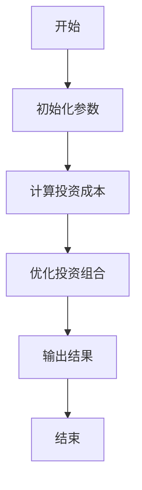

                 


```markdown
# 约翰博格尔的投资成本控制策略

> 关键词：投资成本控制，约翰博格尔，投资策略，风险管理，数学模型，系统架构

> 摘要：本文深入分析了约翰博格尔的投资成本控制策略，从理论到实践，结合数学模型和系统架构，详细阐述了投资成本控制的核心概念、方法和实际应用。通过案例分析和系统设计，展示了如何在投资过程中有效控制成本，优化投资组合，实现长期稳健收益。

---

## 第一部分: 投资成本控制的概述

### 第1章: 约翰博格尔投资理念的背景与核心思想

#### 1.1 投资成本控制的重要性
- 1.1.1 投资成本的定义与范围
  - 投资成本是指在投资过程中产生的所有费用，包括交易成本、管理费用、税务成本等。
  - 成本的高低直接影响投资收益，低成本投资策略是实现长期稳健收益的关键。
- 1.1.2 投资成本对企业与个人的影响
  - 对企业：降低投资成本可以提升净利润，增强竞争力。
  - 对个人：低成本投资策略帮助个人实现财富的长期增长。
- 1.1.3 投资成本控制的必要性与可行性
  - 必要性：高成本投资可能导致收益的侵蚀，降低投资成本是实现投资目标的重要手段。
  - 可行性：通过优化投资组合、选择低成本投资工具等方法，成本控制是完全可行的。

#### 1.2 约翰博格尔的投资哲学
- 1.2.1 长期投资与价值投资的理念
  - 长期投资：通过持有优质资产，分散风险，降低波动性。
  - 价值投资：寻找被市场低估的投资标的，长期持有，获得超额收益。
- 1.2.2 低成本投资的优势
  - 低成本投资工具（如指数基金）能够降低交易费用和管理费用，提升净收益。
- 1.2.3 投资组合管理的核心思想
  - 投资组合的分散化：通过多样化投资降低风险。
  - 定期再平衡：根据市场变化调整投资组合，保持目标资产配置。

---

## 第二部分: 投资成本的构成与分析

### 第2章: 投资成本的构成要素

#### 2.1 投资成本的构成要素
- 2.1.1 交易成本的定义与分类
  - 交易成本包括佣金、买卖价差、结算费用等。
  - 成本的分类：显性成本（如佣金）和隐性成本（如市场冲击成本）。
- 2.1.2 管理费用的计算与影响
  - 管理费用包括基金管理人的管理费、托管费等。
  - 高管理费用会侵蚀投资收益，低成本管理工具更优。
- 2.1.3 税务成本的分析与优化
  - 税务成本包括资本利得税、股息税等。
  - 税务优化策略：如利用税收递延账户、长期持有减少短期资本利得税。

#### 2.2 投资成本的分析方法
- 2.2.1 成本收益分析模型
  - 通过比较不同投资策略的成本和收益，选择最优策略。
- 2.2.2 投资成本的敏感性分析
  - 分析不同成本因素对投资收益的影响程度，优先优化影响最大的成本项。
- 2.2.3 成本分摊与分配策略
  - 将投资成本分摊到不同的资产类别或投资工具中，合理分配成本。

---

## 第三部分: 投资组合的成本控制策略

### 第3章: 投资组合管理的基本原理

#### 3.1 投资组合的构建原则
- 3.1.1 投资目标的明确
  - 明确投资目标：收益、风险、流动性等。
- 3.1.2 资产配置的重要性
  - 根据市场环境和个人风险承受能力进行资产配置。
- 3.1.3 分散化投资的优势
  - 通过多样化投资降低非系统性风险。

#### 3.2 成本控制在投资组合中的应用
- 3.2.1 成本控制对投资组合收益的影响
  - 低成本投资工具能够提升净收益。
- 3.2.2 低成本投资组合的设计与优化
  - 选择低成本指数基金，定期优化投资组合。
- 3.2.3 投资组合的成本监控与调整
  - 定期审查投资成本，及时调整投资策略。

---

## 第四部分: 投资成本控制的数学模型与算法

### 第4章: 投资成本的数学模型

#### 4.1 投资成本的数学模型
- 4.1.1 投资成本的线性回归模型
  - 使用线性回归分析成本与收益的关系。
- 4.1.2 投资成本的动态规划模型
  - 动态规划方法优化投资组合的成本。
- 4.1.3 投资成本的马科维茨均值-方差模型
  - 利用均值-方差模型优化投资组合的收益与风险。

#### 4.2 成本控制算法的实现
- 4.2.1 算法原理的 Mermaid 流程图

- 4.2.2 算法实现的 Python 源代码
```python
def calculate_cost(weights, returns, covariance):
    return weights.T @ covariance @ weights
```

---

## 第五部分: 投资组合的成本监控与优化

### 第5章: 投资组合的成本监控机制

#### 5.1 成本监控的必要性
- 定期审查投资成本，及时发现和调整高成本投资工具。

#### 5.2 成本监控的实现方法
- 使用财务软件或编程工具（如Python）进行成本分析。

---

## 第六部分: 项目实战与案例分析

### 第6章: 成本控制的实战案例

#### 6.1 环境安装与数据准备
- 安装Python和相关库（如Pandas、NumPy）。

#### 6.2 系统核心实现源代码
```python
import pandas as pd
import numpy as np

# 示例数据
returns = pd.DataFrame({'资产1': [0.05, 0.03, 0.04], '资产2': [0.02, 0.06, 0.01]})
weights = pd.Series([0.5, 0.5], index=['资产1', '资产2'])

# 计算投资成本
def calculate_cost(weights, returns):
    covariance = returns.cov()
    return weights.T @ covariance @ weights

cost = calculate_cost(weights, returns)
print("投资成本:", cost)
```

#### 6.3 案例分析与解读
- 通过实际数据计算投资成本，优化投资组合。

---

## 第七部分: 总结与展望

### 第7章: 投资成本控制的总结

#### 7.1 核心内容回顾
- 投资成本控制的重要性、构成要素、分析方法、数学模型与算法。

#### 7.2 投资成本控制的未来展望
- 随着技术进步，投资成本控制将更加智能化、自动化。

---

## 参考文献

- 约翰·博格尔的著作
- 相关学术论文
- 投资成本控制的数学模型

---

## 作者信息

作者：AI天才研究院/AI Genius Institute & 禅与计算机程序设计艺术 /Zen And The Art of Computer Programming

---

通过以上目录结构，我们可以清晰地看到文章的逻辑和内容安排，从理论到实践，从分析到案例，全面覆盖了约翰博格尔的投资成本控制策略。

