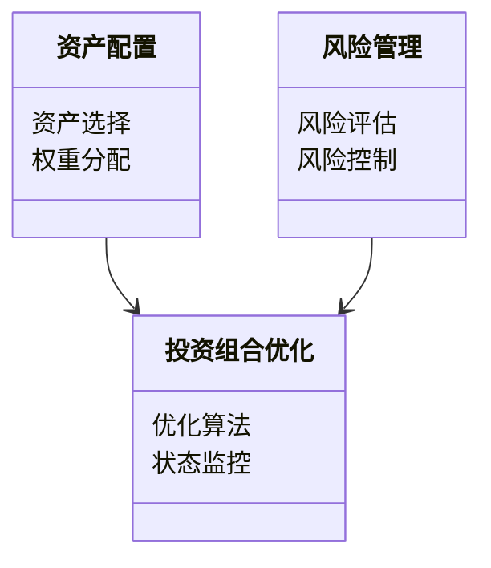

                 


# 经济不确定时期的个人理财策略

## 关键词：经济不确定性，个人理财，投资组合优化，风险管理，现金流管理

## 摘要：在当前经济环境下，个人理财策略显得尤为重要。本文从背景分析、核心概念、算法原理、系统架构、项目实战到最佳实践，详细阐述了在经济不确定时期如何制定和优化个人理财策略，帮助读者在复杂多变的经济环境中保护和增长财富。

---

# 第一部分: 经济不确定时期的个人理财背景与核心概念

## 第1章: 经济不确定时期的个人理财背景

### 1.1 当前全球经济形势分析

#### 1.1.1 全球经济现状与趋势

当前全球经济面临多重挑战，包括地缘政治冲突、通货膨胀、利率上升和供应链不稳定等因素。这些因素加剧了市场的不确定性，对个人理财产生了深远影响。投资者需要更加谨慎地规划财务，以应对潜在的经济波动。

#### 1.1.2 经济周期波动对个人理财的影响

经济周期的波动直接影响个人的收入和资产价值。在经济衰退时期，失业率上升，企业裁员增多，个人收入可能下降，同时股票、房地产等资产价格也可能下跌。因此，个人理财策略需要根据经济周期的变化进行调整，以降低风险并抓住潜在机会。

#### 1.1.3 经济不确定时期的理财挑战

在经济不确定时期，个人理财面临的主要挑战包括资产贬值风险、流动性风险和债务风险。投资者需要通过合理的资产配置、风险管理和现金流管理来应对这些挑战，确保财务安全。

### 1.2 经济不确定时期的理财重要性

#### 1.2.1 经济波动对个人财务的影响

经济波动可能导致个人收入减少、资产贬值，甚至影响到日常开支。因此，制定有效的理财策略可以帮助个人在经济困难时期维持生活水平，甚至实现财富增长。

#### 1.2.2 个人理财在经济不确定性中的作用

个人理财是保护和增长财富的重要手段。通过合理的投资、风险管理和社会安全网的建设，个人可以有效应对经济波动带来的挑战，确保财务稳定。

#### 1.2.3 理财策略的调整与优化

在经济不确定时期，个人需要定期评估和调整理财策略，以适应市场变化。这包括重新评估投资组合、优化债务结构和增强现金流管理等方面。

### 1.3 个人理财的核心概念与边界

#### 1.3.1 个人理财的定义与范围

个人理财是指个人对其财务资源进行规划、管理和优化的过程。其范围包括储蓄、投资、支出管理、债务管理、保险规划和退休计划等方面。

#### 1.3.2 理财目标的分类与优先级

理财目标可以分为短期、中期和长期目标。短期目标包括应急资金储备，中期目标包括债务偿还和子女教育基金，长期目标包括退休计划和财富传承。

#### 1.3.3 理财策略的边界与限制

个人理财策略需要考虑市场风险、流动性需求和法律合规等因素。投资者需要在风险承受能力和收益目标之间找到平衡，确保理财策略的可行性和可持续性。

## 第2章: 个人理财的核心概念与联系

### 2.1 资产配置与风险分散

#### 2.1.1 资产配置的原理与方法

资产配置是将资金分配到不同资产类别（如股票、债券、房地产等）中，以分散风险并优化收益。常见的资产配置方法包括现代投资组合理论（MPT）和恒定混合资产配置策略。

#### 2.1.2 风险分散的策略与实践

通过将资金分配到不同资产类别和行业，可以有效分散投资风险。风险分散的具体方法包括多元化投资、行业轮动和地域分散等。

#### 2.1.3 资产配置与风险分散的数学模型

现代投资组合理论（MPT）是资产配置的重要理论基础。其核心是通过优化资产配置，使投资组合的风险最小化，同时最大化预期收益。

### 2.2 投资组合优化与风险管理

#### 2.2.1 投资组合优化的原理

投资组合优化的目标是在给定的风险水平下实现最大收益，或在给定收益下实现最小风险。这需要考虑各资产的预期收益、风险和相关性。

#### 2.2.2 风险管理的核心工具与方法

风险管理工具包括止损订单、期权、保险和分散投资等。通过合理运用这些工具，可以有效降低投资组合的风险。

#### 2.2.3 资产配置与风险管理的对比分析

资产配置和风险管理是相辅相成的。资产配置决定了投资组合的结构，而风险管理则确保了组合的稳健性。两者共同作用，实现理财目标。

### 2.3 现金流管理与债务优化

#### 2.3.1 现金流管理的基本原则

现金流管理包括收入和支出的计划与控制。通过合理安排现金流，可以确保个人的日常开支、债务偿还和储蓄投资。

#### 2.3.2 债务优化的策略与技巧

债务优化包括选择合适的债务工具、合理安排还款计划和降低债务成本等。通过优化债务结构，可以降低财务压力，提高资金利用效率。

#### 2.3.3 现金流管理与债务优化的协同效应

现金流管理和债务优化相互促进，共同确保个人财务的健康和稳定。通过合理管理现金流，可以有效优化债务结构，降低财务风险。

### 2.4 核心概念联系的Mermaid图


---

## 第3章: 经济不确定时期的理财策略算法原理

### 3.1 现代投资组合理论（MPT）概述

#### 3.1.1 MPT的核心思想

MPT的核心思想是通过优化资产配置，使投资组合的风险最小化，同时实现预期收益最大化。这一理论强调资产的多样性和相关性对风险的影响。

#### 3.1.2 MPT的数学模型与公式

现代投资组合理论的核心公式包括预期收益、方差和协方差的计算。以下是MPT的基本公式：

$$ \text{收益} = \sum_{i=1}^{n} w_i \times r_i $$
$$ \text{方差} = \sum_{i=1}^{n} \sum_{j=1}^{n} w_i w_j \sigma_i \sigma_j \rho_{ij} $$

其中，$w_i$ 是资产i的权重，$r_i$ 是资产i的预期收益，$\sigma_i$ 是资产i的风险，$\rho_{ij}$ 是资产i和j的相关性系数。

#### 3.1.3 MPT的实现步骤与流程

MPT的实现步骤包括：确定投资目标、选择资产类别、估计各资产的预期收益和风险、计算投资组合的最优配置，并进行风险调整和优化。

---

### 3.2 投资组合优化的算法

#### 3.2.1 投资组合优化算法的Python实现

以下是使用Python实现现代投资组合理论的简单代码示例：

```python
import numpy as np

# 定义函数计算投资组合的收益和风险
def portfolio_return(weights, returns):
    return np.sum(weights * returns)

def portfolio_risk(weights, returns, cov_matrix):
    return np.sqrt(np.dot(weights.T, np.dot(cov_matrix, weights)))

# 示例数据
returns = np.array([0.1, 0.15, 0.12])  # 各资产的预期收益
cov_matrix = np.array([
    [0.02, 0.01, 0.01],
    [0.01, 0.03, 0.02],
    [0.01, 0.02, 0.03]
])  # 各资产的协方差矩阵

# 使用优化算法求解最优权重
from scipy.optimize import minimize

def minimize_risk(weights, returns, cov_matrix):
    return portfolio_risk(weights, returns, cov_matrix)

# 初始权重
initial_weights = [1/3, 1/3, 1/3]

# 约束条件
constraints = [{'type': 'eq', 'fun': lambda w: sum(w) - 1}]

# 优化
result = minimize(minimize_risk, initial_weights, constraints)

# 输出结果
print("最优权重:", result.x)
print("最小风险:", result.fun)
```

---

## 第4章: 经济不确定时期的理财策略系统分析与架构设计

### 4.1 理财系统分析与架构设计

#### 4.1.1 理财系统功能设计

理财系统的功能模块包括：资产配置、风险管理、现金流管理、投资组合优化和债务优化等。

#### 4.1.2 理财系统架构图



#### 4.1.3 系统交互流程

理财系统的交互流程包括：用户输入财务数据、系统分析并优化投资组合、用户监控和调整策略。

---

## 第5章: 经济不确定时期的理财策略项目实战

### 5.1 环境配置与代码实现

#### 5.1.1 环境配置

安装必要的Python库，如numpy、pandas和scipy。

#### 5.1.2 代码实现

以下是构建抗跌投资组合的Python代码示例：

```python
import numpy as np
import pandas as pd
from scipy.optimize import minimize

# 示例数据：资产收益和协方差矩阵
returns = pd.Series([0.1, 0.15, 0.12], index=['股票', '债券', '现金'])
cov_matrix = pd.DataFrame([
    [0.02, 0.01, 0.01],
    [0.01, 0.03, 0.02],
    [0.01, 0.02, 0.03]
])

# 定义优化函数
def min_variance(weights, returns, cov_matrix):
    return portfolio_risk(weights, returns, cov_matrix)

# 初始权重
initial_weights = [1/3, 1/3, 1/3]

# 约束条件
constraints = [{'type': 'eq', 'fun': lambda w: sum(w) - 1}]

# 优化
result = minimize(min_variance, initial_weights, constraints)

# 输出结果
print("最优权重:", result.x)
print("最小风险:", result.fun)
```

---

## 第6章: 经济不确定时期的理财策略最佳实践

### 6.1 小结

在经济不确定时期，个人理财策略需要灵活调整，注重风险管理和资产配置。通过合理优化投资组合和加强现金流管理，可以有效降低财务风险，实现财富的保值和增值。

### 6.2 注意事项

- 定期评估和调整理财策略，确保其适应市场变化。
- 避免过度冒险，保持合理的风险承受能力。
- 注重长期投资，避免短期波动的影响。

### 6.3 拓展阅读

- 现代投资组合理论（MPT）
- 有效边界与风险调整
- 投资组合优化的高级算法

---

## 作者：AI天才研究院 & 禅与计算机程序设计艺术

---

这篇博客文章详细分析了经济不确定时期个人理财的策略，结合了技术化的语言和实际案例，帮助读者在复杂多变的经济环境中制定和优化个人理财策略。通过系统的分析和具体的代码实现，文章提供了实用的工具和方法，帮助读者在经济波动中保护和增长财富。

