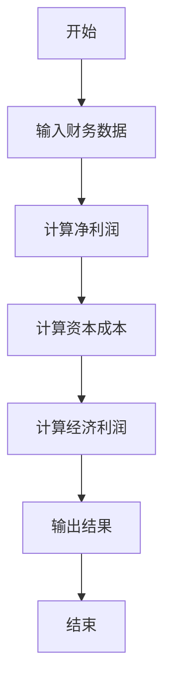
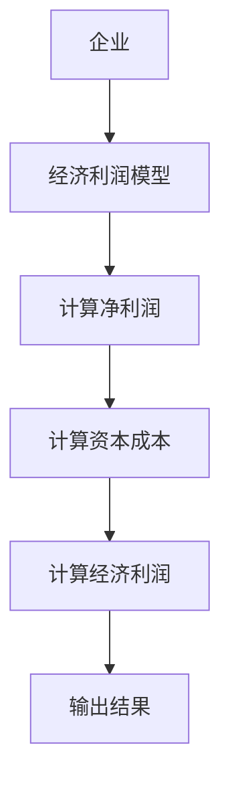
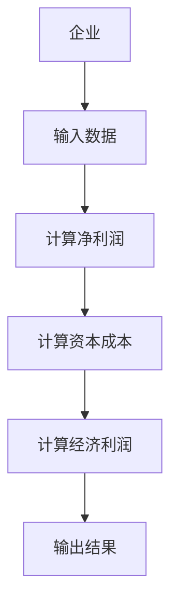

                 


# 经济利润模型：衡量真实价值创造的工具

> 关键词：经济利润模型、真实价值、经济分析、资本成本、企业价值

> 摘要：经济利润模型是一种用于衡量企业真实价值创造的工具，它通过计算经济利润，将企业的财务表现与资本成本相结合，揭示企业的真实价值。本文将从经济利润模型的核心概念、算法原理、系统架构设计、项目实战以及最佳实践等角度，全面解析经济利润模型的应用与实现。

---

## 第一部分：经济利润模型的背景与核心概念

### 第1章：经济利润模型的背景与问题背景

#### 1.1 经济利润模型的定义与核心概念

##### 1.1.1 经济利润模型的定义
经济利润模型是一种用于衡量企业真实价值的工具，它通过计算企业的经济利润（Economic Profit），将企业的净利润与资本成本进行对比，从而揭示企业的真实价值创造能力。与传统的会计利润不同，经济利润模型考虑了资本的机会成本，能够更准确地反映企业的长期价值创造能力。

##### 1.1.2 经济利润模型的核心要素
经济利润模型的核心要素包括：
1. **净利润**：企业的会计利润，扣除所有成本后的净利润。
2. **资本成本**：企业投入资本的机会成本，即如果将资金用于其他投资所能获得的最低回报。
3. **经济利润**：净利润减去资本成本，即企业的真正价值创造。

##### 1.1.3 经济利润模型的边界与外延
经济利润模型适用于企业层面的经济分析，其边界包括企业的财务数据（如收入、成本、净利润）和资本成本的计算。外延则包括企业战略、投资决策、股东价值评估等方面的应用。

#### 1.2 经济利润模型的背景与问题背景

##### 1.2.1 当前经济分析的局限性
传统的会计利润模型仅考虑会计利润，忽略了资本的机会成本，无法准确衡量企业的价值创造能力。此外，会计利润容易受到会计政策的影响，缺乏一致性。

##### 1.2.2 经济利润模型的提出动机
为了克服传统利润模型的局限性，经济利润模型应运而生。它通过引入资本成本的概念，能够更客观地衡量企业的价值创造能力，为企业的投资决策、估值和绩效考核提供依据。

##### 1.2.3 经济利润模型的应用场景
经济利润模型广泛应用于企业估值、绩效考核、投资决策等领域。例如，企业在进行投资决策时，可以通过经济利润模型评估项目的长期价值创造能力。

#### 1.3 经济利润模型与传统利润模型的对比

##### 1.3.1 传统利润模型的局限性
传统利润模型仅关注会计利润，忽略了资本成本，无法反映企业的长期价值创造能力。

##### 1.3.2 经济利润模型的优势
经济利润模型通过引入资本成本，能够更准确地衡量企业的价值创造能力，为企业的投资决策和估值提供依据。

##### 1.3.3 两者的对比分析
| 对比维度 | 传统利润模型 | 经济利润模型 |
|----------|--------------|--------------|
| 核心指标 | 会计利润     | 经济利润     |
| 计算公式 | 净利润        | 净利润 - 资本成本 |
| 应用场景 | 绩效考核     | 企业估值、投资决策 |

---

### 第2章：经济利润模型的核心概念与联系

#### 2.1 经济利润模型的核心原理

##### 2.1.1 经济利润的计算公式
$$ \text{经济利润} = \text{净利润} - \text{资本成本} $$

##### 2.1.2 经济利润与会计利润的区别
会计利润仅考虑企业的会计利润，而经济利润则考虑了资本的机会成本，能够更准确地衡量企业的价值创造能力。

##### 2.1.3 经济利润与股东价值的关系
经济利润与股东价值密切相关。当经济利润为正时，企业的价值在增加；当经济利润为负时，企业的价值在减少。

#### 2.2 核心概念对比分析

##### 2.2.1 经济利润与会计利润的对比
| 对比维度 | 会计利润          | 经济利润          |
|----------|-------------------|-------------------|
| 计算公式 | 净利润            | 净利润 - 资本成本 |
| 计算依据 | 会计准则          | 经济学原理        |
| 应用场景 | 绩效考核          | 投资决策、估值    |

##### 2.2.2 经济利润与市场价值的对比
经济利润关注企业的内在价值，而市场价值关注企业的市场估值。经济利润为正时，企业的市场价值通常会增加；反之亦然。

##### 2.2.3 经济利润与股东价值的对比
经济利润为正时，股东价值增加；经济利润为负时，股东价值减少。

#### 2.3 实体关系图与流程图

##### 2.3.1 经济利润模型的实体关系图（ER图）
```mermaid
erDiagram
    actor 企业 {
        key string 企业ID
        string 名称
        string 行业
    }
    actor 投资者 {
        key string 投资者ID
        string 名称
        string 资金
    }
    actor 市场 {
        key string 市场ID
        string 名称
        decimal 市场利率
    }
    enterprise 经济利润模型 {
        key string 模型ID
        decimal 净利润
        decimal 资本成本
        decimal 经济利润
    }
    企业 --> 经济利润模型 : 输入财务数据
    投资者 --> 经济利润模型 : 输入资金
    市场 --> 经济利润模型 : 输入市场利率
```

##### 2.3.2 经济利润模型的流程图（Mermaid）


---

## 第二部分：经济利润模型的算法原理

### 第3章：经济利润模型的算法原理

#### 3.1 经济利润模型的数学模型

##### 3.1.1 经济利润的计算公式
$$ \text{经济利润} = \text{净利润} - \text{资本成本} $$

##### 3.1.2 净利润的计算公式
净利润的计算公式为：
$$ \text{净利润} = \text{营业收入} - \text{总成本} $$

##### 3.1.3 资本成本的计算公式
资本成本的计算公式为：
$$ \text{资本成本} = \text{资本总额} \times \text{市场利率} $$

#### 3.2 经济利润模型的算法流程

##### 3.2.1 数据输入与处理
- 输入企业的财务数据，包括营业收入、总成本、资本总额和市场利率。

##### 3.2.2 计算净利润
根据营业收入和总成本计算净利润。

##### 3.2.3 计算资本成本
根据资本总额和市场利率计算资本成本。

##### 3.2.4 计算经济利润
根据净利润和资本成本计算经济利润。

#### 3.3 经济利润模型的算法实现

##### 3.3.1 Python实现代码
```python
def calculate_economic_profit(net_profit, capital_cost):
    return net_profit - capital_cost

# 示例数据
net_profit = 100  # 净利润
capital_cost = 50  # 资本成本
economic_profit = calculate_economic_profit(net_profit, capital_cost)
print("经济利润为:", economic_profit)
```

##### 3.3.2 代码解读与分析
上述代码定义了一个计算经济利润的函数，输入净利润和资本成本，输出经济利润。示例数据中，净利润为100，资本成本为50，经济利润为50。

---

## 第三部分：经济利润模型的系统分析与架构设计

### 第4章：经济利润模型的系统分析与架构设计

#### 4.1 系统分析

##### 4.1.1 问题场景介绍
企业需要通过经济利润模型来衡量其价值创造能力，以便做出更好的投资决策。

##### 4.1.2 系统功能需求
- 输入企业的财务数据和市场利率。
- 计算净利润和资本成本。
- 计算经济利润并输出结果。

##### 4.1.3 系统功能设计（领域模型图）


#### 4.2 系统架构设计

##### 4.2.1 系统架构图（Mermaid）


##### 4.2.2 系统接口设计
- 输入接口：接受企业的财务数据和市场利率。
- 输出接口：输出经济利润结果。

##### 4.2.3 系统交互流程图（Mermaid）


---

## 第四部分：经济利润模型的项目实战

### 第5章：经济利润模型的项目实战

#### 5.1 项目环境安装

##### 5.1.1 环境需求
- Python 3.8+

##### 5.1.2 安装依赖
```bash
pip install mermaid
```

#### 5.2 系统核心实现源代码

##### 5.2.1 经济利润模型的代码实现
```python
def calculate_economic_profit(net_profit, capital_cost):
    return net_profit - capital_cost

# 示例数据
net_profit = 100  # 净利润
capital_cost = 50  # 资本成本
economic_profit = calculate_economic_profit(net_profit, capital_cost)
print("经济利润为:", economic_profit)
```

##### 5.2.2 代码解读与分析
上述代码定义了一个计算经济利润的函数，并使用示例数据进行了计算。

#### 5.3 实际案例分析

##### 5.3.1 案例背景
某企业营业收入为200，总成本为100，资本总额为100，市场利率为5%。

##### 5.3.2 计算过程
1. 净利润 = 200 - 100 = 100
2. 资本成本 = 100 × 5% = 5
3. 经济利润 = 100 - 5 = 95

##### 5.3.3 结果解读
经济利润为95，说明该企业的价值在增加。

#### 5.4 项目小结

##### 5.4.1 项目总结
经济利润模型通过引入资本成本，能够更准确地衡量企业的价值创造能力。

##### 5.4.2 注意事项
- 确保输入数据的准确性。
- 确保资本成本的计算正确。

##### 5.4.3 提交代码与文档
将代码和文档提交到版本控制系统中。

---

## 第五部分：经济利润模型的最佳实践

### 第6章：经济利润模型的最佳实践

#### 6.1 最佳实践 tips

##### 6.1.1 小结
经济利润模型是一种衡量企业真实价值创造的工具，通过计算经济利润，能够更准确地反映企业的长期价值创造能力。

##### 6.1.2 注意事项
- 确保输入数据的准确性。
- 确保资本成本的计算正确。

##### 6.1.3 提示
经济利润模型的应用需要结合企业的实际情况，合理选择资本成本的计算方法。

#### 6.2 进一步阅读
推荐阅读《企业价值评估》和《经济利润模型的应用与实践》。

---

## 作者

作者：AI天才研究院/AI Genius Institute & 禅与计算机程序设计艺术 /Zen And The Art of Computer Programming

---

以上是《经济利润模型：衡量真实价值创造的工具》的完整目录大纲结构，涵盖了背景介绍、核心概念、算法原理、系统架构设计、项目实战以及最佳实践等部分内容。希望对您有所帮助！

