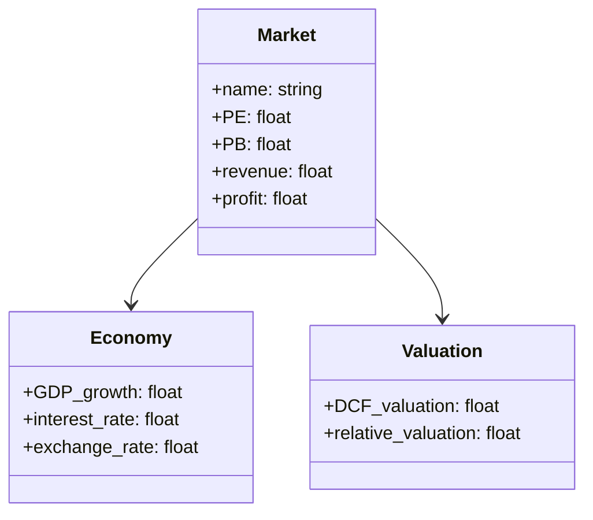
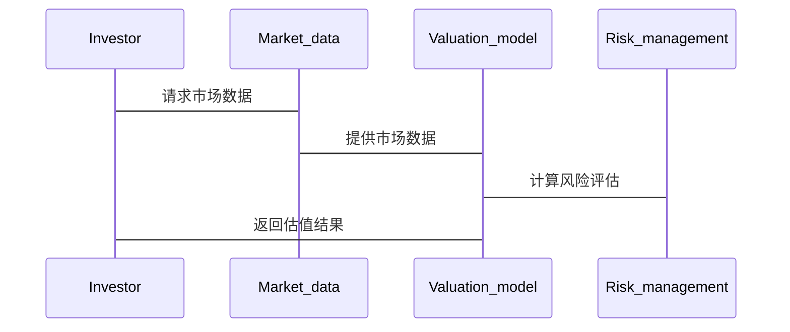

                 

# 经济增长放缓对新兴市场估值的潜在影响

## 关键词：
经济增长放缓、新兴市场、估值、影响分析、应对策略、案例分析、系统设计

## 摘要：
本文探讨经济增长放缓对新兴市场估值的潜在影响，分析了经济增长放缓的背景、新兴市场的估值方法、影响机制以及应对策略。通过详细分析利润、现金流、资产价格等因素的变化，本文揭示了经济增长放缓如何影响新兴市场的估值，并提出优化资产配置和风险管理等应对措施。最后，通过案例分析和系统设计，本文为投资者提供了实际的操作指南和系统架构，帮助他们在经济增长放缓的环境下做出明智的投资决策。

---

## 第一部分: 经济增长放缓的背景与影响

### 第1章: 经济增长放缓的背景分析

#### 1.1 全球经济现状与趋势

##### 1.1.1 经济增长放缓的定义与特征
经济增长放缓是指经济增长速度较之前显著降低，通常表现为GDP增速下降。其特征包括：① 经济增速下降；② 就业率增长放缓；③ 投资意愿降低。

##### 1.1.2 全球经济格局的变化
全球经济格局的变化主要体现在以下几个方面：
1. **技术变革**：人工智能、区块链等技术推动产业结构调整。
2. **地缘政治**：贸易摩擦、地缘政治冲突增加全球不确定性。
3. **政策调整**：各国货币政策和财政政策的变化影响经济增长。

##### 1.1.3 新兴市场的特点
新兴市场通常具有以下特点：
1. **高增长潜力**：新兴市场由于基数较低，潜在增长空间较大。
2. **多元化经济结构**：新兴市场涵盖制造业、服务业等多个领域。
3. **政策敏感性**：新兴市场对政策变化较为敏感，容易受到外部冲击的影响。

#### 1.2 经济增长放缓的原因

##### 1.2.1 全球化与贸易摩擦的影响
全球化带来的贸易摩擦增加，导致供应链中断和贸易壁垒上升，直接影响新兴市场的出口和经济增长。

##### 1.2.2 技术变革与产业转型
技术变革虽然推动了产业升级，但也可能导致部分行业被淘汰，尤其是劳动密集型产业受到冲击。

##### 1.2.3 地缘政治与政策不确定性
地缘政治冲突和政策不确定性增加了市场的不稳定性，影响投资者信心，进而影响经济增长。

---

### 第2章: 新兴市场估值的核心概念

#### 2.1 估值的基本原理

##### 2.1.1 估值的定义与作用
估值是通过对资产的未来现金流折现来确定其当前价值的过程，旨在为投资决策提供依据。

##### 2.1.2 影响估值的主要因素
影响估值的主要因素包括：① 利率水平；② 经营状况；③ 行业竞争格局。

##### 2.1.3 新兴市场的估值特点
新兴市场的估值特点包括：① 波动性较大；② 数据不完全；③ 政策影响显著。

#### 2.2 主要估值方法

##### 2.2.1 市盈率（PE）与市净率（PB）分析
市盈率（PE）=股价/每股收益；市净率（PB）=股价/每股净资产。这两种指标常用于衡量企业估值的合理性。

##### 2.2.2 现金流折现法（DCF）
现金流折现法通过预测企业未来现金流并折现，确定其内在价值。公式为：
$$ V = \sum_{t=1}^{n} \frac{CF_t}{(1 + r)^t} $$
其中，\( V \) 为估值，\( CF_t \) 为第 \( t \) 年的现金流，\( r \) 为折现率。

##### 2.2.3 相对估值法与行业比较
相对估值法通过比较同类企业的估值倍数，确定目标企业的合理估值范围。

---

### 第3章: 经济增长放缓对新兴市场估值的影响

#### 3.1 利润率下降的影响

##### 3.1.1 利润率与估值的关系
利润率下降会导致企业未来现金流减少，进而影响其估值。

##### 3.1.2 利率变化对估值的影响
利率上升会增加企业的融资成本，降低其盈利能力和估值。

##### 3.1.3 消费者行为变化对市场的影响
经济增长放缓可能导致消费者支出减少，影响企业的收入和利润。

#### 3.2 资产价格波动分析

##### 3.2.1 股票市场的波动性
经济增长放缓可能导致股市波动加剧，企业估值下降。

##### 3.2.2 房地产市场的估值变化
房地产市场的估值受经济增长放缓的影响较大，可能出现价格下跌和去杠杆化。

##### 3.2.3 债券市场的风险溢价变化
经济增长放缓可能导致债券市场的风险溢价上升，影响债券估值。

---

### 第4章: 新兴市场估值的敏感性分析

#### 4.1 外部因素的敏感性

##### 4.1.1 全球经济波动的传导机制
全球经济波动通过贸易、资本流动和信心传导至新兴市场，影响其估值。

##### 4.1.2 美联储政策对新兴市场的影响
美联储政策（如加息）可能引发资本外流，影响新兴市场的资产价格和估值。

##### 4.1.3 汇率波动对估值的影响
汇率波动直接影响企业的出口能力和利润，进而影响其估值。

#### 4.2 内部因素的敏感性

##### 4.2.1 政策调整对估值的影响
政策调整（如税收变化）可能影响企业的盈利能力，进而影响估值。

##### 4.2.2 企业盈利能力变化的影响
企业盈利能力下降会导致其估值降低，尤其是在高估值的行业。

##### 4.2.3 市场情绪与投资者行为的影响
市场情绪波动和投资者行为变化可能导致估值的短期波动。

---

### 第5章: 应对经济增长放缓的估值策略

#### 5.1 投资者策略调整

##### 5.1.1 优化资产配置
投资者应根据经济增长放缓的背景，调整资产配置，降低风险敞口。

##### 5.1.2 风险管理与对冲工具的运用
使用衍生品等对冲工具，降低市场波动对估值的影响。

##### 5.1.3 选择性投资与行业配置
选择具有防御性特征的行业进行投资，如公用事业、医疗保健等。

#### 5.2 企业应对策略

##### 5.2.1 成本控制与效率提升
通过成本控制和效率提升，增强企业的盈利能力和抗风险能力。

##### 5.2.2 创新驱动与产业升级
通过技术创新和产业升级，提升企业的核心竞争力。

##### 5.2.3 优化资本结构
通过优化资本结构，降低财务风险，提升企业估值。

---

## 第二部分: 系统设计与案例分析

### 第6章: 系统设计与架构方案

#### 6.1 问题场景介绍
经济增长放缓对新兴市场估值的影响需要一个系统的解决方案，以帮助投资者和企业应对潜在风险。

#### 6.2 系统功能设计

##### 6.2.1 领域模型

##### 6.2.2 系统架构

#### 6.3 系统接口设计

##### 6.3.1 数据接口
- 输入：GDP增长率、企业利润、市场数据
- 输出：估值结果、风险评估

##### 6.3.2 用户接口
- 输入：投资者需求
- 输出：投资建议、风险提示

#### 6.4 系统交互

##### 6.4.1 估值过程

---

## 第三部分: 实战与总结

### 第7章: 项目实战

#### 7.1 环境安装
安装必要的数据处理工具和分析软件，如Python、Pandas、Matplotlib。

#### 7.2 核心实现

##### 7.2.1 数据获取与处理
使用API获取市场数据，清洗数据，计算估值指标。

##### 7.2.2 估值模型实现
编写Python代码实现DCF估值和相对估值。

#### 7.3 案例分析

##### 7.3.1 某新兴市场案例
分析某新兴市场的估值变化，验证模型的有效性。

##### 7.3.2 对策建议
根据分析结果，提出具体的应对策略。

#### 7.4 总结
总结项目成果，强调系统设计和估值模型的实用性。

---

## 第四部分: 结论与展望

### 第8章: 结论与建议

#### 8.1 主要结论
经济增长放缓对新兴市场估值的影响是多方面的，投资者和企业需要采取积极措施应对潜在风险。

#### 8.2 未来展望
未来研究可以进一步探讨技术变革和政策调整对新兴市场估值的长期影响。

---

## 作者：AI天才研究院/AI Genius Institute & 禅与计算机程序设计艺术 /Zen And The Art of Computer Programming

---

通过以上思考，我们可以系统地分析经济增长放缓对新兴市场估值的影响，并提出相应的应对策略。

