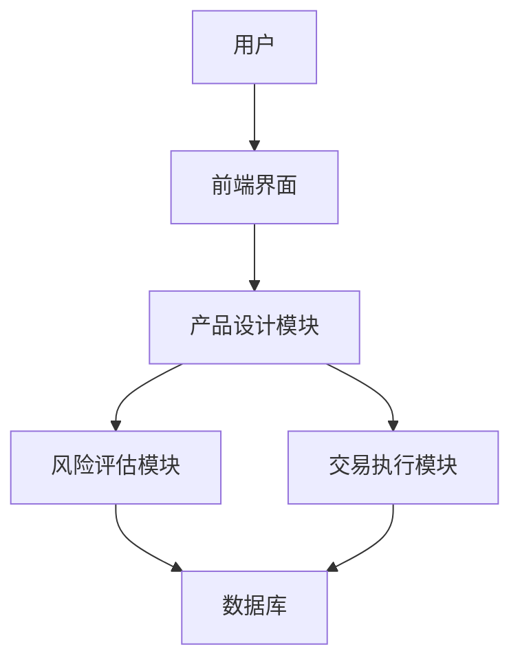
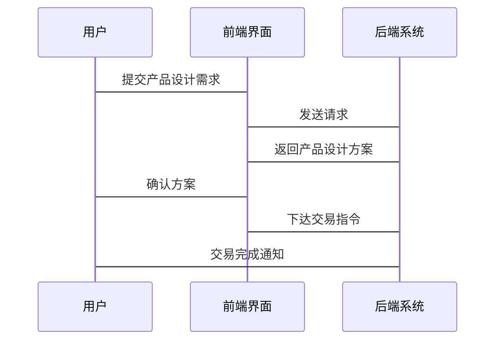

                 


# 结构性产品：定制化投资解决方案

> 关键词：结构性产品，定制化投资，金融衍生品，期权定价，风险评估，系统架构

> 摘要：本文深入探讨结构性产品的定义、核心原理、定价方法、风险评估以及系统设计。通过详细分析结构性产品的设计与定制化，结合实际案例，为投资者和金融从业者提供定制化投资解决方案的理论基础和实践指导。

---

# 第一部分: 结构性产品的基础与核心概念

## 第1章: 结构性产品的定义与背景

### 1.1 结构性产品的定义与特点
结构性产品是一种结合了传统投资工具（如债券、股票）和金融衍生品（如期权、期货）的复合型投资工具。其核心特征包括：
- **收益与风险的双重性**：投资者的收益不仅取决于标的资产的表现，还可能嵌入了期权等衍生品的特性。
- **定制化**：可以根据客户需求设计不同的收益结构和风险敞口。
- **期限灵活**：通常具有固定期限，但也可以根据市场需求调整。

### 1.2 结构性产品的分类与应用场景
结构性产品可以根据收益结构、挂钩资产或风险等级进行分类。例如：
- **收益结构**：固定收益型、浮动收益型、保本型等。
- **挂钩资产**：股票、债券、指数、商品等。

### 1.3 结构性产品的市场现状与发展
近年来，随着金融市场的复杂化和投资者对多样化收益的需求增加，结构性产品在全球范围内的市场规模迅速增长。特别是在亚洲市场，结构性产品的创新和应用更加活跃。

### 1.4 本章小结
本章介绍了结构性产品的基本定义、分类及其在金融市场中的地位，为后续章节的深入分析奠定了基础。

---

## 第2章: 结构性产品的核心概念与原理

### 2.1 结构性产品的基本组成
结构性产品通常由以下部分组成：
- **标的资产**：如股票、债券或指数。
- **嵌入式衍生品**：如期权、互换等。
- **期限与收益结构**：产品的期限和收益分配方式。

### 2.2 结构性产品的运作机制
- **标的资产的表现**：结构性产品的收益通常与标的资产的表现挂钩。
- **嵌入式衍生品的执行**：在特定条件下，嵌入式衍生品会触发，影响最终的收益分配。

### 2.3 结构性产品与传统投资工具的对比
- **风险收益特征**：结构性产品的风险和收益通常比传统投资工具更为复杂。
- **流动性**：结构性产品通常具有较低的流动性，尤其是在非到期日。

### 2.4 本章小结
本章深入探讨了结构性产品的核心组成和运作机制，帮助读者理解其复杂的特性。

---

## 第3章: 结构性产品的定价与风险评估

### 3.1 结构性产品的定价原理
结构性产品的定价需要考虑多个因素，包括标的资产的价格波动、嵌入式衍生品的执行价以及市场利率等。常用的方法包括：
- **蒙特卡洛模拟**：通过模拟标的资产的价格波动来评估结构性产品的期望收益。
- **期权定价模型**：如Black-Scholes模型，用于评估嵌入式期权的价值。

### 3.2 结构性产品的风险评估
- **市场风险**：标的资产价格波动对结构性产品价值的影响。
- **信用风险**：产品发行人或交易对手的信用风险。
- **流动性风险**：结构性产品可能难以在二级市场中变现。

### 3.3 结构性产品定价的数学模型
以下是结构性产品定价的一个简化模型：
$$
C = S_0 \Phi(d_1) - K e^{-rT} \Phi(d_2)
$$
其中，$S_0$是标的资产当前价格，$K$是执行价格，$r$是无风险利率，$T$是到期时间，$\Phi$是标准正态分布的累积分布函数。

### 3.4 本章小结
本章通过数学模型和风险分析，帮助读者理解结构性产品的定价和风险评估过程。

---

## 第4章: 结构性产品的设计与定制化

### 4.1 结构性产品的设计流程
1. **需求分析**：根据客户的投资目标和风险承受能力设计收益结构。
2. **标的资产选择**：选择适合的标的资产以匹配客户的投资目标。
3. **嵌入式衍生品的设计**：根据需求设计嵌入的期权或其他衍生品。
4. **产品测试与优化**：通过模拟测试优化产品设计。

### 4.2 结构性产品的定制化特点
- **个性化收益结构**：可以根据客户需求设计不同的收益分配方式。
- **风险敞口可控**：通过嵌入衍生品可以有效控制风险。

### 4.3 实际案例分析
以一个简单的保本型结构性产品为例，假设挂钩标的为某股票指数，嵌入了一个看跌期权。产品设计如下：
- **本金保障**：投资者在到期时可以收回本金。
- **收益部分**：如果指数在到期时的表现优于某个阈值，投资者可以获得额外收益。

### 4.4 本章小结
本章通过设计流程和实际案例，展示了结构性产品的定制化特点。

---

## 第5章: 结构性产品的系统分析与架构设计

### 5.1 系统功能设计
- **产品设计模块**：用于设计和优化结构性产品。
- **风险评估模块**：评估产品的市场风险、信用风险等。
- **交易执行模块**：实现产品的发行和交易。

### 5.2 系统架构设计
以下是系统的架构图：



### 5.3 系统接口设计
- **前端接口**：用户通过前端界面提交产品设计需求。
- **后端接口**：系统根据需求生成产品方案。

### 5.4 系统交互设计
以下是系统交互的序列图：



### 5.5 本章小结
本章通过系统架构和交互设计，展示了如何构建一个支持结构性产品定制的系统。

---

## 第6章: 项目实战与最佳实践

### 6.1 项目环境安装
- 需要安装Python、NumPy、Pandas、Matplotlib等工具。

### 6.2 核心代码实现
以下是一个简单的结构性产品定价代码示例：

```python
import numpy as np
from scipy.stats import norm

def d1(S, K, r, sigma, T):
    return (np.log(S/K) + (r + 0.5*sigma**2)*T) / (sigma*np.sqrt(T))

def d2(d1, sigma, T):
    return d1 - sigma*np.sqrt(T)

def option_price(S, K, r, sigma, T):
    call_price = S * norm.cdf(d1(S, K, r, sigma, T)) - K * np.exp(-r*T) * norm.cdf(d2(d1(S, K, r, sigma, T), sigma, T))
    return call_price

# 示例参数
S = 100
K = 105
r = 0.05
sigma = 0.2
T = 1

print(option_price(S, K, r, sigma, T))
```

### 6.3 案例分析
通过上述代码，我们可以计算出嵌入期权的结构性产品的理论价格。

### 6.4 最佳实践
- **充分的风险披露**：在设计结构性产品时，必须向投资者充分披露风险。
- **定期产品评估**：根据市场变化定期评估产品的风险和收益。

### 6.5 本章小结
本章通过实际项目和代码示例，展示了结构性产品在实际应用中的实现过程。

---

## 第7章: 总结与展望

### 7.1 总结
本文系统地介绍了结构性产品的定义、核心原理、定价方法、风险评估以及系统设计。通过实际案例和代码示例，展示了结构性产品的定制化投资解决方案。

### 7.2 展望
未来，随着人工智能和大数据技术的发展，结构性产品的设计和定价将更加智能化和个性化。投资者和金融机构需要不断学习和适应这些变化。

---

## 作者：AI天才研究院/AI Genius Institute & 禅与计算机程序设计艺术 /Zen And The Art of Computer Programming

---

这篇文章通过详细的分析和实际案例，为读者提供了结构性产品定制化投资解决方案的全面指导。

