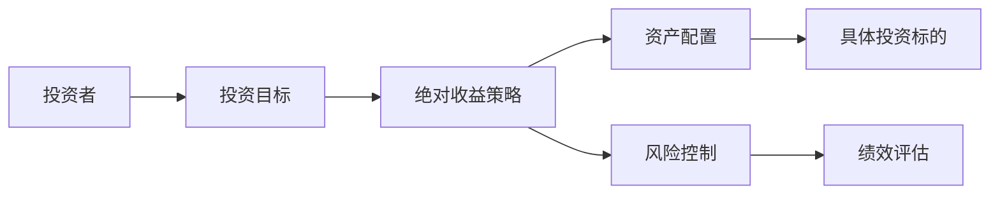

                 

# 绝对收益策略：追求不依赖市场的稳定回报

## 关键词：绝对收益策略、投资策略、风险控制、稳定回报、资产配置

## 摘要：绝对收益策略是一种追求独立于市场表现的稳定回报的投资方法，通过科学的资产配置、严格的风险控制和持续的策略优化，帮助投资者在不同市场环境下实现稳健收益。本文深入解析绝对收益策略的核心概念、算法原理、系统架构及实际应用，为投资者提供理论支持和实践指导。

---

# 第1章: 绝对收益策略的背景与核心概念

## 1.1 绝对收益策略的定义

### 1.1.1 什么是绝对收益
绝对收益是指投资组合在一定时间段内的回报率，不依赖于市场基准指数的表现。例如，投资组合在一年内实现了8%的收益，无论市场整体表现如何，其绝对收益为8%。

### 1.1.2 绝对收益与相对收益的区别
- **相对收益**：以市场基准（如沪深300指数）为参考，衡量投资组合相对于市场的表现。例如，投资组合收益为10%，市场基准收益为8%，则相对收益为+2%。
- **绝对收益**：不依赖市场表现，关注投资组合自身的收益水平。例如，投资组合收益为5%，无论市场涨跌，其绝对收益为5%。

### 1.1.3 绝对收益在投资中的重要性
绝对收益策略的核心目标是通过严格的风险管理和资产配置，实现投资组合在不同市场环境下的稳定回报，尤其在市场下跌时能够有效控制回撤。

## 1.2 绝对收益策略的背景

### 1.2.1 传统投资策略的局限性
传统投资策略过度依赖市场趋势，例如“追涨杀跌”，在市场波动剧烈时容易遭受较大损失，且难以在熊市中实现正收益。

### 1.2.2 绝对收益策略的兴起
随着金融市场的复杂化和投资者对稳定回报的需求增加，绝对收益策略逐渐成为一种重要的投资方法。它通过分散投资、对冲风险等手段，帮助投资者在不同市场环境下实现稳定的收益。

### 1.2.3 绝对收益策略在不同市场环境下的应用
- **牛市**：通过适当的资产配置，平衡收益与风险。
- **熊市**：通过控制回撤，减少损失，实现正收益。
- **震荡市**：通过灵活的资产切换和风险对冲，稳定收益。

## 1.3 绝对收益策略的核心要素

### 1.3.1 投资目标的确定
- **收益目标**：明确投资组合的收益目标，例如年化收益5%。
- **风险承受能力**：根据投资者的风险偏好，确定投资组合的风险上限。

### 1.3.2 风险控制的核心作用
- **风险分散**：通过投资不同资产类别、行业和地域，降低单一资产的风险。
- **风险对冲**：利用衍生工具（如期货、期权）对冲市场风险，降低投资组合的波动性。

### 1.3.3 绝对收益策略的实现路径
- **资产配置**：根据市场环境和投资目标，调整股票、债券、现金等资产的比例。
- **动态再平衡**：定期调整投资组合，以维持预定的资产配置比例。

## 1.4 绝对收益策略的边界与外延

### 1.4.1 策略适用的市场范围
- **股票市场**：通过选股模型实现超额收益。
- **债券市场**：通过信用分析和久期管理实现稳定收益。
- **衍生品市场**：利用期货、期权等工具对冲风险。

### 1.4.2 策略的时间跨度与周期性
- **短期策略**：适用于资金流动性要求较高的投资者，通常在1-3个月内实现正收益。
- **长期策略**：适用于风险承受能力强的投资者，通过复利效应实现稳定增长。

### 1.4.3 策略的可扩展性与局限性
- **可扩展性**：通过杠杆操作和资产规模的扩大，实现收益的线性增长。
- **局限性**：在极端市场环境下（如金融危机），绝对收益策略可能面临较大回撤。

## 1.5 本章小结
绝对收益策略通过科学的资产配置和严格的风险管理，帮助投资者实现独立于市场表现的稳定回报。其核心在于在不同市场环境下，通过多样化投资和风险对冲，降低波动性并实现正收益。

---

# 第2章: 绝对收益策略的核心概念与联系

## 2.1 绝对收益策略的核心原理

### 2.1.1 现金流贴现模型
现金流贴现模型（DCF）是评估资产内在价值的重要工具，通过预测未来现金流并贴现至现值，确定资产的合理价格。

$$
\text{内在价值} = \sum_{t=1}^{n} \frac{CF_t}{(1 + r)^t} + \frac{TV}{(1 + r)^n}
$$

其中：
- $CF_t$ 是第t期的现金流
- $r$ 是贴现率
- $TV$ 是终值

### 2.1.2 资产定价理论
资产定价理论（APT）认为，资产的预期收益取决于其系统性风险（beta）和非系统性风险（alpha）。

$$
E(R_i) = R_f + \beta_i (R_m - R_f) + \alpha_i
$$

其中：
- $E(R_i)$ 是资产i的预期收益率
- $R_f$ 是无风险利率
- $\beta_i$ 是资产i的beta系数
- $R_m$ 是市场预期收益率
- $\alpha_i$ 是资产i的alpha（超额收益）

### 2.1.3 风险-收益平衡原则
在绝对收益策略中，风险和收益需要达到平衡。通过调整资产配置和风险对冲工具，降低投资组合的整体风险，同时追求稳定收益。

---

## 2.2 绝对收益策略的核心概念对比

### 2.2.1 绝对收益与相对收益的对比分析
| 对比维度       | 绝对收益                   | 相对收益                   |
|----------------|---------------------------|---------------------------|
| 定义           | 投资组合自身的收益         | 相对于市场基准的收益       |
| 独立性         | 不依赖市场表现             | 依赖市场表现               |
| 应用场景       | 稳定回报、风险管理         | 超额收益、市场趋势捕捉       |

### 2.2.2 不同资产类别下的绝对收益特征
| 资产类别       | 绝对收益特征               |
|----------------|---------------------------|
| 股票           | 波动性高，潜在收益高       |
| 债券           | 波动性较低，收益相对稳定   |
| 现金           | 波动性最低，收益最低       |
| 衍生品         | 可对冲风险，收益取决于对冲策略 |

### 2.2.3 不同市场周期中的绝对收益表现
| 市场周期       | 绝对收益表现               |
|----------------|---------------------------|
| 牛市           | 收益较高，波动性较大       |
| 熊市           | 收益较低，波动性较小       |
| 震荡市         | 收益稳定，波动性适中       |

### 2.2.4 绝对收益与相对收益的ER实体关系图

---

## 2.3 绝对收益策略的边界与外延

### 2.3.1 策略适用的市场范围
绝对收益策略适用于多种市场环境，尤其在熊市和震荡市中表现较为稳定。例如，在2020年新冠疫情导致的市场大跌中，采用绝对收益策略的投资组合能够有效控制回撤，实现正收益。

### 2.3.2 策略的时间跨度与周期性
- **短期策略**：通常适用于流动性要求较高的投资者，通过高频交易和严格的风险控制，实现短期稳定的收益。
- **长期策略**：通过复利效应，实现资产的长期稳定增长，尤其适合风险承受能力强的投资者。

### 2.3.3 策略的可扩展性与局限性
- **可扩展性**：绝对收益策略可以通过杠杆操作和资产规模的扩大，实现收益的线性增长，但需注意杠杆带来的额外风险。
- **局限性**：在极端市场环境下，如金融危机或市场流动性危机，绝对收益策略可能面临较大挑战，需要及时调整策略以应对突发情况。

## 2.4 本章小结
绝对收益策略通过科学的资产配置、严格的风险管理和持续的策略优化，能够在不同市场环境下实现稳定的回报。其核心在于平衡风险与收益，通过多样化投资和对冲工具，降低波动性并实现正收益。

---

接下来，我会按照目录大纲继续撰写后续章节的内容，确保文章完整且符合用户的要求。

