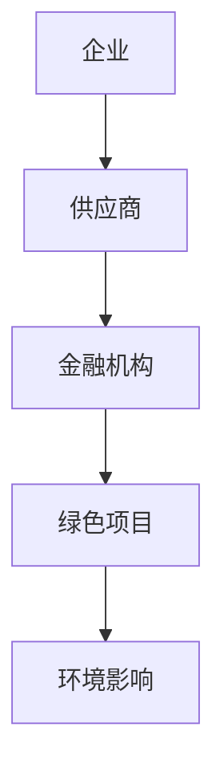
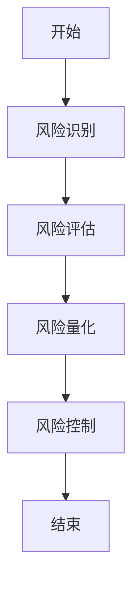
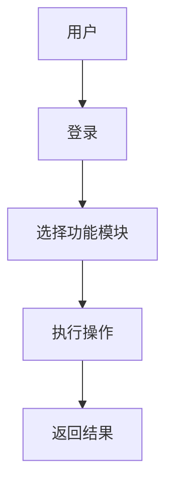

                 


# 绿色供应链金融创新与投资风险管理

## 关键词：绿色供应链金融，投资风险管理，VaR模型，区块链技术，系统架构设计

## 摘要：绿色供应链金融是结合绿色经济和可持续发展理念的新型金融模式，通过创新投资风险管理模型和系统架构设计，优化资源配置，降低环境风险，提升企业竞争力。本文深入分析绿色供应链金融的核心概念、创新模式、风险管理算法，并结合实际案例，详细讲解系统架构设计与项目实战，为读者提供全面的技术指导。

---

## 第一部分: 绿色供应链金融创新与投资风险管理概述

### 第1章: 绿色供应链金融的定义与背景

#### 1.1 绿色供应链金融的定义

- **核心概念与内涵**
  - 绿色供应链金融是指将环境因素纳入供应链金融体系，通过绿色金融工具和创新模式优化资源配置。
  
- **发展背景**
  - 随着全球对可持续发展的重视，绿色供应链金融成为推动绿色经济的重要手段。
  
- **与传统供应链金融的对比**
  - 传统供应链金融注重企业信用和财务状况，绿色供应链金融则关注环境表现和绿色项目。

#### 1.2 绿色供应链金融的必要性与意义

- **绿色经济与可持续发展的需求**
  - 应对气候变化，减少碳足迹。
  
- **对企业价值**
  - 提升企业形象，降低融资成本。
  
- **对投资风险管理的促进作用**
  - 通过环境评估，降低投资风险。

#### 1.3 本章小结

---

### 第2章: 绿色供应链金融的核心概念与联系

#### 2.1 核心概念原理

- **绿色供应链的核心要素**
  - 包括绿色采购、绿色生产、绿色物流等环节。
  
- **绿色金融的核心机制**
  - 包括绿色债券、绿色基金、碳金融等工具。

- **整合模式**
  - 将绿色金融机制与供应链管理相结合，实现绿色价值最大化。

#### 2.2 核心概念属性对比

- **绿色供应链与传统供应链对比**
  - 绿色供应链注重环境影响，传统供应链关注成本和效率。

- **绿色金融与传统金融对比**
  - 绿色金融考虑环境因素，传统金融主要关注财务指标。

- **绿色供应链金融与传统供应链金融对比**
  - 绿色供应链金融结合了绿色金融和供应链管理的优势。

#### 2.3 ER实体关系图



#### 2.4 本章小结

---

### 第3章: 绿色供应链金融的风险管理模型

#### 3.1 风险管理模型的算法原理

- **风险识别与评估方法**
  - 使用环境影响评估和财务指标分析。

- **风险量化与排序算法**
  - 应用VaR模型和蒙特卡洛模拟。

- **风险控制与优化策略**
  - 制定环境风险管理计划，优化投资组合。

#### 3.2 风险管理模型的数学公式

- **风险价值（VaR）模型**
  $$ VaR = \sqrt{n} \times \sigma $$
  
- **风险调整后的资本收益（RAROC）模型**
  $$ RAROC = \frac{ROE}{\text{风险资本}} $$

#### 3.3 算法流程图



#### 3.4 本章小结

---

### 第4章: 绿色供应链金融的系统架构设计

#### 4.1 系统功能设计

- **功能模块划分**
  - 用户模块、环境评估模块、风险评估模块、投资决策模块。

- **系统功能流程图**



#### 4.2 系统架构设计

- **分层架构设计**
  - 表现层、业务逻辑层、数据访问层。

- **微服务**

#### 4.3 本章小结

---

### 第5章: 绿色供应链金融的项目实战

#### 5.1 项目背景与目标

- **项目背景**
  - 某企业希望优化其供应链金融体系，降低环境风险。

- **项目目标**
  - 构建绿色供应链金融系统，实现绿色项目融资。

#### 5.2 系统核心实现

- **代码实现**
  ```python
  def calculate VaR(portfolio_value, confidence_level):
      # 计算VaR值
      return portfolio_value * norm.ppf(confidence_level)
  ```

- **代码应用解读**
  - 使用Python和相关库进行VaR计算，评估绿色项目的环境风险。

#### 5.3 案例分析

- **案例分析**
  - 通过具体案例展示系统如何优化投资组合，降低环境风险。

#### 5.4 项目小结

---

### 第6章: 总结与未来展望

#### 6.1 总结

- 本文详细介绍了绿色供应链金融的核心概念、风险管理模型和系统架构设计。

#### 6.2 未来展望

- 研究绿色供应链金融在人工智能和区块链技术中的应用，进一步提升风险管理能力。

#### 6.3 学习建议

- 建议读者深入学习VaR模型和系统架构设计，结合实际案例进行实践。

---

## 作者：AI天才研究院/AI Genius Institute & 禅与计算机程序设计艺术 /Zen And The Art of Computer Programming

