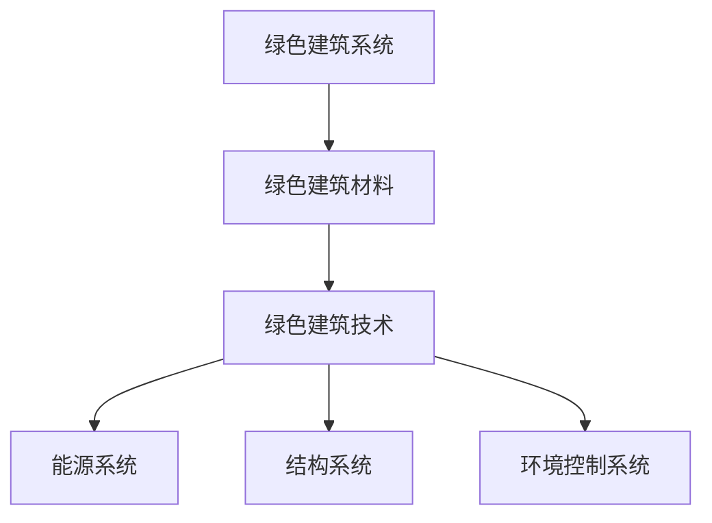

                 

# 绿色建筑技术与材料的市场增长潜力

> **关键词**：绿色建筑，可持续发展，建筑材料，市场增长，环保效益，经济效益

> **摘要**：绿色建筑技术与材料的市场增长潜力巨大，随着全球环保意识的增强和政策支持的加大，绿色建筑已成为建筑行业的重要发展趋势。本文将从绿色建筑的基本概念、技术与材料的分类、市场驱动因素、技术原理、数学模型、系统架构、项目实战以及最佳实践等方面，详细分析绿色建筑技术与材料的市场增长潜力，为读者提供全面的视角和深入的见解。

---

# 第1章: 绿色建筑技术与材料的背景介绍

## 1.1 绿色建筑的基本概念

### 1.1.1 绿色建筑的定义与内涵
绿色建筑是指在全生命周期内，最大限度地节约资源、保护环境、减少污染的建筑。它强调能源效率、可再生能源利用、环保材料的应用以及生态设计。绿色建筑不仅关注建筑本身的节能，还考虑施工过程中的环保性和后期维护的可持续性。

### 1.1.2 绿色建筑的核心要素与组成
绿色建筑的核心要素包括：
1. **节能设计**：通过优化建筑设计降低能源消耗。
2. **可再生能源**：利用太阳能、地热能等可再生能源。
3. **环保材料**：使用 recycled materials 和低挥发性有机化合物（VOC）材料。
4. **水资源管理**：雨水收集、废水回收利用。
5. **智能化系统**：通过智能控制系统提高能源利用效率。

### 1.1.3 绿色建筑与传统建筑的区别
绿色建筑与传统建筑的区别主要体现在以下几个方面：
1. **能源消耗**：绿色建筑注重节能，而传统建筑通常能耗较高。
2. **材料选择**：绿色建筑使用环保材料，而传统建筑可能使用会对环境造成较大影响的材料。
3. **设计理念**：绿色建筑强调生态友好和可持续性，传统建筑可能更注重功能性和美观性。

## 1.2 绿色建筑技术与材料的发展现状

### 1.2.1 国际绿色建筑发展现状
近年来，全球绿色建筑市场迅速发展，多个国家和地区已经制定了严格的建筑节能标准。例如，欧盟的《建筑能效条例》要求所有新建建筑在2020年后实现“近零能耗”。在美国，LEED认证（Leadership in Energy and Environmental Design）已经成为绿色建筑的重要标志。

### 1.2.2 国内绿色建筑技术的应用情况
在中国，绿色建筑的发展也取得了显著进展。根据住建部的统计，截至2022年，中国已建成绿色建筑面积超过80亿平方米。主要的绿色建筑技术应用包括：
1. **被动式设计**：通过建筑设计减少能源消耗。
2. **主动式技术**：利用可再生能源和智能控制系统提高能源效率。
3. **环保材料的应用**：推广使用低碳混凝土、竹材等环保材料。

### 1.2.3 绿色建筑技术与材料的未来趋势
未来，绿色建筑技术与材料的发展趋势将主要体现在以下几个方面：
1. **智能化与数字化**：通过物联网技术实现建筑的智能化管理。
2. **低碳材料的创新**：研发更多低碳、可循环的建筑材料。
3. **可再生能源的广泛应用**：进一步提高可再生能源在建筑中的应用比例。

## 1.3 绿色建筑市场增长的驱动因素

### 1.3.1 政策驱动
各国政府纷纷出台政策支持绿色建筑的发展，例如：
- 碳中和目标的推动。
- 建筑节能标准的提高。
- 绿色建筑认证和补贴政策的实施。

### 1.3.2 技术进步
技术进步是推动绿色建筑市场增长的重要因素。例如：
- 新型节能技术的应用降低了建筑能耗。
- 环保材料的创新提高了建筑的可持续性。

### 1.3.3 环保意识的提升
随着环保意识的增强，消费者和企业都更加关注建筑对环境的影响，这进一步推动了绿色建筑市场的发展。

### 1.3.4 经济效益的驱动
绿色建筑不仅具有环保效益，还能带来经济效益。例如：
- 降低能源消耗，减少运营成本。
- 提高建筑的市场价值和租金收益。

## 1.4 绿色建筑技术与材料的分类

### 1.4.1 绿色建筑技术的主要类型
1. **节能技术**：包括建筑-envelope优化、保温技术等。
2. **可再生能源技术**：如太阳能光伏、地热能利用等。
3. **智能化技术**：如建筑自动化控制系统。

### 1.4.2 绿色建筑材料的主要分类
1. **低碳材料**：如低碳混凝土、竹材等。
2. **可循环材料**：如再生钢材、回收塑料等。
3. **环保型材料**：如低VOC涂料、环保木材等。

### 1.4.3 绿色建筑技术与材料的对比分析
下表对比了绿色建筑技术与材料的主要特点：

| 属性       | 绿色建筑材料                | 绿色建筑技术                |
|------------|---------------------------|-----------------------------|
| 环保性      | 可回收、低污染            | 节能、减排                  |
| 耐用性      | 高耐久性                  | 长寿命、低维护              |
| 可循环性    | 可循环利用                | 可升级、可改造              |
| 经济性      | 初始成本较高              | 运行成本降低                |
| 技术成熟度  | 成熟度较高                | 部分技术仍需完善            |

---

# 第2章: 绿色建筑技术与材料的核心概念

## 2.1 绿色建筑技术的核心原理

### 2.1.1 能源效率提升技术
能源效率提升技术包括优化建筑-envelope设计、使用高效 HVAC 系统等。例如，通过使用三层中空玻璃可以显著降低建筑的热量流失，从而减少供暖和制冷能耗。

### 2.1.2 可再生能源利用技术
可再生能源利用技术包括太阳能光伏、太阳能热水系统和地热能利用等。例如，安装屋顶光伏系统可以为建筑提供清洁能源，减少对化石能源的依赖。

### 2.1.3 建筑节能技术
建筑节能技术包括智能控制系统、LED照明等。例如，使用智能温控系统可以根据室内外温湿度自动调节 HVAC 系统，从而实现节能。

## 2.2 绿色建筑材料的特性与优势

### 2.2.1 环保性
绿色建筑材料通常具有低污染性，例如低VOC涂料不会释放有害气体，对人体和环境无害。

### 2.2.2 耐用性
许多绿色建筑材料具有高耐久性，例如再生钢材和竹材，可以延长建筑的使用寿命。

### 2.2.3 可循环性
绿色建筑材料可以循环利用，例如再生塑料和回收钢材，减少资源浪费和环境污染。

## 2.3 绿色建筑技术与材料的系统架构

### 2.3.1 系统整体架构图（Mermaid流程图）

### 2.4 本章小结
本章介绍了绿色建筑技术与材料的核心概念，包括技术原理、材料特性以及系统架构。通过对比分析，我们可以看出绿色建筑技术与材料在环保性、经济性和可持续性方面的优势。

---

# 第3章: 绿色建筑技术与材料的市场增长潜力

## 3.1 绿色建筑技术与材料的市场需求

### 3.1.1 市场规模
根据市场研究机构的数据，2023年全球绿色建筑市场市值约为3.

