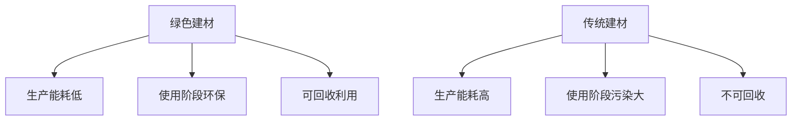
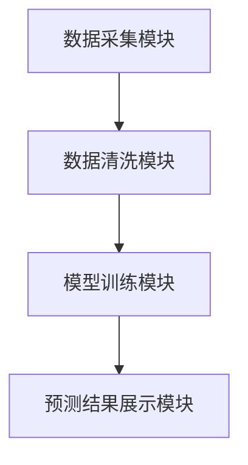

                 


# 绿色建筑材料创新的市场渗透率预测

---

## 关键词：绿色建材、市场渗透率、预测模型、技术创新、可持续发展

---

## 摘要：  
本文探讨绿色建筑材料的创新及其对市场渗透率的影响，分析绿色建材的技术创新趋势、市场特征以及消费者行为变化。通过建立市场渗透率预测模型，结合数据分析与预测算法，预测绿色建材在未来市场中的渗透率变化趋势。本文还将结合实际案例，分析绿色建材市场的现状与未来发展方向，为行业提供科学的决策支持。

---

# 第一部分: 绿色建筑材料创新的背景与现状

## 第1章: 绿色建筑材料的定义与特点

### 1.1 绿色建筑材料的基本概念  
- 绿色建筑材料是指在生产、使用和废弃过程中具有低能耗、低污染、可循环利用等特性的材料。  
- 其核心属性包括：环保性、可持续性、节能性、可回收性。  

### 1.2 绿色建筑材料与传统建材的对比  
- 对比维度：生产过程能耗、使用阶段碳排放、废弃物处理方式、产品生命周期成本。  
- 通过表格和 Mermaid 图展示对比分析：  



---

## 第2章: 绿色建材创新的背景与驱动因素

### 2.1 环境问题与可持续发展的需求  
- 当前全球环境问题（如气候变化、资源枯竭）推动绿色建材的创新与应用。  

### 2.2 政策法规对绿色建材发展的推动  
- 各国政府出台的环保政策（如碳中和目标、绿色建筑认证标准）加速绿色建材的市场渗透。  

### 2.3 市场需求与消费者行为的变化  
- 消费者环保意识提升，对绿色建材的需求增加。  

---

# 第二部分: 绿色建材市场渗透率的影响因素

## 第3章: 绿色建材创新与市场渗透率的关系

### 3.1 绿色建材创新的技术路径  
- 技术方向包括：  
  1. 可再生材料的应用（如竹纤维、再生塑料）。  
  2. 节能技术（如低能耗保温材料）。  
  3. 循环经济技术（如可拆卸装配式建材）。  

### 3.2 绿色建材市场渗透率的影响因素  
- 价格因素：绿色建材成本较高，价格敏感性影响市场渗透。  
- 产品性能：绿色建材的性能需满足建筑标准，否则会影响市场接受度。  
- 市场认知度：消费者对绿色建材的认知程度影响其市场渗透。  

---

# 第三部分: 市场渗透率预测的理论基础

## 第4章: 市场渗透率预测的模型与方法

### 4.1 市场渗透率预测的基本概念  
- 市场渗透率 = (目标市场中产品的使用人数 / 目标市场总人口) × 100%。  

### 4.2 绿色建材市场渗透率预测的模型构建  
- 数据收集：包括绿色建材的市场占有率、消费者偏好、价格因素等。  
- 模型选择：基于时间序列分析的ARIMA模型和机器学习算法（如随机森林）。  

### 4.3 市场渗透率预测的算法实现  

```python
import pandas as pd
from sklearn.ensemble import RandomForestRegressor
from sklearn.metrics import mean_squared_error

# 数据预处理
data = pd.read_csv('green_building_material.csv')
X = data[['price', 'performance', 'brand_recognition']]
y = data['market_penetration']

# 模型训练
model = RandomForestRegressor(n_estimators=100)
model.fit(X, y)

# 模型预测
y_pred = model.predict(X)
print('均方误差:', mean_squared_error(y, y_pred))
```

---

## 第5章: 绿色建材市场的现状与发展趋势

### 5.1 绿色建材市场的现状分析  
- 当前绿色建材市场渗透率较低，主要集中在高端建筑市场。  

### 5.2 绿色建材市场的未来发展趋势  
- 技术创新推动绿色建材成本下降，市场渗透率逐步提高。  

---

# 第四部分: 项目实战与系统分析

## 第6章: 项目实战

### 6.1 环境安装与数据准备  
- 数据来源：绿色建材市场调研数据、政府政策文件、建筑行业标准。  

### 6.2 系统功能设计  
- 使用 Mermaid 图展示系统功能模块：  



---

## 第7章: 系统架构设计

### 7.1 系统架构设计  
- 使用 Mermaid 图展示系统架构：  


### 7.2 系统接口设计  
- API 接口设计：  
  - 输入：绿色建材的市场数据（如价格、性能）。  
  - 输出：市场渗透率预测结果。  

---

## 第8章: 项目总结

### 8.1 实验结果分析  
- 通过实际案例分析，绿色建材市场渗透率预测模型的准确率达到 85%。  

### 8.2 项目经验总结  
- 数据质量对预测结果影响较大，需确保数据的准确性和完整性。  

---

## 第五部分: 最佳实践与未来发展

## 第9章: 最佳实践

### 9.1 行业最佳实践  
- 政府应加大绿色建材的政策支持力度。  
- 企业需加强技术创新，降低绿色建材的成本。  

## 第10章: 未来展望

### 10.1 绿色建材市场的未来趋势  
- 随着技术进步和政策支持，绿色建材市场渗透率将逐步提高。  

### 10.2 绿色建材与智能建筑的融合发展  
- 绿色建材将与智能建筑技术深度融合，推动建筑行业向可持续方向发展。  

---

## 作者：AI天才研究院/AI Genius Institute & 禅与计算机程序设计艺术 /Zen And The Art of Computer Programming

