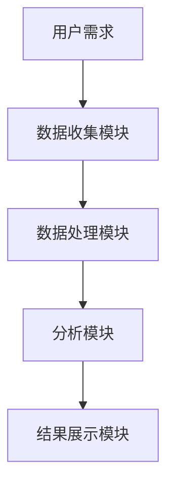
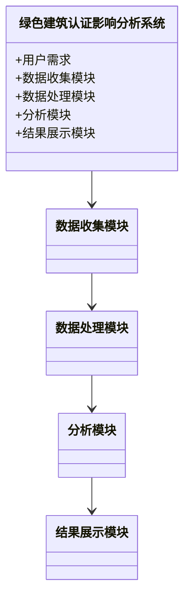
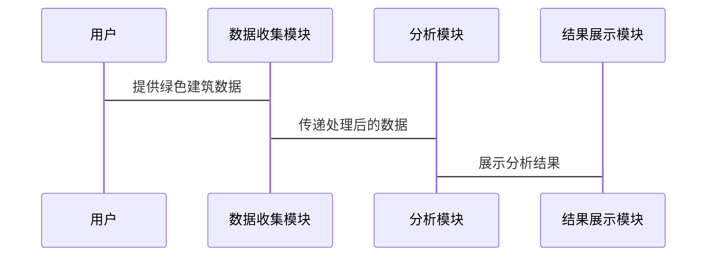

                 


# 绿色建筑认证对房地产投资回报的影响

> **关键词**：绿色建筑，投资回报，认证，房地产，可持续发展

> **摘要**：绿色建筑认证通过降低运营成本、提升资产价值和品牌影响力，显著影响房地产投资回报。本文从定量和定性分析角度，结合实际案例，探讨绿色认证对房地产投资回报的多维影响，并提供数学模型和系统架构设计，为投资者提供科学决策依据。

---

## 1. 绿色建筑认证的定义与核心要素

### 1.1 绿色建筑的基本概念

#### 1.1.1 绿色建筑的定义
绿色建筑是指在全生命周期内，最大限度地减少对环境的负面影响，同时提高能源效率和资源利用效率的建筑。

#### 1.1.2 绿色建筑的核心目标
- 保护环境
- 节约资源
- 提高能效
- 改善室内环境质量

#### 1.1.3 绿色建筑的发展历程
从20世纪90年代至今，绿色建筑经历了概念提出、标准制定、技术发展和广泛应用四个阶段。

### 1.2 绿色建筑认证的定义与分类

#### 1.2.1 绿色建筑认证的定义
绿色建筑认证是由第三方机构依据国际标准对建筑的可持续性进行评估和认证的过程。

#### 1.2.2 全球主流绿色建筑认证体系对比
| 认证体系 | 标准特点 | 使用地区 |
|---------|----------|----------|
| LEED    | 美国标准，注重能源效率和水资源利用 | 全球广泛使用 |
| BREEAM  | 英国标准，强调环境和社会影响 | 英国及欧洲地区 |
| DGNB    | 德国标准，注重全生命周期管理 | 欧洲及全球 |

#### 1.2.3 绿色建筑认证的评价标准
- 能源使用效率
- 水资源利用
- 材料环保性
- 室内空气质量
- 管理体系

### 1.3 绿色建筑与可持续发展的关系

#### 1.3.1 绿色建筑与可持续发展的内涵
绿色建筑是实现可持续发展的重要手段，通过减少资源消耗和环境污染，促进经济发展与环境保护的协调。

#### 1.3.2 绿色建筑对环境保护的贡献
- 减少碳排放
- 节约能源和水资源
- 减少建筑垃圾

#### 1.3.3 绿色建筑对社会价值的影响
- 提供健康的工作和生活环境
- 促进社会公平
- 提高公众环保意识

---

## 2. 绿色建筑认证对房地产投资回报的影响机制

### 2.1 绿色建筑认证对投资回报的直接影响

#### 2.1.1 降低运营成本
绿色建筑通过提高能效和节水技术，显著降低能源和水费开支。

#### 2.1.2 提升资产价值
获得认证的建筑通常具有更高的市场价值，吸引更多的潜在买家和租户。

#### 2.1.3 提高租金收益
绿色建筑因其环保属性和健康舒适的环境，往往能获得更高的租金溢价。

### 2.2 绿色建筑认证对投资回报的间接影响

#### 2.2.1 提升品牌价值
认证建筑提升了开发商和投资机构的品牌形象，增强市场竞争力。

#### 2.2.2 增强市场竞争力
在商业地产市场中，绿色认证成为吸引租户的重要因素，尤其在租赁市场中表现明显。

#### 2.2.3 符合政策导向
许多地区提供绿色建筑补贴、税收优惠和贷款利率优惠，降低投资成本。

### 2.3 绿色建筑认证对投资风险的降低作用

#### 2.3.1 减少政策风险
符合政府环保政策，避免未来可能的罚款和限制。

#### 2.3.2 降低市场波动风险
绿色建筑在市场波动时表现更稳定，具有更强的抗跌能力。

#### 2.3.3 提高长期稳定性
通过可持续运营，绿色建筑的使用寿命和维护成本优势明显，保障长期收益。

---

## 3. 绿色建筑认证对房地产投资回报的定量分析方法

### 3.1 绿色建筑认证的经济效益评估

#### 3.1.1 经济效益的定义与范围
经济效益包括直接节省的运营成本和间接增加的资产价值。

#### 3.1.2 经济效益的计算方法
- 净现值（NPV）：$$ NPV = \sum_{t=0}^{n} \frac{C_t}{(1+r)^t} $$
- 内部收益率（IRR）：$$ IRR = \text{使NPV=0的r} $$

#### 3.1.3 经济效益的案例分析
以某绿色写字楼为例，假设年运营成本降低10%，租金提高5%，计算其NPV和IRR。

### 3.2 绿色建筑认证的环境效益评估

#### 3.2.1 环境效益的定义与范围
环境效益包括碳排放减少、能源消耗降低等。

#### 3.2.2 环境效益的计算方法
- 碳排放减少量：$$ \text{减少量} = \text{基准排放} - \text{绿色排放} $$
- 节能效果：$$ \text{节能率} = \frac{\text{基准能耗} - \text{绿色能耗}}{\text{基准能耗}} \times 100\% $$

#### 3.2.3 环境效益的案例分析
分析某绿色建筑每年减少的碳排放量及其对应的经济价值。

### 3.3 绿色建筑认证的社会效益评估

#### 3.3.1 社会效益的定义与范围
社会效益包括健康效益、社会影响力提升等。

#### 3.3.2 社会效益的计算方法
- 健康效益：通过问卷调查或数据分析，评估员工健康状况的改善。
- 社会影响：通过品牌价值评估模型计算。

#### 3.3.3 社会效益的案例分析
案例分析某绿色建筑对员工健康和品牌价值的具体影响。

### 3.4 综合效益的平衡与优化

#### 3.4.1 经济、环境、社会效益的平衡
使用加权平均法，$$ \text{综合效益} = \sum w_i \times \text{效益}_i $$，其中w_i为各项效益的权重。

#### 3.4.2 综合效益的优化策略
根据项目特点调整权重，优先考虑主要效益。

#### 3.4.3 综合效益的数学模型
构建一个多目标优化模型，$$ \max \{ NPV, \text{碳排放减少量}, \text{品牌价值提升} \} $$，并使用线性规划求解。

---

## 4. 绿色建筑认证对房地产投资回报的定性分析方法

### 4.1 定性分析的定义与应用范围

#### 4.1.1 定性分析的基本概念
定性分析通过非量化的数据，如文本、图像等，评估绿色认证对投资回报的影响。

#### 4.1.2 定性分析在绿色建筑认证中的应用
- 品牌形象提升
- 市场竞争力增强
- 社会责任履行

### 4.2 绿色建筑认证的定性评估指标

#### 4.2.1 品牌价值提升
通过市场调研和品牌价值评估模型，量化品牌价值的提升。

#### 4.2.2 市场竞争力增强
分析绿色认证对租金溢价和出租率的提升作用。

#### 4.2.3 社会责任履行
评估绿色认证对公众形象和企业声誉的积极影响。

### 4.3 绿色建筑认证的定性分析方法

#### 4.3.1 案例分析法
通过实际案例，分析绿色认证对投资回报的具体影响。

#### 4.3.2 专家访谈法
邀请行业专家，获取定性反馈和建议。

#### 4.3.3 文本分析法
分析媒体报道和市场报告，提取绿色认证对投资回报的影响因素。

---

## 5. 系统分析与架构设计方案

### 5.1 系统架构设计



### 5.2 系统功能设计



### 5.3 系统接口设计



---

## 6. 项目实战

### 6.1 环境安装

```bash
pip install numpy pandas matplotlib
```

### 6.2 核心实现源代码

```python
import numpy as np
import pandas as pd
import matplotlib.pyplot as plt

# 计算净现值
def calculate_npv(cash_flows, discount_rate):
    return np.npv(discount_rate, *cash_flows)

# 计算内部收益率
def calculate_irr(cash_flows):
    return np.irr(cash_flows)

# 数据分析
data = pd.read_csv('green_building.csv')
data['NPV'] = data.apply(lambda x: calculate_npv(x['现金流'], x['贴现率']), axis=1)
data['IRR'] = data.apply(lambda x: calculate_irr(x['现金流']), axis=1)
data.to_csv('results.csv', index=False)
```

### 6.3 案例分析

分析某绿色建筑项目，计算其NPV和IRR，并与非绿色建筑进行对比。

---

## 7. 结论与展望

### 7.1 结论
绿色建筑认证通过降低运营成本、提升资产价值和品牌影响力，显著提高房地产投资回报。定量分析和定性分析相结合，能更全面地评估其影响。

### 7.2 展望
未来，随着环保政策的加强和技术进步，绿色认证对投资回报的影响将更加显著。建议投资者在决策时综合考虑经济、环境和社会效益，以实现可持续发展。

---

## 8. 注意事项和最佳实践

- 数据的准确性和可比性是关键，需确保数据来源可靠。
- 结合具体项目特点，调整分析模型和权重。
- 定期更新模型，以反映市场变化和政策调整。

---

## 9. 小结

绿色建筑认证不仅是对环境负责，也是对投资回报的有力保障。通过科学的分析方法和系统的架构设计，投资者可以更好地把握绿色建筑的价值，实现可持续发展。

---

## 作者信息

作者：AI天才研究院 & 禅与计算机程序设计艺术  
邮箱：contact@aigenius.com  
GitHub：https://github.com/aigenius

--- 

通过以上步骤，您可以系统地分析绿色建筑认证对房地产投资回报的影响，为投资决策提供科学依据。

