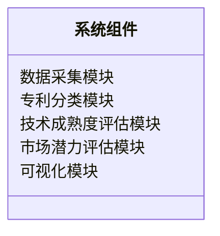
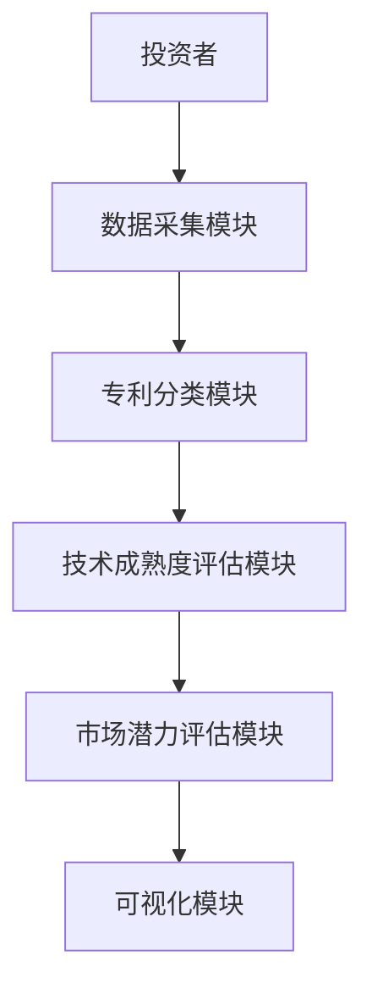

                 


```markdown
# 绿色技术专利分析与投资机会识别方法

> 关键词：绿色技术、专利分析、投资机会、技术成熟度、市场潜力

> 摘要：本文详细探讨了绿色技术专利分析的方法及其在投资机会识别中的应用。通过分析绿色技术的定义、专利分析的核心概念、算法原理、系统架构设计和项目实战，结合最佳实践，为投资者和研究人员提供了一套系统的方法论，帮助他们更有效地识别和评估绿色技术的投资价值。

---

# 第一部分: 绿色技术专利分析与投资机会识别背景

## 第1章: 绿色技术与专利分析概述

### 1.1 绿色技术的定义与内涵

#### 1.1.1 绿色技术的核心概念
绿色技术是指那些能够减少资源消耗、降低污染排放、提高能源利用效率，并促进可持续发展的技术。这些技术通常涵盖可再生能源、节能环保、循环经济、生态修复等领域。

#### 1.1.2 绿色技术的分类与特征
绿色技术可以分为以下几类：
- **可再生能源技术**：如太阳能、风能、生物质能等。
- **节能环保技术**：如能效提升、污染控制等。
- **循环经济与资源再利用技术**：如废弃物资源化、工业共生等。
- **生态修复技术**：如土壤修复、水体修复等。

绿色技术的特征包括技术创新性、环境效益显著、市场潜力大等。

#### 1.1.3 绿色技术的全球发展趋势
随着全球对可持续发展的关注，绿色技术在全球范围内呈现出快速发展的趋势。各国政府和企业都在加大对绿色技术的投入，专利申请量也在逐年增加。

---

### 1.2 专利分析的背景与意义

#### 1.2.1 专利分析的基本概念
专利分析是通过对专利数据的收集、整理和分析，了解某一领域的技术发展状况、竞争格局和创新趋势。专利数据包括专利申请数量、申请人、技术领域分布、专利引用关系等。

#### 1.2.2 专利分析在技术研究中的作用
专利分析可以帮助研究人员了解技术的创新热点、技术成熟度、技术差距等，为技术研发和战略布局提供参考。

#### 1.2.3 绿色技术专利分析的独特价值
绿色技术专利分析可以帮助投资者识别高潜力的技术领域，评估技术的市场价值，降低投资风险。

---

### 1.3 绿色技术与专利分析的结合

#### 1.3.1 绿色技术的创新与专利保护
绿色技术的创新通常通过专利申请来保护其知识产权，这为专利分析提供了丰富的数据来源。

#### 1.3.2 专利技术的市场价值评估
通过专利分析，可以评估技术的市场潜力、技术成熟度、竞争对手情况等，为投资决策提供依据。

#### 1.3.3 绿色技术专利分析的挑战与机遇
绿色技术专利分析面临数据量大、分析复杂性高等挑战，但也带来了巨大的投资机遇，尤其是在应对气候变化和可持续发展目标的推动下。

---

## 第2章: 绿色技术专利分析的核心概念与联系

### 2.1 绿色技术专利分析的原理

#### 2.1.1 绿色技术的专利申请流程
绿色技术的专利申请流程包括专利检索、专利分类、专利评估等步骤。通过这些步骤，可以系统地分析绿色技术的专利布局。

#### 2.1.2 专利分析的基本方法
专利分析的基本方法包括定量分析和定性分析。定量分析主要通过统计方法，如专利申请量、申请人分布等；定性分析则通过技术领域分布、专利摘要、权利要求等进行分析。

#### 2.1.3 绿色技术专利分析的指标体系
绿色技术专利分析的指标体系包括技术成熟度、市场潜力、技术差距等。这些指标可以帮助投资者全面评估绿色技术的投资价值。

---

### 2.2 绿色技术与专利的关系

#### 2.2.1 绿色技术的创新与专利保护
绿色技术的创新往往通过专利申请来保护，专利可以反映技术的创新性和商业化潜力。

#### 2.2.2 专利技术的市场价值评估
通过专利分析，可以评估技术的市场潜力、技术成熟度、市场需求等，为投资决策提供依据。

#### 2.2.3 绿色技术专利的生命周期分析
技术的生命周期分析可以帮助投资者了解专利的生命周期，从而做出更合理的投资决策。

---

### 2.3 绿色技术专利分析的实体关系图

```mermaid
er
actor: 投资者
actor: 技术研发机构
actor: 专利数据库
class: 绿色技术
class: 专利
class: 投资机会
```

---

## 第3章: 绿色技术专利分析的算法原理

### 3.1 绿色技术专利分析的流程

#### 3.1.1 数据采集与预处理
绿色技术专利分析的第一步是数据采集，包括从专利数据库中获取绿色技术相关的专利数据，并进行清洗和整理。

#### 3.1.2 专利分类与特征提取
将专利按照技术领域进行分类，并提取关键特征，如技术领域、申请人、申请时间等。

#### 3.1.3 专利技术成熟度评估
基于专利的特征，评估其技术成熟度，通常采用加权评分的方法。

---

### 3.2 算法原理的数学模型

#### 3.2.1 技术成熟度指数计算
$$ S = \sum_{i=1}^{n} w_i x_i $$
其中，$S$ 为技术成熟度指数，$w_i$ 为特征权重，$x_i$ 为特征值。

#### 3.2.2 市场潜力评估模型
$$ P = a \cdot S + b \cdot M + c \cdot G $$
其中，$P$ 为市场潜力，$S$ 为技术成熟度，$M$ 为市场需求，$G$ 为政策支持。

---

### 3.3 算法实现的Python代码示例

```python
def calculate_technology_maturity(patents):
    weights = [0.4, 0.3, 0.2, 0.1]
    features = [patent.feature1, patent.feature2, patent.feature3, patent.feature4]
    maturity = sum(w * f for w, f in zip(weights, features))
    return maturity

# 示例数据
patent = {
    'feature1': 0.8,
    'feature2': 0.7,
    'feature3': 0.6,
    'feature4': 0.5
}

maturity = calculate_technology_maturity(patent)
print(f"技术成熟度指数: {maturity}")
```

---

## 第4章: 绿色技术专利分析的系统架构设计

### 4.1 问题场景介绍
以可再生能源领域的专利分析为例，描述系统需要解决的问题和目标。

### 4.2 系统功能设计



### 4.3 系统架构设计



---

## 第5章: 绿色技术专利分析的项目实战

### 5.1 环境安装
安装必要的软件和工具，例如Python、数据采集工具、数据分析库等。

### 5.2 系统核心实现源代码

```python
# 数据采集模块
import requests
from bs4 import BeautifulSoup

def fetch_patents(url):
    response = requests.get(url)
    soup = BeautifulSoup(response.text, 'html.parser')
    patents = []
    for patent in soup.find_all('patent'):
        patents.append({
            'title': patent.title.text,
            'applicant': patent.applicant.text,
            'date': patent.date.text
        })
    return patents

# 示例运行
patents = fetch_patents('https://example.com/patents')
print(patents)
```

---

## 第6章: 最佳实践与总结

### 6.1 最佳实践 tips
- 选择权威的专利数据库，如WIPO、USPTO等。
- 结合技术专家的分析，提高专利分析的准确性。
- 定期更新专利数据，跟踪技术发展趋势。

### 6.2 小结
本文详细探讨了绿色技术专利分析的方法及其在投资机会识别中的应用，为投资者和研究人员提供了一套系统的方法论。

### 6.3 注意事项
- 注意数据的准确性和隐私问题。
- 在进行专利分析时，需遵守相关法律法规。

### 6.4 拓展阅读
推荐相关书籍和资源，供读者进一步学习和研究。

---

# 作者：AI天才研究院/AI Genius Institute & 禅与计算机程序设计艺术/Zen And The Art of Computer Programming
```

