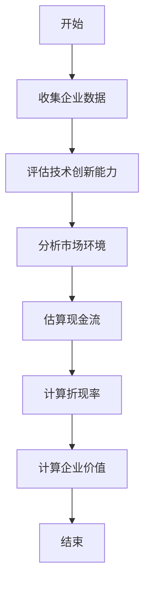

                 


# 绿色科技创新企业的估值挑战与机遇

> 关键词：绿色科技，企业估值，创新，可持续发展，风险管理

> 摘要：绿色科技创新企业作为推动全球可持续发展的重要力量，其估值问题具有特殊性与挑战性。本文从绿色科技的核心概念出发，分析其与传统企业的区别，探讨绿色科技创新企业在估值过程中的独特优势与面临的挑战。通过构建绿色科技企业的估值模型，结合实际案例，提出创新的估值方法，并展望绿色科技企业在未来的发展趋势与投资机会。

---

## 第一部分：绿色科技创新企业的背景与概念

### 第1章：绿色科技创新企业的定义与特点

#### 1.1 绿色科技的定义与内涵
绿色科技（Green Technology）是指在环境保护和资源节约的前提下，通过技术创新和应用，实现经济活动的可持续发展。绿色科技的核心在于减少资源消耗、降低环境污染、提高能源利用效率，并通过技术手段推动社会向低碳、循环经济模式转型。

绿色科技创新企业的特点包括：
- **技术驱动**：以技术创新为核心竞争力。
- **可持续性**：产品或服务在全生命周期内具有环境友好性。
- **社会价值**：通过技术创新解决环境问题，创造社会价值。
- **政策支持**：通常享有政府政策支持和行业补贴。

#### 1.2 绿色科技创新企业的商业模式
绿色科技创新企业的商业模式与传统企业有显著不同，主要体现在以下几个方面：
- **价值主张**：通过提供环保解决方案或绿色产品，满足市场对可持续发展的需求。
- **收入来源**：包括技术授权、绿色产品销售、碳交易等。
- **成本结构**：研发投入较高，但长期来看，环境成本的降低可以带来显著的经济效益。
- **客户关系**：注重与政府、企业、消费者建立长期合作关系，推动绿色技术的广泛应用。

### 第2章：绿色科技创新企业的现状与发展

#### 2.1 绿色科技行业的全球发展概况
全球范围内，绿色科技行业呈现快速增长态势。根据国际能源署（IEA）的报告，2020年全球可再生能源投资达到5000亿美元，其中绿色科技企业占据了重要份额。中国作为全球最大的碳排放国，也在积极推动绿色科技发展，提出了“碳中和”目标。

#### 2.2 绿色科技创新企业的技术应用领域
绿色科技创新企业的技术应用主要集中在以下几个领域：
1. **可再生能源**：包括太阳能、风能等清洁能源技术。
2. **环境保护**：如污水处理、大气污染治理技术。
3. **绿色交通**：电动车辆、智能交通管理系统的开发。
4. **循环经济**：资源回收与再利用技术。

---

## 第二部分：绿色科技创新企业的核心概念与联系

### 第3章：绿色科技创新的核心要素与关系

#### 3.1 绿色科技创新的核心要素
绿色科技创新的核心要素包括：
- **技术创新**：绿色科技企业的核心竞争力在于技术的创新性和领先性。
- **商业模式创新**：通过创新的商业模式实现技术的商业化应用。
- **组织创新**：绿色科技企业需要建立灵活高效的组织架构，以适应快速变化的市场需求。

#### 3.2 绿色科技创新的核心概念关系图

```mermaid
erDiagram
    actor 顾客
    actor 政府
    actor 投资者
    actor 传统企业
    actor 竞争对手
    class 绿色科技企业 {
        技术创新
        商业模式创新
        组织创新
    }
    竞争对手 -->[竞争压力] 绿色科技企业
    顾客 -->[需求驱动] 绿色科技企业
    政府 -->[政策支持] 绿色科技企业
    投资者 -->[资金支持] 绿色科技企业
    传统企业 -->[转型需求] 绿色科技企业
```

---

## 第三部分：绿色科技创新企业的估值挑战与机遇

### 第4章：绿色科技创新企业的估值方法

#### 4.1 绿色科技企业的估值模型
传统的估值方法（如DCF模型）在绿色科技企业的应用中面临特殊挑战。绿色科技企业的估值需要考虑以下几个因素：
- **技术不确定性**：绿色技术的成熟度可能影响企业的未来盈利能力。
- **政策风险**：政府政策的变化可能对绿色科技企业的估值产生重大影响。
- **环境效益**：绿色科技企业的环境效益难以量化，但可以通过碳减排等指标进行估算。

#### 4.2 绿色科技创新企业的估值模型设计



---

### 第4章：绿色科技创新企业的估值方法（续）

#### 4.3 绿色科技创新企业的估值挑战与应对策略
- **挑战**：
  - 绿色技术的不确定性可能导致估值偏差。
  - 环境效益难以量化，影响估值的准确性。
  - 政策变化可能对估值产生重大影响。
- **应对策略**：
  - 使用情景分析法评估不同政策环境下的企业价值。
  - 将碳资产纳入估值模型，反映环境效益。
  - 采用动态调整模型，实时更新企业价值评估。

#### 4.4 绿色科技创新企业的估值案例分析
以某家新能源汽车企业为例，假设其2023年的销售收入为10亿元，净利润率为10%，折现率为8%。根据DCF模型，其企业价值可以估算为：

$$
\text{企业价值} = \sum_{t=1}^{n} \frac{\text{净利润}_t}{(1 + r)^t}
$$

其中，$r$为折现率，$n$为预测年限。

---

## 第四部分：绿色科技创新企业的风险管理与挑战

### 第5章：绿色科技创新企业的风险管理

#### 5.1 绿色科技创新企业的风险类型
绿色科技创新企业面临的主要风险包括：
- **市场风险**：绿色技术的市场需求可能低于预期。
- **技术风险**：技术创新失败可能导致企业竞争力下降。
- **政策风险**：政府政策的变化可能影响企业的经营环境。

#### 5.2 绿色科技创新企业的风险管理模型

```mermaid
graph TD
    A[风险识别] --> B[风险评估]
    B --> C[风险应对]
    C --> D[风险监控]
    D --> 结束
```



---

## 第五部分：绿色科技创新企业的投资机会与策略

### 第6章：绿色科技创新企业的投资机会

#### 6.1 绿色科技创新企业的投资趋势
全球范围内，绿色科技投资呈现快速增长态势。根据麦肯锡的报告，2023年全球绿色科技投资有望突破6000亿美元。

#### 6.2 绿色科技创新企业的领先案例
- **特斯拉**：通过技术创新推动电动汽车的普及。
- **宁德时代**：全球领先的动力电池供应商。
- **远景能源**：智能风机技术推动风能发电。

---

## 第六部分：绿色科技创新企业的未来发展趋势

### 第7章：绿色科技创新企业的未来展望

#### 7.1 绿色科技创新企业的未来发展方向
- **技术创新**：进一步提高绿色技术的效率和经济性。
- **技术融合**：绿色技术与其他技术的深度融合。
- **全球化合作**：加强国际间的技术交流与合作。

---

## 第七部分：附录

### 附录A：绿色科技创新企业相关术语表
- 绿色科技：指在环境保护和资源节约的前提下，通过技术创新实现经济活动的可持续发展。
- 碳中和：指企业或个人在一定时间内，通过减少或抵消碳排放，实现净零碳排放。

### 附录B：绿色科技创新企业估值工具推荐
- Python代码示例：用于DCF模型的计算。
- 数据来源：国际能源署、麦肯锡报告等。

---

## 作者：AI天才研究院/AI Genius Institute & 禅与计算机程序设计艺术/Zen And The Art of Computer Programming

