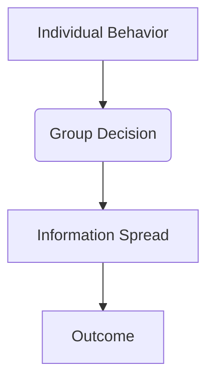

                 


# 羊群效应：理解并避免从众心理陷阱

> 关键词：羊群效应, 从众心理, 群体决策, 信息传播, 群体行为

> 摘要：羊群效应是一种普遍存在的社会现象，它描述了个体在群体压力下，容易受到周围人影响而做出从众行为的现象。本文通过分析羊群效应的定义、心理机制、数学模型以及系统架构，帮助读者理解这一现象，并提供避免从众心理陷阱的方法。

---

# 第一部分: 羊群效应的背景与概念

## 第1章: 羊群效应的定义与背景

### 1.1 羊群效应的定义与背景

羊群效应（Herding Effect）是一种社会现象，指个体在面对不确定性时，倾向于模仿或跟随大多数人的行为，从而导致群体行为的一致性。这种现象在经济、社会、科技等领域普遍存在，例如金融市场的跟风投资、社交媒体上的信息传播等。

#### 1.1.1 羊群效应的定义与概念

羊群效应的核心在于个体决策受到群体行为的影响，导致个体行为趋同。这种趋同行为可能与个体的真实偏好不符，但为了融入群体或避免被孤立，个体选择跟随 majority。

#### 1.1.2 羊群效应的历史背景

羊群效应的概念最早可以追溯到古希腊哲学家亚里士多德的“多数人原则”。在现代社会中，随着信息传播技术的进步，羊群效应的表现形式更加多样，例如互联网时代的“口碑传播”和“信息 cascade”。

#### 1.1.3 羊群效应的普遍性与现实意义

羊群效应的普遍性体现在人类社会的各个领域，尤其是在信息不对称和不确定性较高的环境中，个体更容易受到群体行为的影响。理解羊群效应有助于我们更好地做出理性决策，避免被盲目跟风所左右。

### 1.2 羊群效应的心理机制

#### 1.2.1 从众心理的形成原因

从众心理是羊群效应的核心驱动力，主要包括以下几种原因：

1. **社会认同**：个体倾向于认同 majority group，以获得归属感和安全感。
2. **信息影响**：在不确定的情况下，个体倾向于依赖 majority opinion作为决策依据。
3. **风险分担**：跟随 majority 可以降低个体的决策风险，将责任分散到群体中。

#### 1.2.2 羊群效应的传播机制

羊群效应的传播机制通常包括以下几个步骤：

1. **信息传播**：个体间通过交流传播信息，形成信息 cascade。
2. **群体决策**：多数个体的决策影响少数个体的判断，形成群体行为的一致性。
3. **强化效应**：群体行为的趋同进一步强化个体的从众行为。

#### 1.2.3 个体决策与群体决策的差异

个体决策主要基于个人偏好和信息，而群体决策则受到社会影响和群体互动的影响。两者的主要差异体现在信息来源、决策依据和风险承担上。

---

## 第2章: 羊群效应的数学模型与算法

### 2.1 羊群效应的数学模型

#### 2.1.1 信息传播模型

信息传播模型描述了信息在群体中的传播过程，可以用以下公式表示：

$$
P(i \rightarrow j) = \frac{1}{N-1}
$$

其中，$P(i \rightarrow j)$ 表示个体 $i$ 向个体 $j$ 传播信息的概率，$N$ 是群体规模。

#### 2.1.2 群体决策模型

群体决策模型可以表示为：

$$
D_{\text{group}} = \text{sign}(\sum_{i=1}^{N} w_i D_i)
$$

其中，$D_{\text{group}}$ 表示群体决策，$w_i$ 是个体权重，$D_i$ 是个体决策。

### 2.2 羊群效应的算法实现

#### 2.2.1 基于 agent 的信息传播算法

以下是一个简单的信息传播算法示例：

```python
def information_spread(network):
    for each node in network:
        if node.is_infected:
            for neighbor in node.neighbors:
                if not neighbor.is_infected:
                    neighbor.chance_to_infect = 0.5
                    if random < neighbor.chance_to_infect:
                        neighbor.is_infected = True
```

#### 2.2.2 群体决策模拟算法

群体决策模拟算法可以通过以下步骤实现：

1. 初始化个体偏好。
2. 计算个体权重。
3. 聚合个体决策形成群体决策。

---

## 第3章: 羊群效应的系统分析与架构设计

### 3.1 羊群效应的系统架构

#### 3.1.1 系统功能模块

系统功能模块包括：

- 信息传播模块
- 群体决策模块
- 个体行为模块

#### 3.1.2 羊群效应的系统架构图



### 3.2 羊群效应的系统设计

#### 3.2.1 个体行为建模

个体行为建模可以通过以下步骤实现：

1. 确定个体偏好。
2. 计算个体权重。
3. 聚合个体决策。

#### 3.2.2 群体行为建模

群体行为建模可以通过以下步骤实现：

1. 初始化群体。
2. 传播信息。
3. 形成群体决策。

---

## 第4章: 避免羊群效应陷阱的策略

### 4.1 提高个体决策能力

#### 4.1.1 培养独立思考能力

独立思考能力是避免从众心理的关键，可以通过以下方式提升：

1. 学习逻辑思维。
2. 提高信息分析能力。
3. 培养批判性思维。

#### 4.1.2 获取更多信息

通过获取更多信息，可以减少信息不对称，避免盲目跟风。

### 4.2 改善群体决策机制

#### 4.2.1 建立透明的信息传播机制

透明的信息传播机制有助于减少信息 cascade 的负面影响。

#### 4.2.2 优化群体决策流程

优化群体决策流程可以通过以下方式实现：

1. 建立决策规则。
2. 明确决策权限。
3. 建立反馈机制。

---

## 第5章: 总结与展望

### 5.1 羊群效应的核心思想

羊群效应的核心思想在于理解个体与群体行为的差异，并通过理性决策避免从众心理的陷阱。

### 5.2 未来的挑战与机遇

随着信息技术的发展，羊群效应的表现形式将更加多样化，未来的研究需要关注如何利用技术手段减少其负面影响。

---

# 作者：AI天才研究院/AI Genius Institute & 禅与计算机程序设计艺术 /Zen And The Art of Computer Programming

---

通过以上分析，我们可以看到羊群效应是一种复杂的社会现象，其背后涉及心理、数学和系统等多个层面的因素。理解羊群效应的原理和机制，有助于我们在实际生活中做出更加理性的决策，避免掉进从众心理的陷阱。

