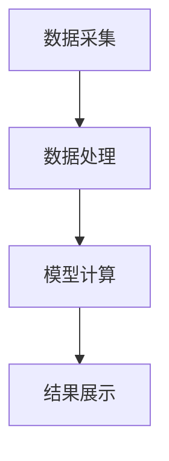

                 


# 美国市场估值预测的成功经验及其启示

---

## 关键词：
美国市场、估值预测、投资策略、市场分析、风险管理、技术指标

---

## 摘要：
本文系统地探讨了美国市场估值预测的核心理论、实践经验及其成功启示。通过分析市场估值的基本概念、常见模型和预测方法，结合实际案例，深入解读了如何在美国市场中实现精准的估值预测，并总结了可应用于其他市场的通用策略。

---

## 第一部分：美国市场估值预测的背景与核心概念

### 第1章：市场估值预测的背景与重要性

#### 1.1 什么是市场估值预测
市场估值预测是指通过分析市场数据和经济指标，预测市场未来价格走势的过程。它帮助投资者在不确定性中做出更明智的决策。在美国市场，由于其高度流动性和复杂性，估值预测尤为重要。

#### 1.2 美国市场的独特性
- 美国市场是全球最大的股票市场之一，具有高度的流动性和透明性。
- 市场参与者多元化，包括机构投资者、个人投资者和外国投资者。
- 美国市场的波动性较高，受经济周期、政策变化和市场情绪的影响较大。

#### 1.3 估值预测的定义与作用
- 定义：通过分析历史数据和当前市场状况，预测市场未来走势。
- 作用：帮助投资者制定投资策略，规避风险，优化资产配置。

---

### 第2章：市场估值的核心概念与原理

#### 2.1 市场估值的核心概念
- **价格与价值**：价格是市场的即时报价，价值是资产的内在价值。
- **风险与回报**：高风险资产通常具有更高的潜在回报。

#### 2.2 市场估值的基本假设
- 市场参与者理性行为。
- 市场信息透明且有效。

#### 2.3 估值预测的核心原理
- 基于历史数据分析预测未来走势。
- 利用技术指标和市场情绪分析辅助决策。

---

## 第二部分：美国市场估值预测的模型与方法

### 第3章：常见的市场估值模型

#### 3.1 市盈率模型（P/E）
- **定义**：市盈率=股价/每股收益。
- **应用场景**：适用于稳定增长的企业。

#### 3.2 市净率模型（P/B）
- **定义**：市净率=股价/每股净资产。
- **应用场景**：适用于金融、房地产等资产密集型行业。

#### 3.3 市销率模型（P/S）
- **定义**：市销率=股价/每股销售额。
- **应用场景**：适用于高增长但利润较低的公司。

#### 3.4 市值回报率模型（PEG）
- **定义**：PEG=市盈率/盈利增长率。
- **应用场景**：适用于高增长公司。

---

### 第4章：美国市场估值预测的步骤

#### 4.1 数据收集与整理
- 收集历史价格数据、财务数据和市场指标。
- 清洗数据，去除异常值。

#### 4.2 模型选择与参数设定
- 根据市场特性选择合适的模型。
- 设定参数，如时间窗口、数据频率。

#### 4.3 估值预测与结果分析
- 通过模型生成预测结果。
- 对比实际数据，评估模型准确性。

---

## 第三部分：美国市场估值预测的系统设计与实现

### 第5章：市场估值预测的系统架构设计

#### 5.1 系统功能模块设计
- 数据采集模块：实时收集市场数据。
- 数据处理模块：清洗和转换数据。
- 模型计算模块：运行估值模型。
- 结果展示模块：可视化预测结果。

#### 5.2 系统架构图



#### 5.3 系统接口设计
- 输入接口：接收市场数据和模型参数。
- 输出接口：返回预测结果和分析报告。

---

### 第6章：项目实战分析

#### 6.1 环境安装与数据准备
- 使用Python和相关库（如Pandas、NumPy）。
- 数据来源：Yahoo Finance API。

#### 6.2 核心代码实现
```python
import pandas as pd
import numpy as np

def calculate_pe_ratio(dataframe):
    df = dataframe.copy()
    df['PE'] = df['Price'] / df['EPS']
    return df['PE']

# 示例数据
data = {
    'Date': ['2023-01-01', '2023-01-02', '2023-01-03'],
    'Price': [100, 102, 98],
    'EPS': [10, 10, 9]
}

df = pd.DataFrame(data)
pe_ratio = calculate_pe_ratio(df)
print(pe_ratio)
```

#### 6.3 案例分析与解读
- 通过市盈率模型分析某公司股票，预测其未来价格走势。
- 对比实际数据，评估模型准确性。

---

## 第四部分：总结与启示

### 第7章：成功经验总结

#### 7.1 成功经验总结
- 采用多模型结合方法，提高预测准确性。
- 定期更新模型参数，适应市场变化。

#### 7.2 对其他市场的启示
- 可以借鉴美国市场的估值方法，但需结合本地市场特点。
- 加强市场数据收集和分析能力。

---

## 作者：AI天才研究院 & 禅与计算机程序设计艺术

---

通过本文的系统分析，读者可以深入了解美国市场估值预测的核心理论和实践方法，同时也能将这些经验应用于其他市场，提升投资决策的科学性和准确性。

