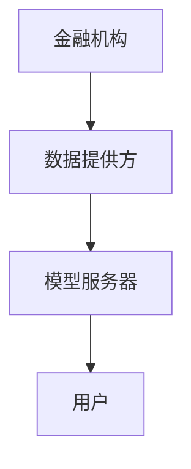
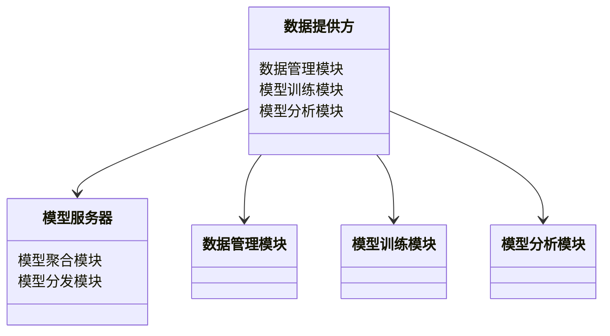
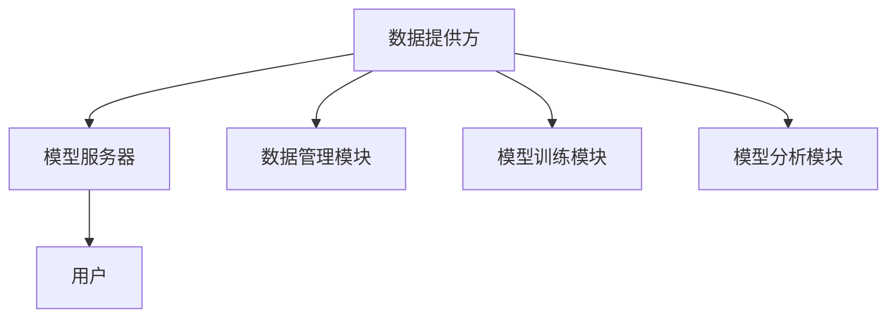
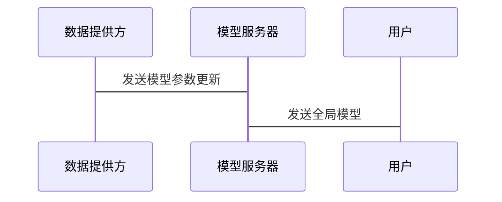

                 


# 联邦学习在金融机构间数据协作中的应用

## 关键词：联邦学习, 金融机构, 数据协作, 数据隐私, 分布式模型

## 摘要：  
随着数据隐私保护的重要性日益增加，金融机构间的数据协作面临越来越大的挑战。联邦学习作为一种新兴的技术，能够在不共享原始数据的情况下，通过模型的协作训练实现数据的联合利用。本文详细探讨了联邦学习在金融机构间数据协作中的应用，从核心概念、算法原理、系统架构到实际项目实现，全面分析了其在金融领域的优势与挑战，并给出了最佳实践建议。

---

# 第一部分: 联邦学习的背景与概念

## 第1章: 联邦学习的起源与发展

### 1.1 数据协作的背景与挑战

#### 1.1.1 数据隐私保护的重要性  
在金融行业，数据隐私保护是重中之重。金融机构处理大量敏感数据，包括客户信息、交易记录等，这些数据的泄露可能带来巨大的经济损失和声誉损害。传统的数据协作方式往往需要共享原始数据，这种方式不仅存在隐私泄露的风险，还可能违反相关法律法规。

#### 1.1.2 数据协作的现状与问题  
金融机构间常常需要合作进行数据分析和模型训练，但由于数据隐私保护的限制，数据共享变得困难。例如，银行和保险公司可能需要合作开发风险评估模型，但各自的数据孤岛问题使得合作变得复杂。

#### 1.1.3 联邦学习的提出与意义  
联邦学习（Federated Learning）是一种新兴的人工智能技术，它允许多个参与方在不共享原始数据的情况下，通过模型的协作训练来实现共同的目标。这种技术为金融机构间的数据协作提供了一种新的解决方案，能够在保护数据隐私的前提下，充分利用各方数据进行模型训练。

### 1.2 联邦学习的核心概念

#### 1.2.1 数据隐私保护机制  
联邦学习通过加密通信和差分隐私等技术，确保数据在传输和计算过程中不会泄露敏感信息。每个参与方仅分享模型参数的更新，而不共享原始数据。

#### 1.2.2 数据分割与模型聚合  
在联邦学习中，数据被分割到不同的参与方，每个参与方仅拥有本地数据的使用权。模型训练时，各方在本地数据上训练模型，并将模型参数的更新传递给中央服务器或协调方，最终通过模型聚合得到一个全局模型。

#### 1.2.3 联邦学习与传统数据协作方式的对比  
传统的数据协作方式通常需要共享原始数据，而联邦学习通过模型参数的共享实现了数据的不共享。这种差异使得联邦学习在数据隐私保护方面具有明显优势。

### 1.3 联邦学习在金融领域的应用现状

#### 1.3.1 金融机构间数据协作的痛点  
金融机构间数据协作的主要痛点包括数据隐私保护、数据孤岛问题、数据格式不统一等。这些问题使得传统数据协作方式难以满足金融机构的需求。

#### 1.3.2 联邦学习在金融领域的应用案例  
目前，联邦学习已经在金融领域得到了一些应用，例如联合信用评分模型、欺诈检测模型等。这些应用展示了联邦学习在金融机构间数据协作中的潜力。

#### 1.3.3 联邦学习的优势与局限性  
联邦学习的优势在于能够保护数据隐私，同时充分利用各方数据进行模型训练。其局限性在于模型训练效率较低，且需要较高的通信成本。

---

## 第2章: 联邦学习的核心概念与联系

### 2.1 联邦学习的基本原理

#### 2.1.1 数据隐私保护机制  
联邦学习通过加密通信和差分隐私等技术，确保数据在传输和计算过程中不会泄露敏感信息。每个参与方仅分享模型参数的更新，而不共享原始数据。

#### 2.1.2 数据分割与模型聚合  
在联邦学习中，数据被分割到不同的参与方，每个参与方仅拥有本地数据的使用权。模型训练时，各方在本地数据上训练模型，并将模型参数的更新传递给中央服务器或协调方，最终通过模型聚合得到一个全局模型。

#### 2.1.3 联邦学习与其他数据协作技术的对比  
联邦学习与其他数据协作技术，如区块链和联邦学习的结合，可以通过区块链技术实现数据的不可篡改性和透明性。

### 2.2 联邦学习的核心要素

#### 2.2.1 数据提供方的职责与权限  
数据提供方负责本地数据的管理，仅分享模型参数的更新，而不共享原始数据。数据提供方需要确保本地数据的完整性和安全性。

#### 2.2.2 模型服务器的功能与作用  
模型服务器负责协调各方的模型训练过程，接收各方的模型参数更新，并进行模型聚合，最终生成全局模型。

#### 2.2.3 用户隐私保护的实现方式  
用户隐私保护可以通过差分隐私、加密计算等技术实现，确保用户数据在模型训练过程中不被泄露。

### 2.3 联邦学习的实体关系图

#### 2.3.1 实体关系图的描述  
以下是一个简单的实体关系图，展示了金融机构、数据提供方、模型服务器和用户之间的关系：



#### 2.3.2 数据流、模型流和结果流的流向  
- 数据流：数据提供方将本地数据用于模型训练，仅分享模型参数更新。
- 模型流：模型服务器接收各方的模型参数更新，进行模型聚合，并将全局模型分发给各方。
- 结果流：各方根据全局模型进行预测和分析，得到最终的分析结果。

---

## 第3章: 联邦学习的算法原理

### 3.1 数据预处理

#### 3.1.1 数据清洗与标准化  
数据清洗包括去除重复数据、处理缺失值等。标准化则是将数据归一化，以便不同数据源的数据能够协同训练。

#### 3.1.2 数据分割与分配  
数据被分割到不同的参与方，每个参与方仅拥有本地数据的使用权。

#### 3.1.3 数据隐私保护的实现方式  
通过加密通信和差分隐私等技术，确保数据在传输和计算过程中不会泄露敏感信息。

### 3.2 模型训练与聚合

#### 3.2.1 分布式模型训练的流程  
1. 每个参与方在本地数据上训练模型。
2. 参与方将模型参数的更新传递给中央服务器或协调方。
3. 模型服务器接收各方的模型参数更新，并进行模型聚合。

#### 3.2.2 模型聚合的方法与实现  
模型聚合通常采用加权平均的方式，权重可以根据参与方的数据量或模型性能来确定。

#### 3.2.3 模型优化的策略与技巧  
模型优化可以通过调整学习率、增加正则化项等方法来提高模型的性能。

### 3.3 模型更新与通信

#### 3.3.1 模型参数的更新与同步  
参与方在本地训练模型后，将模型参数的更新传递给中央服务器或协调方。

#### 3.3.2 数据隐私保护机制的实现  
通过加密通信和差分隐私等技术，确保模型参数的更新不会泄露敏感信息。

#### 3.3.3 模型性能的评估与优化  
模型性能可以通过准确率、召回率等指标进行评估，并通过调整模型参数和优化算法来提高模型性能。

---

## 第4章: 金融机构间数据协作的系统架构

### 4.1 系统功能设计

#### 4.1.1 数据管理模块  
数据管理模块负责本地数据的存储、清洗和预处理。

#### 4.1.2 模型训练模块  
模型训练模块负责在本地数据上训练模型，并将模型参数的更新传递给模型服务器。

#### 4.1.3 模型分析模块  
模型分析模块负责对全局模型进行评估和分析，输出最终的分析结果。

### 4.2 系统架构设计

#### 4.2.1 领域模型类图  
以下是一个简单的领域模型类图：



#### 4.2.2 系统架构图  
以下是一个简单的系统架构图：



#### 4.2.3 系统接口设计  
系统接口设计包括数据提供方与模型服务器之间的通信接口，以及模型服务器与用户之间的接口。

#### 4.2.4 系统交互序列图  
以下是一个简单的系统交互序列图：



---

## 第5章: 项目实战

### 5.1 环境安装

#### 5.1.1 安装必要的库  
需要安装的库包括TensorFlow、Flatten等。

#### 5.1.2 安装步骤  
1. 使用pip安装所需的库：`pip install tensorflow flatten`

### 5.2 系统核心实现源代码

#### 5.2.1 数据预处理代码  
```python
import pandas as pd
import numpy as np

# 加载数据
data = pd.read_csv('data.csv')

# 数据清洗
data = data.dropna()
data = data.drop_duplicates()

# 数据标准化
from sklearn.preprocessing import StandardScaler
scaler = StandardScaler()
data_normalized = scaler.fit_transform(data)
```

#### 5.2.2 模型训练与聚合代码  
```python
import tensorflow as tf
from tensorflow.keras import layers

# 模型定义
model = tf.keras.Sequential([
    layers.Dense(64, activation='relu'),
    layers.Dense(1)
])

# 模型训练
model.compile(optimizer='adam', loss='mse')

# 模型聚合
def model_average(weights1, weights2):
    # 权重平均
    return [(w1 + w2) / 2 for w1, w2 in zip(weights1, weights2)]

global_weights = model.get_weights()
# 更新全局模型权重
model.set_weights(model_average(local_weights1, local_weights2))
```

#### 5.2.3 模型评估与分析代码  
```python
# 模型评估
loss = model.evaluate(x_test, y_test)
print(f'Loss: {loss}')

# 模型预测
predictions = model.predict(x_test)
```

### 5.3 代码应用解读与分析

#### 5.3.1 数据预处理解读  
数据预处理包括数据清洗和标准化，确保数据的完整性和一致性。

#### 5.3.2 模型训练与聚合解读  
模型训练在本地数据上进行，通过模型聚合得到全局模型。模型聚合采用权重平均的方法，确保各方模型的参数能够共同优化全局模型。

#### 5.3.3 模型评估与分析解读  
通过模型评估和预测，可以验证模型的性能，并根据结果进行优化。

### 5.4 实际案例分析

#### 5.4.1 案例背景  
假设我们有两家银行，需要合作开发一个信用评分模型。

#### 5.4.2 数据协作过程  
1. 两家银行分别在本地数据上训练模型。
2. 模型服务器接收两家银行的模型参数更新，并进行模型聚合。
3. 生成全局模型，并分发给两家银行。
4. 两家银行使用全局模型进行信用评分。

#### 5.4.3 模型性能分析  
通过准确率、召回率等指标评估模型性能，并根据结果进行优化。

### 5.5 项目小结

#### 5.5.1 项目总结  
通过联邦学习技术，金融机构可以在不共享原始数据的情况下，共同训练模型，实现数据的联合利用。

#### 5.5.2 经验与教训  
在实际应用中，需要考虑通信成本、模型收敛速度等问题，并根据实际情况进行优化。

---

## 第6章: 总结与展望

### 6.1 总结

#### 6.1.1 联邦学习在金融机构间数据协作中的应用总结  
联邦学习通过模型协作训练，能够在保护数据隐私的前提下，充分利用各方数据进行模型训练。这种方式为金融机构间的数据协作提供了一种新的解决方案。

#### 6.1.2 联邦学习的优势与局限性  
联邦学习的优势在于能够保护数据隐私，同时充分利用各方数据进行模型训练。其局限性在于模型训练效率较低，且需要较高的通信成本。

### 6.2 未来展望

#### 6.2.1 隐私计算技术的发展  
随着隐私计算技术的不断发展，联邦学习在金融机构间数据协作中的应用将更加广泛。

#### 6.2.2 联邦学习的优化方向  
未来，可以通过优化算法、降低通信成本等方法，进一步提高联邦学习的效率和性能。

### 6.3 最佳实践 tips

#### 6.3.1 数据隐私保护建议  
金融机构在使用联邦学习技术时，应加强数据隐私保护，采用多种加密技术确保数据的安全性。

#### 6.3.2 模型优化建议  
在模型训练过程中，可以通过调整学习率、增加正则化项等方法，提高模型的性能。

#### 6.3.3 通信优化建议  
为了降低通信成本，可以采用压缩技术，减少模型参数的传输量。

---

## 作者：AI天才研究院/AI Genius Institute & 禅与计算机程序设计艺术 /Zen And The Art of Computer Programming

