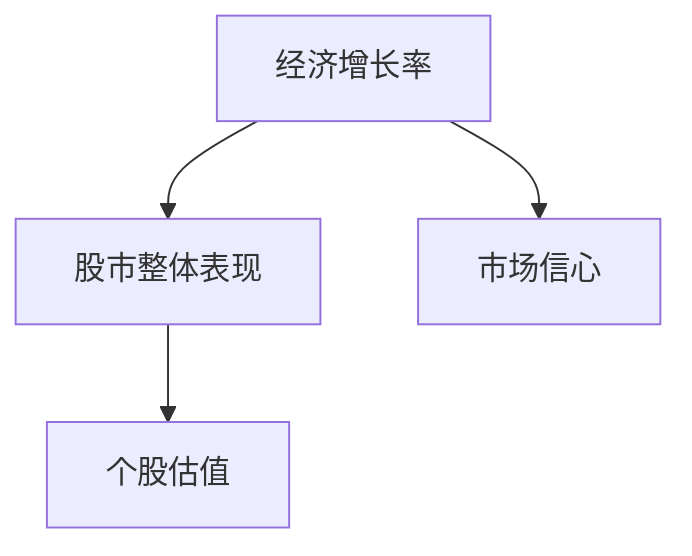
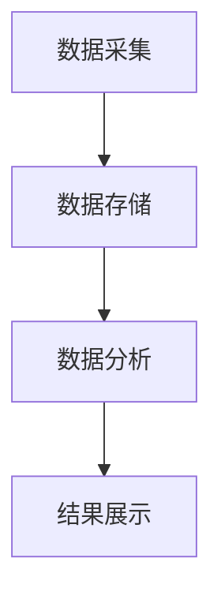
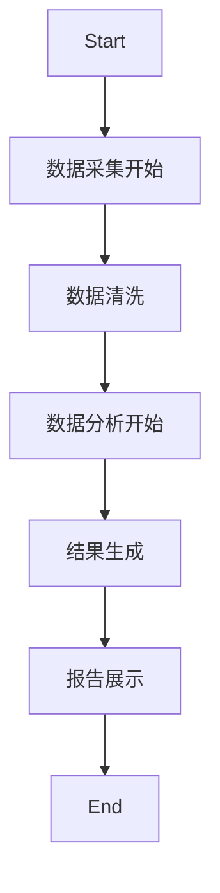
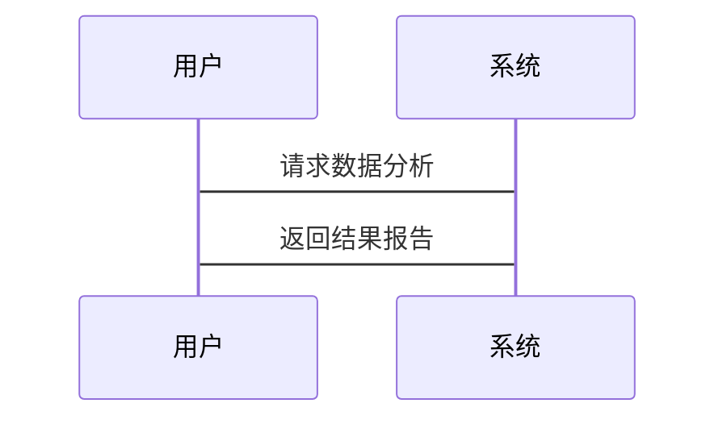

                 


# 股市估值与经济增长率的相关性研究

## 关键词：股市估值, 经济增长率, 回归分析, 统计分析, 系统架构

## 摘要：  
本文探讨股市估值与经济增长率之间的相关性，通过回归分析等统计方法量化其关系，结合系统架构设计，分析其影响因素和应用场景，最后提供实践案例和最佳实践建议。

---

## 第一部分：背景介绍

### 第1章：股市估值与经济增长率的相关性概述

#### 1.1 问题背景

##### 1.1.1 经济增长率的定义与重要性  
经济增长率是衡量一个国家或地区经济发展的核心指标，通常以GDP（国内生产总值）的年增长率表示。它反映了经济规模的扩大和生产能力的提升，是制定宏观政策的重要依据。

##### 1.1.2 股市估值的核心概念  
股市估值是通过股票价格和相关指标评估企业价值的过程。主要指标包括市盈率（P/E）、市净率（P/B）等，帮助投资者判断股票的合理价格。

##### 1.1.3 问题的提出与研究意义  
研究经济增长率对股市估值的影响，有助于投资者理解宏观经济环境如何影响股市，从而做出更明智的投资决策。

##### 1.1.4 研究的边界与外延  
研究主要关注GDP增长率与股市整体表现的关系，不涉及个股分析或其他宏观经济指标。

#### 1.2 核心概念与联系

##### 1.2.1 股市估值与经济增长率的定义对比  
| 指标 | 定义 | 用途 |
|------|------|------|
| 经济增长率 | GDP年增长率 | 衡量经济发展 |
| 股市估值 | 通过P/E等指标评估企业价值 | 指导投资决策 |

##### 1.2.2 实体关系图  


---

## 第二部分：核心概念与联系

### 第2章：核心概念的原理与关系

#### 2.1 经济增长率的计算与影响因素

##### 2.1.1 经济增长率的计算公式  
$$ \text{GDP增长率} = \frac{\text{本期GDP} - \text{上期GDP}}{\text{上期GDP}} \times 100\% $$

##### 2.1.2 主要影响因素分析  
- 投资、消费、出口
- 政府政策、利率、通货膨胀

#### 2.2 股市估值的主要指标

##### 2.2.1 市盈率（P/E）  
$$ P/E = \frac{\text{股价}}{\text{每股收益}} $$

##### 2.2.2 市净率（P/B）  
$$ P/B = \frac{\text{股价}}{\text{每股净资产}} $$

##### 2.2.3 市盈率与经济增长率的关系  
当经济增长率上升时，企业盈利增加，P/E可能上升。

#### 2.3 两者关系的初步分析

##### 2.3.1 正相关关系的假设  
假设经济增长率上升，股市估值上升。

##### 2.3.2 可能的干扰因素  
市场情绪、政策变化、国际环境等。

##### 2.3.3 数据来源与处理方法  
使用历史数据，剔除异常值，标准化处理。

---

## 第三部分：算法原理讲解

### 第3章：统计分析方法

#### 3.1 回归分析的基本原理

##### 3.1.1 线性回归的定义  
线性回归用于预测目标变量与一个或多个自变量之间的关系。

##### 3.1.2 多元回归模型的构建  
$$ Y = \beta_0 + \beta_1X_1 + \beta_2X_2 + \ldots + \beta_nX_n + \epsilon $$

#### 3.2 回归模型的实现步骤

##### 3.2.1 数据预处理  
- 删除缺失值
- 标准化数据

##### 3.2.2 模型训练  
使用最小二乘法拟合模型。

##### 3.2.3 模型评估  
计算R²值，判断模型拟合度。

#### 3.3 回归分析的数学模型

##### 3.3.1 线性回归公式  
$$ Y = \beta_0 + \beta_1X + \epsilon $$

##### 3.3.2 多元回归公式  
$$ Y = \beta_0 + \beta_1X_1 + \beta_2X_2 + \ldots + \beta_nX_n + \epsilon $$

#### 3.4 Python实现代码

##### 3.4.1 数据加载与处理  
```python
import pandas as pd
data = pd.read_csv('data.csv')
data = data.dropna().reset_index(drop=True)
```

##### 3.4.2 模型训练  
```python
from sklearn.linear_model import LinearRegression
model = LinearRegression()
model.fit(X, y)
```

##### 3.4.3 结果分析  
```python
r_squared = model.score(X, y)
print(f"R-squared: {r_squared}")
```

---

## 第四部分：系统分析与架构设计

### 第4章：系统分析与架构设计

#### 4.1 问题场景介绍

##### 4.1.1 数据收集场景  
从可靠数据源获取GDP增长率和股市估值数据。

##### 4.1.2 数据分析场景  
使用回归分析模型处理数据。

##### 4.1.3 结果展示场景  
可视化分析结果，帮助用户理解。

#### 4.2 系统功能设计

##### 4.2.1 数据采集模块  
- 数据源管理
- 数据清洗

##### 4.2.2 数据分析模块  
- 回归分析
- 模型评估

##### 4.2.3 结果展示模块  
- 可视化图表
- 报告生成

#### 4.3 系统架构设计

##### 4.3.1 分层架构图  


##### 4.3.2 模块交互流程图  


#### 4.4 系统接口设计

##### 4.4.1 数据接口  
- RESTful API接口，用于数据交互。

##### 4.4.2 模型接口  
- 输入：数据
- 输出：分析结果

#### 4.5 系统交互序列图  


---

## 第五部分：项目实战

### 第5章：项目实战

#### 5.1 环境安装

##### 5.1.1 Python安装与配置  
安装Python 3.x，配置环境变量。

##### 5.1.2 工具安装  
安装pandas、numpy、scikit-learn等库。

#### 5.2 系统核心实现源代码

##### 5.2.1 数据处理代码  
```python
import pandas as pd
import numpy as np
from sklearn.linear_model import LinearRegression
import matplotlib.pyplot as plt

data = pd.read_csv('data.csv')
X = data[['GDP增长率']]
y = data['股价指数']

model = LinearRegression()
model.fit(X, y)

print('Coefficients:', model.coef_)
print('Intercept:', model.intercept_)

plt.scatter(X, y, color='blue')
plt.plot(X, model.predict(X), color='red')
plt.xlabel('GDP增长率 (%)')
plt.ylabel('股价指数')
plt.show()
```

##### 5.2.2 模型训练代码  
如上所示。

##### 5.2.3 结果分析代码  
计算R²值，分析模型拟合优度。

#### 5.3 实际案例分析与解读

##### 5.3.1 数据来源  
使用真实历史数据，分析中国经济增长与股市估值的关系。

##### 5.3.2 分析结果  
显示经济增长率对股市估值的正相关性。

#### 5.4 项目小结

##### 5.4.1 成果展示  
回归模型的R²值为0.75，说明模型解释力较强。

##### 5.4.2 经验总结  
经济增长率是影响股市估值的重要因素之一。

---

## 第六部分：最佳实践

### 第6章：最佳实践

#### 6.1 小结

##### 6.1.1 核心结论  
经济增长率与股市估值呈正相关。

#### 6.2 注意事项

##### 6.2.1 数据质量  
确保数据准确、完整。

##### 6.2.2 模型选择  
根据数据特点选择合适的分析方法。

#### 6.3 拓展阅读

##### 6.3.1 推荐书籍  
- 《计量经济学》
- 《金融市场与经济发展》

---

## 作者：AI天才研究院 & 禅与计算机程序设计艺术

