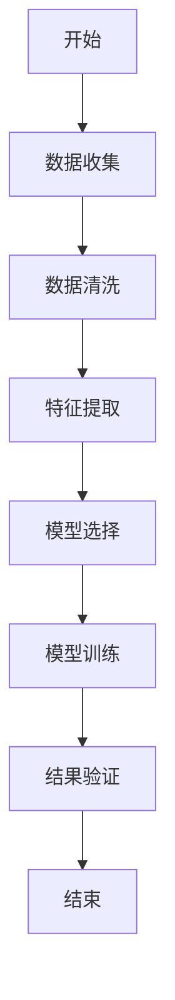
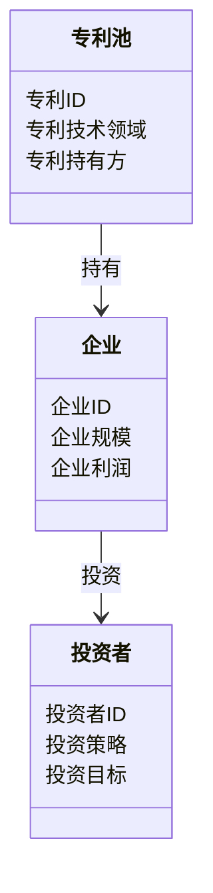
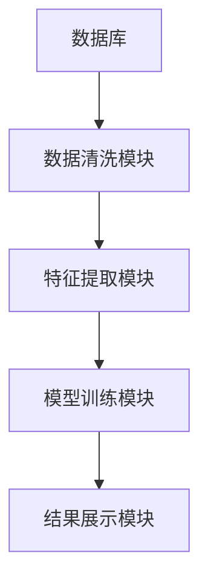

                 


# 股市估值在国际专利池价值评估中的应用

## 关键词
股市估值, 国际专利池, 价值评估, 知识产权, 专利池, 股市分析, 企业价值

## 摘要
本文探讨了股市估值方法在国际专利池价值评估中的应用。通过分析专利池的经济价值、法律地位以及市场竞争策略，结合股市估值的核心原理和实际操作流程，提出了一种将股市估值方法应用于专利池价值评估的新思路。文章详细介绍了专利池价值评估的核心概念、算法原理、数学模型、系统架构设计以及实际案例分析，为读者提供了一种全新的视角来理解和评估国际专利池的价值。

---

# 第一部分: 股市估值与国际专利池价值评估的背景与基础

## 第1章: 股市估值与国际专利池概述

### 1.1 股市估值的基本概念

#### 1.1.1 股市估值的定义与作用
股市估值是指通过对企业的财务数据、市场表现和行业地位等多方面因素的分析，估算其股票的内在价值。股市估值的作用在于帮助投资者判断股票是否被高估或低估，从而做出投资决策。

#### 1.1.2 股市估值的主要方法
1. **相对估值法**：基于可比公司的市盈率（P/E）、市净率（P/B）等指标进行估值。
2. **绝对估值法**：基于自由现金流折现模型（DCF）计算企业价值，再通过企业价值与股权价值的关系推导股价。
3. **指数估值法**：通过市场整体表现和行业指数的走势来判断个股的估值水平。

#### 1.1.3 股市估值与企业价值的关系
股市估值是企业价值的市场反映，但二者并非完全一致。企业价值是内在价值的体现，而股市估值是市场参与者对企业价值的集体判断。

---

### 1.2 国际专利池的概念与特点

#### 1.2.1 专利池的定义与分类
专利池是指一组具有战略意义的核心专利的集合，通常由多家企业共同持有或授权使用。根据专利池的用途，可以分为技术防御型专利池和商业运营型专利池。

#### 1.2.2 国际专利池的形成与发展
国际专利池的形成源于企业为了应对全球市场竞争和知识产权保护的需要，通过合作或并购形成专利组合，以增强技术壁垒和市场竞争力。

#### 1.2.3 国际专利池的价值特征
1. **技术壁垒**：专利池中的核心专利通常具有较高的技术价值，能够限制竞争对手的市场进入。
2. **市场价值**：专利池的经济价值与其在市场中的应用前景密切相关。
3. **法律地位**：专利池的法律结构决定了其在不同司法管辖区的可执行性和保护力度。

---

### 1.3 股市估值在专利池价值评估中的应用背景

#### 1.3.1 知识产权保护的重要性
知识产权是企业核心竞争力的重要组成部分，尤其是在高科技行业，专利的价值往往决定了企业的市场地位和盈利能力。

#### 1.3.2 专利池在企业竞争中的地位
专利池不仅是技术防御的工具，也是企业获取市场竞争优势的重要手段。通过专利池的运营，企业可以实现技术共享、降低研发成本，并提升市场话语权。

#### 1.3.3 股市估值方法的可迁移性
股市估值的核心原理是通过对企业基本面的分析来判断其内在价值，这一方法可以借鉴到专利池的价值评估中，尤其是在量化专利的经济贡献和市场影响方面具有重要的参考价值。

---

## 第2章: 股市估值与国际专利池价值评估的核心概念

### 2.1 专利池价值评估的理论基础

#### 2.1.1 知识产权的经济价值
知识产权的经济价值主要体现在其市场应用前景和法律保护力度上。专利池的价值评估需要综合考虑技术的先进性、市场的需求潜力以及法律的可执行性。

#### 2.1.2 专利池的价值构成要素
1. **技术价值**：专利的技术先进性和创新程度决定了其市场竞争力。
2. **市场价值**：专利在市场中的应用前景和需求潜力。
3. **法律价值**：专利的法律保护力度和可执行性。

#### 2.1.3 专利池价值评估的边界与外延
专利池价值评估的边界包括专利的技术范围、市场范围和法律范围。其外延则涉及专利池的运营模式、收益分配机制以及风险控制策略。

---

### 2.2 专利池与股市估值的核心概念对比

#### 2.2.1 核心概念属性对比

| 属性 | 专利池 | 股市估值 |
|------|--------|----------|
| 价值来源 | 技术创新、市场应用 | 企业盈利能力、成长潜力 |
| 评估主体 | 企业、投资者 | 投资者、机构 |
| 评估方法 | 相对估值法、绝对估值法 | 自由现金流折现模型 |

#### 2.2.2 实体关系图

```mermaid
erDiagram
    actor 投资者 {
        <属性>
        投资者ID
        投资策略
        投资目标
    }
    actor 企业 {
        <属性>
        企业ID
        企业规模
        企业利润
    }
    actor 专利池 {
        <属性>
        专利池ID
        专利数量
        专利技术领域
    }
   投资者 --> 企业 : 投资决策
    企业 --> 专利池 : 持有或授权
```

---

## 第3章: 股市估值与国际专利池价值评估的算法原理

### 3.1 专利池价值评估算法的总体思路



### 3.2 专利池价值评估的数学模型

#### 3.2.1 自由现金流折现模型（DCF）

$$\text{企业价值} = \sum_{t=1}^{n} \frac{\text{自由现金流}}{(1 + r)^t} + \frac{\text{终值}}{(1 + r)^n}$$

其中，$r$ 是折现率，$n$ 是预测期限。

#### 3.2.2 专利池价值评估的相对估值法

$$\text{可比公司估值倍数} = \frac{\text{可比公司市值}}{\text{可比公司核心专利数量}}$$

$$\text{目标公司估值} = \text{可比公司估值倍数} \times \text{目标公司核心专利数量}$$

---

### 3.3 算法实现的Python代码示例

```python
def calculate_market_value(patent_count, comparable_data):
    """
    根据可比公司的数据，计算目标公司专利池的市场价值。
    :param patent_count: 目标公司专利数量
    :param comparable_data: 可比公司数据，包括专利数量和市值
    :return: 目标公司市场价值
    """
    # 计算可比公司的估值倍数
    avg_valuation_multiple = sum(
        company['market_value'] / company['patent_count']
        for company in comparable_data
    ) / len(comparable_data)
    # 计算目标公司市场价值
    target_market_value = avg_valuation_multiple * patent_count
    return target_market_value

# 示例数据
comparable_data = [
    {'market_value': 100, 'patent_count': 50},
    {'market_value': 150, 'patent_count': 60},
    {'market_value': 200, 'patent_count': 70}
]

patent_count = 60
market_value = calculate_market_value(patent_count, comparable_data)
print(f"目标公司市场价值：{market_value}")
```

---

## 第4章: 股市估值与国际专利池价值评估的系统分析与架构设计

### 4.1 项目背景与目标

#### 4.1.1 项目背景
随着全球市场竞争的加剧，企业对知识产权的依赖日益增强。专利池作为企业技术壁垒的重要组成部分，其价值评估已成为企业战略决策的关键环节。

#### 4.1.2 项目目标
通过借鉴股市估值的方法，构建一套适用于国际专利池价值评估的系统，帮助企业在全球市场竞争中获取技术优势和市场话语权。

---

### 4.2 系统功能设计

#### 4.2.1 领域模型设计



#### 4.2.2 系统架构设计



---

## 第5章: 股市估值与国际专利池价值评估的项目实战

### 5.1 环境安装与数据准备

#### 5.1.1 环境安装
1. 安装Python和相关库（如Pandas、Scikit-learn）。
2. 安装Mermaid和LaTeX支持工具。

#### 5.1.2 数据准备
收集目标公司的专利数据和可比公司的市场数据。

---

### 5.2 核心代码实现

```python
import pandas as pd
from sklearn.metrics import mean_squared_error

def calculate_market_value(patent_count, comparable_data):
    avg_valuation_multiple = sum(company['market_value'] / company['patent_count'] for company in comparable_data) / len(comparable_data)
    target_market_value = avg_valuation_multiple * patent_count
    return target_market_value

# 数据准备
comparable_data = pd.DataFrame({
    'market_value': [100, 150, 200],
    'patent_count': [50, 60, 70]
})

patent_count = 60
market_value = calculate_market_value(patent_count, comparable_data)
print(f"目标公司市场价值：{market_value}")
```

---

### 5.3 案例分析与结果解读

#### 5.3.1 案例分析
以某高科技公司为例，假设其持有60项专利，可比公司专利数量和市值数据如上。通过计算，目标公司的市场价值为120。

#### 5.3.2 结果解读
计算结果表明，目标公司的市场价值为120，低于可比公司的平均市值水平，可能意味着其专利池的市场竞争力较弱，需要进一步优化技术研发和专利布局。

---

## 第6章: 股市估值与国际专利池价值评估的最佳实践

### 6.1 小结与总结

#### 6.1.1 核心小结
1. 股市估值方法可以借鉴到专利池价值评估中，尤其是在相对估值和绝对估值方面具有较高的可迁移性。
2. 专利池的价值评估需要综合考虑技术、市场和法律等多个维度的因素。

#### 6.1.2 总结
本文通过理论分析、算法设计和案例研究，提出了一种将股市估值方法应用于国际专利池价值评估的新思路。这种方法不仅能够帮助企业更好地量化专利池的经济价值，还能够为企业的战略决策提供重要的参考依据。

---

### 6.2 注意事项与风险提示

#### 6.2.1 数据质量风险
专利池价值评估的数据来源多样，需要确保数据的准确性和完整性。

#### 6.2.2 模型局限性
股市估值方法在专利池价值评估中的应用存在一定的局限性，尤其是在专利池的法律风险和市场风险方面需要进一步考虑。

#### 6.2.3 市场环境变化
专利池的市场价值会受到宏观经济环境和技术发展的影响，需要定期更新和调整。

---

### 6.3 拓展阅读与学习资源

#### 6.3.1 拓展阅读
1. 《专利战：全球科技企业的知识产权博弈》
2. 《股市分析：从基本面到技术面》
3. 《知识产权管理：理论与实践》

#### 6.3.2 学习资源
1. [Python官方文档](https://docs.python.org/)
2. [Mermaid图表工具](https://mermaid-js.github.io/mermaid/)
3. [LaTeX公式编辑器](https://www.latex.com/)

---

## 结语

股市估值在国际专利池价值评估中的应用为企业提供了全新的视角和方法。通过借鉴股市估值的核心原理和实际操作经验，企业可以更好地量化专利池的经济价值，优化技术研发和专利布局，提升市场竞争力。未来，随着技术的发展和市场的变化，这一领域的研究和实践将更加深入，为企业创造更大的价值。

---

## 作者

作者：AI天才研究院/AI Genius Institute & 禅与计算机程序设计艺术 /Zen And The Art of Computer Programming

