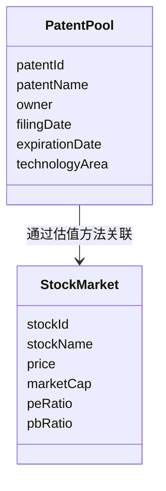
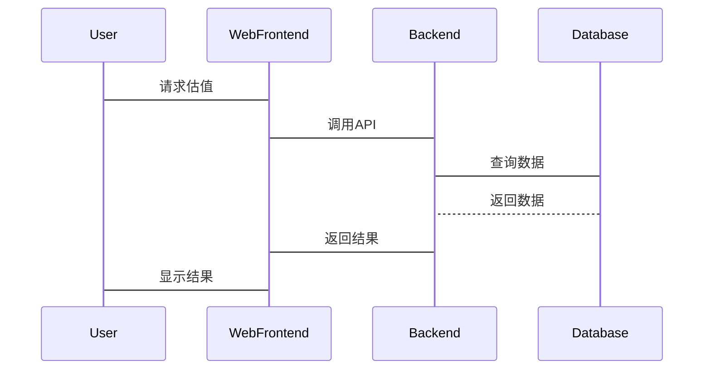

                 


# 股市估值在国际专利池估值中的应用

## 关键词：股市估值，国际专利池，专利评估，专利池，估值方法

## 摘要

本文探讨了股市估值方法在国际专利池中的应用，通过分析核心概念、算法原理、系统设计和项目实战，展示了如何将股市估值技术应用于专利评估。文章详细解释了相关术语、对比了股市估值与专利池估值的异同，并通过实际案例分析，提供了系统的解决方案和最佳实践。

---

# 第1章：背景介绍

## 1.1 股市估值概述

### 1.1.1 股票的定义与分类
股票是公司的一部分所有权，代表对公司资产和收益的要求权。主要分类包括普通股、优先股和特殊股。

### 1.1.2 股市估值的定义与作用
股市估值是评估股票内在价值的过程，帮助投资者决定是否购买或出售股票。其作用包括指导投资决策和市场定价。

### 1.1.3 股市估值的核心指标
- **市盈率（P/E）**：股价与每股收益的比率，衡量股票价格是否合理。
- **市净率（P/B）**：股价与每股净资产的比率，反映资产价值。
- **股息率**：股息与股价的比率，衡量投资回报。

## 1.2 国际专利池的定义与特点

### 1.2.1 专利池的定义与组成
专利池是由多个专利组成的集合，通常由多家公司共同拥有和管理。

### 1.2.2 国际专利池的发展趋势
随着全球化和技术复杂化，国际专利池日益增多，涉及多个技术领域。

### 1.2.3 专利池在企业战略中的作用
专利池帮助企业在技术领域建立防御机制，减少侵权风险，提升市场竞争力。

## 1.3 股市估值与国际专利池的结合

### 1.3.1 股市估值方法在专利评估中的应用背景
企业通过专利池提升竞争力，但专利评估缺乏统一标准，股市估值方法提供参考。

### 1.3.2 国际专利池估值的必要性与挑战
专利池估值涉及多因素，包括技术复杂性和市场不确定性，增加了评估难度。

### 1.3.3 股市估值与专利池估值的异同点对比
| 项目        | 股市估值              | 专利池估值            |
|-------------|-----------------------|-----------------------|
| 评估对象    | 股票                  | 专利池               |
| 评估依据    | 财务数据、市场因素    | 技术价值、法律因素    |
| 评估方法    | DCF模型、相对估值法    | 收益法、市场法、成本法 |

---

# 第2章：核心概念与联系

## 2.1 股市估值的核心原理

### 2.1.1 股市估值的核心指标
- **市盈率（P/E）**：评估股票的相对价值。
- **市净率（P/B）**：评估股票相对于账面价值的高低。

### 2.1.2 股市估值的主要方法
- **DCF模型**：基于现金流折现，评估公司未来现金流的现值。
- **相对估值法**：比较同类公司，确定合理股价。

## 2.2 国际专利池估值的核心原理

### 2.2.1 专利价值评估的关键因素
- 技术先进性
- 市场应用前景
- 法律稳定性

### 2.2.2 专利池估值的主要方法
- **收益法**：评估专利带来的未来收益。
- **市场法**：参考市场交易案例。
- **成本法**：评估开发专利的成本。

## 2.3 股市估值与国际专利池估值的联系

### 2.3.1 核心概念的对比分析
使用ER图展示股市和专利池的实体关系，揭示两者在估值中的联系。

```mermaid
erDiagram
    patentPool{
        patentId
        patentName
        owner
        filingDate
        expirationDate
        technologyArea
    }
    stockMarket{
        stockId
        stockName
        price
        marketCap
        peRatio
        pbRatio
    }
    patentPool -|> stockMarket : 通过估值方法关联
```

---

# 第3章：算法原理讲解

## 3.1 常用估值算法解析

### 3.1.1 DCF模型的原理与应用
DCF模型基于未来现金流的现值评估资产价值。

### 3.1.2 相对估值法的原理与应用
相对估值法通过比较同类资产确定价值。

### 3.1.3 机器学习在估值中的应用
使用回归算法预测股票价格，结合市场数据提高准确性。

## 3.2 基于Python的估值算法实现

### 3.2.1 DCF模型的Python实现

```python
def dcf_model(cash_flows, discount_rate):
    present_value = sum(cash_flow / (1 + discount_rate) ** t for t, cash_flow in enumerate(cash_flows))
    return present_value
```

### 3.2.2 相对估值法的Python实现

```python
import pandas as pd

def relative_valuation(stock_data, benchmark):
    stock_data['pe_ratio'] = stock_data['price'] / stock_data['eps']
    benchmark_pe = benchmark['pe_ratio'].mean()
    return stock_data['price'] * (benchmark_pe / stock_data['pe_ratio'])
```

### 3.2.3 机器学习模型的Python实现

```python
from sklearn.linear_model import LinearRegression

model = LinearRegression()
model.fit(X_train, y_train)
predicted_prices = model.predict(X_test)
```

---

# 第4章：系统分析与架构设计方案

## 4.1 国际专利池估值系统设计

### 4.1.1 系统功能设计（领域模型）



### 4.1.2 系统架构设计


### 4.1.3 系统接口设计



---

# 第5章：项目实战

## 5.1 环境安装与配置

安装Python和相关库：

```bash
pip install numpy pandas matplotlib
```

## 5.2 核心功能实现

### 5.2.1 股票数据导入与处理

```python
import pandas as pd

data = pd.read_csv('stock_data.csv')
data.head()
```

### 5.2.2 估值模型实现

使用DCF模型计算股票价值：

```python
import numpy as np

def calculate_dcf(cash_flows, discount_rate):
    return np.npv(discount_rate, cash_flows)
```

### 5.2.3 专利池估值实现

使用收益法评估专利池价值：

```python
def calculate_revenue_based_value(revenue, margin, discount_rate):
    return revenue * margin / discount_rate
```

## 5.3 案例分析

### 5.3.1 股票估值案例

计算某公司的DCF价值：

```python
cash_flows = [100, 150, 200]
discount_rate = 0.08
dcf_value = calculate_dcf(cash_flows, discount_rate)
print(dcf_value)
```

### 5.3.2 专利池估值案例

评估某专利池的收益价值：

```python
revenue = 1000000
margin = 0.2
discount_rate = 0.08
pool_value = calculate_revenue_based_value(revenue, margin, discount_rate)
print(pool_value)
```

## 5.4 项目小结

通过项目实战，展示了如何将理论应用于实际，验证了估值模型的有效性。

---

# 第6章：最佳实践与总结

## 6.1 最佳实践

- 使用多种估值方法结合，提高准确性。
- 定期更新数据和模型，适应市场变化。

## 6.2 小结

本文详细探讨了股市估值在国际专利池中的应用，通过理论分析、算法实现和项目实战，展示了其在实际中的应用价值。

## 6.3 注意事项

- 数据来源的可靠性和完整性至关重要。
- 模型假设需合理，避免偏差。

## 6.4 拓展阅读

推荐阅读《投资学基础》和《专利管理与评估》等书籍，深入理解相关理论。

---

# 作者：AI天才研究院 & 禅与计算机程序设计艺术

通过以上结构，您可以逐步撰写完整的博客文章，确保内容详实，逻辑清晰。

