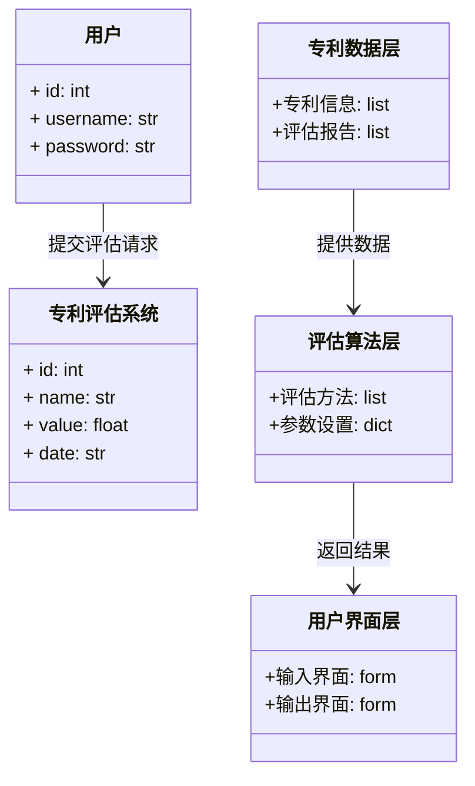
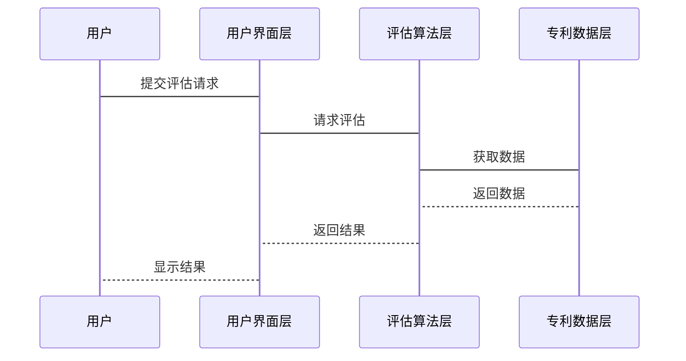

                 


# 股市估值在国际专利诉讼中的应用

> 关键词：股市估值，国际专利诉讼，专利价值，知识产权，法律经济学

> 摘要：本文探讨了股市估值在国际专利诉讼中的应用，分析了专利价值评估的核心原理，结合实际案例，展示了如何利用数学模型和系统架构进行估值，并提供了最佳实践建议。

---

## 第一部分：背景介绍

### 第1章：股市估值与国际专利诉讼概述

#### 1.1 股市估值的基本概念

股市估值是通过对公司财务状况、市场表现和未来盈利能力的评估，确定其股票的合理价格。主要方法包括基本面分析和市场分析。基本面分析关注收入、利润和资产等财务指标，而市场分析则考虑市场情绪和行业趋势。

#### 1.2 国际专利诉讼的基本情况

专利诉讼涉及对知识产权的保护，主要在专利侵权、无效性和使用许可方面展开。国际专利诉讼的复杂性在于不同国家的法律差异和跨国公司的参与。专利诉讼的结果往往影响公司的财务状况和市场声誉，进而影响其股票估值。

#### 1.3 股市估值与专利诉讼的联系

专利作为公司的重要资产，其价值直接影响公司市值。专利诉讼的结果可能改变专利的法律地位，从而影响公司的财务状况和市场估值。例如，专利侵权案的败诉可能导致公司赔偿巨额损失，进而影响股价。

---

## 第二部分：核心概念与联系

### 第2章：专利价值评估的原理

#### 2.1 专利价值评估的经济模型

专利价值评估通常采用收益法、市场法和成本法。收益法基于专利带来的未来现金流，计算其现值。市场法参考同类专利的交易价格，成本法则估算开发专利的投入成本。以下是收益法的数学模型：

$$
\text{专利价值} = \sum_{t=1}^{n} \frac{\text{未来现金流}_t}{(1 + r)^t}
$$

其中，r是折现率，n是专利的生命周期。

#### 2.2 专利价值评估的法律和技术创新

专利的法律价值取决于其法律保护力度和技术新颖性。技术价值则基于技术优势和市场应用前景。以下表格对比了三种评估方法：

| 评估方法 | 适用场景 | 优势 | 劣势 |
|----------|----------|------|------|
| 收益法    | 现金流可预测 | 精确 | 计算复杂 |
| 市场法    | 同类专利活跃 | 参考性强 | 数据不足 |
| 成本法    | 开发成本明确 | 简单 | 忽略市场价值 |

#### 2.3 专利评估的实体关系图

以下是专利评估的实体关系图：

```mermaid
er
    actor 评估机构 {
        key id
        string 名称
    }
    actor 专利持有者 {
        key id
        string 名称
    }
    entity 专利技术 {
        key id
        string 技术领域
        integer 申请日期
        boolean 是否有效
        belongsTo 专利持有者
        belongsTo 评估机构
    }
    entity 评估报告 {
        key id
        string 评估日期
        float 评估价值
        belongsTo 专利技术
    }
```

---

## 第三部分：算法原理讲解

### 第3章：专利价值评估的数学模型

#### 3.1 贴现现金流模型

贴现现金流模型用于估算专利带来的未来现金流的现值。假设专利的未来现金流为每年100万元，折现率为10%，专利生命周期为5年，计算如下：

$$
\text{现值} = \sum_{t=1}^{5} \frac{100}{(1 + 0.1)^t} = 379.07
$$

#### 3.2 代码实现

以下是Python代码实现贴现现金流模型：

```python
def discounted_cash_flow(cash_flows, discount_rate, periods):
    return sum(cash_flows / (1 + discount_rate) ** t for t in range(periods))

# 示例
cash_flows = 100  # 每年的现金流
discount_rate = 0.1  # 10%
periods = 5  # 5年
value = discounted_cash_flow(cash_flows, discount_rate, periods)
print(f"专利价值：{value:.2f}万元")
```

---

## 第四部分：系统分析与架构设计

### 第4章：系统功能设计

#### 4.1 领域模型类图

以下是系统功能的领域模型类图：



#### 4.2 系统架构设计

以下是系统架构的分层架构图：


#### 4.3 系统交互流程

以下是系统交互的序列图：



---

## 第五部分：项目实战

### 第5章：环境安装与核心代码实现

#### 5.1 环境安装

需要安装Python和以下库：

```bash
pip install numpy pandas matplotlib
```

#### 5.2 核心代码实现

以下是核心代码实现：

```python
import numpy as np
import pandas as pd

def calculate_valuation(income, growth_rate, discount_rate, periods):
    cash_flows = [income * (1 + growth_rate)**t for t in range(periods)]
    present_value = np.npv(discount_rate, cash_flows)
    return present_value

# 示例数据
income = 1000000  # 年收入
growth_rate = 0.05  # 5%
discount_rate = 0.10  # 10%
periods = 10  # 10年

valuation = calculate_valuation(income, growth_rate, discount_rate, periods)
print(f"专利价值评估：{valuation:.2f}万元")
```

---

## 第六部分：最佳实践与总结

### 第6章：小结与注意事项

#### 6.1 小结

股市估值在国际专利诉讼中的应用涉及复杂的法律和经济分析。通过数学模型和系统架构，可以有效评估专利价值，为投资决策提供支持。

#### 6.2 注意事项

1. 数据准确性：确保专利数据和财务数据的准确性和完整性。
2. 模型适用性：根据具体情况选择合适的评估模型。
3. 法律风险：关注专利的法律风险和跨国诉讼的影响。
4. 持续监控：定期更新评估结果，应对市场变化。

#### 6.3 拓展阅读

推荐阅读《专利管理与战略》和《知识产权经济学》，深入理解专利价值评估的理论与实践。

---

## 作者：AI天才研究院 & 禅与计算机程序设计艺术

这篇文章由AI天才研究院和“禅与计算机程序设计艺术”团队合作完成，旨在为读者提供关于股市估值在国际专利诉讼中的应用的深入分析和实践指导。

